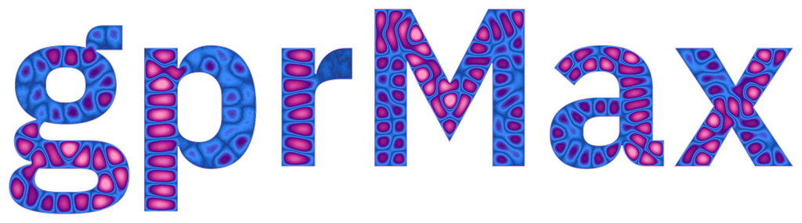

# gprMax version 4 logo and branding assets



The version 4 wordmark preserves the physical idea behind the original
gprMax logo: the letters are free-space cavities carved into an otherwise PEC
two-dimensional FDTD domain, and their resonant electric fields supply the
colour and texture. It is therefore a result produced by gprMax rather than a
conventional colour fill applied to text.

The approved wordmark uses IBM Plex Sans Bold with no additional letter
tracking. The font is distributed under the SIL Open Font License; its licence
is included in [`fonts/OFL.txt`](fonts/OFL.txt).

## Brand colours

The field magnitude is mapped through a scale that retains the established
gprMax purple while introducing blue nodes and pink antinodes:

| Role | Colour |
| --- | --- |
| gprMax purple | `#55037f` |
| Deep indigo | `#28367f` |
| Blue | `#1656b8` |
| Bright blue | `#3b8cff` |
| Magenta | `#c42b91` |
| Pink | `#ff9bca` |
| Recommended dark background | `#111827` |

Use a transparent asset where possible. Pre-composited white and dark versions
are supplied when an application does not preserve PNG transparency. Preserve
the `gprMax` capitalisation and the wordmark aspect ratio.

## Prebuilt assets

[`assets/`](assets) contains transparent, white-background, and dark-background
PNGs at widths of 2048, 1024, 512, 400, and 256 pixels. The 2048-pixel
transparent PNG is the repository master. Exact dimensions, 300 dpi print
metadata, and SHA-256 checksums are recorded in
[`assets/manifest.json`](assets/manifest.json).

The documentation uses the 1024-pixel transparent asset and the top-level
README uses the 400-pixel asset. The archived production master is 10000 pixels
wide; it is not committed because the same image can be rendered at any width
from the field snapshot and its size exceeds the repository file limit.

## How the model is built

The official model is a 2D TMz simulation with a 1.0 m by 0.5 m physical
domain and a 0.083333 mm spatial step (12000 by 6000 cells). The full plane is
initially PEC. The IBM Plex Sans glyph mask is then compressed into 9724
rectangular `#box` commands which replace the letters with free space. No PML
is required because the resonant cavities are surrounded by PEC.

Eight z-polarised Hertzian line sources excite the isolated glyph cavities
with continuous 10 or 12 GHz sinusoids. Their amplitudes were calibrated on
the 3x grid to produce comparable RMS field strength in each glyph. The
`Ez` field is sampled at 10 ns. The renderer displays `abs(Ez)`, normalised by
its 99.5th percentile inside the letters, using a power-law colour
normalisation. The PEC region remains transparent.

The generated input file is [`model/gprmax_v4_logo_3x.in`](model/gprmax_v4_logo_3x.in).
The raw snapshot is approximately 1.7 GB and is intentionally not committed.
The 72-million-cell production model is best run on a GPU with adequate
memory.

## Reproduction

From the repository root, regenerate the model and glyph preview with:

```bash
python branding/logo_v4/logo_model.py
```

Run the generated model (device index is optional):

```bash
python -m gprMax branding/logo_v4/model/gprmax_v4_logo_3x.in -gpu 0
```

Render a new transparent master from the resulting snapshot:

```bash
python branding/logo_v4/render_logo.py \
  branding/logo_v4/model/gprmax_v4_logo_3x.in \
  branding/logo_v4/model/gprmax_v4_logo_3x_snaps/logo_fields.h5 \
  /tmp/gprmax_v4_logo_master.png --width-px 10000
```

Finally, create the standard screen and print assets:

```bash
python branding/logo_v4/export_assets.py \
  /tmp/gprmax_v4_logo_master.png branding/logo_v4/assets
```

The optional `--refinement` model-generator argument is useful for exploratory
lower-resolution runs. Only the default 3x model has calibrated amplitudes and
defines the approved logo.
