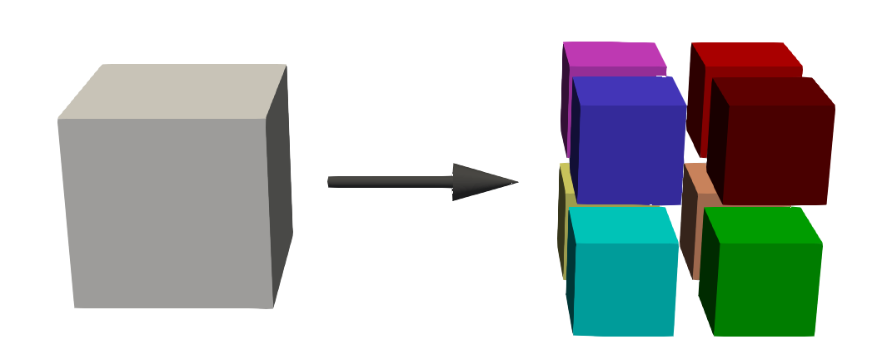
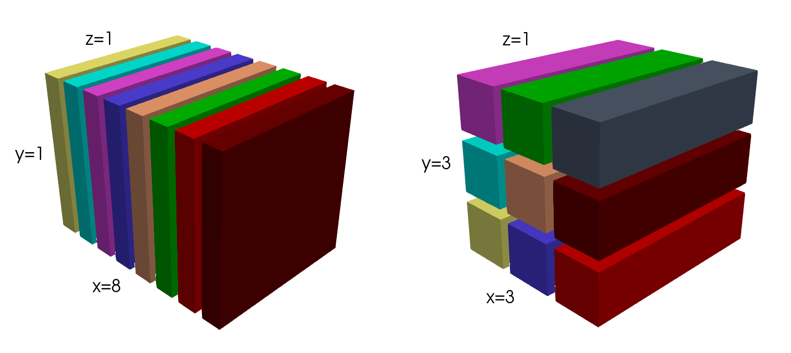

.. _accelerators:

**********************
OpenMP/MPI/CUDA/OpenCL
**********************

The most computationally intensive parts of gprMax, which are the FDTD solver loops, have been parallelized using different CPU and GPU accelerators to offer performance and flexibility.

1. `OpenMP <http://openmp.org>`_ which supports multi-platform shared memory multiprocessing.
2. `OpenMP <http://openmp.org>`_ + `MPI <https://mpi4py.readthedocs.io/en/stable/>`_ enables parallelism beyond shared mememory multiprocessing (e.g. multiple nodes on a HPC system).
3. `NVIDIA CUDA <https://developer.nvidia.com/cuda-toolkit>`_ for NVIDIA GPUs.
4. `OpenCL <https://www.khronos.org/api/opencl>`_ for a wider range of CPU and GPU hardware.

Each of these approaches to acceleration have different characteristics and hardware/software support. While all these approaches can offer increased performance, OpenMP + MPI can also increase the modelling capabilities of gprMax when running on a multi-node system (e.g. HPC environments). It does this by distributing models accoss multiple nodes, increasing the total amount of memory available and allowing larger models to be simulated.

Additionally, the Message Passing Interface (MPI) can be utilised to implement a simple task farm that can be used to distribute a series of models as independent tasks. This can be useful in many GPR simulations where a B-scan (composed of multiple A-scans) is required. Each A-scan can be task-farmed as an independent model, and within each model, OpenMP or CUDA can still be used for parallelism. This creates mixed mode OpenMP/MPI or CUDA/MPI environments.

Some of these accelerators and frameworks require additional software to be installed. The guidance below explains how to do that and gives examples of usage.

.. note::

    You can use the ``get_host_spec.py`` module (in ``toolboxes/Utilities``) to help you understand what hardware (CPU/GPU) you have and how gprMax can use it with the aforementioned accelerators.

OpenMP
======

No additional software is required to use OpenMP as it is part of the standard installation of gprMax.

By default, gprMax will try to determine and use the maximum number of OpenMP threads (usually the number of physical CPU cores) available on your machine. You can override this behaviour in two ways: firstly, gprMax will check to see if the ``#omp_threads`` command is present in your input file; if not, gprMax will check to see if the environment variable ``OMP_NUM_THREADS`` is set. This can be useful if you are running gprMax in a High-Performance Computing (HPC) environment where you might not want to use all of the available CPU cores.

MPI
===

No additional software is required to use MPI as it is part of the standard installation of gprMax. However you will need to :ref:`build h5py with MPI support<h5py_mpi>` if you plan to use the MPI domain decomposition functionality.

There are two ways to use MPI with gprMax:

- Domain decomposition - divides a single model across multiple MPI ranks.
- Task farm - distribute multiple models as independent tasks to each MPI rank.

.. _mpi_domain_decomposition:

Domain decomposition
--------------------

Open a Terminal (Linux/macOS) or Command Prompt (Windows), navigate into the top-level gprMax directory, and if it is not already active, activate the gprMax conda environment: ``conda activate gprMax``

Run one of the 2D test models:

.. code-block:: console

    (gprMax)$ mpirun -n 4 python -m gprMax examples/cylinder_Ascan_2D.in --mpi 2 2 1

The ``--mpi`` argument passed to gprMax takes three integers to define the number of MPI processes in the x, y, and z dimensions to form a cartesian grid. The product of these three numbers shoud equal the number of MPI ranks. In this case ``2 x 2 x 1 = 4``.

    Example decomposition using 8 MPI ranks in a 2 x 2 x 2 pattern (specified with ``--mpi 2 2 2``). The full model (left) is evenly divided across MPI ranks (right).

.. _fractal_domain_decomposition:

Decomposition of Fractal Geometry
^^^^^^^^^^^^^^^^^^^^^^^^^^^^^^^^^

There are some restrictions when using MPI domain decomposition with :ref:`fractal user objects <fractals>`.

.. warning::

    gprMax will throw an error during the model build phase if the MPI decomposition is incompatible with the model geometry.

#fractal_box
############

When a fractal box has a mixing model attached, it will perform a parallel fast Fourier transforms (FFTs) as part of its construction. When performing a parallel FFT in 3D space, the decomposition must be either 1D or 2D - it cannot be decomposed in all 3 dimensions. To support this, the MPI domain decomposition of the fractal box must have size one in at least one dimension:

.. _fractal_domain_decomposition_figure:

    Example slab and pencil decompositions. These decompositions could be specified with ``--mpi 8 1 1`` and ``--mpi 3 3 1`` respectively.

.. note::

    This does not necessarily mean the whole model domain needs to be divided this way. So long as the volume covered by the fractal box is divided into either slabs or pencils, the model can be built. This includes the volume covered by attached surfaces added by the ``#add_surface_water``, ``#add_surface_roughness``, or ``#add_grass`` commands.

#add_surface_roughness
######################

When adding surface roughness, a parallel fast Fourier transform is applied across the 2D surface of a fractal box. Therefore, the MPI domain decomposition across the surface must be size one in at least one dimension.

For example, in figure :numref:`fractal_domain_decomposition_figure`, surface roughness can be attached to any surface when using the slab decomposition. However, if using the pencil decomposition, it could not be attached to the XY surfaces.

#add_grass
##########

.. warning::

    Domain decomposition of grass is not currently supported. Grass can still be built in a model so long as it is fully contained within a single MPI rank.

Task farm
---------

By default, the MPI task farm functionality is turned off. It can be used with the ``--taskfarm`` command line option, which specifies the total number of MPI tasks, i.e. master + workers, for the MPI task farm. This option is most usefully combined with ``-n`` to allow individual models to be farmed out using an MPI task farm, e.g. to create a B-scan with 60 traces and use MPI to farm out each trace:

.. code-block:: console

    (gprMax)$ python -m gprMax examples/cylinder_Bscan_2D.in -n 60 --taskfarm

CUDA
====

Software required
-----------------

The following steps provide guidance on how to install the extra components to allow gprMax to run on your NVIDIA GPU:

1. Install the `NVIDIA CUDA Toolkit <https://developer.nvidia.com/cuda-toolkit>`_. You can follow the Installation Guides in the `NVIDIA CUDA Toolkit Documentation <http://docs.nvidia.com/cuda/index.html#installation-guides>`_ You must ensure the version of CUDA you install is compatible with the compiler you are using. This information can usually be found in a table in the CUDA Installation Guide under System Requirements.
2. You may need to add the location of the CUDA compiler (``nvcc``) to your user path environment variable, e.g. for Windows ``C:\Program Files\NVIDIA GPU Computing Toolkit\CUDA\vX.X\bin`` or Linux/macOS ``/Developer/NVIDIA/CUDA-X.X/bin``.
3. Install the pycuda Python module. Open a Terminal (Linux/macOS) or Command Prompt (Windows), navigate into the top-level gprMax directory, and if it is not already active, activate the gprMax conda environment ``conda activate gprMax``. Run ``pip install pycuda``

Example
-------

Open a Terminal (Linux/macOS) or Command Prompt (Windows), navigate into the top-level gprMax directory, and if it is not already active, activate the gprMax conda environment ``conda activate gprMax``

Run one of the test models:

.. code-block:: console

    (gprMax)$ python -m gprMax examples/cylinder_Ascan_2D.in -gpu

.. note::

    * If you want to select a specific GPU card on your system, you can specify an integer after the ``-gpu`` flag. The integer should be the NVIDIA CUDA device ID for a specific GPU card. If it is not specified it defaults to device ID 0.
    * You can use the ``get_host_spec.py`` module (in ``toolboxes/Utilities``) to help you understand what hardware (CPU/GPU) you have and how gprMax can use it.

OpenCL
======

Software required
-----------------

The following steps provide guidance on how to install the extra components to allow gprMax to use OpenCL:

1. Install the pyopencl Python module. Open a Terminal (Linux/macOS) or Command Prompt (Windows), navigate into the top-level gprMax directory, and if it is not already active, activate the gprMax conda environment ``conda activate gprMax``. Run ``pip install pyopencl``

Example
-------

Open a Terminal (Linux/macOS) or Command Prompt (Windows), navigate into the top-level gprMax directory, and if it is not already active, activate the gprMax conda environment ``conda activate gprMax``

Run one of the test models:

.. code-block:: console

    (gprMax)$ python -m gprMax examples/cylinder_Ascan_2D.in -opencl

.. note::

    * If you want to select a specific computer device on your system, you can specify an integer after the ``-opencl`` flag. The integer should be the device ID for a specific compute device. If it is not specified it defaults to device ID 0.
    * You can use the ``get_host_spec.py`` module (in ``toolboxes/Utilities``) to help you understand what hardware (CPU/GPU) you have and how gprMax can use it.

CUDA/MPI
========

Message Passing Interface (MPI) has been utilised to implement a simple task farm that can be used to distribute a series of models as independent tasks. This is described in more detail in the :ref:`HPC <hpc>` section. MPI can be combined with the GPU functionality to allow a series of models to be distributed to multiple GPUs on the same machine (node).

Example
-------

For example, to run a B-scan that contains 60 A-scans (traces) on a system with 4 GPUs:

.. code-block:: console

    (gprMax)$ python -m gprMax examples/cylinder_Bscan_2D.in -n 60 --taskfarm -gpu 0 1 2 3

.. note::

    When running a task farm, one MPI rank runs on the CPU as a coordinator (master) while the remaining worker ranks each use their own GPU. Therefore the number of MPI ranks should equal the number of GPUs + 1. The integers given with the ``-gpu`` argument are the NVIDIA CUDA device IDs for the specific GPU cards to be used.
