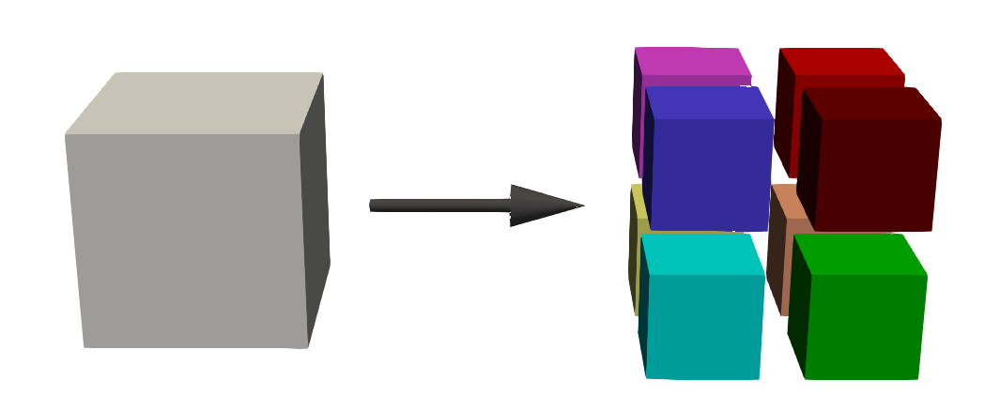
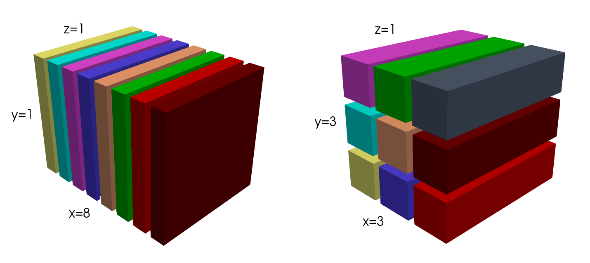

.. _accelerators:

******************************
OpenMP/CUDA/OpenCL/Apple Metal
******************************

The most computationally intensive parts of gprMax, which are the FDTD solver loops, have been parallelized using different CPU and GPU accelerators to offer performance and flexibility.

1. `OpenMP <http://openmp.org>`_ which supports multi-platform shared memory multiprocessing.
2. `NVIDIA CUDA <https://developer.nvidia.com/cuda-toolkit>`_ for NVIDIA GPUs.
3. `OpenCL <https://www.khronos.org/api/opencl>`_ for a wider range of CPU and GPU hardware.
4. `Apple Metal <https://developer.apple.com/metal/>`_ for Apple Silicon (M-series) based Mac GPUs.

Each of these approaches to acceleration have different characteristics and hardware/software support. While all these approaches can offer increased performance, OpenMP + MPI can also increase the modelling capabilities of gprMax when running on a multi-node system (e.g. HPC environments). It does this by distributing models accoss multiple nodes, increasing the total amount of memory available and allowing larger models to be simulated.

Additionally, the Message Passing Interface (MPI) can be utilised to implement a simple task farm that can be used to distribute a series of models as independent tasks. This can be useful in many GPR simulations where a B-scan (composed of multiple A-scans) is required. Each A-scan can be task-farmed as an independent model, and within each model, OpenMP, CUDA, OpenCL, or Metal can still be used for parallelism. This creates mixed mode OpenMP/MPI, CUDA/MPI, OpenCL/MPI, or Metal/MPI environments.

Some of these accelerators and frameworks require additional software to be installed. The guidance below explains how to do that and gives examples of usage.

The CPU/OpenMP solver is part of the core installation. The Python bindings
for the other accelerators are optional package extras and can be installed
independently from the top-level gprMax source directory:

.. code-block:: console

    (gprMax)$ python -m pip install -e ".[cuda]"       # Linux/Windows
    (gprMax)$ python -m pip install -e ".[opencl]"
    (gprMax)$ python -m pip install -e ".[metal]"      # macOS

Extras can be combined, for example ``.[cuda,opencl]``. The
``.[accelerators]`` convenience extra requests all accelerator bindings that
apply to the current operating system. A core installation remains fully
usable with the CPU solver when none of these extras is installed.

.. warning::

    Python package installers can select dependencies by operating system but
    cannot determine whether a compatible accelerator, driver, CUDA toolkit,
    or OpenCL runtime is installed. The ``accelerators`` convenience extra can
    therefore fail on a machine without the necessary system software. The
    individual backend extra is the recommended installation method.

.. note::

    You can use the ``get_host_spec.py`` module (in ``toolboxes/Utilities``) to help you understand what hardware (CPU/GPU) you have and how gprMax can use it with the aforementioned accelerators.

Solver precision
================

The CPU, CUDA, and OpenCL solvers support single- and double-precision field
storage. Single precision is the default for both CPU and accelerator solves
because it reduces memory use and generally gives the best accelerator
performance.

For a text input file, select CPU precision with ``-cpu_precision`` and CUDA or
OpenCL precision with ``-gpu_precision``:

.. code-block:: console

    (gprMax)$ python -m gprMax model.in -cpu_precision double
    (gprMax)$ python -m gprMax model.in -gpu -gpu_precision double

The corresponding Python API arguments are ``cpu_precision="double"`` and
``gpu_precision="double"`` on :func:`gprMax.run`. Each accepts ``single`` or
``double``. The CPU option is ignored for an accelerator solve, and the GPU
option is ignored for a CPU solve.

.. note::

    * Apple Metal supports single precision only. Requesting double precision
      with Metal is rejected before kernel compilation because the Metal
      Shading Language has no native ``double`` type.
    * Subgridding requires double precision and overrides a requested single
      precision. Subgridding is currently available only with the CPU solver.
    * Output datasets and KSIR complex phasors use the type corresponding to
      the configured solver precision.

OpenMP
======

No additional software is required to use OpenMP as it is part of the standard installation of gprMax.

By default, gprMax will try to determine and use the maximum number of OpenMP threads (usually the number of physical CPU cores) available on your machine. You can override this behaviour in two ways: firstly, gprMax will check to see if the ``#omp_threads`` command is present in your input file; if not, gprMax will check to see if the environment variable ``OMP_NUM_THREADS`` is set. This can be useful if you are running gprMax in a High-Performance Computing (HPC) environment where you might not want to use all of the available CPU cores.

MPI
===

MPI support is optional and is not installed with the core gprMax package. It
requires a system MPI implementation and the gprMax ``mpi`` extra:

.. code-block:: console

    (gprMax)$ python -m pip install -e ".[mpi]"

The extra installs ``mpi4py`` but does not install or configure the system MPI
runtime. You will also need to :ref:`build h5py with MPI support<h5py_mpi>` if
you plan to use parallel HDF5 output with MPI domain decomposition.
For an existing source installation, MPI can instead be enabled without
recompiling gprMax by installing the runtime followed by
``python -m pip install mpi4py``.

There are two ways to use MPI with gprMax:

- Domain decomposition - divides a single model across multiple MPI ranks.
- Task farm - distribute multiple models as independent tasks to each MPI rank.

.. _mpi_domain_decomposition:

Domain decomposition
--------------------

Open a Terminal (Linux/macOS) or Command Prompt (Windows), navigate into the top-level gprMax directory, and if it is not already active, activate the gprMax conda environment: ``conda activate gprMax``

Run one of the 2D test models:

.. code-block:: console

    (gprMax)$ mpirun -n 4 python -m gprMax examples/gpr/basic/cylinder_Ascan_2D.in --mpi 2 2 1

The ``--mpi`` argument passed to gprMax takes three integers to define the number of MPI processes in the x, y, and z dimensions to form a cartesian grid. The product of these three numbers shoud equal the number of MPI ranks. In this case ``2 x 2 x 1 = 4``.

Discrete plane waves can span MPI subdomains. Their small one-dimensional DPW
state is replicated on every rank, and the TFSF surface corrections are
partitioned by Yee-component ownership. Axial layered profiles are assembled
once during model construction, so plane waves add no source-specific
communication to the timestep loop.

Eigenmode ports can also span MPI subdomains. Their component-resolved modal
cross-sections are assembled once during construction, TF/SF source terms are
partitioned by field ownership, and the modal spectra are reduced only at
finalisation. A virtual waveguide replicates its compact auxiliary Yee grid on
each rank and performs one aperture-sized magnetic-field collective per time
step to preserve bidirectional coupling.

PEC and PMC symmetry boundaries may be used on MPI domain faces. Boundary
construction and the PMC ghost-image update are dispatched only on ranks that
touch the selected global face. Physical domain-edge corrections are similarly
restricted to ranks that touch both adjoining global faces, so internal halo
seams retain the ordinary distributed Yee update.

Internal one-axis PML slabs may cross MPI partitions in any direction. Their
global CFS grading is sliced between participating ranks without restarting at
a partition, and only rank-local PML history arrays are allocated. The normal
field-halo exchanges join the corrected fields, so these slabs introduce no
additional per-timestep MPI collective.

    Example decomposition using 8 MPI ranks in a 2 x 2 x 2 pattern (specified with ``--mpi 2 2 2``). The full model (left) is evenly divided across MPI ranks (right).

.. _fractal_domain_decomposition:

Decomposition of Fractal Geometry
^^^^^^^^^^^^^^^^^^^^^^^^^^^^^^^^^

There are some restrictions when using MPI domain decomposition with :ref:`fractal user objects <fractals>`.

.. warning::

    gprMax will throw an error during the model build phase if the MPI decomposition is incompatible with the model geometry.

#fractal_box
############

When a fractal box has a mixing model attached, it will perform a parallel fast Fourier transforms (FFTs) as part of its construction. When performing a parallel FFT in 3D space, the decomposition must be either 1D or 2D - it cannot be decomposed in all 3 dimensions. To support this, the MPI domain decomposition of the fractal box must have size one in at least one dimension:

.. _fractal_domain_decomposition_figure:

    Example slab and pencil decompositions. These decompositions could be specified with ``--mpi 8 1 1`` and ``--mpi 3 3 1`` respectively.

.. note::

    This does not necessarily mean the whole model domain needs to be divided this way. So long as the volume covered by the fractal box is divided into either slabs or pencils, the model can be built. This includes the volume covered by attached surfaces added by the ``#add_surface_water``, ``#add_surface_roughness``, or ``#add_grass`` commands.

#add_surface_roughness
######################

When adding surface roughness, a parallel fast Fourier transform is applied across the 2D surface of a fractal box. Therefore, the MPI domain decomposition across the surface must be size one in at least one dimension.

For example, in figure :numref:`fractal_domain_decomposition_figure`, surface roughness can be attached to any surface when using the slab decomposition. However, if using the pencil decomposition, it could not be attached to the XY surfaces.

#add_grass
##########

.. warning::

    Domain decomposition of grass is not currently supported. Grass can still be built in a model so long as it is fully contained within a single MPI rank.

Task farm
---------

By default, the MPI task farm functionality is turned off. It can be used with the ``--taskfarm`` command line option, which specifies the total number of MPI tasks, i.e. master + workers, for the MPI task farm. This option is most usefully combined with ``-n`` to allow individual models to be farmed out using an MPI task farm, e.g. to create a B-scan with 60 traces and use MPI to farm out each trace:

.. code-block:: console

    (gprMax)$ python -m gprMax examples/gpr/basic/cylinder_Bscan_2D.in -n 60 --taskfarm

CUDA
====

Software required
-----------------

The following steps provide guidance on how to install the extra components to allow gprMax to run on your NVIDIA GPU:

1. Install the `NVIDIA CUDA Toolkit <https://developer.nvidia.com/cuda-toolkit>`_. You can follow the Installation Guides in the `NVIDIA CUDA Toolkit Documentation <http://docs.nvidia.com/cuda/index.html#installation-guides>`_ You must ensure the version of CUDA you install is compatible with the compiler you are using. This information can usually be found in a table in the CUDA Installation Guide under System Requirements.
2. You may need to add the location of the CUDA compiler (``nvcc``) to your
   user path environment variable, for example
   ``C:\Program Files\NVIDIA GPU Computing Toolkit\CUDA\vX.X\bin`` on Windows
   or the toolkit's ``bin`` directory on Linux.
3. Install the CUDA extra. Open a Terminal (Linux) or Command Prompt
   (Windows), navigate into the top-level gprMax directory, activate the
   gprMax environment if necessary, and run:

   .. code-block:: console

       (gprMax)$ python -m pip install -e ".[cuda]"

   This installs ``pycuda``. Modern macOS releases do not support NVIDIA CUDA,
   so the dependency is guarded by a platform marker.

Example
-------

Open a Terminal (Linux/macOS) or Command Prompt (Windows), navigate into the top-level gprMax directory, and if it is not already active, activate the gprMax conda environment ``conda activate gprMax``

Run one of the test models:

.. code-block:: console

    (gprMax)$ python -m gprMax examples/gpr/basic/cylinder_Ascan_2D.in -gpu

.. note::

    * If you want to select a specific GPU card on your system, you can specify an integer after the ``-gpu`` flag. The integer should be the NVIDIA CUDA device ID for a specific GPU card. If it is not specified it defaults to device ID 0.
    * You can use the ``get_host_spec.py`` module (in ``toolboxes/Utilities``) to help you understand what hardware (CPU/GPU) you have and how gprMax can use it.

OpenCL
======

Software required
-----------------

The following steps provide guidance on how to install the extra components to allow gprMax to use OpenCL:

1. Install a vendor OpenCL implementation/ICD for the intended CPU or GPU.
2. Open a Terminal (Linux/macOS) or Command Prompt (Windows), navigate into the
   top-level gprMax directory, activate the gprMax environment if necessary,
   and install the OpenCL extra:

   .. code-block:: console

       (gprMax)$ python -m pip install -e ".[opencl]"

   This installs ``pyopencl``; it does not install the vendor OpenCL runtime.

Example
-------

Open a Terminal (Linux/macOS) or Command Prompt (Windows), navigate into the top-level gprMax directory, and if it is not already active, activate the gprMax conda environment ``conda activate gprMax``

Run one of the test models:

.. code-block:: console

    (gprMax)$ python -m gprMax examples/gpr/basic/cylinder_Ascan_2D.in -opencl

.. note::

    * If you want to select a specific computer device on your system, you can specify an integer after the ``-opencl`` flag. The integer should be the device ID for a specific compute device. If it is not specified it defaults to device ID 0.
    * You can use the ``get_host_spec.py`` module (in ``toolboxes/Utilities``) to help you understand what hardware (CPU/GPU) you have and how gprMax can use it.

Apple Metal
===========

Apple Metal provides high-performance GPU acceleration for Apple Silicon (M-series) based Mac systems. The Metal backend in gprMax leverages the unified memory architecture and optimized compute shaders to deliver significant performance improvements over CPU-only execution.

System requirements
-------------------

The Apple Metal backend requires:

1. **macOS 11 or later** - required by Apple Silicon Macs
2. **Apple Silicon (M-series) based GPU**
3. **pyobjc-framework-metal** - Python bindings for Apple Metal framework

Software required
-----------------

The following Python package is required to use Apple Metal acceleration:

1. Open a Terminal on macOS, navigate into the top-level gprMax directory,
   activate the gprMax environment if necessary, and install the Metal extra:

   .. code-block:: console

       (gprMax)$ python -m pip install -e ".[metal]"

   This installs ``pyobjc-framework-Metal`` only on macOS.

.. note::

    Metal is not installed by the core package or ``conda_env.yml``. This keeps
    the same environment file portable across Linux, Windows, and macOS. It is
    available on compatible Macs after installing the ``metal`` extra.

Example
-------

Open a Terminal on macOS, navigate into the top-level gprMax directory, and if it is not already active, activate the gprMax conda environment ``conda activate gprMax``

Run one of the test models with Metal acceleration:

.. code-block:: none

    (gprMax)$ python -m gprMax examples/gpr/basic/cylinder_Ascan_2D.in -metal

.. note::

    * The Metal backend automatically selects the best available GPU device on your Mac system
    * Metal is available only on macOS; select the CPU, CUDA, or OpenCL backend
      explicitly on other platforms
    * For debugging or development purposes, you can use the ``get_host_spec.py`` module (in ``toolboxes/Utilities``) to understand your hardware capabilities

CUDA/MPI
========

Message Passing Interface (MPI) has been utilised to implement a simple task farm that can be used to distribute a series of models as independent tasks. This is described in more detail in the :ref:`HPC <hpc>` section. MPI can be combined with the GPU functionality to allow a series of models to be distributed to multiple GPUs on the same machine (node).

Example
-------

For example, to run a B-scan that contains 60 A-scans (traces) on a system with 4 GPUs:

.. code-block:: console

    (gprMax)$ python -m gprMax examples/gpr/basic/cylinder_Bscan_2D.in -n 60 --taskfarm -gpu 0 1 2 3

.. note::

    When running a task farm, one MPI rank runs on the CPU as a coordinator (master) while the remaining worker ranks each use their own GPU. Therefore the number of MPI ranks should equal the number of GPUs + 1. The integers given with the ``-gpu`` argument are the NVIDIA CUDA device IDs for the specific GPU cards to be used.
