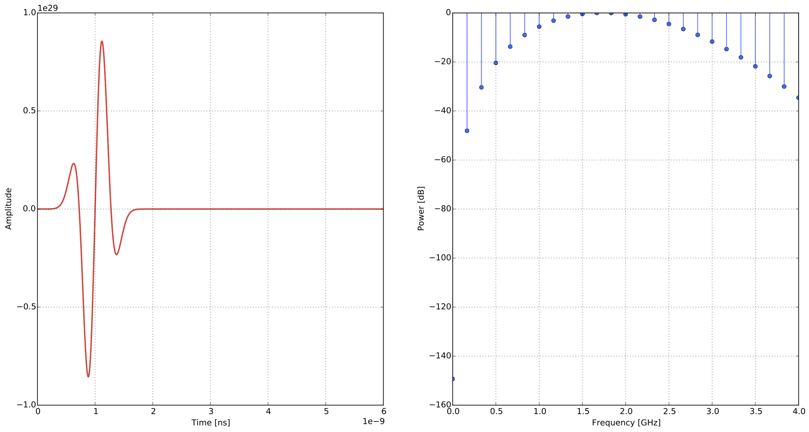

.. _waveforms:

******************
Built-in waveforms
******************

This section provides definitions of the functions that are used to create the built-in waveforms. Example plots are shown using the parameters: amplitude of one, frequency of 1GHz, time window of 6ns, and a time step of 1.926ps.

gaussian
========

A Gaussian waveform.

.. math:: I = e^{-\zeta(t-\chi)^2}

where :math:`I` is the current, :math:`\zeta = 2\pi^2f^2`, :math:`\chi=\frac{1}{f}` and :math:`f` is the frequency.

.. figure:: images/gaussian.png

    Example of the ``gaussian`` waveform - time domain and power spectrum.

gaussiandot
===========

First derivative of a Gaussian waveform.

.. math:: I = -2 \zeta (t-\chi) e^{-\zeta(t-\chi)^2}

where :math:`I` is the current, :math:`\zeta = 2\pi^2f^2`, :math:`\chi=\frac{1}{f}` and :math:`f` is the frequency.

.. figure:: images/gaussiandot.png

    Example of the ``gaussiandot`` waveform - time domain and power spectrum.

gaussiandotnorm
===============

Normalised first derivative of a Gaussian waveform.

.. math:: I = -2 \sqrt{\frac{e}{2\zeta}} \zeta (t-\chi) e^{-\zeta(t-\chi)^2}

where :math:`I` is the current, :math:`\zeta = 2\pi^2f^2`, :math:`\chi=\frac{1}{f}` and :math:`f` is the frequency.

.. figure:: images/gaussiandotnorm.png

    Example of the ``gaussiandotnorm`` waveform - time domain and power spectrum.

gaussiandotdot
==============

Second derivative of a Gaussian waveform.

.. math:: I = 2\zeta \left(2\zeta(t-\chi)^2 - 1 \right) e^{-\zeta(t-\chi)^2}

where :math:`I` is the current, :math:`\zeta = 2\pi^2f^2`, :math:`\chi=\frac{1}{f}` and :math:`f` is the frequency.

.. figure:: images/gaussiandotdot.png

    Example of the ``gaussiandotdot`` waveform - time domain and power spectrum.

gaussiandotdotnorm
==================

Normalised second derivative of a Gaussian waveform.

.. math:: I = \left( 2\zeta (t-\chi)^2 - 1 \right) e^{-\zeta(t-\chi)^2}

where :math:`I` is the current, :math:`\zeta = 2\pi^2f^2`, :math:`\chi=\frac{1}{f}` and :math:`f` is the frequency.

.. figure:: images/gaussiandotdotnorm.png

    Example of the ``gaussiandotdotnorm`` waveform - time domain and power spectrum.

gaussiandotdotdot
=================

Third derivative of a Gaussian waveform.

.. math:: I = \zeta^2 \left( 3(t-\chi) - 2\zeta (t-\chi)^3 \right) e^{-\zeta(t-\chi)^2}

where :math:`I` is the current, :math:`\zeta = 2\pi^2f^2`, :math:`\chi=\frac{1}{f}` and :math:`f` is the frequency.

    Example of the ``gaussiandotdotdot`` waveform - time domain and power spectrum.

ricker
======

A Ricker (or Mexican Hat) waveform which is the negative, normalised second derivative of a Gaussian waveform.

.. math:: I = - \left( 2\zeta (t-\chi)^2 -1 \right) e^{-\zeta(t-\chi)^2}

where :math:`I` is the current, :math:`\zeta = 2\pi^2f^2`, :math:`\chi=\frac{1}{f}` and :math:`f` is the frequency.

.. figure:: images/ricker.png

    Example of the ``ricker`` waveform - time domain and power spectrum.

sine
====

A single cycle of a sine waveform.

.. math:: I = R\sin(2\pi ft)

and

.. math::

    R =
    \begin{cases}
    1 &\text{if $ft\leq1$}, \\
    0 &\text{if $ft>1$}.
    \end{cases}

:math:`I` is the current, :math:`t` is time and :math:`f` is the frequency.

.. figure:: images/sine.png

    Example of the ``sine`` waveform - time domain and power spectrum.

contsine
========

A continuous sine waveform. In order to avoid introducing noise into the calculation the amplitude of the waveform is modulated for the first cycle of the sine wave (ramp excitation).

.. math:: I = R\sin(2\pi ft)

and

.. math::

    R =
    \begin{cases}
    R_cft &\text{if $R\leq 1$}, \\
    1 &\text{if $R>1$}.
    \end{cases}

where :math:`I` is the current, :math:`R_c` is set to :math:`0.25`, :math:`t` is time and :math:`f` is the frequency.

.. figure:: images/contsine.png

    Example of the ``contsine`` waveform - time domain and power spectrum.

