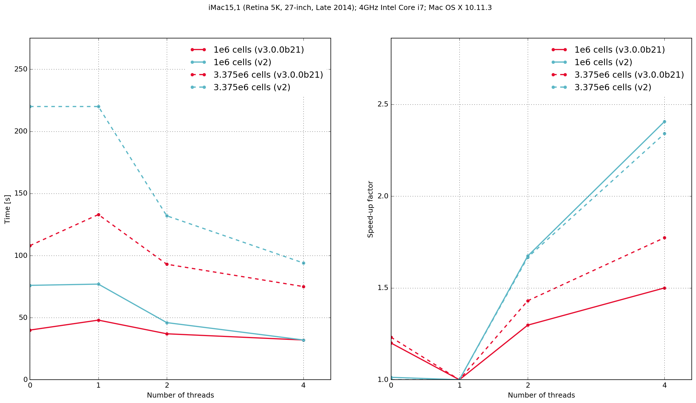
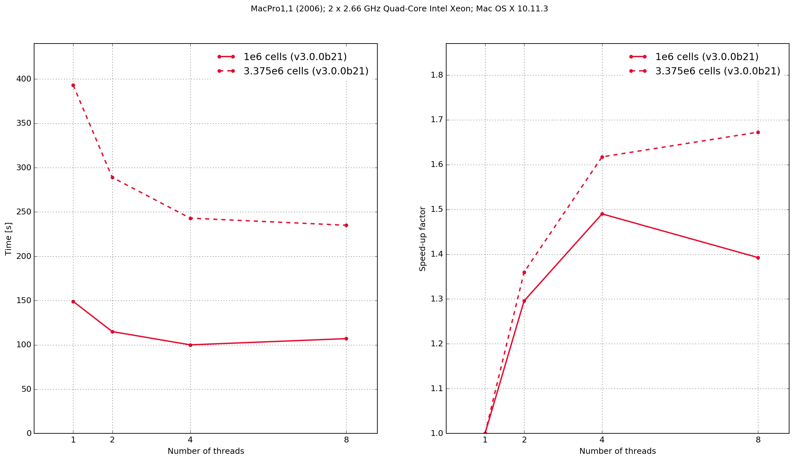

.. _benchmarking:

************
Benchmarking
************

This section provides information and results from performance benchmarking of gprMax.

How to benchmark?
=================

The following simple models (found in the ``tests/benchmarking`` sub-package) can be used to benchmark gprMax on your own system. The models feature different domain sizes and contain a simple source in free space.

:download:`bench_100x100x100.in <../../tests/benchmarking/bench_100x100x100.in>`

.. literalinclude:: ../../tests/benchmarking/bench_100x100x100.in
    :language: none
    :linenos:

:download:`bench_150x150x150.in <../../tests/benchmarking/bench_150x150x150.in>`

.. literalinclude:: ../../tests/benchmarking/bench_150x150x150.in
    :language: none
    :linenos:

The ``#num_threads`` command can be adjusted to benchmark running the code with different numbers of OpenMP threads.

Using the following steps to collect and report benchmarking results:

1. Run each model with different ``#num_threads`` values - from 1 thread up to the number of physical CPU cores on your machine.
2. Note the ``Solving took ..`` time reported by the simulation for each model run.
3. Use the ``save_results.py`` script to enter and save your results in a Numpy archive. You will need to enter some machine identification information in the script.
4. Use the ``plot_time_speedup.py`` script to create plots of the execution time and speed-up.
5. Commit the Numpy archive and plot file using Git

Results
=======

Zero threads indicates that the code was compiled serially, i.e. without using OpenMP.

Mac OS X
--------

iMac15,1
^^^^^^^^

    Execution time and speed-up factor plots for Python/Cython-based gprMax and previous version C-based code.

The results demonstrate that the Python/Cython-based code is faster, in these two benchmarks, than the previous version which was written in C. It also shows that the performance scaling with multiple OpenMP threads is better with the C-based code. Results from the C-based code show that when it is compiled serially the performance is approximately the same as when it is compiled with OpenMP and run with a single thread. With the Python/Cython-based code this is not the case. The overhead in setting up and tearing down the OpenMP threads means that for a single thread the performance is worse than the serially-compiled version.

MacPro1,1
^^^^^^^^^

