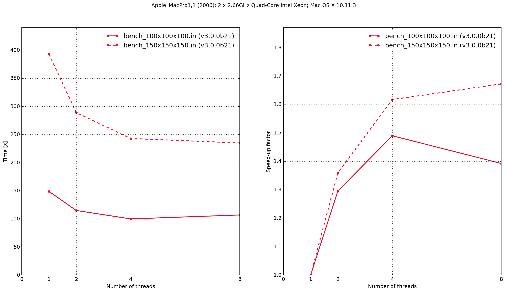
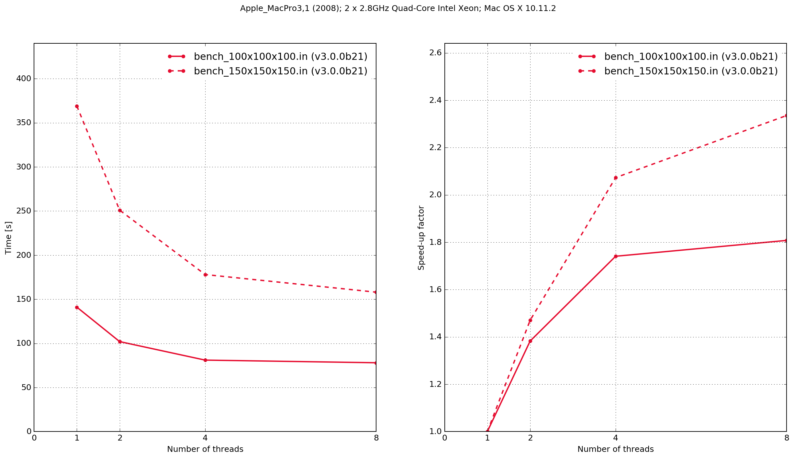
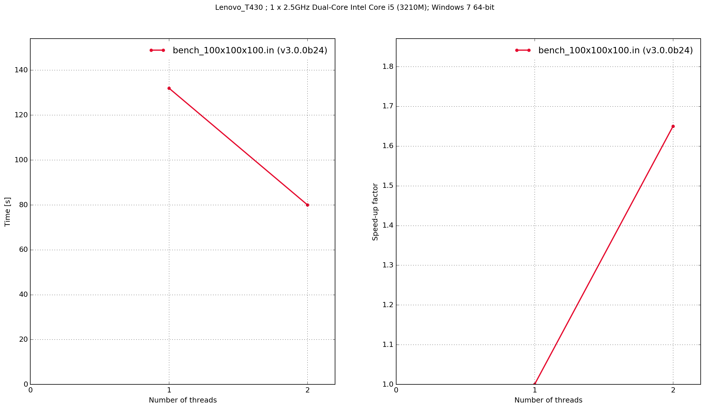
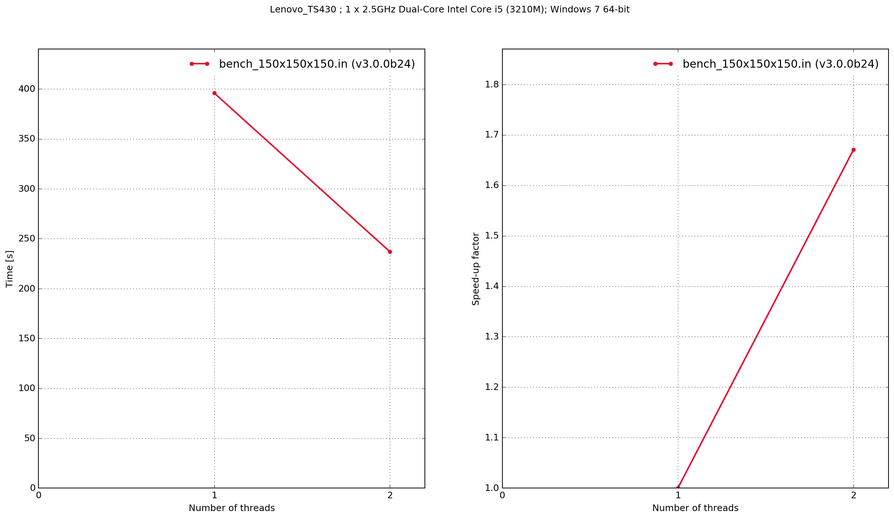
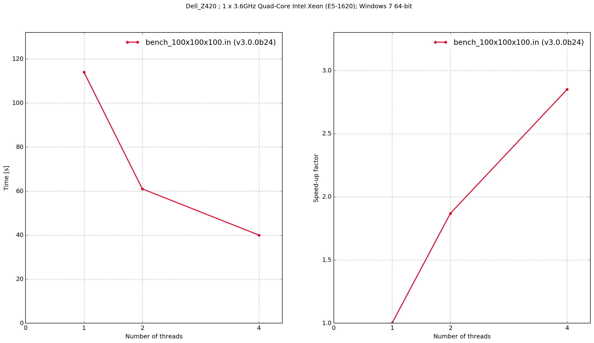
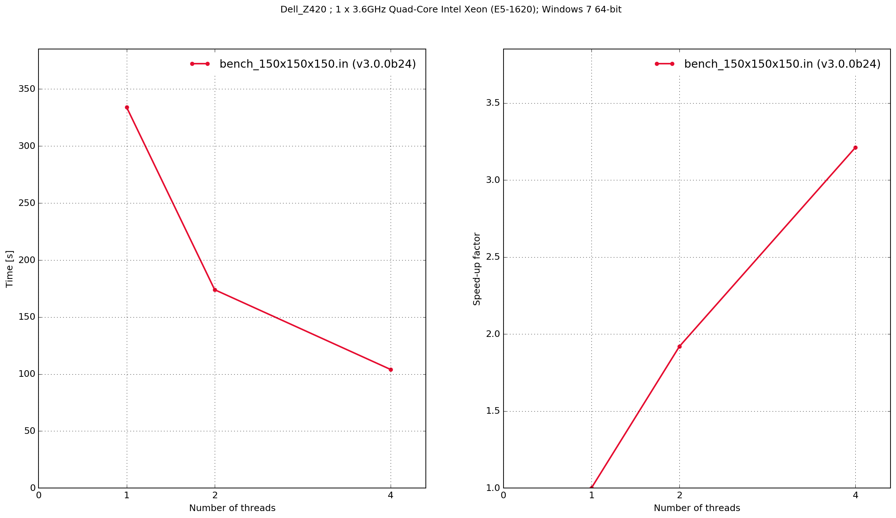

.. _benchmarking:

************
Benchmarking
************

This section provides information and results from performance benchmarking of gprMax.

How to benchmark?
=================

The following simple models (found in the ``tests/benchmarking`` sub-package) can be used to benchmark gprMax on your own system. The models feature different domain sizes and contain a simple source in free space.

:download:`bench_100x100x100.in <../../tests/benchmarking/bench_100x100x100.in>`

.. literalinclude:: ../../tests/benchmarking/bench_100x100x100.in
    :language: none
    :linenos:

:download:`bench_150x150x150.in <../../tests/benchmarking/bench_150x150x150.in>`

.. literalinclude:: ../../tests/benchmarking/bench_150x150x150.in
    :language: none
    :linenos:

Using the following steps to collect and report benchmarking results for each of the models:

1. Run gprMax in benchmarking mode, e.g. ``python -m gprMax tests/benchmarking/bench_100x100x100.in -benchmark``
2. Use the ``plot_benchmark`` module to create plots of the execution time and speed-up, e.g. ``python -m tests.benchmarking.plot_benchmark tests/benchmarking/bench_100x100x100.npz``. You will be prompted to enter information to describe your machine, number and type of CPU/cores, and operating system.
3. Share your data by emailing us your Numpy archives and plot files to info@gprmax.com

Results
=======

.. note::

    Zero threads indicates that the code was compiled serially, i.e. without using OpenMP.

Mac OS X
--------

iMac15,1
^^^^^^^^

.. figure:: ../../tests/benchmarking/results/MacOSX/iMac15,1/iMac15,1+Ccode.png
    :width: 600px

    Execution time and speed-up factor plots for Python/Cython-based gprMax and previous version C-based code.

The results demonstrate that the Python/Cython-based code is faster, in these two benchmarks, than the previous version which was written in C. It also shows that the performance scaling with multiple OpenMP threads is better with the C-based code. Results from the C-based code show that when it is compiled serially the performance is approximately the same as when it is compiled with OpenMP and run with a single thread. With the Python/Cython-based code this is not the case. The overhead in setting up and tearing down the OpenMP threads means that for a single thread the performance is worse than the serially-compiled version.

MacPro1,1
^^^^^^^^^

MacPro3,1
^^^^^^^^^

Windows
-------

Lenovo T430
^^^^^^^^^^^

Dell Z420
^^^^^^^^^

