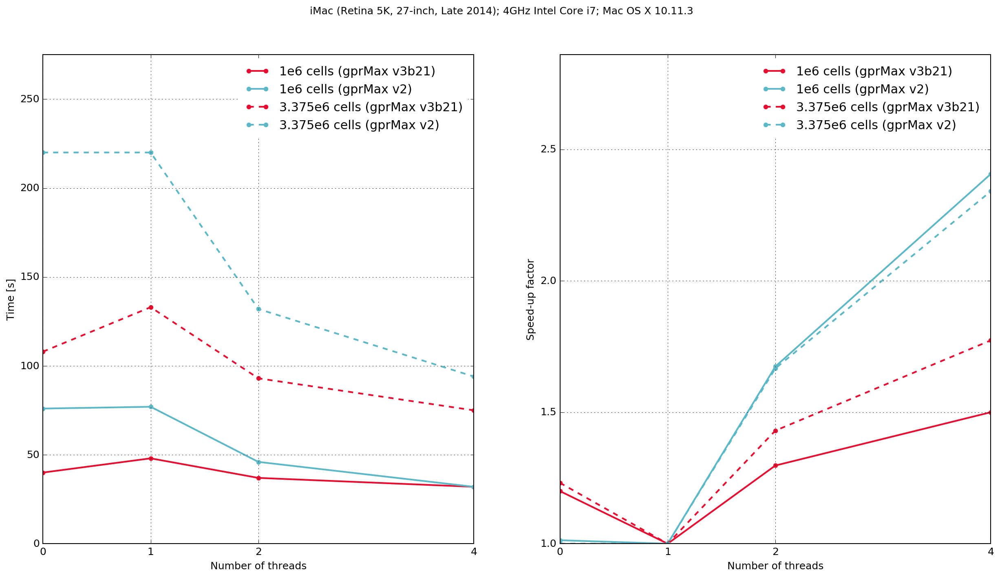

.. _benchmarking:

************
Benchmarking
************

This section provides information and results from performance benchmarking of gprMax.

How to benchmark?
=================

The following simple model is an example (found in the ``tests/benchmarking`` sub-package) that can be used to benchmark gprMax on your own system. The model contains a simple source in free space.

.. literalinclude:: ../../tests/benchmarking/bench_100x100x100.in
    :language: none
    :linenos:

Results
=======

Mac OS X
--------

    Execution time and speed-up factor plots for gprMax (v3b21) and GprMax (v2).