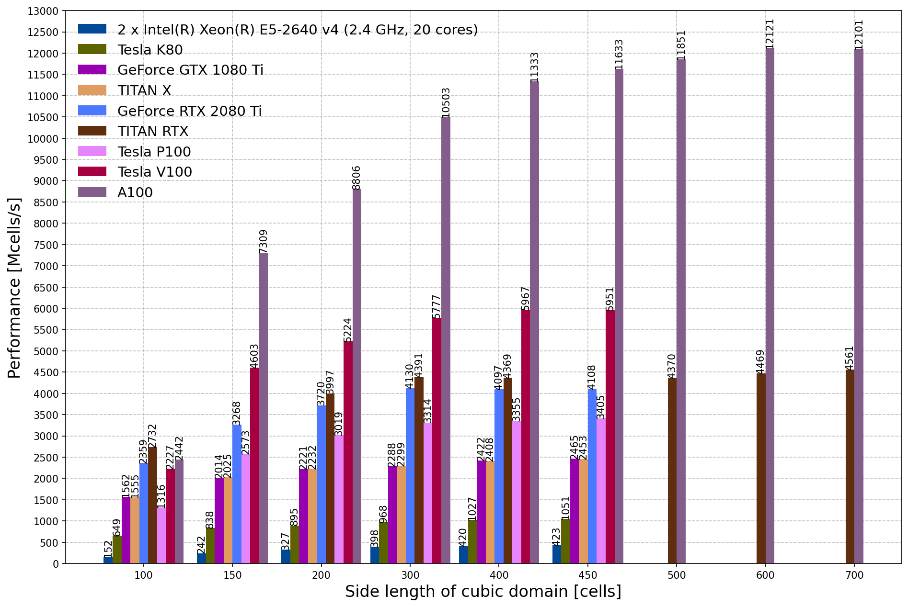

.. _benchmarking:

************
Benchmarking
************

This section provides information and results from performance benchmarking of gprMax.

How to benchmark?
=================

The following simple models (found in the ``testing/benchmarking`` sub-package) can be used to benchmark gprMax on your own system. The models feature different domain sizes (from 100^3 to 800^3 cells) and contain a simple Hertzian dipole source in free space. The following shows an example of the 100^3 cell model:

.. literalinclude:: ../../testing/benchmarking/bench_100x100x100.in
    :language: none
    :linenos:

The performance metric used to measure the throughput of the solver is:

.. math::

    P = \frac{NX \cdot NY \cdot NZ \cdot NT}{T \cdot 1 \times 10^6},

where P is the throughput in millions of cells per second; NX, NY, and NZ are the number of cells in domain in the x, y, and z directions; NT is the number of time-steps in the simulation; and T is the runtime of the simulation in seconds.

