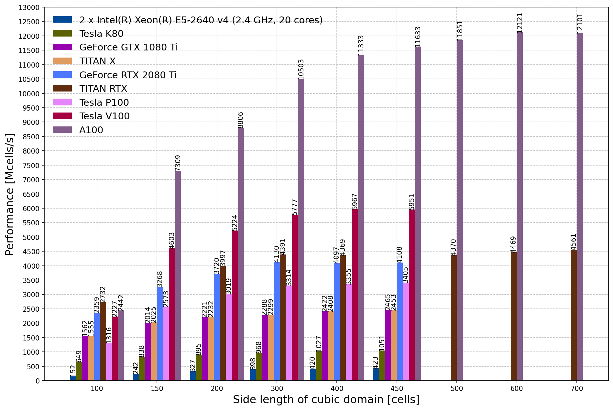

.. _benchmarking:

************
Benchmarking
************

This section provides information and results from performance benchmarking of gprMax.

How to benchmark?
=================

The following simple models (found in the ``testing/benchmarking`` sub-package) can be used to benchmark gprMax on your own system. The models feature different domain sizes (from 100^3 to 800^3 cells) and contain a simple Hertzian dipole source in free space:

.. literalinclude:: ../../testing/benchmarking/bench_simple.py
    :language: python
    :linenos:

The performance metric used to measure the throughput of the solver is:

.. math::

    P = \frac{NX \cdot NY \cdot NZ \cdot NT}{T \cdot 1 \times 10^6},

where P is the throughput in millions of cells per second; NX, NY, and NZ are the number of cells in domain in the x, y, and z directions; NT is the number of time-steps in the simulation; and T is the runtime of the simulation in seconds.

NTFF benchmarking and validation
================================

The incremental cost of KSIR near-to-far-field collection can be measured with
the reusable-surface benchmark. It brackets the monitored cases with
unmonitored baseline runs and writes the complete configuration, individual
run times, collection backend, slowdown, and overhead to JSON. CPU, CUDA,
OpenCL, and Metal use the same benchmark model and configured gprMax precision.

.. code-block:: none

    (gprMax)$ python -m testing.benchmarking.benchmark_ntff --backend cpu --threads 8 --precision double
    (gprMax)$ python -m testing.benchmarking.benchmark_ntff --backend cuda --device 0 --precision single

The surface sizes, frequency counts, number of repeats, and output filename
can be changed using command-line options; run the module with ``--help`` for
the complete list.

End-to-end :ref:`analytical validation cases <analytical-comparisons>` are
provided separately. They include
dielectric and dispersive half-space reflection against Fresnel theory,
Hertzian-dipole far- and near-field comparisons, and broadband PEC- and
dielectric-sphere backscatter through the Mie resonances. The Debye-sphere
case additionally compares averaged and staircased dispersive interfaces.
Solver HDF5 files are
treated as local cache data; compact reports, CSV tables, and plots record the
comparison with the independent analytical solution.

.. code-block:: none

    (gprMax)$ python -m testing.validation.validate_plane_wave_dispersive_halfspace --gpu 0
    (gprMax)$ python -m testing.validation.validate_plane_wave_realistic_materials --gpu 0
    (gprMax)$ python -m testing.validation.validate_hertzian_dipole --gpu 0
    (gprMax)$ python -m testing.validation.planar_layered_ntff.validate_point_dipole
    (gprMax)$ python -m testing.validation.validate_dielectric_sphere_rcs --gpu 0
    (gprMax)$ python -m testing.validation.validate_debye_sphere_averaging --gpu 0
    (gprMax)$ python -m testing.validation.validate_pec_sphere_rcs --gpu 0

The OpenMP/Cython angular summation used by the planar-layered transform can
also be compared directly with its independent NumPy implementation:

.. code-block:: none

    (gprMax)$ python -m testing.benchmarking.benchmark_layered_ntff --threads 8

Omit ``--gpu`` to use the CPU. See :download:`the validation README
<../../testing/validation/README.rst>` for the scope of each case and the
output layout.

Apple Metal GPU Benchmarking
=============================

For macOS users with Apple Silicon (M-series) based GPUs, a dedicated Metal benchmarking script is available in the ``testing/benchmarking`` sub-package:

.. literalinclude:: ../../testing/benchmarking/benchmark_metal.py
    :language: python
    :linenos:
    :lines: 1-30

This script provides comprehensive benchmarking capabilities specifically designed for the Apple Metal backend:

Features
--------

* **Automated domain size testing**: Tests multiple domain sizes from 50×50×50 to 200×200×200 cells
* **CPU vs Metal comparison**: Runs identical simulations on both CPU and Metal backends for direct performance comparison
* **Performance visualization**: Generates plots showing throughput (Mcells/s) and speedup ratios
* **Data export**: Saves results in multiple formats (JSON, NumPy) for further analysis
* **Validation integration**: Can be combined with PML validation testing

Usage
-----

To run the Metal benchmarking suite:

.. code-block:: none

    (gprMax)$ cd testing/benchmarking
    (gprMax)$ python benchmark_metal.py

The script will automatically:

1. Create benchmark input files for different domain sizes
2. Run simulations using both CPU and Metal backends
3. Calculate performance metrics using the standard formula above
4. Generate comparison plots and save results

Visualization Tools
===================

The ``benchmark_metal.py`` script includes plotting support for:

* **Multi-platform comparison**: Compare results across different hardware configurations
* **Custom data visualization**: Load and plot benchmark data from various sources
* **Performance trend analysis**: Visualize performance scaling with domain size
* **Publication-ready plots**: Generate high-quality figures for reports and papers

The generated plots compare the performance characteristics of Apple Metal and
the CPU solver across the requested domain sizes.

