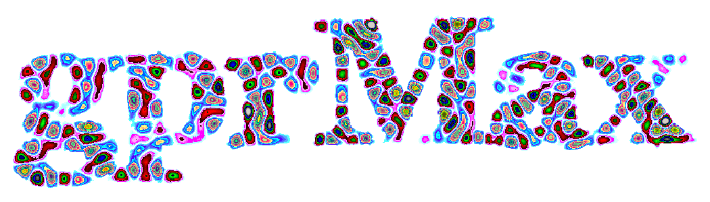
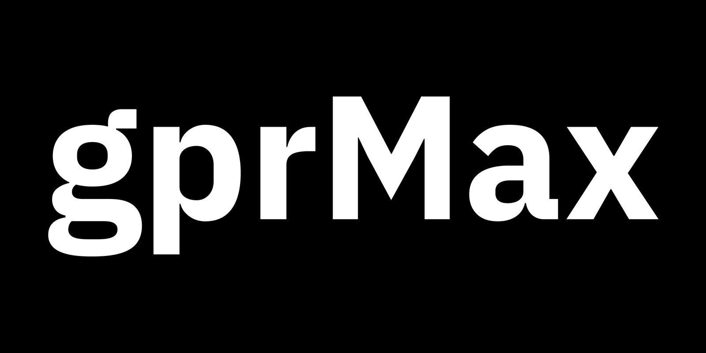

************************
gprMax logo and branding
************************

   The gprMax version 4 resonant-field wordmark.

The version 4 wordmark preserves the physical idea behind the original gprMax
logo. The lettering is not filled with a decorative texture: the colours are
generated by an FDTD simulation performed by gprMax itself.

Physical construction
=====================

The logo is a 2D TMz model. A 1.0 m by 0.5 m plane is first filled with PEC,
then the ``gprMax`` glyphs are carved out as free space. The lettering uses IBM
Plex Sans Bold without additional tracking. Each isolated glyph therefore
forms a small electromagnetic cavity; the electric field is zero in the PEC
surrounding the letters.

Eight z-polarised Hertzian line sources excite the cavities with continuous
10 GHz or 12 GHz sinusoidal waveforms. Their amplitudes are calibrated on the
final grid to give comparable RMS field strength in each glyph. The official
model has a 0.083333 mm spatial step and 12000 by 6000 cells. Its ``Ez`` field
is sampled at 10 ns. No PML is needed because every free-space cavity is
enclosed by PEC.

   The free-space glyph mask before the field simulation. White identifies the
   glyph cavities and black identifies the surrounding PEC plane.

Rendering and colours
=====================

The renderer takes the magnitude of ``Ez``, normalises it by the 99.5th
percentile inside the glyphs, and applies a power-law colour mapping. The scale
retains the established gprMax purple (``#55037f``), with indigo and blue for
weaker fields and magenta and pink for stronger fields. The PEC background is
transparent, so the wordmark works on both light and dark pages.

The prebuilt asset collection contains transparent, white-background, and
dark-background PNGs. Use the transparent version where possible, preserve
the wordmark aspect ratio, and retain the ``gprMax`` capitalisation.

* :download:`2048 px transparent PNG
  <../../branding/logo_v4/assets/gprmax_v4_logo_2048px.png>`
* :download:`1024 px transparent PNG
  <../../branding/logo_v4/assets/gprmax_v4_logo_1024px.png>`
* :download:`512 px transparent PNG
  <../../branding/logo_v4/assets/gprmax_v4_logo_512px.png>`
* :download:`Asset manifest
  <../../branding/logo_v4/assets/manifest.json>`

Reproducing the logo
====================

The complete model, bundled font and licence, rendering tools, standard
exports, and detailed reproduction instructions are included in the
:download:`branding README <../../branding/logo_v4/README.md>`.

Generate the model from the repository root with:

.. code-block:: console

   $ python branding/logo_v4/logo_model.py

The production case contains 72 million cells and produces an approximately
1.7 GB raw field snapshot, so a suitable GPU is recommended. The snapshot is
not distributed; the compact input model and generated assets are. After the
simulation, ``render_logo.py`` creates a transparent master at any requested
pixel width, and ``export_assets.py`` creates the standard screen and print
sizes. Only the default 3x model has the calibrated source amplitudes used for
the approved wordmark.
