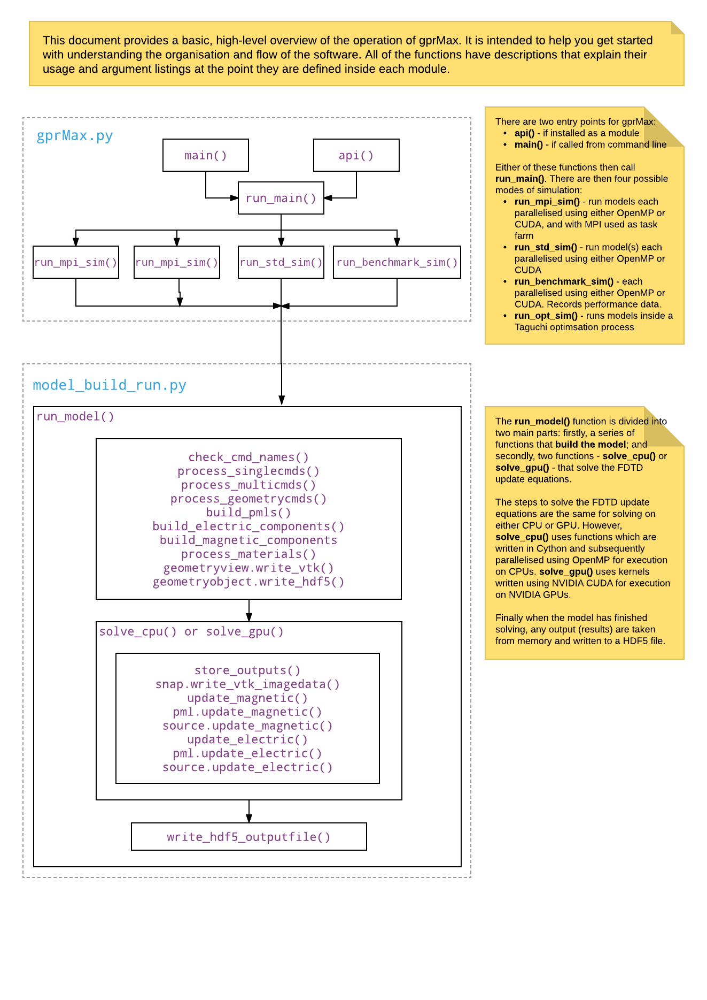

.. _coding:

*************
Code Overview
*************

This section aims to provide information and advice for developers who want to
get started using and modifying the gprMax code.

The code has been written in Python (3.x) with performance-critical parts, i.e.
the FDTD solver, written using Cython (for CPU) or the NVIDIA CUDA programming
model (for GPU). Cython allows the CPU-based solver to be parallelised using
OpenMP which enables it to run on multi-core CPUs. gprMax also features a
Messaging Passing Interface (MPI) task farm, which can operate with CPU nodes or
multiple GPUs.

    Basic, high-level overview of the flow of control (operation) of the code.
