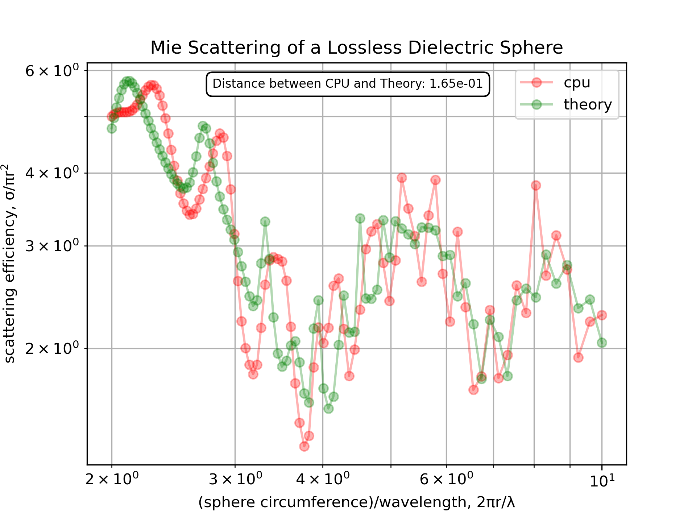
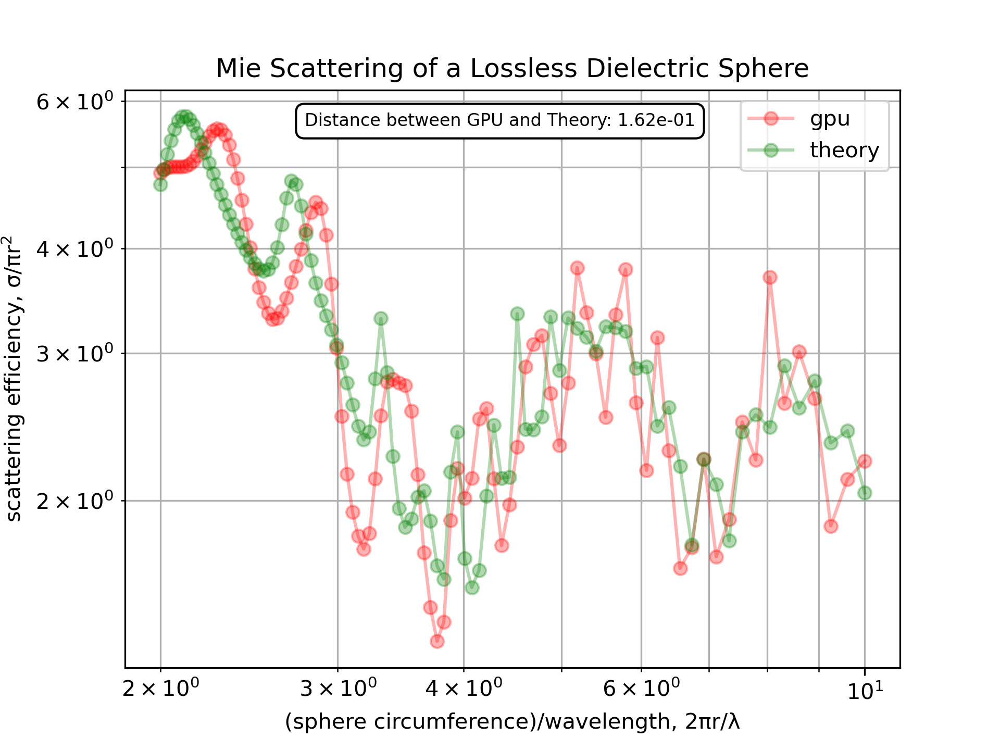

**********************
Analytical comparisons
**********************

This section presents comparisons between analytical solutions and modelled solutions using gprMax.

Hertzian dipole in free space
=============================

:download:`hertzian_dipole_fs.in <../../tests/models_basic/hertzian_dipole_fs/hertzian_dipole_fs.in>`

This example is of a Hertzian dipole, i.e. an additive source (electric current density), in free space.

.. literalinclude:: ../../tests/models_basic/hertzian_dipole_fs/hertzian_dipole_fs.in
    :language: none
    :linenos:

The function ``hertzian_dipole_fs``, which can be found in the ``analytical_solutions`` module in the ``tests`` sub-package, computes the analytical solution.

Results
-------

:numref:`hertzian_dipole_fs_results` shows the time history of the electric and magnetic field components of the modelled and analytical solutions. The responses completely overlap one another due to their similarity. Therefore, :numref:`hertzian_dipole_fs_results_diffs` shows the percentage differences between the modelled and analytical solutions.

.. _hertzian_dipole_fs_results:

.. figure:: ../../tests/models_basic/hertzian_dipole_fs_analytical/hertzian_dipole_fs_analytical.png
    :width: 600 px

    Time history of the electric and magnetic field components of the modelled and analytical solutions ('Ref', in this case, indicates solution calculated from theory).

.. _hertzian_dipole_fs_results_diffs:

.. figure:: ../../tests/models_basic/hertzian_dipole_fs_analytical/hertzian_dipole_fs_analytical_diffs.png
    :width: 600 px

    Percentage differences between the modelled and analytical solutions.

The match between the analytical and numerically modelled solutions is excellent. The maximum difference is approximately 1%, which is observed in the Ez field component (the same direction as the Hertzian dipole source). The other electric field components exhibit maximum differences of approximately 0.5%, and the magnetic field components 0.25%.

Half-wave dipole in free space
==============================

See the :ref:`section on antenna example models <example-wire-dipole>` for the simulated s11 parameter and input impedance of a half-wave dipole antenna in free space. The resonant frequency and input impedance from the model agree very well with the theoretical predictions for a half-wave dipole antenna.

Fluxes
======

:download:`lossless_sphere_scattering.in <../../tests/fluxes/lossless_sphere_scattering.in>`

This example is a plane wave incident on a lossless dielectric sphere. The frequency-domain fluxes through a closed box encapsulating the sphere are accumulated during the time-domain simulation and then compared to the analytical Mie solution.

.. literalinclude:: ../../tests/fluxes/lossless_sphere_scattering.in
    :language: none
    :linenos:

Analytical reference
--------------------
The analytical scattering efficiency is computed with the `PyMieScatt <https://pypi.org/project/PyMieScatt/>`_ module.

.. warning::
    PyMieScatt currently pins (directly or via its dependency chain) to an older SciPy version than the one
    recommended/required by gprMax. To avoid dependency conflicts install PyMieScatt in a *separate* lightweight
    virtual environment used only for the post-processing step (``analyse_lossless_sphere.py``). The simulation
    itself does **not** need PyMieScatt.

Minimal install in a dedicated environment:

.. code-block:: bash

    pip install PyMieScatt h5py

The analysis script auto-detects one of the produced flux output files (CPU/GPU). It also works with a user-specified file.

Scripts & workflow
------------------
The directory ``tests/fluxes`` contains:

* ``run_lossless_sphere.py`` – builds an input file parametrically and runs the simulation (``--backend cpu`` or ``--backend gpu``). Produces ``Mie_scattering_<backend>_fluxes.out``.
* ``analyse_lossless_sphere.py`` – loads the flux output, computes scattering efficiency :math:`\sigma/(\pi r^{2})`, compares to Mie theory, and generates a figure. No backend parameter is required (auto-detection); optionally use ``--file`` to specify a custom path.

Example usage:

.. code-block:: bash

    # Run on CPU
    python run_lossless_sphere.py --backend cpu
    # Run on GPU (requires CUDA + GPUtil for auto-detect)
    python run_lossless_sphere.py --backend gpu
    # Analyse (auto-detects output file)
    python analyse_lossless_sphere.py
    # Or analyse a specific file
    python analyse_lossless_sphere.py --file Mie_scattering_cpu_fluxes.out

Notes:

* ``PyMieScatt`` is only needed for the analytical curve; the simulation itself does not depend on it.
* ``GPUtil`` is only required when using the GPU backend for automatic device selection.
* Incident flux magnitudes and scattered box fluxes are combined to obtain the scattering efficiency.

Results
-------
The CPU and GPU results are shown in :numref:`fluxes_results_cpu` and :numref:`fluxes_results_gpu`.

.. _fluxes_results_cpu:

.. _fluxes_results_cpu:

    Mie Scattering of a Lossless Dielectric Sphere - CPU run

.. _fluxes_results_gpu:

    Mie Scattering of a Lossless Dielectric Sphere - GPU run

Both implementations closely follow the analytical Mie scattering efficiency; minor deviations arise from finite spatial/temporal resolution and the finite-difference realisation of the incident plane wave (source spans the PML and is not perfectly planar in practice, see [MEEP_PML]_). The GPU version typically achieves the solution faster (order of minutes vs tens of minutes on CPU) and small numerical differences (2-norm distance) can appear due to differing floating-point reduction order.