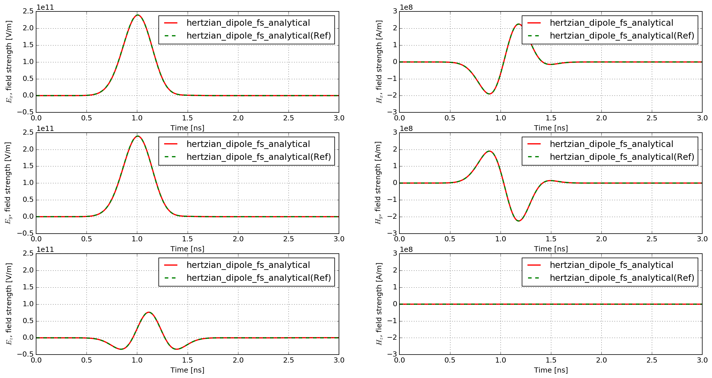
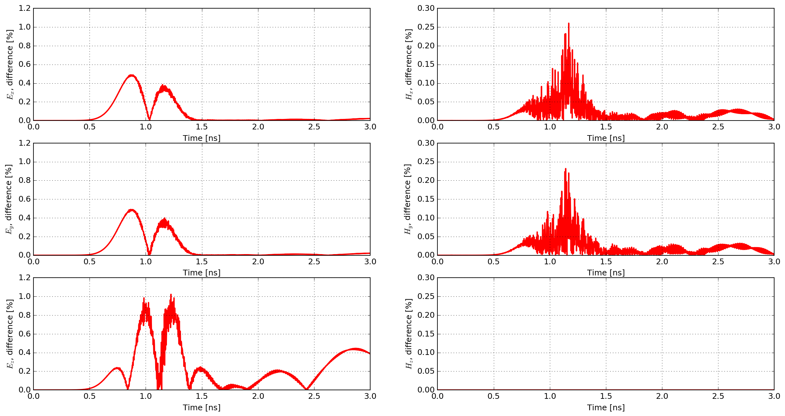

**********************
Analytical comparisons
**********************

This section presents comparisons between analytical solutions and modelled solutions using gprMax.

Hertzian dipole in free space
=============================

:download:`hertzian_dipole_fs.in <../../tests/models_basic/hertzian_dipole_fs/hertzian_dipole_fs.in>`

This example is of a Hertzian dipole, i.e. an additive source (electric current density), in free space.

.. literalinclude:: ../../tests/models_basic/hertzian_dipole_fs/hertzian_dipole_fs.in
    :language: none
    :linenos:

The function ``hertzian_dipole_fs``, which can be found in the ``analytical_solutions`` module in the ``tests`` sub-package, computes the analytical solution.

Results
-------

:numref:`hertzian_dipole_fs_results` shows the time history of the electric and magnetic field components of the modelled and analytical solutions. The responses completely overlap one another due to their similarity. Therefore, :numref:`hertzian_dipole_fs_results_diffs` shows the percentage differences between the modelled and analytical solutions.

.. _hertzian_dipole_fs_results:

    Time history of the electric and magnetic field components of the modelled and analytical solutions ('Ref', in this case, indicates solution calculated from theory).

.. _hertzian_dipole_fs_results_diffs:

    Percentage differences between the modelled and analytical solutions.

The match between the analytical and numerically modelled solutions is excellent. The maximum difference is approximately 1%, which is observed in the Ez field component (the same direction as the Hertzian dipole source). The other electric field components exhibit maximum differences of approximately 0.5%, and the magnetic field components 0.25%.

Half-wave dipole in free space
==============================

See the :ref:`section on antenna example models <example-wire-dipole>` for the simulated s11 parameter and input impedance of a half-wave dipole antenna in free space. The resonant frequency and input impedance from the model agree very well with the theoretical predictions for a half-wave dipole antenna.

Fluxes
=====

:download:`lossless_sphere_scattering.in <../../tests/fluxes/lossless_sphere_scattering.in>`

This example is of a plane wave incident on a lossless dielectric sphere. The fluxes through a box surrounding the sphere are calculated and compared to the analytical solution.

.. literalinclude:: ../../tests/fluxes/lossless_sphere_scattering.in
    :language: none
    :linenos:

To compute the analytical solution, we use the PyMieScatt module, which can be installed using conda:

.. code-block:: bash

    conda install conda-forge::pymiescatt

Be careful when installing PyMieScatt as for running it, you need to have a version of scipy for which trapz has not been deprecated (scipy 1.13.1 works fine). The analytical solution is computed in the script ``lossless_sphere_scattering.py``, which can be found in the ``tests/models_basic/fluxes`` directory.

We ran it twice, once using the CPU and once using the GPU. The only difference in the input files is the addition of the ``#gpu`` command for the GPU run. You can find the scripts and the ouput files of both run iun the ``tests/models_basic/fluxes`` directory. The results are found in :numref:`fluxes_results_cpu` and :numref:`fluxes_results_gpu`.

+---------------------------------------------------+---------------------------------------------------+
| .. _fluxes_results_cpu:                           | .. _fluxes_results_gpu:                            |
|.. figure:: ../../tests/fluxes/Mie_scattering_cpu.png | .. figure:: ../../tests/fluxes/Mie_scattering_gpu.png |
|    :width: 300 px                                 |    :width: 300 px                                 |
|                                                   |                                                   |
|    Mie Scattering of a Lossless Dielectric Sphere - CPU run |    Mie Scattering of a Lossless Dielectric Sphere - GPU run |
+---------------------------------------------------+---------------------------------------------------+

The results from gprMax are close to the theory, but not exactly the same. Moreover, the GPU implementation seems a little more precise than the CPU one (the GPU is closer to the theory if we compute the distance between its results and the theory (2-norm)). 
The CPU implementation ran the simulation in about 35 minutes, while the GPU took about 2 minutes.

The difference between the theory and the results of the simulation may come from the implementation of the plane wave source, as this extends through PML, and is not perfectly plane in this case, as explained in [MEEP_PML]_.