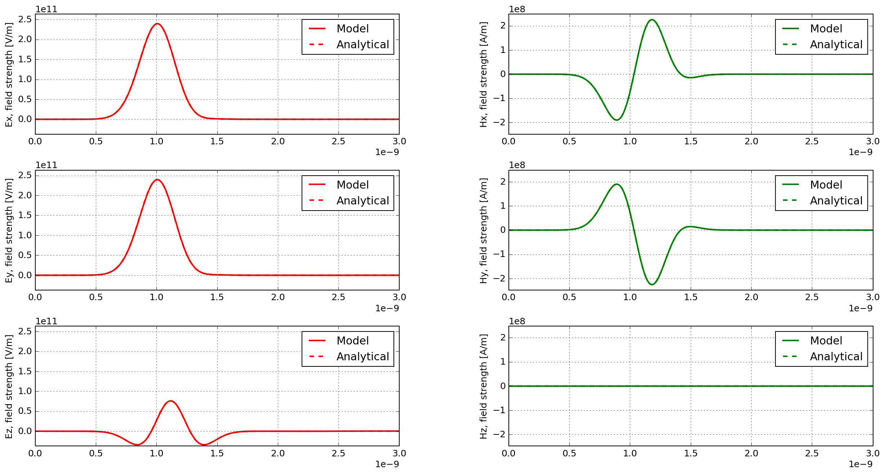
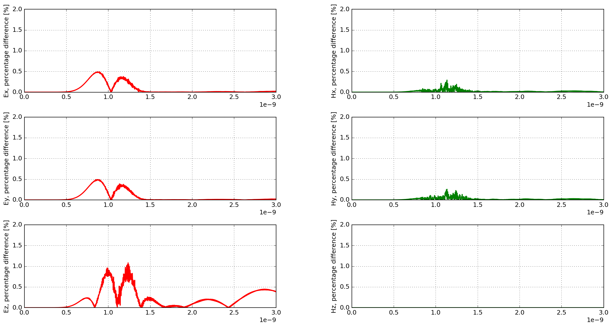

**********************
Analytical comparisons
**********************

This section presents comparisons between analytical solutions and modelled solutions using gprMax.

Hertzian dipole in free space
=============================

:download:`hertzian_dipole_fs.in <../../tests/analytical/hertzian_dipole_fs/hertzian_dipole_fs.in>`

This example is of a Hertzian dipole, i.e. an additive source (electric current density), in free space.

.. literalinclude:: ../../tests/analytical/hertzian_dipole_fs/hertzian_dipole_fs.in
    :language: none
    :linenos:

The function ``hertzian_dipole_fs``, which can be found in the ``analytical_solutions`` module in the ``tests`` sub-package, computes the analytical solution.

Results
-------

:numref:`hertzian_dipole_fs_results` shows the time history of the electric and magnetic field components of the modelled and analytical solutions. The responses completely overlap one another due to their similarity. Therefore, :numref:`hertzian_dipole_fs_results_diffs` shows the percentage differences between the modelled and analytical solutions.

.. _hertzian_dipole_fs_results:

    Time history of the electric and magnetic field components of the modelled and analytical solutions.

.. _hertzian_dipole_fs_results_diffs:

    Percentage differences between the modelled and analytical solutions.

The match between the analytical and numerically modelled solutions is excellent. The maximum difference is approximately 1%, which is observed in the Ez field component (the same direction as the Hertzian dipole source). The other electric field components exhibit maximum differences of approximately 0.5%, and the magnetic field components 0.25%.

