.. _analytical-comparisons:

**********************
Analytical comparisons
**********************

This section compares production gprMax results with independent analytical
solutions. These are correctness validations: unlike the
:ref:`inter-code studies <numerical-comparisons>`, the reference is not the
output of another numerical solver.

Two levels are provided. Compact tests in ``tests/ntff`` exercise the complete
FDTD and near-to-far-field path during routine pytest runs. The higher
resolution studies in ``testing/validation`` are deliberately run manually;
they write plots, CSV data, a machine-readable summary, and a report containing
the numerical acceptance checks. The large HDF5 solver files are reproducible
working data and are not the analytical reference.

TE10 transmission across cutoff
===============================

The :download:`partial-cutoff rectangular-waveguide model
<../../testing/validation/rectangular_waveguide_partial_cutoff/rectangular_waveguide_partial_cutoff.in>`
compares the generalized TE10 transmission coefficient with

.. math::

    S_{21}(f) = \exp[-j\beta(f)L],

where the two modal reference planes are separated by :math:`L=12` mm. Below
cutoff, :math:`\beta=-j\alpha`, so the field-amplitude magnitude decays as
:math:`\exp(-\alpha L)` and its phase is zero. Above cutoff, the ideal
magnitude is 0 dB and the unwrapped phase is :math:`-\beta L`.

.. figure:: ../../testing/validation/rectangular_waveguide_partial_cutoff/rectangular_waveguide_partial_cutoff_s11_s21.png
    :width: 850 px

    gprMax and analytical TE10 transmission magnitude and phase across cutoff.
    The shaded below-cutoff coefficients are generalized modal amplitudes, not
    physical power waves.

The retained 100-frequency result has maximum theory errors of 0.336 dB in
magnitude and 2.441 degrees in phase. Seven samples lie below cutoff and
remain finite generalized coefficients while their separate power-wave-valid
flags are false. The comparison uses the integrated eigenmode-port result
directly; it does not use auxiliary receiver-derived oracle traces.

Full incident-matrix modal de-embedding
=======================================

An eigenmode study records every port's incident and outgoing modal waves in
every independent excitation case. With those case vectors as columns,

.. math::

    A=[a^{(1)}\;\cdots\;a^{(N)}], \qquad
    B=[b^{(1)}\;\cdots\;b^{(N)}], \qquad B=SA.

The :download:`multiport validation driver
<../../testing/validation/eigenmode_multiport_deembedding/validate_rectangular_waveguide.py>`
first prescribes an exact frequency-dependent :math:`S` and a non-diagonal
:math:`A`, then forms :math:`B` analytically. The production conditioned solve
recovers :math:`S` with a maximum Frobenius-norm error of
:math:`2.31\times10^{-16}`. Dividing each case only by its nominal source wave
has an error of at least :math:`2.17\times10^{-2}` in this test.

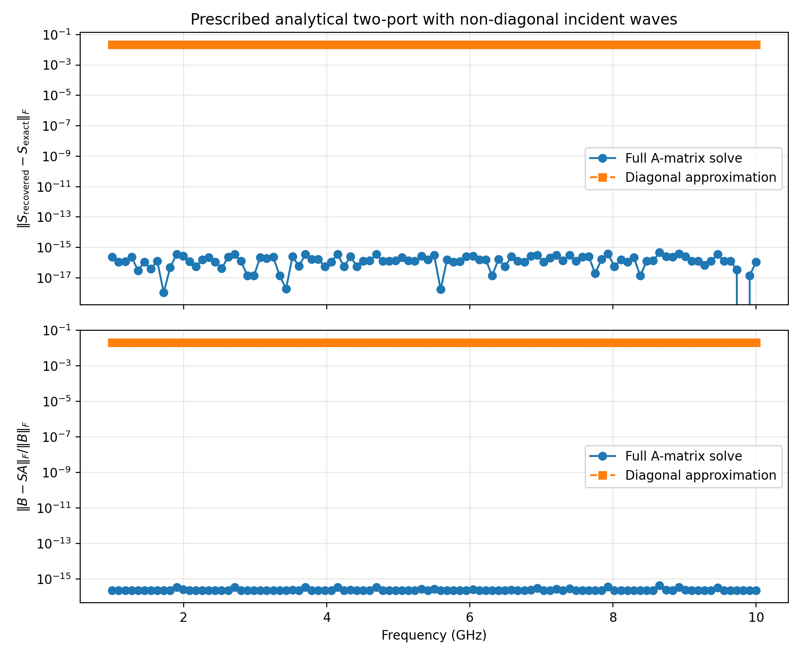

    Exact matrix recovery and network-equation residual with deliberately
    non-zero incident waves at nominally passive ports.

The end-to-end comparison uses a lossless two-port rectangular guide and the
analytical TE10 propagation factor :math:`\exp(-j\beta L)`. Across 20--24 GHz,
the full solve has maximum errors of 0.001829 in linear magnitude and 1.243
degrees in phase. Its maximum :math:`\|B-SA\|/\|B\|` residual is
:math:`2.93\times10^{-16}`, compared with 0.0379 for diagonal normalisation.

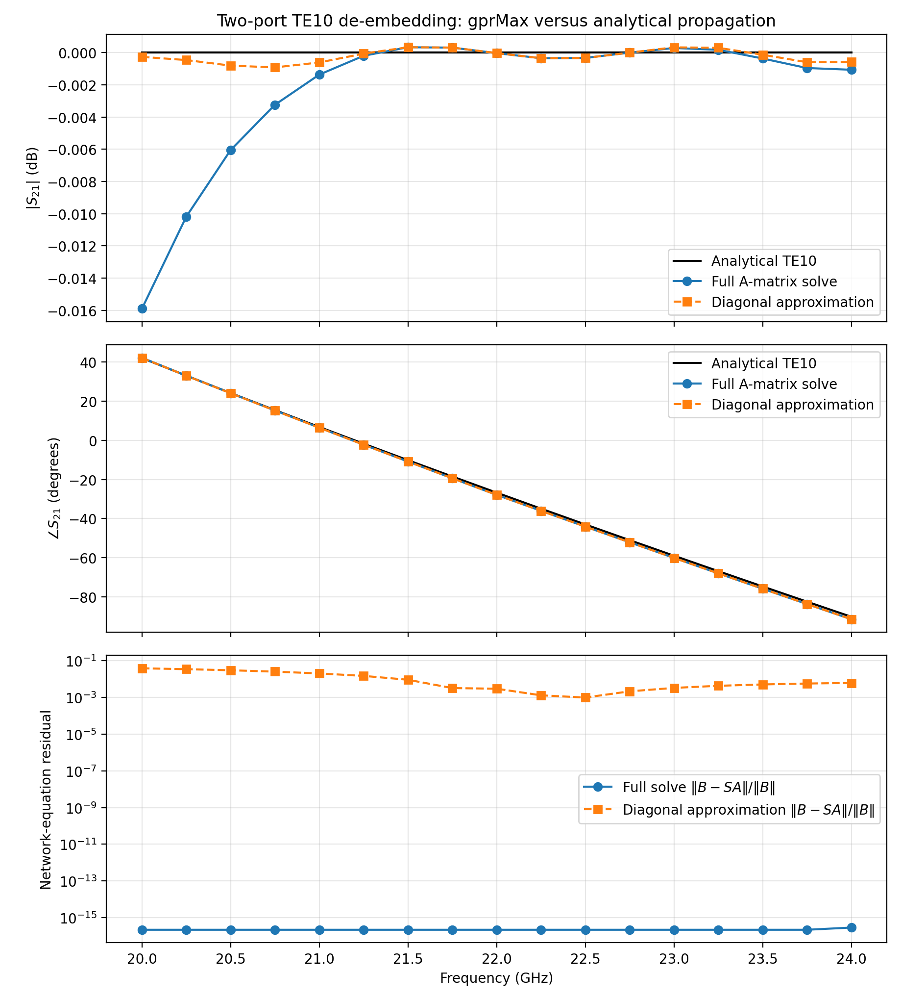

    End-to-end TE10 comparison and the measured multiport network residual.
    The diagonal result is accidentally closer to the continuum magnitude in
    this coarse model, but it does not satisfy the measured :math:`B=SA`
    system; full de-embedding does not remove ordinary FDTD discretisation or
    port-termination errors.

Hertzian dipole in free space
=============================

:download:`hertzian_dipole_fs_analytical.in <../../testing/models_basic/hertzian_dipole_fs_analytical/hertzian_dipole_fs_analytical.in>`

This example is a Hertzian electric dipole, i.e. an additive electric-current
source, in free space.

.. literalinclude:: ../../testing/models_basic/hertzian_dipole_fs_analytical/hertzian_dipole_fs_analytical.in
    :language: none
    :linenos:

The function ``hertzian_dipole_fs`` in ``testing/analytical_solutions.py``
evaluates the complete free-space time-domain solution at the Yee-component
positions. The relative source and receiver positions are important because
the six field components are spatially staggered.

.. _hertzian_dipole_fs_results:

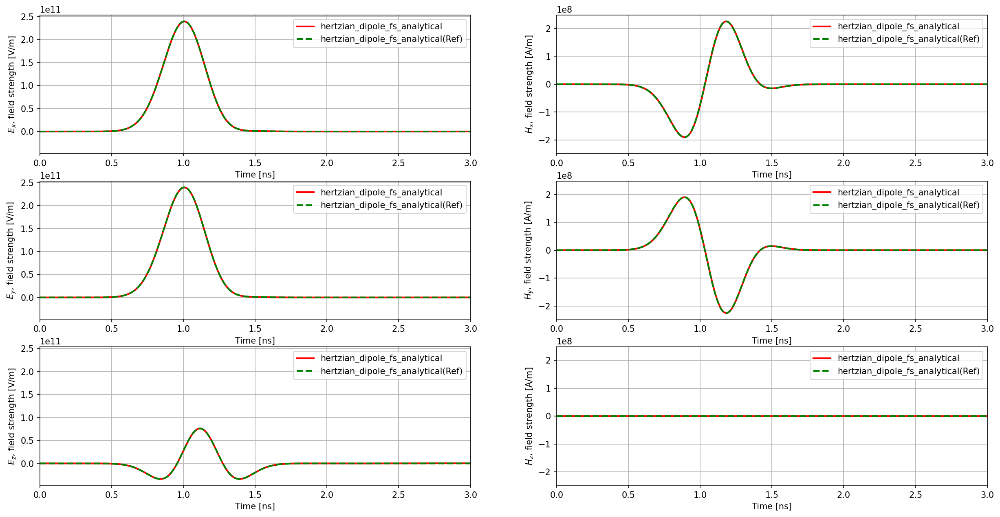

    Electric and magnetic field histories from gprMax and the analytical
    solution (``Ref``).

.. _hertzian_dipole_fs_results_diffs:

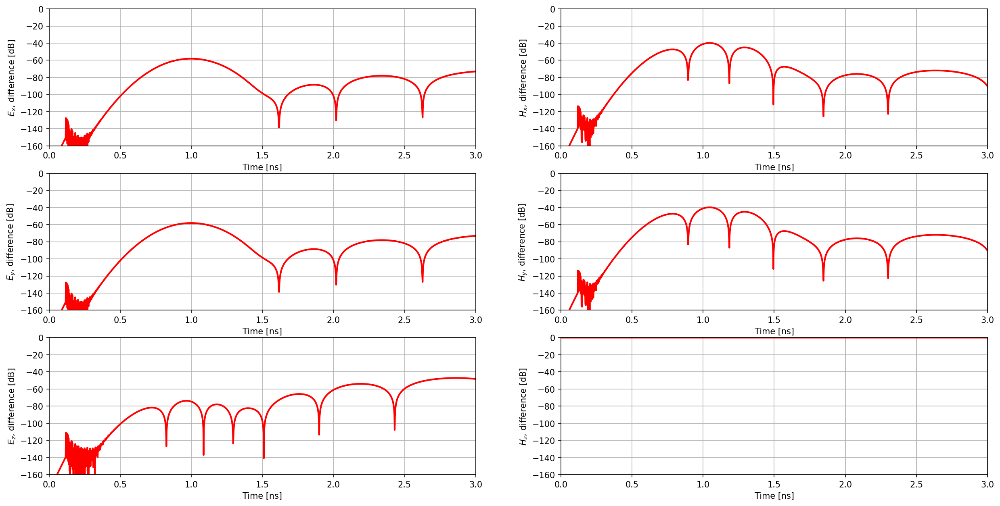

    Percentage differences between the numerical and analytical fields.

The largest difference is approximately one percent in the electric component
parallel to the source. The remaining electric components are within about
0.5 percent and the magnetic components within about 0.25 percent.

Plane-wave reflection from dispersive half spaces
=================================================

The normal-incidence validation calculates the incident waveform in free
space, repeats the model with a planar half space, and obtains the reflected
field by subtraction. The complex reflection coefficient is compared with the
Fresnel result

.. math::

    \Gamma(\omega) = \frac{\eta_2(\omega)-\eta_1(\omega)}
                           {\eta_2(\omega)+\eta_1(\omega)},

where the frequency-dependent wave impedance is evaluated from the same
dielectric, conductivity, Debye, Lorentz, or Drude parameters used to define
the material. Propagation phase between the receiver and the effective Yee
interface is included explicitly.

:download:`Dispersive half-space driver <../../testing/validation/validate_plane_wave_dispersive_halfspace.py>`
tests a nondispersive dielectric, one- and three-pole Debye media, and
multi-pole Lorentz and Drude media over 0.25--8 GHz.

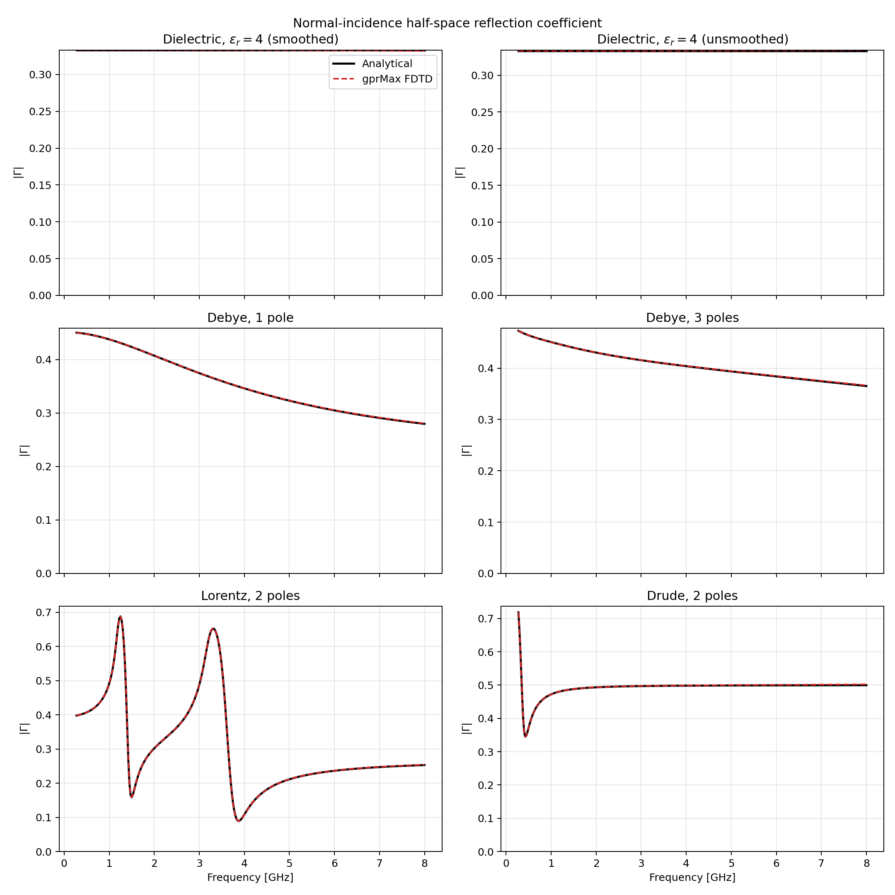

    Magnitude of the gprMax reflection coefficients and the corresponding
    Fresnel solutions.

Across the retained result set, magnitude RMS errors are between
:math:`3.3\times10^{-4}` and :math:`1.2\times10^{-3}`. The maximum phase RMS
error is 0.021 degrees. These comparisons exercise the discrete plane-wave
source and the complete multipole material-update path, rather than only
evaluating the material formula in isolation.

:download:`Realistic-material driver <../../testing/validation/validate_plane_wave_realistic_materials.py>`
adds fresh water at 25 degrees Celsius and Puerto Rico clay with ten percent
volumetric water content over frequency ranges selected to show their
dispersion.

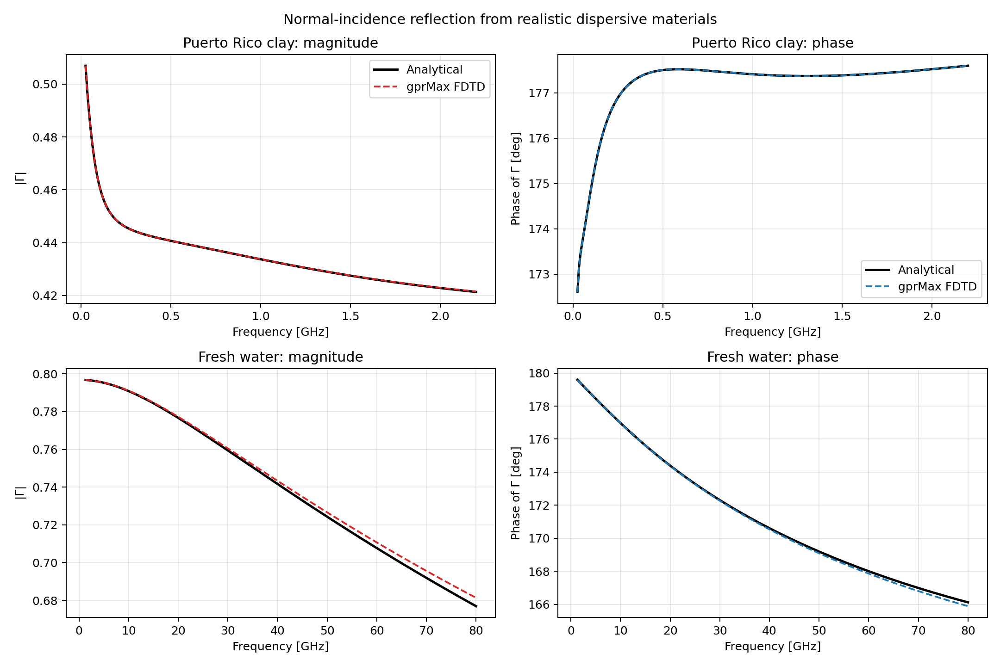

    Complex Fresnel comparison for the fresh-water and clay models.

.. _rational-network-validation:

Rational lumped networks in a parallel-plate guide
===================================================

The :download:`rational-network validation driver
<../../testing/validation/validate_rational_network_literature.py>` uses the
finite-width parallel-plate guide introduced by Pereda et al. [PER1999]_. Its
width is :math:`a=15` mm, its plate separation is :math:`b=2` mm, and the
1 mm Yee mesh gives 15 effective parallel paths, each containing two series
electric edges. For a one-edge network impedance :math:`Z(\omega)`, the exact
TEM quantities are therefore

.. math::

    Z_\mathrm{guide}=\eta_0\frac{b}{a},\qquad
    Z_\mathrm{sheet}=\frac{2Z}{15},\qquad
    \Gamma=-\frac{Z_\mathrm{guide}}
                   {2Z_\mathrm{sheet}+Z_\mathrm{guide}}.

The FDTD result is obtained from an empty-guide incident run and a loaded-guide
run. The first reflected pulse is isolated, transformed using the engineering
Fourier convention, and de-embedded to the sheet with the axial Yee numerical
wavenumber. Separate resistor, capacitor, and inductor sheets exercise the
direct :math:`G`, direct :math:`sC`, and zero-pole terms. The two literature
cases exercise a real pole for a series RC network and a conjugate pole pair
for a series RLC network.

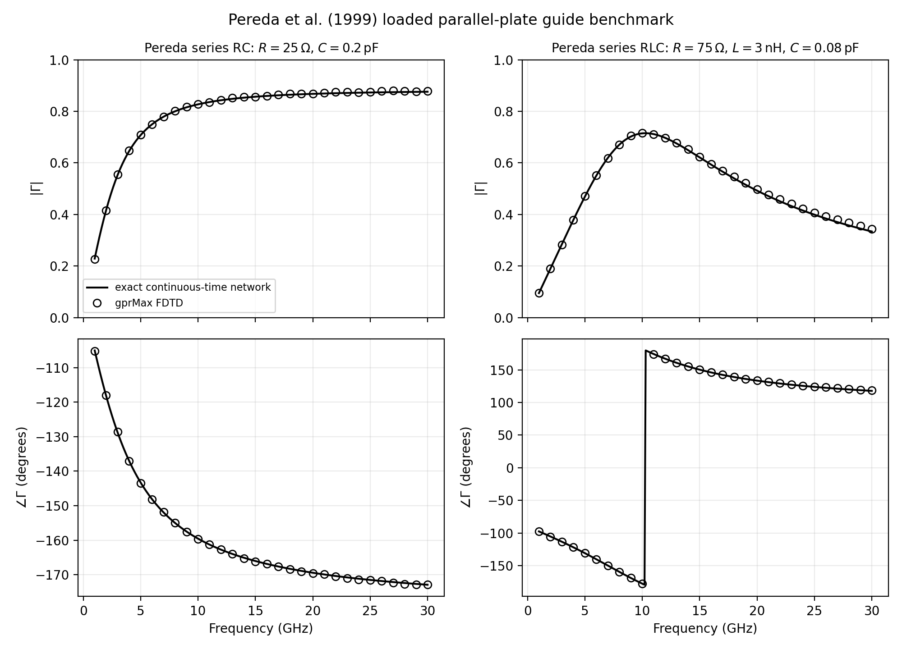

    Production gprMax FDTD reflection (symbols) compared with the exact
    continuous-time network result (lines) for the two examples of
    [PER1999]_.

From 1--30 GHz, the series-RC comparison has magnitude and phase RMS errors of
0.0027 and 0.15 degrees; the series-RLC errors are 0.0057 and 0.37 degrees.
The RC capacitance printed in [PER1999]_ is 0.02 pF, but both magnitude and
phase curves published in that paper correspond to 0.2 pF; the latter value
is used for the reproduced curve above.

The arbitrary one-port coupling follows the lumped-network FDTD formulations
of [PER1999]_ and [CHE2007]_. gprMax does not retain their classic PLRC time
placement unchanged. Each partial-fraction term is advanced using the
exponential recursive-convolution approach of Giannakis and Giannopoulos
[GIA2014]_, evaluated directly at :math:`n+1/2` for a linearly varying
terminal voltage. This avoids estimating the half-step network current by
averaging adjacent integer-time pole currents.

Hertzian-dipole pattern, directivity, and near field
====================================================

The :download:`Hertzian-dipole validation driver
<../../testing/validation/validate_hertzian_dipole.py>` compares both KSIR and
equivalent-current far fields with the analytical :math:`\sin\theta` field
pattern and :math:`D_\mathrm{max}=1.5` directivity. It also compares one
directly sampled and one KSIR-predicted time-domain near-field component with
the complete analytical field.

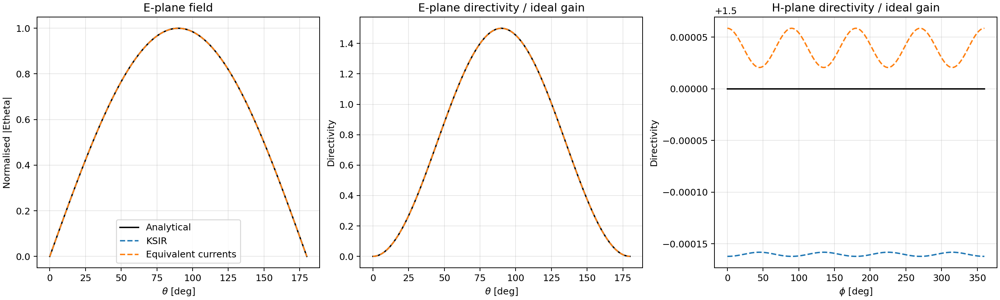

    Far-field pattern and directivity from both transformations compared with
    the Hertzian-dipole closed form.

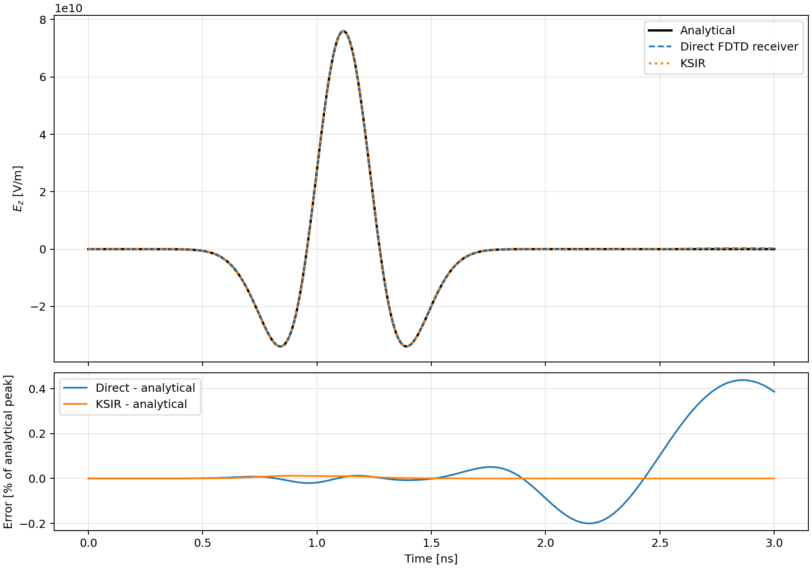

    Direct FDTD and KSIR time-domain near fields compared with the analytical
    component at the same physical position.

The retained result has directivity-pattern RMS errors below
:math:`10^{-4}` for KSIR and :math:`2.5\times10^{-5}` for the
equivalent-current method. The significant-signal relative L2 errors of the
direct and KSIR near fields are :math:`3.4\times10^{-4}` and
:math:`1.7\times10^{-4}`, respectively.

Sphere radar cross section
==========================

The sphere studies illuminate a staircased sphere with a broadband discrete
plane wave and calculate monostatic RCS using the production NTFF path. The
reference values are evaluated independently from converged Mie series at the
actual requested frequencies.

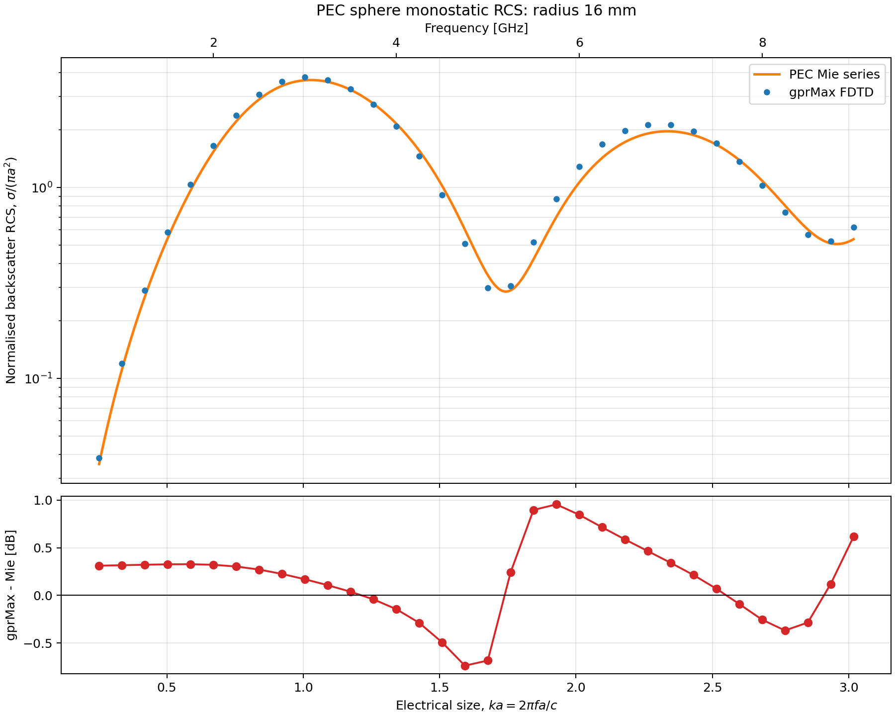

    Broadband PEC-sphere backscatter compared with the PEC Mie series.

The :download:`PEC-sphere driver
<../../testing/validation/validate_pec_sphere_rcs.py>` covers
:math:`0.25<ka<3.02`, including the first resonances and nulls. With a 0.5 mm
grid and 16 mm radius, the retained result has 0.44 dB RMS error and 0.95 dB
maximum error across 34 independent frequency samples.

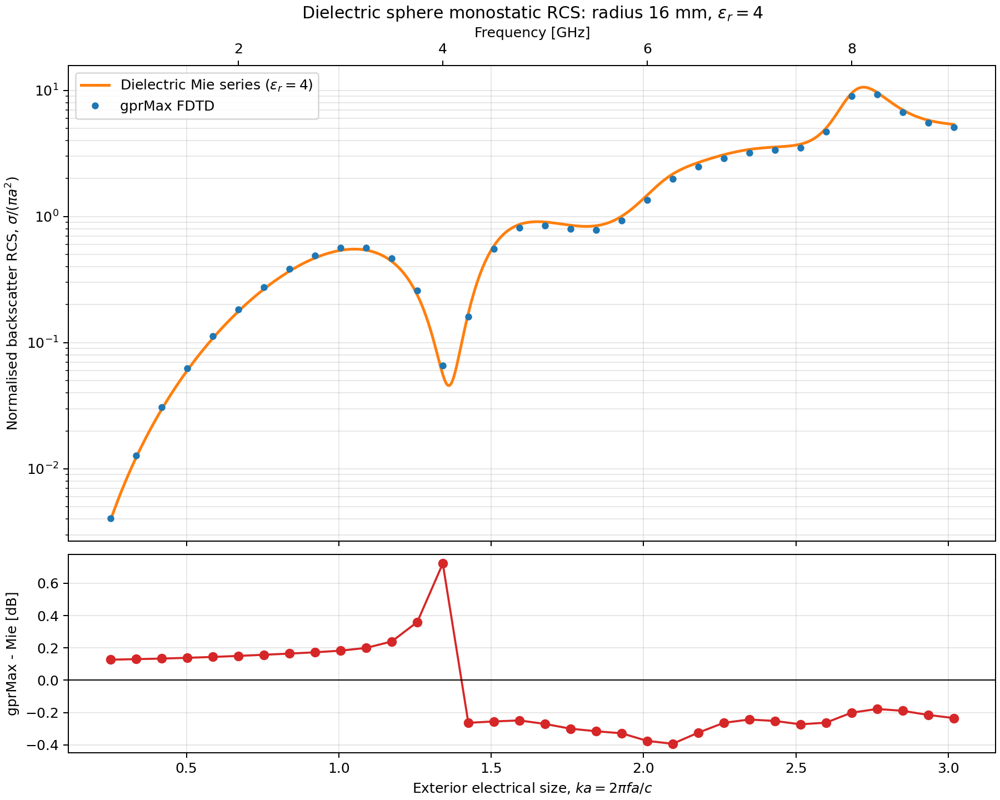

    Backscatter from a lossless :math:`\epsilon_r=4` sphere compared with the
    homogeneous dielectric-sphere Mie series.

The :download:`dielectric-sphere driver
<../../testing/validation/validate_dielectric_sphere_rcs.py>` uses the same
exterior geometry and frequency range. Its retained result has 0.27 dB RMS
error and 0.72 dB maximum error. This case additionally exercises dielectric
geometry averaging and the shorter wavelength inside the sphere.

Dispersive spheres and interface averaging
===========================================

Hartley's effective-permittivity treatment extends the ordinary arithmetic
electric-edge average to Debye media [HAR2020]_. For the engineering Fourier
convention used by gprMax, constituent material :math:`m` has

.. math::

    \epsilon_{r,m}(\omega) =
    \epsilon_{\infty,m}
    + \sum_p \frac{\Delta\epsilon_{m,p}}
                       {1 + j\omega\tau_{m,p}}
    + \frac{\sigma_m}{j\omega\epsilon_0}.

If the surrounding cells occupy fractions :math:`w_m` of the contour-path
area, with :math:`\sum_m w_m=1`, the effective edge response is

.. math::

    \epsilon_{r,\mathrm{eff}}(\omega)
    = \sum_m w_m\epsilon_{r,m}(\omega).

Consequently,

.. math::

    \begin{aligned}
    \epsilon_{\infty,\mathrm{eff}}
      &= \sum_m w_m\epsilon_{\infty,m}, \\
    \sigma_{\mathrm{eff}}
      &= \sum_m w_m\sigma_m, \\
    \Delta\epsilon_{\mathrm{eff},m,p}
      &= w_m\Delta\epsilon_{m,p}, \\
    \tau_{\mathrm{eff},m,p}
      &= \tau_{m,p}.
    \end{aligned}

The four cells surrounding a standard electric Yee edge each contribute
:math:`w_m=1/4`. Repeated relaxation times are combined exactly; distinct
times remain distinct poles. Thus two different single-pole Debye materials
generally produce a two-pole interface material. This construction follows
Chapter 4 of Hartley's thesis [HAR2020]_.

The implementation extends the same arithmetic response to Lorentz and Drude
media through the inclusive susceptibility used by gprMax [GIA2014]_. If
:math:`W_{m,p}` and :math:`Q_{m,p}` are the residue and location of a Debye,
Lorentz, or Drude term, the interface retains :math:`Q_{m,p}` and replaces
:math:`W_{m,p}` by :math:`w_m W_{m,p}`. Identical locations are merged exactly.
This gives the frequency-by-frequency arithmetic constitutive response without
fitting. It may, however, increase the model-wide pole count, so dispersive
averaging is an opt-in feature.

Reducing this exact union is a separate, band-limited material-fitting
problem. The validation package includes constrained fitting experiments,
building on the type of hybrid optimisation used for Debye fitting in
[KEL2007]_, but the production solver never replaces the exact interface
response automatically.

The :download:`Debye-sphere averaging driver
<../../testing/validation/validate_debye_sphere_averaging.py>` reproduces the
three curved-interface experiments from Section 4.4 of the thesis. A
:math:`200^3` grid contains a sphere of radius 60 cells made from one of three
two-pole Puerto Rico clay/loam models. A 300 MHz discrete plane wave excites
the model, and production equivalent-current NTFF output is compared from 25
to 525 MHz with an independent homogeneous dispersive-sphere Mie series.

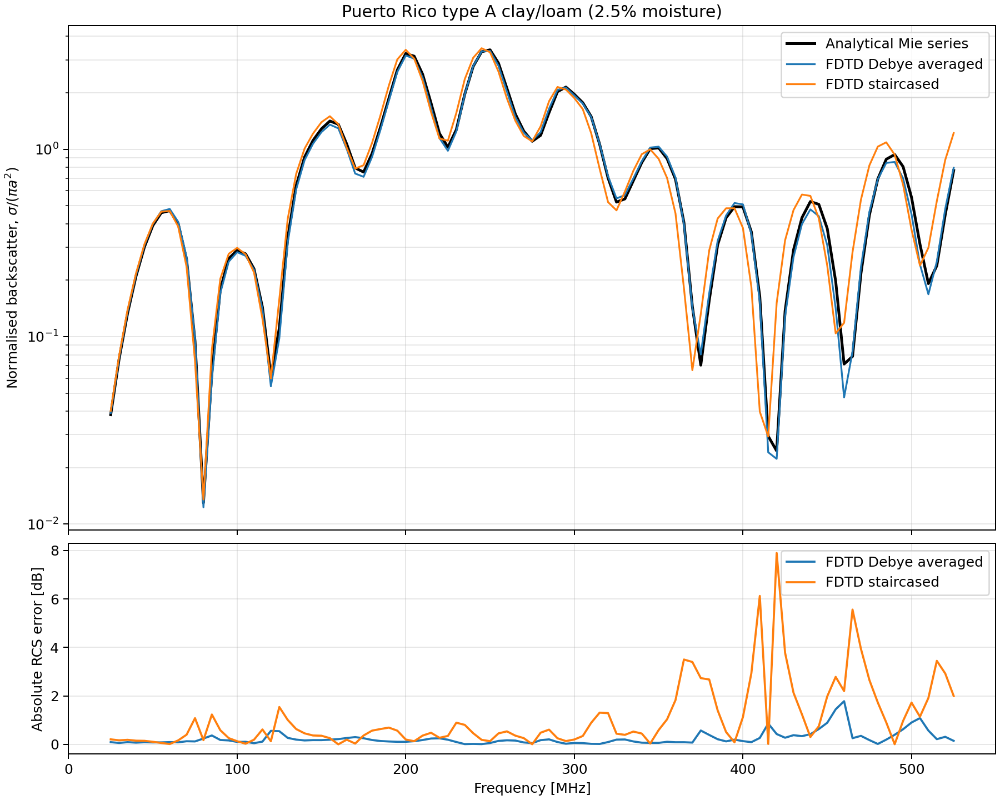

    Type A clay/loam (2.5% moisture): analytical Mie backscatter compared
    with dispersive-averaged and non-averaged FDTD spheres.

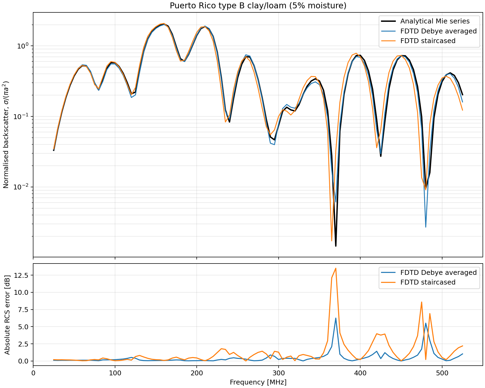

    Type B clay/loam (5% moisture). Debye averaging follows the resonant
    minima more closely than the staircased interface.

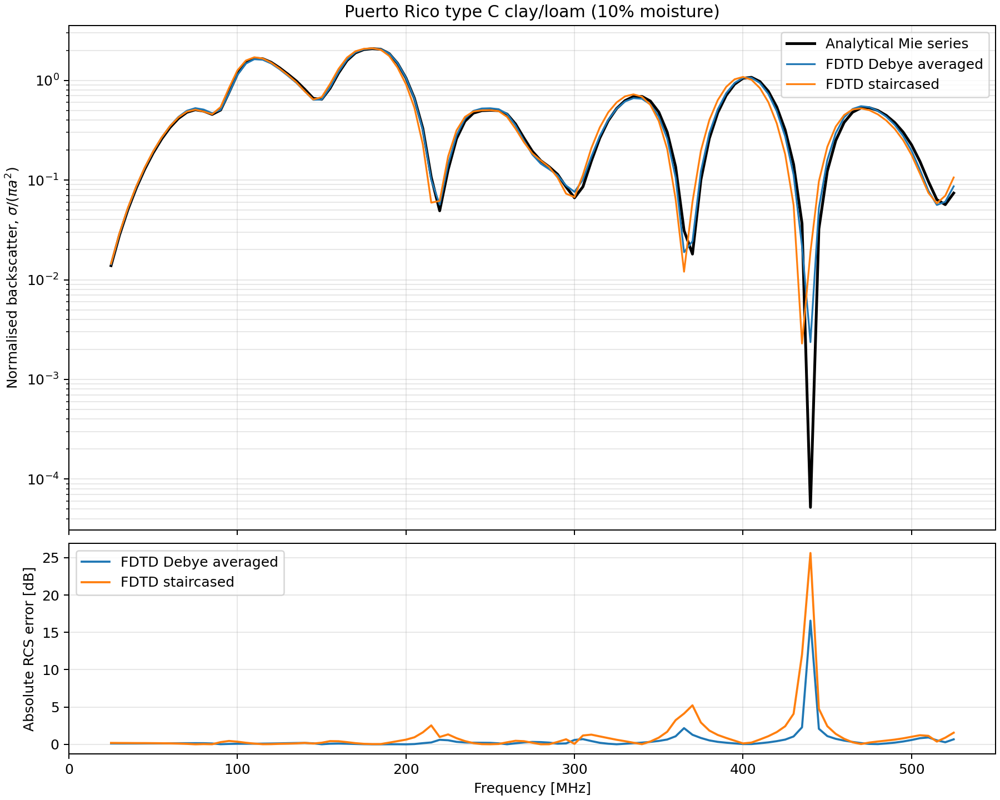

    Type C clay/loam (10% moisture). Errors in dB become very large at the
    exceptionally deep analytical null, so global relative L2 error is the
    more representative metric.

The retained 300 ns simulations give:

.. list-table:: Debye-sphere backscatter errors
    :header-rows: 1
    :widths: 16 18 18 18 18

    * - Soil
      - Averaged RMS error
      - Staircased RMS error
      - Averaged relative L2
      - Staircased relative L2
    * - A, 2.5%
      - 0.371 dB
      - 1.728 dB
      - 3.39%
      - 13.71%
    * - B, 5%
      - 1.011 dB
      - 2.476 dB
      - 3.58%
      - 11.57%
    * - C, 10%
      - 1.734 dB
      - 3.090 dB
      - 3.14%
      - 8.85%

The relative L2 error is reduced by factors of approximately 4.0, 3.2, and
2.8 for soils A, B, and C, respectively. Unlike the planar half-space test,
these curved objects expose the geometric and accumulated phase errors that
the interface average is intended to reduce.

Mixed dispersive layers and a core-shell sphere
------------------------------------------------

The reusable validation modules in
``testing/validation/dispersive_averaging`` extend the comparison to mixed
dispersion families. Planar stacks are evaluated with the normal-incidence
multilayer recursion using the complex permittivity of every layer. All FDTD
results are de-embedded to the geometrical first interface requested by the
model; no fitted half-cell displacement is applied.

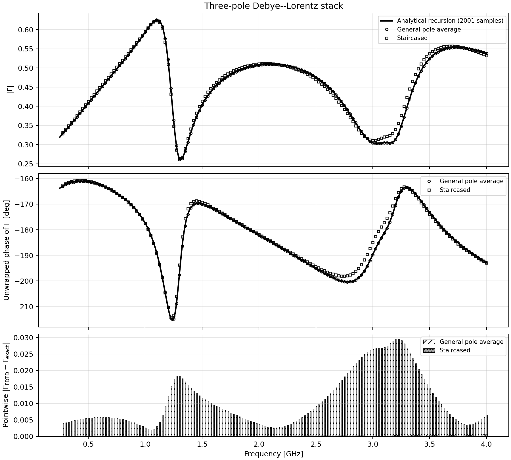

    A three-pole Debye layer and a two-pole Lorentz layer compared with the
    analytical multilayer reflection coefficient. Symbols are FDTD samples;
    the continuous black curve is evaluated independently.

Across the retained dielectric, Debye/dielectric, Debye/Lorentz,
Lorentz/Drude, and multipole Debye/Lorentz stacks, exact interface averaging
gives complex relative L2 errors between :math:`4.3\times10^{-4}` and
:math:`8.1\times10^{-4}`. The corresponding staircased errors are 1.85--3.70%.
The :download:`multilayer validation driver
<../../testing/validation/dispersive_averaging/validate_multilayer_fdtd.py>`
also records magnitude and phase residuals at every FDTD frequency.

The curved mixed-material test is a 60 mm Debye core surrounded by a 100 mm
outer-radius Lorentz shell. Its exact backscatter reference uses the
Aden--Kerker coated-sphere series and the complex material response at every
frequency.

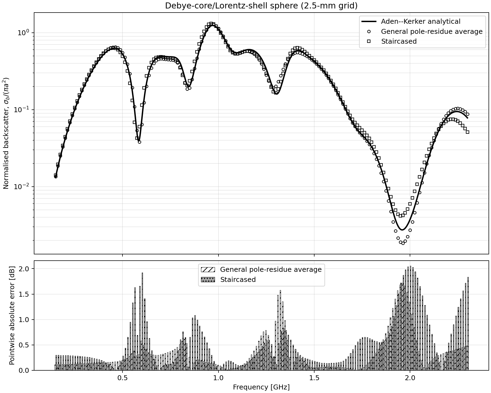

    Refined Debye-core/Lorentz-shell backscatter. The analytical curve is
    densely sampled; averaged and staircased FDTD results are shown as symbols
    with pointwise error bars below.

On the 2.5 mm grid, the exact pole-residue average reduces the complex
relative L2 error from 8.77% to 6.01% and the RMS logarithmic error from
0.756 dB to 0.507 dB. Run the :download:`coated-sphere validation driver
<../../testing/validation/dispersive_averaging/validate_core_shell_fdtd.py>`
to regenerate the full comparison.

Tagged-cell SAR in a lossy half space
=====================================

The :download:`SAR validation driver
<../../testing/validation/validate_sar_lossy_halfspace.py>` launches a
normally incident unit-amplitude plane wave onto a homogeneous conductive
half space whose declared interface uses dielectric averaging. It compares
cell-centred SAR along the central propagation line with the Fresnel
transmitted field and its analytical attenuation. The analytical field is
integrated over the cell volume, as recommended for comparisons of FDTD SAR
algorithms [LAA2010]_. A secondary implementation-matched comparison averages
the two tangential electric-field phasors on the bounding faces of the cell:

.. math::

   \begin{aligned}
    E(z) &= \frac{2\eta_2}{\eta_1+\eta_2}\exp(-\gamma_2 z),\\
    E_c(z) &= \frac{E(z-\Delta x/2)+E(z+\Delta x/2)}{2},\\
    \overline{\mathrm{SAR}}(z) &= \frac{1}{\Delta x}
      \int_{z-\Delta x/2}^{z+\Delta x/2}
      \frac{\sigma |E(u)|^2}{2\rho}\,\mathrm{d}u.
   \end{aligned}

For the supplied 1 GHz, 2 mm-grid case, the production on-the-fly transform
has a relative L2 error of 0.113% and a maximum pointwise relative error of
0.150% against the exact cell-volume average over 16 interior depth samples.
The implementation-matched Yee-collocated errors are 0.072% and 0.093%.

One broadband run also evaluates 14 frequencies from 0.5 to 7 GHz. The
cell-average L2 error rises smoothly from 0.040% at 0.5 GHz to 5.69% at
7 GHz, where the shortest wavelength has 10.7 cells. The corresponding
maximum pointwise errors are 0.041% and 7.00%. This shows both the accuracy
of the on-the-fly multi-frequency transform and the expected deterioration
as the grid approaches its lambda/10 limit. The script enforces conservative
5% and 6% limits for its default 1 GHz test and writes plots plus JSON metrics.

This is the local-SAR analytical validation. The separate
:download:`spatial-average validation driver
<../../testing/validation/validate_sar_spatial_averaging.py>` compares the
production 1 g/10 g algorithm with the independent Apache-2.0 STASIS
implementation of IEC/IEEE 62704-1. For its heterogeneous two-density test,
all voxel-status classifications agree. The maximum relative differences in
spatial-average SAR are :math:`5.14\times10^{-8}` for 1 g and
:math:`9.90\times10^{-6}` for 10 g; the residual is attributable to the two
implementations' independent cubic-root searches. The external reference
repository is not bundled with gprMax and must be supplied to the driver.

The exhaustive comparison with the official uniform-grid SAR Star reports
uses a :math:`281^3` grid containing 1,498,184 tissue voxels. For both 1 g
and 10 g there are zero tissue-status, background-status, and unambiguous
orientation mismatches. For 1 g, the maximum relative mass, volume, and SAR
differences are :math:`2.17\times10^{-7}`, :math:`1.95\times10^{-7}`, and
:math:`7.55\times10^{-7}`. For 10 g they are
:math:`2.00\times10^{-7}`, :math:`1.75\times10^{-7}`, and
:math:`7.50\times10^{-7}`. With reusable averaging geometry and compiled
OpenMP processing, the complete 1 g and 10 g cases took 20.9 s and 36.9 s,
respectively, on the validation server. Before this optimisation the same
production algorithm took 4,710 s and 3,555 s. These full-size comparisons
remain manual release validations rather than routine CI tests.

Tagged-cell SAR in a lossy dielectric sphere
=============================================

The :download:`lossy-sphere SAR driver
<../../testing/validation/validate_sar_lossy_sphere.py>` supplies an
independent three-dimensional check that includes a curved, staircased
material boundary. A unit-amplitude plane wave illuminates a homogeneous
conductive dielectric sphere. The exact Mie absorption cross-section is

.. math::

   C_{\mathrm{abs}} = \frac{2\pi}{k_0^2}
   \sum_{n=1}^{\infty}(2n+1)
   \left[\Re(a_n+b_n)-|a_n|^2-|b_n|^2\right],

where :math:`a_n` and :math:`b_n` are the homogeneous-sphere Mie
coefficients [MIE1908]_. For an incident peak electric-field phasor
:math:`E_0`, the reference absorbed power is

.. math::

   P_{\mathrm{abs}}^{\mathrm{Mie}}
   = C_{\mathrm{abs}}\frac{|E_0|^2}{2\eta_0}.

The production gprMax result is evaluated independently by integrating the
tagged-cell absorbed-power-density output,
:math:`P_{\mathrm{abs}}^{\mathrm{FDTD}}=\sum_i p_{\mathrm{abs},i}\Delta V`.
The same run requests an ``incident_flux``-normalised radiometry output, for
which the tag integral is the absorption cross-section directly. Thus the
validation exercises both the density-dependent SAR route and the
density-independent radiometric weighting route against one independent Mie
quantity.
For the supplied 18 mm-radius, :math:`\epsilon_r=4`,
:math:`\sigma=0.3` S/m sphere at 1 GHz, the relative absorbed-power errors
decrease from 12.29% to 8.81% and 6.37% as the resolution increases from 12
to 18 and 24 cells per radius. Double-precision CUDA runs at 36 and 48 cells
per radius reduce the error further to 4.27% and 3.29%, respectively. The
monotonic convergence is consistent with curved-interface staircasing and
ordinary FDTD discretisation, rather than agreement to numerical precision.

.. _sar-2d-cylinder-validation:

Two-dimensional SAR in lossy dielectric cylinders
==================================================

The :download:`2-D cylinder SAR validation driver
<../../testing/validation/validate_sar_2d_cylinder.py>` compares production
TMz and TEz SAR with the exact internal fields of a homogeneous, lossy,
infinite circular cylinder. The general oblique-incidence cylindrical-wave
solution was derived by Wait [WAI1955]_; at normal incidence the two
polarisations decouple and the cross-polarised field vanishes.

Gasmelseed [GAS2026]_ used a muscle cylinder to check a separate 2-D FDTD
implementation before studying numerical-dispersion compensation in layered
tissues. That paper presents a graphical TMz cylinder comparison but does not
report numerical cylinder-error estimates. The error measures below are new
gprMax validation results. No medium-scaling or dispersion-correction method
from that paper is used: the test uses the declared physical material
properties directly.

Exact cylindrical series
-------------------------

For the :math:`\exp(j\omega t)` convention, define

.. math::

   \widetilde{\epsilon}_r
   = \epsilon_r + \frac{\sigma}{j\omega\epsilon_0},
   \qquad
   m=\sqrt{\widetilde{\epsilon}_r},
   \qquad
   \widetilde{\epsilon}=\epsilon_0\widetilde{\epsilon}_r,
   \qquad
   k_0=\frac{\omega}{c},
   \qquad
   k_1=mk_0,
   \qquad
   x=k_0a,

where :math:`a` is the cylinder radius. A unit-amplitude plane wave travelling
in the positive x direction has the cylindrical expansion

.. math::

   \exp(-jk_0r\cos\phi)
   = \sum_{n=-\infty}^{\infty}
     (-j)^nJ_n(k_0r)\exp(jn\phi).

For TMz, the exact internal axial electric field is

.. math::

   E_z^{\mathrm{int}}(r,\phi)
   = E_0\sum_{n=-\infty}^{\infty}
     (-j)^n B_n^{\mathrm{TM}}
     J_n(k_1r)\exp(jn\phi),

with

.. math::

   B_n^{\mathrm{TM}} =
   \frac{
     J_n(x)H_n^{(2)\prime}(x)-J_n'(x)H_n^{(2)}(x)
   }{
     J_n(mx)H_n^{(2)\prime}(x)
     -mJ_n'(mx)H_n^{(2)}(x)
   }.

For TEz, :math:`H_z` is the axial scalar field and :math:`E_z=0`:

.. math::

   H_z^{\mathrm{int}}(r,\phi)
   = H_0\sum_{n=-\infty}^{\infty}
     (-j)^n B_n^{\mathrm{TE}}
     J_n(k_1r)\exp(jn\phi),

.. math::

   B_n^{\mathrm{TE}} =
   \frac{
     J_n(x)H_n^{(2)\prime}(x)-J_n'(x)H_n^{(2)}(x)
   }{
     J_n(mx)H_n^{(2)\prime}(x)
     -m^{-1}J_n'(mx)H_n^{(2)}(x)
   }.

The transverse TE electric fields follow directly from Maxwell's equations,

.. math::

   E_r = \frac{1}{j\omega\widetilde{\epsilon}r}
         \frac{\partial H_z}{\partial\phi},
   \qquad
   E_\phi = -\frac{1}{j\omega\widetilde{\epsilon}}
         \frac{\partial H_z}{\partial r}.

The series is truncated after

.. math::

   N=\left\lceil X+4.05X^{1/3}+12\right\rceil,
   \qquad X=\max\left(|k_0a|,|k_1a|\right),

and is evaluated from :math:`n=-N` to :math:`N`. The validator reconstructs
the scattered coefficients and independently checks continuity of the scalar
field and its appropriately weighted normal derivative at :math:`r=a`.
Across the retained cases, the largest relative boundary residual is
:math:`6.1\times10^{-16}`.

SAR comparison and error measures
---------------------------------

The exact complex fields are evaluated at the actual gprMax Yee-edge
locations and collocated to the cell centre using the same TM/TE rules as the
production implementation described in :ref:`sar-output`. Complex fields are
averaged before their magnitude is taken. With peak phasors, the analytical
local SAR is [IEEE62704-3]_

.. math::

   \mathrm{SAR}_{\mathrm{TM}}
      = \frac{\sigma}{2\rho}|E_z|^2,
   \qquad
   \mathrm{SAR}_{\mathrm{TE}}
      = \frac{\sigma}{2\rho}
        \left(|E_r|^2+|E_\phi|^2\right).

The continuous absorbed power per unit invariant length is evaluated as

.. math::

   P'_{\mathrm{abs}}
      = \frac{\sigma}{2}\int_0^a\int_0^{2\pi}
        |\mathbf{E}(r,\phi)|^2r\,\mathrm{d}\phi\,\mathrm{d}r.

The radiometry output is checked independently as an absorption
cross-section per unit invariant length,

.. math::

   C'_{\mathrm{abs}}=\frac{P'_{\mathrm{abs}}}{S_{\mathrm{inc}}}.

Its relative error is identical to :math:`\epsilon_P`, as required. For the
reported muscle case it is 0.949% for TMz and 0.232% for TEz; the latter is an
exact-series extension rather than a value reported by Gasmelseed.

For TMz, angular orthogonality gives

.. math::

   P'_{\mathrm{abs,TM}}
      = \pi\sigma|E_0|^2
        \sum_{n=-\infty}^{\infty}|B_n^{\mathrm{TM}}|^2
        \int_0^a|J_n(k_1r)|^2r\,\mathrm{d}r.

The radial integrals for both modes are evaluated using 600-point
Gauss--Legendre quadrature. Increasing the quadrature order from 300 to 600
changes the muscle-cylinder reference by approximately
:math:`1.2\times10^{-13}` relative.

For the selected cell set :math:`\mathcal{I}`, the reported local and
integrated errors are

.. math::

   \begin{aligned}
   \epsilon_{L_2} &=
      \frac{\left\|\mathrm{SAR}_{\mathrm{FDTD}}
      -\mathrm{SAR}_{\mathrm{Mie}}\right\|_2}
      {\left\|\mathrm{SAR}_{\mathrm{Mie}}\right\|_2},\\
   \epsilon_{\max} &=
      \max_{i\in\mathcal{I}}
      \frac{\left|\mathrm{SAR}_{i,\mathrm{FDTD}}
      -\mathrm{SAR}_{i,\mathrm{Mie}}\right|}
      {\mathrm{SAR}_{i,\mathrm{Mie}}},\\
   \epsilon_P &=
      \frac{\left|P'_{\mathrm{FDTD}}-P'_{\mathrm{Mie}}\right|}
      {P'_{\mathrm{Mie}}}.
   \end{aligned}

Cells below 5% of the analytical peak SAR are excluded from the local relative
metrics. The primary interior metric additionally excludes a two-cell band at
the cylinder boundary. This separates field-update accuracy from the
inevitable geometrical difference between an exact circular interface and a
voxelised, dielectrically averaged Yee interface. All-cell results are still
written to the JSON report.

Numerical cases and results
---------------------------

The cylinders have radius 60 mm and are illuminated at 5.5 GHz by a
grid-axis-aligned discrete plane wave travelling along the positive x
direction, normal to the cylinder's invariant z axis. A completed
3.5 GHz Ricker waveform provides a strong 5.5 GHz spectral component without
the position-dependent finite-record bias of a truncated continuous sine.
The model uses 0.4 mm cells, an 8 ns time window, 12-cell exterior PMLs, and
dielectric averaging on the circular interface. The target incident electric
field is 1 V/m. The electrical properties are the physical skin, fat, and
muscle values reported by Gasmelseed [GAS2026]_; the two former materials are
applied to cylinders here as additional tests. Representative tissue
densities scale absolute SAR equally in both solutions and do not affect the
relative electromagnetic errors.

.. list-table:: CUDA double-precision cylinder validation at 0.4 mm resolution
   :header-rows: 1
   :widths: 15 12 14 10 20 19 20

   * - Material
     - :math:`\epsilon_r`
     - :math:`\sigma` (S/m)
     - Mode
     - Interior :math:`\epsilon_{L_2}`
     - Interior :math:`\epsilon_{\max}`
     - :math:`\epsilon_P`
   * - Fat
     - 4.983
     - 0.274
     - TMz
     - 0.32%
     - 1.33%
     - 0.19%
   * - Fat
     - 4.983
     - 0.274
     - TEz
     - 0.72%
     - 11.52%
     - 0.062%
   * - Skin
     - 35.36
     - 3.463
     - TMz
     - 2.80%
     - 8.88%
     - 0.73%
   * - Skin
     - 35.36
     - 3.463
     - TEz
     - 2.56%
     - 14.98%
     - 0.038%
   * - Muscle
     - 48.9
     - 4.61
     - TMz
     - 3.46%
     - 11.51%
     - 0.95%
   * - Muscle
     - 48.9
     - 4.61
     - TEz
     - 3.02%
     - 15.40%
     - 0.23%

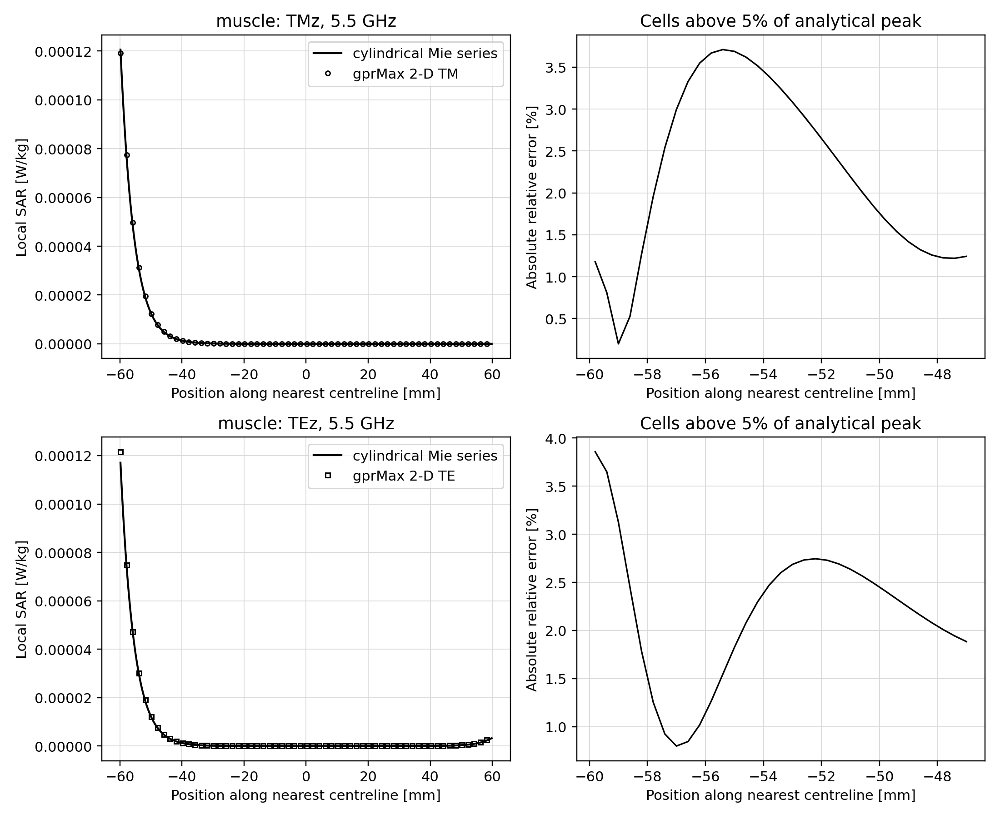

   Centreline local SAR for the muscle cylinder. Solid curves are the exact
   cylindrical series; symbols are gprMax samples.

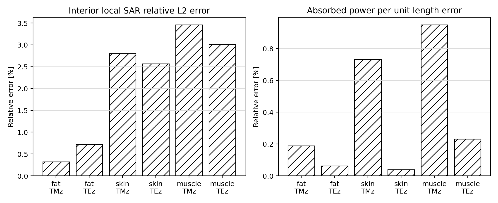

   Interior local-SAR and integrated absorbed-power errors for the three
   materials and both polarisations.

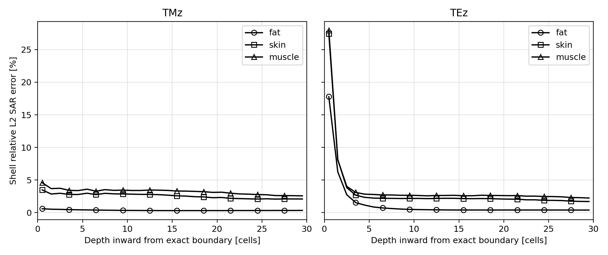

   Shell-wise error versus distance from the exact interface. TEz is more
   sensitive to the representation of the discontinuous tangential electric
   field, but the excess error is strongly concentrated in the first two
   boundary-cell layers.

The :download:`full two-dimensional field maps
<../../testing/validation/sar_2d_cylinder_results/sar_2d_cylinder_material_maps.png>`
show the exact and gprMax SAR distributions and error normalised by the exact
peak. Halving the muscle TMz cell size from 0.4 to 0.2 mm reduces the interior
:math:`\epsilon_{L_2}` from 3.46% to 0.72% and :math:`\epsilon_P` from 0.95%
to 0.22%, demonstrating mesh convergence. CPU and CUDA double-precision
muscle results agree to :math:`5.9\times10^{-13}` relative L2 for TMz and
:math:`1.7\times10^{-12}` for TEz.

The retained material cases can be regenerated from the repository root, for
example:

.. code-block:: none

   python -m testing.validation.validate_sar_2d_cylinder \
       --backend cuda --precision double --material muscle --modes TM TE

Replace ``muscle`` by ``fat`` or ``skin`` to reproduce the other rows. The
driver writes the complete parameters, checks, and unrounded errors to its
JSON report rather than relying on values read from a plotted curve.

Power-normalisation consistency
===============================

The :download:`power-normalisation driver
<../../testing/validation/validate_sar_power_normalisation.py>` exercises an
actual voltage source and its automatic port through the complete solver and output
path. Requesting 4 W rather than 1 W incident power multiplies every SAR value
by four exactly. Normalising the same fields to accepted rather than incident
power agrees with the independently evaluated port-power ratio to
:math:`8.9\times10^{-16}` relative. This test establishes implementation
consistency; unlike the half-space and sphere cases, it is not an independent
electromagnetic reference solution.

Running the validation suite
============================

Run the studies from the repository root, for example:

.. code-block:: none

    python -m testing.validation.validate_plane_wave_dispersive_halfspace --gpu 0
    python -m testing.validation.validate_plane_wave_realistic_materials --gpu 0
    python -m testing.validation.validate_hertzian_dipole --gpu 0
    python -m testing.validation.validate_rational_network_literature
    python -m testing.validation.validate_pec_sphere_rcs --gpu 0
    python -m testing.validation.validate_dielectric_sphere_rcs --gpu 0
    python -m testing.validation.validate_debye_sphere_averaging --gpu 0
    python -m testing.validation.validate_sar_lossy_halfspace
    python -m testing.validation.validate_sar_lossy_sphere
    python -m testing.validation.validate_sar_2d_cylinder \
        --backend cuda --precision double --material muscle --modes TM TE
    python -m testing.validation.validate_sar_power_normalisation
    python testing/validation/validate_sar_spatial_averaging.py \
        --reference /path/to/IEC-IEEE-62704-1-spatial-average-SAR
    python -m testing.validation.validate_sar_star \
        /path/to/62704-1_supplemental_files.zip
    python -m testing.validation.dispersive_averaging.validate_multilayer_fdtd
    python -m testing.validation.dispersive_averaging.validate_core_shell_fdtd --gpu 0
    python -m gprMax \
        testing/validation/rectangular_waveguide_partial_cutoff/rectangular_waveguide_partial_cutoff.in \
        --hide-progress-bars
    python testing/validation/rectangular_waveguide_partial_cutoff/plot_partial_cutoff.py

Omit ``--gpu`` for CPU execution. The full-resolution plane-wave and sphere
cases are long-running and are not part of the default pytest selection. See
:download:`the validation README <../../testing/validation/README.rst>` for
the output layout, cache policy, and acceptance criteria.

Related half-wave dipole example
================================

The :ref:`wire-dipole antenna example <example-wire-dipole>` demonstrates the
simulated reflection coefficient, input impedance, directivity, and gain of a
finite half-wave dipole. Its resonant frequency and impedance can be compared
with classical thin-wire predictions, while the more detailed MoM comparison
is documented in the :ref:`numerical-comparison section
<numerical-comparisons>`.
