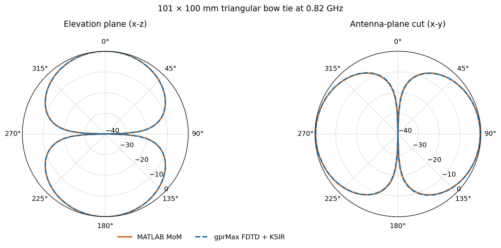
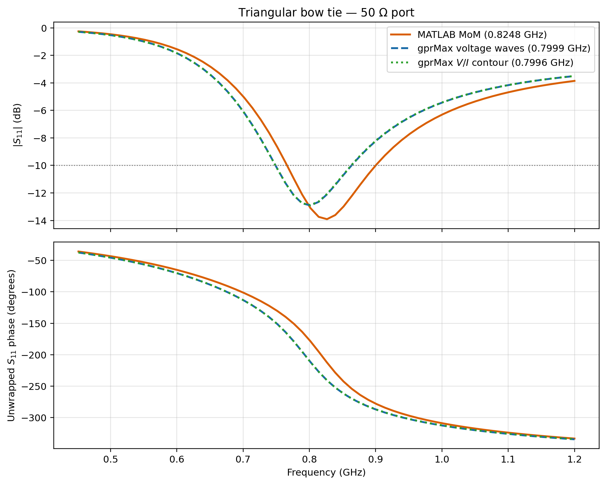
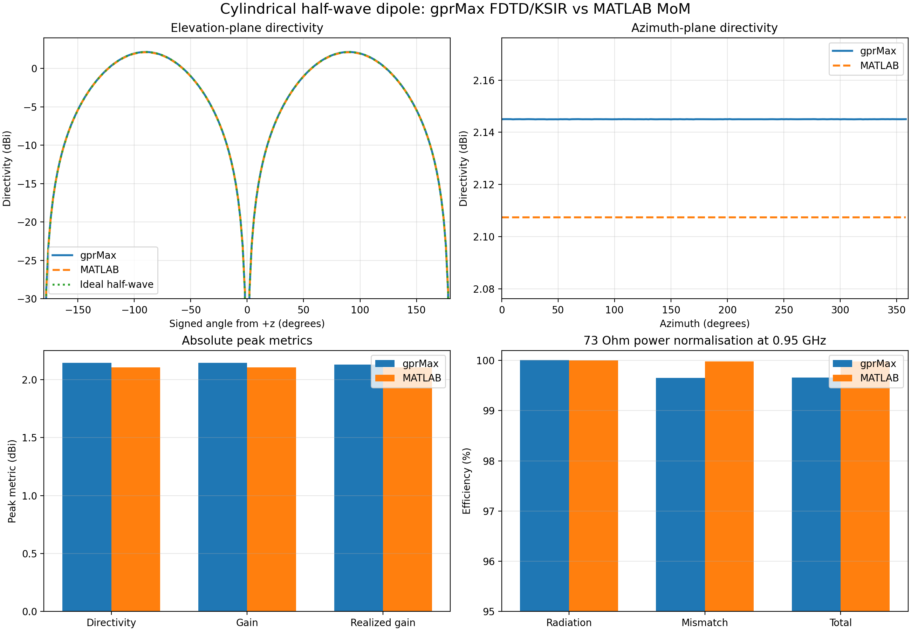
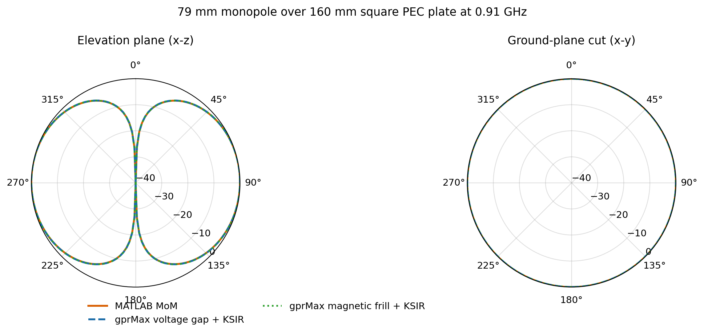
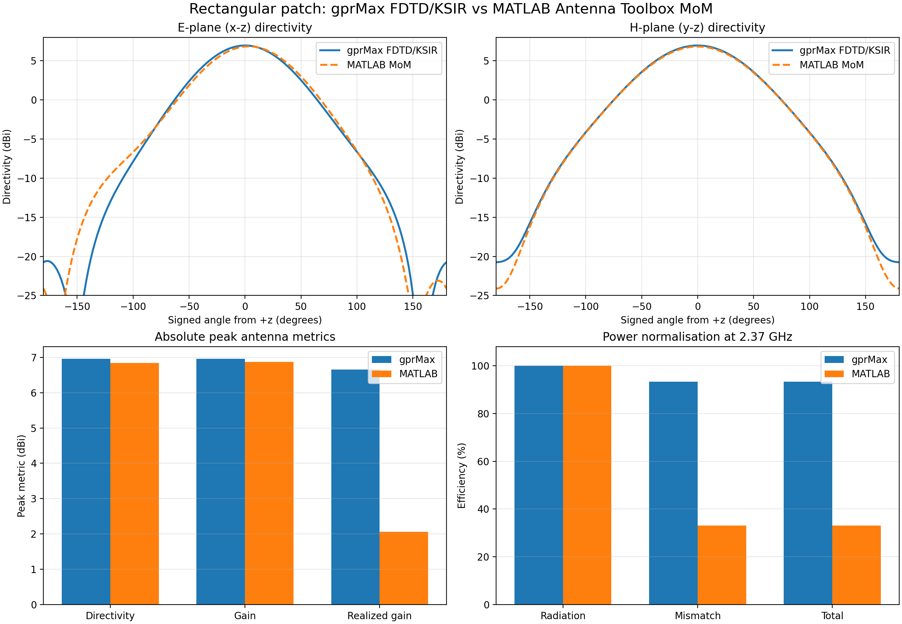
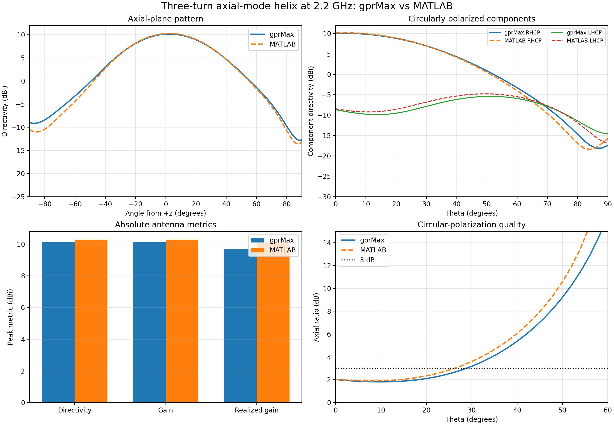
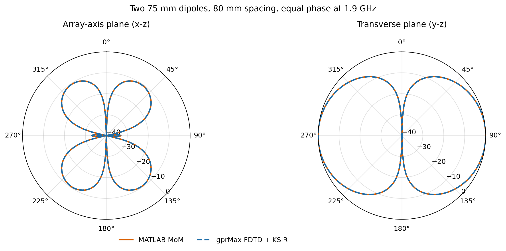
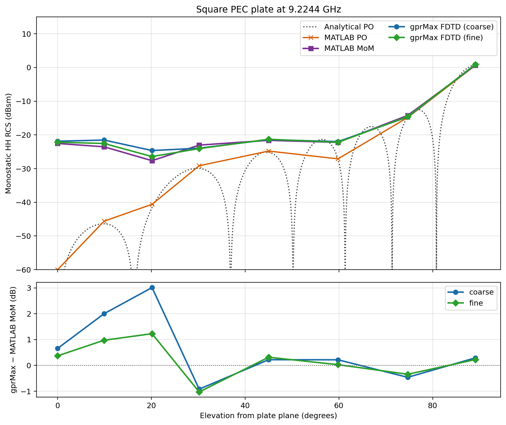
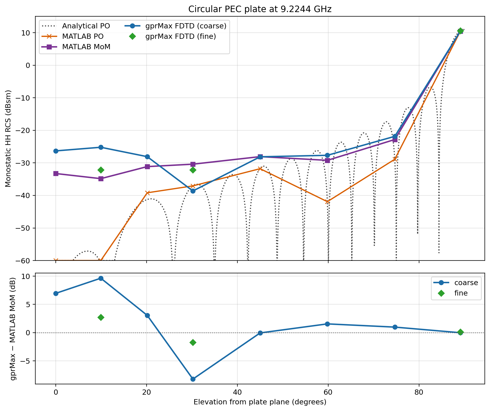
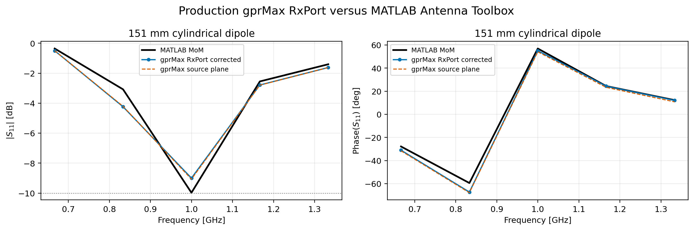

.. _numerical-comparisons:

*********************
Numerical comparisons
*********************

This section compares gprMax FDTD results with independent numerical solvers.
These studies are not analytical validation: neither calculation is treated
as ground truth, and differences include the effects of meshes, conductor
representations, ports, and the underlying numerical methods. Exact and
semi-analytical comparisons are kept separately in
:ref:`Analytical comparisons <analytical-comparisons>`.

MATLAB Antenna Toolbox suite
============================

The current suite compares gprMax with the Method of Moments (MoM), and with
physical optics where appropriate, from the `MATLAB Antenna Toolbox
<https://www.mathworks.com/products/antenna.html>`_. The cases are stored in
``testing/other_codes/matlab_mom``.

.. list-table:: Available comparisons
    :header-rows: 1
    :widths: 28 72

    * - Case
      - Principal capabilities compared
    * - Half-wave dipole
      - Thin wires, one-port S11 and impedance, pattern, directivity, gain,
        and efficiency
    * - Finite-ground monopole
      - Voltage-gap and magnetic-frill feeds, finite-plate diffraction, S11,
        impedance, and radiation pattern
    * - Triangular bow tie
      - Planar PEC rasterisation, source-edge current, S11, impedance, and
        principal-plane patterns
    * - Rectangular patch
      - Dielectric substrate, finite ground plane, probe-feed alternatives,
        mesh convergence, gain, and efficiency
    * - Three-turn helix
      - Circular polarisation, axial ratio, beamwidth, front-to-back ratio,
        directivity, and realised gain
    * - Two-element dipole array
      - Coherent ports, mutual coupling, active impedance, and array factor
    * - PEC plates
      - Plane-wave scattering and absolute monostatic RCS for square and
        circular plates

Each modern case builds the gprMax model, writes its normal HDF5 output,
reopens that file for post-processing, and writes a fine ``vtkhdf`` geometry
for inspection in ParaView. MATLAB scripts generate the independent numerical
data. The retained MAT, CSV, JSON, and PNG products allow the comparisons to
be inspected or replotted by users who do not have MATLAB or Antenna Toolbox.
Large HDF5 and VTK files are reproducible working products rather than
portable reference data.

:download:`Suite overview <../../testing/other_codes/matlab_mom/README.md>`
describes the common evidence chain and file policy. Each case directory has
its own README with the precise geometry equivalence, run commands, and
quantitative result.

Triangular bow-tie antenna
==========================

The planar PEC bow tie has a 101 mm outer length, a 100 mm width, and a
one-cell x-directed feed gap. The gprMax model uses a 1 mm Yee grid and a
closed KSIR surface; MATLAB uses ``bowtieTriangular`` with its MoM delta-gap
port. Both use a 50 ohm reference impedance.

* :download:`gprMax model <../../testing/other_codes/matlab_mom/antenna_bowtie_fs/bowtie_antenna_gprmax.py>`
* :download:`MATLAB model <../../testing/other_codes/matlab_mom/antenna_bowtie_fs/bowtie_antenna_matlab.m>`
* :download:`comparison script <../../testing/other_codes/matlab_mom/antenna_bowtie_fs/plot_bowtie_comparison.py>`
* :download:`case description <../../testing/other_codes/matlab_mom/antenna_bowtie_fs/README.md>`

    Normalised principal-plane patterns from gprMax KSIR and MATLAB MoM.

    Reflection coefficient calculated from two independent gprMax terminal
    definitions and from MATLAB MoM.

At 0.82 GHz, the retained elevation-pattern difference is 0.014 dB RMS. The
interpolated S11 minima are 0.800 GHz for gprMax and 0.825 GHz for MATLAB. The
offset is approximately two independent FFT bins and is consistent with the
one-cell FDTD gap and edge-rasterised conductor differing from the MoM delta
gap and continuous triangular surfaces.

Dipole, monopole, and patch antennas
====================================

The :download:`dipole case
<../../testing/other_codes/matlab_mom/antenna_dipole_fs/README.md>` compares a
centre-fed 151 mm FDTD wire with a ``dipoleCylindrical`` MoM model and the
closed-form half-wave pattern. It uses the documented effective radius of an
axial one-cell PEC wire and compares the complete full-sphere antenna metrics,
not only normalised cuts.

    Absolute dipole pattern and antenna-metric comparison. Peak directivity
    differs by 0.038 dB in the retained result.

The :download:`monopole case
<../../testing/other_codes/matlab_mom/antenna_monopole_fs/README.md>` encloses
a finite 160 mm square PEC ground plate. Separate gprMax runs use a voltage
gap and the Hyun magnetic-frill feed. Their patterns agree closely with each
other and with MATLAB, while their port results expose the expected
sensitivity to the local feed representation.

    Complete elevation and ground-plane cuts for the finite-ground monopole.

The :download:`patch case
<../../testing/other_codes/matlab_mom/antenna_patch_fs/README.md>` reproduces a
40 mm by 30 mm rectangular patch on a 1.57 mm, :math:`\epsilon_r=2.33`
substrate. It provides single, parallel, series, and magnetic-frill feed
variants, mesh-convergence studies, two independent far-field formulations,
and full-sphere gain and efficiency.

    Full-sphere patch-antenna metrics from gprMax and MATLAB.

Helix and multiport array
=========================

The :download:`three-turn helix
<../../testing/other_codes/matlab_mom/antenna_helix_fs/README.md>` operates in
axial mode at 2.2 GHz. It adds comparisons of circular-polarisation handedness,
axial ratio, half-power beamwidth, and front-to-back ratio. The retained peak
directivities are 10.15 dBi from gprMax and 10.29 dBi from MATLAB; the axial
ratios are 2.02 and 2.04 dB.

    Helix polarisation, radiation-pattern, gain, and port comparison.

The :download:`two-element array
<../../testing/other_codes/matlab_mom/antenna_dipole_array_fs/README.md>` uses
two simultaneous, equal-phase ports. The reported terminal quantity is active
impedance under that excitation, rather than conventional single-port S11
with the second element terminated. This case exercises coherent sources,
mutual coupling, independent port storage, and the combined element and array
factors.

    Array-axis and transverse patterns from gprMax and MATLAB.

PEC-plate radar cross section
=============================

The :download:`plate-RCS study
<../../testing/other_codes/matlab_mom/rcs_comparison/README.md>` reproduces the
square- and circular-plate cases from the MathWorks radar-cross-section
benchmark. It compares gprMax discrete-plane-wave/KSIR results with MATLAB
MoM, MATLAB physical optics, and the closed-form physical-optics plate
expressions. Because the PO approximation omits edge and shadow-region
currents, MATLAB MoM remains the relevant full-wave inter-code comparison.

    Monostatic RCS of the square PEC plate. Refinement reduces the selected
    angle gprMax/MoM RMS difference from 1.36 to 0.70 dB.

    Circular-plate RCS and the stronger sensitivity of deep nulls to Cartesian
    staircasing and mesh refinement.

Native port-output comparison
=============================

An additional :download:`voltage-port study
<../../testing/other_codes/matlab_mom/rx_port_comparison/README.md>` uses the
production ``/ports`` HDF5 datasets directly for the dipole, bow tie,
monopole, and patch. It is deliberately distinct from cases that reconstruct
terminal current from surrounding magnetic-field receivers.

    Native gprMax port reflection coefficients compared with the retained
    MATLAB antenna results.

Reproducing a comparison
========================

Run a case from the repository root. For example:

.. code-block:: none

    python testing/other_codes/matlab_mom/antenna_bowtie_fs/bowtie_antenna_gprmax.py --gpu 0
    matlab -batch "run('testing/other_codes/matlab_mom/antenna_bowtie_fs/bowtie_antenna_matlab.m')"
    python testing/other_codes/matlab_mom/antenna_bowtie_fs/plot_bowtie_comparison.py

Omit ``--gpu 0`` to use the CPU solver. Most model drivers also provide
``--geometry-only`` and ``--postprocess-only`` modes. Consult the case README
before interpreting differences: the independent FFT resolution, source
model, effective wire radius, and angular normalisation are deliberately
recorded for each comparison.
