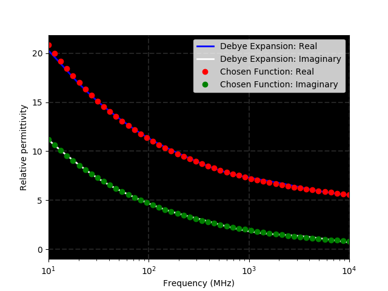
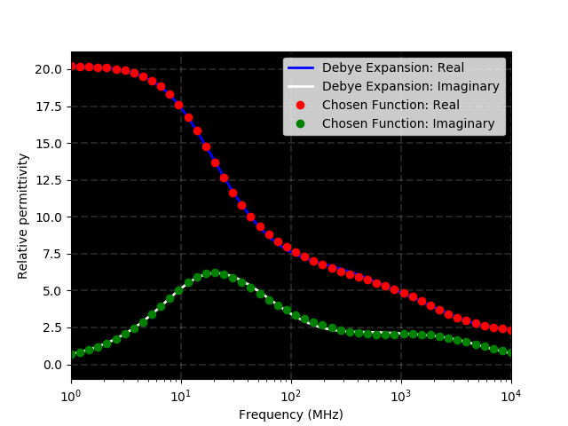

User libraries is a sub-package where useful Python modules contributed by users are stored.

*******************************
Multi-pole Debye fitting 
*******************************

Information
===========

**Author/Contact**: Iraklis Giannakis (i.giannakis@ed.ac.uk), University of Edinburgh

**License**: `Creative Commons Attribution-ShareAlike 4.0 International License <http://creativecommons.org/licenses/by-sa/4.0/>`_

**Attribution/cite**: D. F. Kelley, T. J. Destan, R. J. Luebbers, "Debye function expansions of complex permittivity using a hybrid particle swarm-least squares optimization approach", IEEE Trans. Antennas Propag., vol. 55, no. 7, pp. 1999-2005, Jul. 2007.

**Attribution/cite**: A modified edition of pyswarm is used in the present package (https://pythonhosted.org/pyswarm/).

FDTD is limited regarding modelling dispersive materials. Due its time-domain nature, arbitrary dispersive materials can not be directly implemented in a straightforward manner. To overcome this, the given dielectric spectrum is approximated by functions compatible with FDTD. The most common function employed for this is the multi-Debye expansion. 

The current package features an optimisation approach to fit a multi-Debye expansion to dielectric data. The user can choose between Havriliak-Negami, Johnsher and complex refractive index mixing models. Notice that Havriliak-Negami is an inclusive function that holds as special cases the widely-used **Cole-Cole** and **Cole-Davidson** functions. Lastly the present package can be used to fit arbitrary dielectric data derived experimentally or calculated using some other function.

The technique employed here is a hybrid linear-nonlinear optimisation proposed by Kelley et. al (2007). Their method was slightly adjusted to overcome some instability issues and thus making the process more robust and faster. In particular, in the case of negative weights we inverse the sign in order to introduce a large penalty in the optimisation process thus indirectly constraining the weights to be always positive. This made dumbing factors unnecessary and consequently they were removed from the algorithm. Furthermore we added the real part to the cost action to avoid possible instabilities to arbitrary given functions that does not follow the Kramers–Kronig relationship. For more info check the paper from Kelley et. al. (2007).     

.. warning::
    * This package is used between ``#python:`` .... ``#end_python:`` commands. It can also be used outside of gprMax as a set of python Classes.
    * The fitting accuracy depends on the number of the Debye poles as well as the fitted function. It is advised to check if the resulted accuracy is sufficient for your application. 
	* Increasing the number of Debye poles will make the approximation more accurate but it will increase the overall computational resources of FDTD.

Multi-Debye function
----------------

.. math::

   \epsilon(\omega) = \epsilon_{\infty} + \sum_{i=1}^{N}\frac{\Delta\epsilon_{i}}{1+j\omega t_{0,i}}

* :math:`\epsilon(\omega)`: Frequency dependent dielectric properties.  
* :math:`\Delta\epsilon`: Fifference between the real permittivity at zero and infinity frequency.  
* :math:`t_{0}`: Relaxation time.
* :math:`\epsilon_{\infty}`: Real part of relative permittivity at infinity frequency.
* :math:`N`: Number of the Debye poles.

Havriliak-Negami
================

Havriliak-Negami Function
----------------

.. math::

   \epsilon(\omega) = \epsilon_{\infty} + \frac{\Delta\epsilon}{\left(1+\left(j\omega t_{0}\right)^{a}\right)^{b}}

* :math:`\epsilon(\omega)`: Frequency dependent dielectric properties.  
* :math:`\Delta\epsilon`: Difference between the real permittivity at zero and infinity frequency.  
* :math:`t_{0}`: Relaxation time.
* :math:`\epsilon_{\infty}`: Real part of relative permittivity at infinity frequency.
* :math:`a`: Havriliak-Negami parameter :math:`\left(0 < a < 1 \right)`. 
* :math:`b`: Havriliak-Negami parameter :math:`\left(0 < b < 1\right)`. 

 When :math:`b=1` the model is reduced to Cole-Cole. When :math:`a=1` the model is reduced to Cole-Davidson. When both :math:`a=1` and :math:`b=1` the model is reduced to Debye.

Havriliak-Negami Class
-------

The HavriliakNegami class has the following structure

 ``HavriliakNegami(p1, p2, p3, p4, p5, p6, p7, p8, p9, p10, p11, p12, plot=True, pso=[r1, r2, r3, r4, r5])``

* p1: Number of Debye poles (N).  
* p2, p3: Lower and upper frequency bounds (in Hz).  
* p4: :math:`a` parameter.
* p5: :math:`b` parameter.
* p6: Relative permittivity at infinity frequency (:math:`\epsilon_{\infty}`).
* p7: Difference between the real permittivity at zero and infinity frequency (:math:`\Delta\epsilon`).
* p8: Relaxation time (:math:`t_{0}`).
* p9: Electric conductivity of the material. It is not involved in the optimisation process. 
* p10: Magnetic permeability of the material. It is not involved in the optimisation process. 
* p11: Magnetic Looses of the material. It is not involved in the optimisation process. 
* p12: Name of the material. Should be given within quotations e.g. "Material1". 

 The last two inputs are optional and can be omitted. 
* plot: When **True** it plots the actual function and the Debye approximation as well as the optimisation process in real time. When **False** only the final results are printed. Default is **False**.  
* pso: A vector which contains parameters associated with the particle swarm optimisation which is employed during the non-linear optimisation process.  
* r1 : Number of particles. Default is 40.
* r2 : Number of iterations. Default is 40.
* r3 : Inertia of the particles. Default is 0.9.
* r4 : Is the cognitive sclaed parameter. Default is 0.9.
* r5 : Is the social scaled parameter. Default is 0.9.
 
Example
-------

.. code-block:: none

    #python:
    from user_libs.Debye_Fit import HavriliakNegami 
    HavriliakNegami(5, 10*10**9, 10**6, 0.4, 1, 10, 20, 10**-9, 0.1, 1, 0, "Material", plot=True, pso=[10, 10, 0.1, 0.4, 0.9])
    #end_python:

The above command approximates using five Debye poles a Cole-Cole function with :math:`\epsilon_{\infty}=10`, :math:`\Delta\epsilon=20`, :math:`t_{0}=10^{-9}`  and :math:`a=0.4`. The resulting output is the following set of gprMax commands and a plot with the actual and the approximated Cole-Cole function.   

.. code-block:: none

    #material: 12.192171464056292 0.1 1 0 Material
    #add_dispersion_debye: 5 2.885351644740246 2.026830465249982e-08 1.9520440414063742 2.2638958050872464e-07 4.036533481832635 3.0230537165872743e-09  4.552138474926087 4.278226881576881e-10 3.654228873983569 4.426279094449899e-11 Material

.. figure:: images/user_libs/Havriliak_Negami.png
    :width: 600 px

Johnsher
========

Johnsher Function
-----------------

.. math::

    \epsilon(\omega) = \epsilon_{\infty} - a_{p}*\left( -j*\frac{\omega}{\omega_{p}} \right)^{n}

* :math:`\epsilon(\omega)`: Frequency dependent dielectric properties.  
* :math:`\epsilon_{\infty}`: Real part of the relative permittivity at infinity frequency.
* :math:`a_{p}`: Johnsher parameter :math:`\left(0 < a < 1\right)`. 
* :math:`\omega_{p}`: Johnsher parameter that scales the dielectric properties. 
* :math:`n`: Johnsher parameter :math:`\left(0 < n < 1\right)`.

Johnsher Class
--------------

The Johnsher class has the following structure

 ``Johnsher(p1, p2, p3, p4, p5, p6, p7, p8, p9, p10, p11, plot=True, pso=[r1, r2, r3, r4, r5])``

* p1: Number of the Debye poles (N).  
* p2, p3: Lower and upper frequency bound (in Hz).  
* p4: Real relative permittivity at infinity frequency (:math:`\epsilon_{\infty}`).
* p5: :math:`a_{p}` parameter.
* p6: :math:`\omega_{p}` parameter.
* p7: :math:`n` parameter..
* p8: Electric conductivity of the material. It is not involved in the optimisation process. 
* p9: Magnetic permeability of the material. It is not involved in the optimisation process. 
* p10: Magnetic Looses of the material. It is not involved in the optimisation process. 
* p11: Name of the material. Should be given within quotations e.g. "Material1". 

For a description for "plot" and "pso" see the Havriliak-Negami session. 

Example
-------

.. code-block:: none

    #python:
    from user_libs.Debye_Fit import Johnsher 
    Jonscher(5, 0.01*10**9, 10**12, 4.39, 7.49, 0.5*10**9, 0.62, 0.1, 1, 0.1, "Material_Jonscher", plot=True)
    #end_python:

The above command approximates using five Debye poles a Johnsher function with :math:`\epsilon_{\infty}=4.39`, :math:`a_{p}=7.49`, :math:`\omega_{p}=0.5\times 10^{9}`  and :math:`n=0.4`. The resulting output is the following set of gprMax commands and a plot with the actual and the approximated Johnsher function.   

.. code-block:: none

    #material: 5.3481800239416035 0.1 1 0.1 Material_Jonscher
    #add_dispersion_debye: 5 1.791893998387804 4.670728076646466e-11 194.75103605487774 4.904329146588183e-07 4.283161954346454 2.453046099572916e-09 8.68660242785235 1.1423757079235287e-08 2.9956673291661673 4.873890608057871e-10 Material_Jonscher

Complex Refractive Index Mixing (CRIM)
======================================

CRIM Function
-------------

.. math::

    \epsilon(\omega)^{d} = \sum_{i=1}^{m}f_{i}\epsilon_{m,i}(\omega)^{d}

* :math:`\epsilon(\omega)`: Frequency dependent dielectric properties.
* :math:`d`: CRIM parameter, usually equals to 0.5.
* :math:`f`: Volumetric fraction of each material. :math:`\sum_{i}^{m}f_{i}=1`.
* :math:`\epsilon_{m}`: Dielectric properties of the *mth* mixing material. 

CRIM Class
----------

The Crim class has the following structure

 ``Crim(p1, p2, p3, p4, p5, p6, p7, p8, p9, p10, p11, plot=True, pso=[r1, r2, r3, r4, r5])``

* p1: Number of Debye poles (N).  
* p2, p3: The lower and upper frequency bound (in Hz).  
* p4: :math:`d` parameter.
* p5: A vector containing the volumetric fractions [f1, f2 .... ].
* p6: A vector containing the materials [material1, material2 .... ]. Where material1 is a vector containing the Debye properties of its material e.g. material1 = [:math:`\epsilon_{\infty}`, :math:`\Delta\epsilon`, :math:`t_{0}`]
* p7: Electric conductivity of the material. It is not involved in the optimisation process. 
* p8: Magnetic permeability of the material. It is not involved in the optimisation process. 
* p9: Magnetic Looses of the material. It is not involved in the optimisation process. 
* p10: Name of the material. Should be given within quotations e.g. "Material1". 

For a description for "plot" and "pso" see the Havriliak-Negami session.

Example
-------

.. code-block:: none

    #python:
    from user_libs.Debye_Fit import Crim 
    f=[0.5, 0.1, 0.4]
    material = [3, 25, 10**-8]
    material2 = [3 ,25, 10**-9]
    material3 = [1 , 10, 10**-10]
    Crim(5, 10*10**9, 10**6, 0.5, f, [material, material2, material3], 0, 1, 0, "CRIM", plot=True)
    #end_python:

The above command approximates using five Debye poles the following CRIM function

.. math::
    \epsilon(\omega)^{0.5} = \sum_{i=1}^{m}f_{i}\epsilon_{m,i}(\omega)^{0.5}
.. math::    
    f = [0.5, 0.1, 0.4]
.. math::
    \epsilon_{m,1} = 3 + \frac{25}{1+j\omega\times 10^{-8}}  
.. math::
   \epsilon_{m,2} = 3 + \frac{25}{1+j\omega\times 10^{-9}} 
.. math::
   \epsilon_{m,3} = 1 + \frac{10}{1+j\omega\times 10^{-10}} 

.. code-block:: none

   #material: 2.1727002836841374 0 1 0 CRIM
   #add_dispersion_debye: 5 65.78574824073017 0.001 4.490282916328491 3.813562572036576e-09 8.984935674156354 1.0241849741232823e-08 2.1708394227577656 2.7347958986996887e-10 2.4477431246026504 6.188345639126433e-11 CRIM

Raw data
========

Rawdata Class
------------

The present package has the ability to model dielectric properties obtained experimentally by fitting multi-Debye functions to data given from a file. 

    ``Rawdata(p1, p2, p3, p4, p5, p6, plot=True, pso=[r1, r2, r3, r4, r5])``

* p1: Number of Debye poles (N).  
* p2: Path/name of the file within quotations "\example.txt".  
* p4: Electric conductivity of the material. It is not involved in the optimisation process. 
* p5: Magnetic permeability of the material. It is not involved in the optimisation process. 
* p6: Magnetic Looses of the material. It is not involved in the optimisation process. 

For a description for "plot" and "pso" see the Havriliak-Negami session.

The format of the file should be four columns. The first column contains the frequencies (Hz) associated with the real part of the permittivity. The second column contains the real part of the relative permittivity. The third column contains the frequencies (Hz) associated with the imaginary part. Lastly the fourth column contains the imaginary part of the relative permittivity. The columns should separated by space.

.. figure:: images/user_libs/Rawdata2.png
    :width: 600 px

Example
-------

.. code-block:: none

	 #python:
	 from user_libs.Debye_Fit import Rawdata
	 Rawdata(5, "Example.txt", 0.1, 1, 0.1, "Material", plot=True)
	 #end_python:

