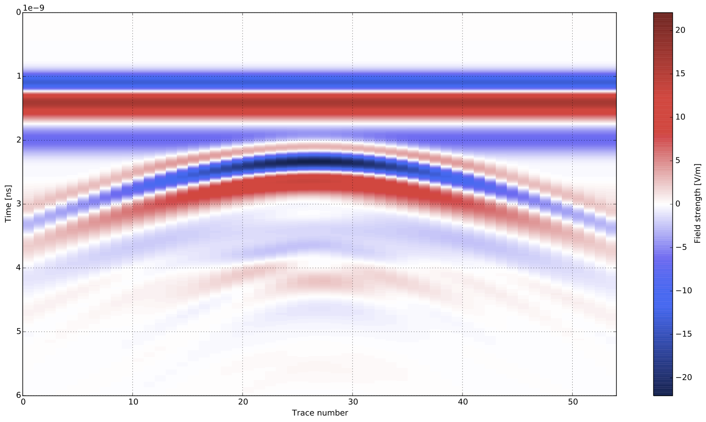

***********
3D Examples
***********

This section provides some general example models in 3D that demonstrate how to use certain features of gprMax. Each example comes with an input file which you can download and run.

Using an antenna model
======================

:download:`antenna_MALA_1200_fs.in <models/antenna_MALA_1200_fs.in>`

This example demonstrates how to use one of the built-in antenna models in a simulation. Using a model of an antenna rather than a simple source, such as a Hertzian dipole, can improve the accuracy of the results of a simulation for many situations. It is especially important when the target is in the near-field of the antenna and there are complex interactions between the antenna and the environment. The simulation uses the model of an antenna similar to a MALA 1.2GHz antenna.

.. literalinclude:: models/antenna_MALA_1200_fs.in
    :language: none
    :linenos:

.. figure:: images/antenna_MALA_1200.png
    :width: 600 px

    FDTD geometry mesh showing an antenna model similar to a MALA 1.2GHz antenna (skid removed for illustrative purposes).

The antenna model is loaded from a Python module and inserted into the input file just like another geometry command. The arguments for the ``antenna_like_MALA_1200`` function specify its (x, y, z) location as 0.132m, 0.095m, 0.100m using a 1mm spatial resolution. In this example the antenna is the only object in the model, i.e. the antenna is in free space. When the simulation is run two geometry files for the antenna are produced along with an output file which contains a single receiver (the antenna output). The antenna bowties are aligned with the y axis so the output is the y component of the electric field. More information can be found in the :ref:`Python section <python>`.

Results
-------

:numref:`antenna_MALA_1200_fs_results` shows the time history of the electric and magnetic field components from the receiver bowtie of the antenna model. The antenna bowties are aligned with the y axis so the output will be the Ey component of the electric field.

.. _antenna_MALA_1200_fs_results:

.. figure:: images/antenna_MALA_1200_fs_results.png

    Field outputs from the receiver bowtie of a model of an antenna similar to a MALA 1.2GHz antenna.

B-scan with an antenna model
============================

:download:`GSSI_1500_cylinder_Bscan.in <models/GSSI_1500_cylinder_Bscan.in>`

This example demonstrates how to create a B-scan with an antenna model. The scenario is purposely simple to illustrate the method. A metal cylinder of diameter 20mm is buried in a dielectric half-space which has a relative permittivity of six. The simulation uses the model of an antenna similar to a GSSI 1.5GHz antenna.

.. literalinclude:: models/GSSI_1500_cylinder_Bscan.in
    :language: none
    :linenos:

.. figure:: images/GSSI_1500_cylinder.png
    :width: 600 px

    FDTD geometry mesh showing a metal cylinder buried in a half-space and an antenna model similar to a GSSI 1.5GHz antenna.

The antenna must be moved to a new position for every single A-scan (trace) in the B-scan. In this example the B-scan distance will be 270mm with a trace every 5mm, so 54 model runs will be required.

.. code-block:: none

    python -m gprMax GSSI_1500_cylinder_Bscan.in -n 54

The total number of runs for a model as well as the number of the current run of the model are stored and can be accessed in Python as ``number_model_runs`` and ``current_model_run``. The ``current_model_run`` can be used to move the position of the antenna for every run of the model as shown in Line 13. The antenna will be moved 5mm in the x direction for every new run of the model.

Results
-------

:numref:`GSSI_1500_cylinder_Bscan_results` shows the B-scan (image of the Ey field). As expected a hyperbolic response is present from the metal cylinder.

.. _GSSI_1500_cylinder_Bscan_results:

    B-scan of model of a metal cylinder buried in a dielectric half-space with a model of an antenna similar to a GSSI 1.5GHz antenna.

Building a heterogeneous soil
=============================

:download:`heterogeneous_soil.in <models/heterogeneous_soil.in>`

This example demonstrates how to build a more realistic soil model using a stochastic distribution of dielectric properties. A mixing model for soils proposed by Peplinski (http://dx.doi.org/10.1109/36.387598) is used to define a series of dispersive material properties for the soil.

.. literalinclude:: models/heterogeneous_soil.in
    :language: none
    :linenos:

.. figure:: images/heterogeneous_soil.png
    :width: 600 px

    FDTD geometry mesh showing a heterogeneous soil model with a rough surface.

Line 10 defines a series of dispersive materials to represent a soil with sand fraction 0.5, clay fraction 0.5, bulk density :math:`2~g/cm^3`, sand particle density of :math:`2.66~g/cm^3`, and a volumetric water fraction range of 0.001 - 0.25. The volumetric water fraction is given as a range which is what defines a series of dispersive materials.

These materials can then be distributed stochastically over a volume using the ``#fractal_box`` command. Line 11 defines a volume, a fractal dimension, a number of materials, and a mixing model to use. The fractal dimension, 1.5, controls how the materials are stochastically distributed. The fractal weightings, 1, 1, 1, weight the fractal in the x, y, and z directions. The number of materials, 50, specifies how many dispersive materials to create using the mixing model (``my_soil``).

Adding rough surfaces
---------------------

A rough surface can be added to any side of ``#fractal_box`` using,

.. code-block:: none

    #add_surface_roughness: 0 0 0.070 0.15 0.15 0.070 1.5 1 1 0.065 0.080 my_soil_box

which defines one of the surfaces of the ``#fractal_box``, a fractal dimension, and minimum and maximum values for the height of the roughness (relative to the original ``#fractal_box`` volume). In this example the roughness will be stochastically distributed with troughs up to 5mm deep, and peaks up to 10mm high.

More information, including adding surface water and vegetation, can be found in the :ref:`section on using the fractal box command <fractals>`.

