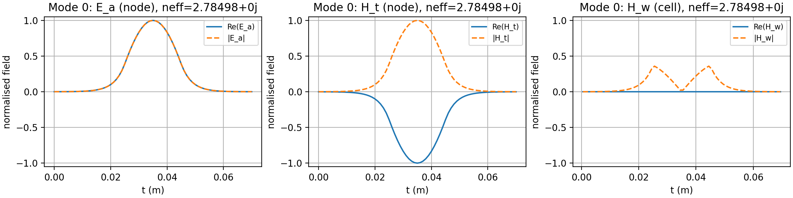
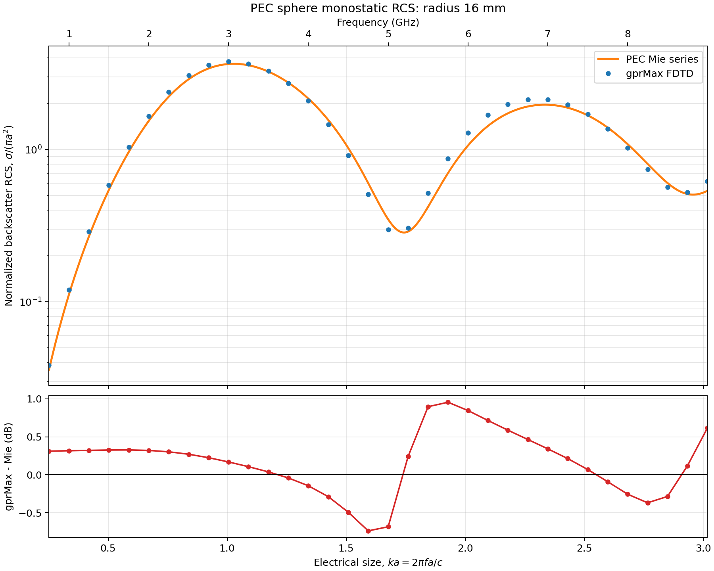
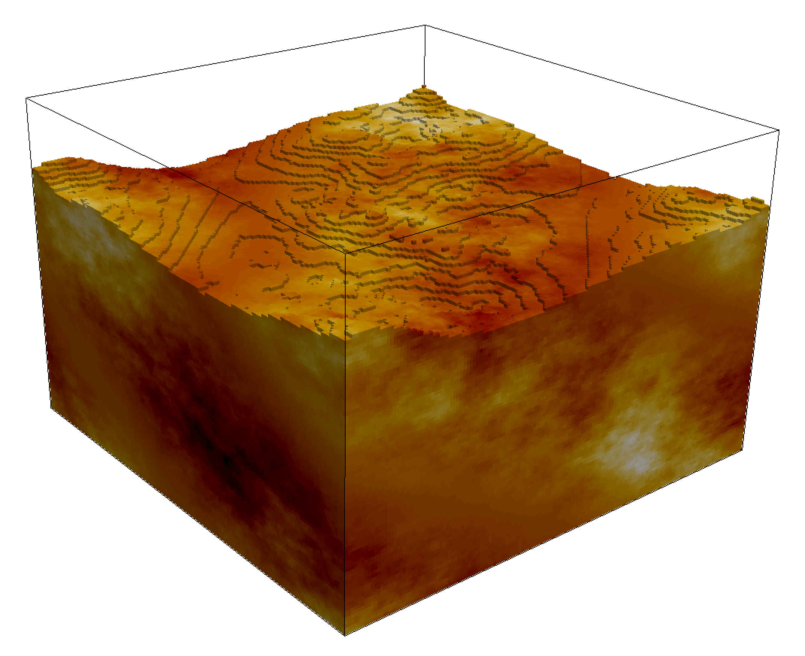
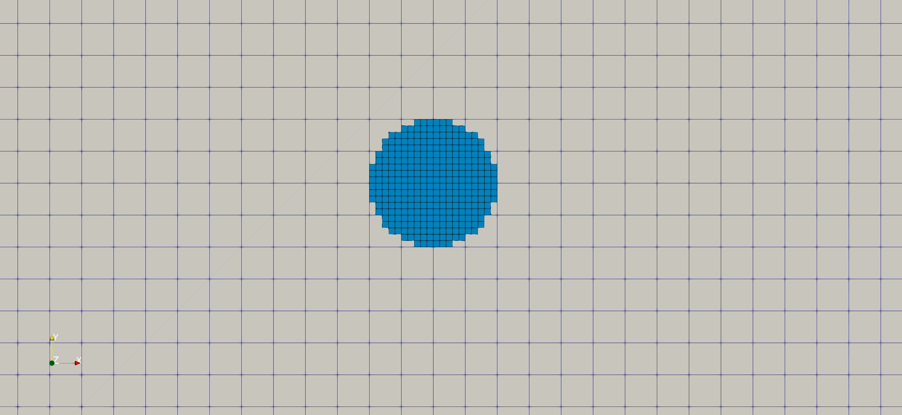
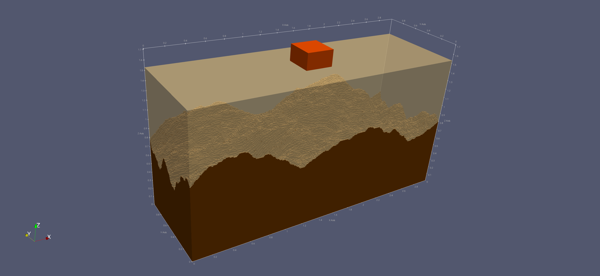
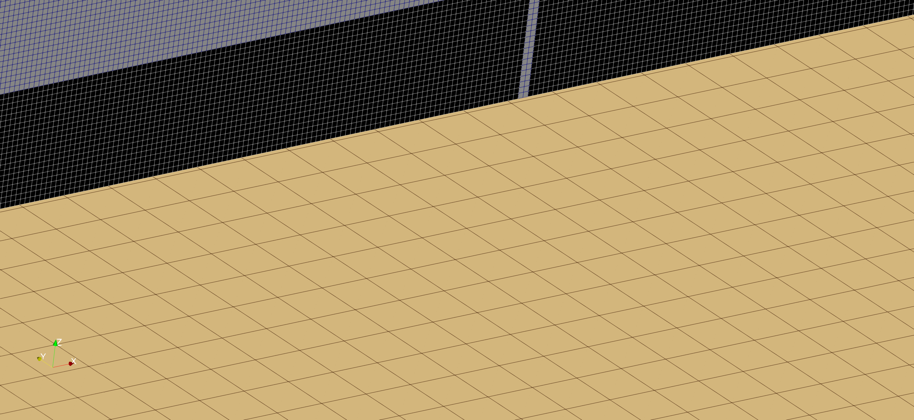

*****************
Advanced features
*****************

This section provides example models of some of the more advanced features of gprMax. Each example comes with an input file which you can download and run.

Eigenmode ports
===============

The six numbered examples under ``examples/features/eigenmode_ports`` progress
from straight and curved guides to a closed-surface horn, a complete modal
matrix study, a phase-steered array, and a guide crossing cutoff.
:doc:`eigenmode_port` provides a step-by-step tutorial for users who primarily
want S-parameters and far fields.

Always inspect the solved mode before committing to a long FDTD run:

.. code-block:: console

    python examples/features/eigenmode_ports/example_1_straight_waveguide/straight_waveguide.py --geometry-only

Geometry-only mode builds the material grid and solves the mode without time
stepping. It automatically writes the modal-field plot. Check its requested
polarisation, symmetry, mode order, confinement, and field behaviour at
material, PEC, or PMC boundaries.

    Yee-staggered active field components of the fundamental 2D TM dielectric-slab mode.

The complete regression and directionality matrix is kept separately under
``testing/regression/eigenmode_sources``; it is not intended as introductory
user material.

Plane-wave TFSF source
======================

:download:`dielectric_sphere_tfsf.in <../../examples/features/plane_waves/dielectric_sphere_tfsf.in>`
and its equivalent
:download:`Python API model <../../examples/features/plane_waves/dielectric_sphere_tfsf.py>`
demonstrate a discrete plane wave incident on a dielectric sphere. The sphere
and one receiver lie inside the total-field/scattered-field box, while a
second receiver beyond its x-maximum face records scattered field only.

.. literalinclude:: ../../examples/features/plane_waves/dielectric_sphere_tfsf.in
    :language: none
    :linenos:

The example above is deliberately small and focuses on the TFSF field
separation. For a quantitative far-field scattering calculation, use the PEC
sphere example below.

PEC-sphere radar cross section
==============================

:download:`pec_sphere_rcs.in <../../examples/rcs/pec_sphere/pec_sphere_rcs.in>`
and the equivalent
:download:`Python API model <../../examples/rcs/pec_sphere/pec_sphere_rcs.py>`
together with their
:download:`plotting script <../../examples/rcs/pec_sphere/plot_pec_sphere_rcs.py>`
form a complete monostatic radar cross-section workflow. A 16 mm-radius PEC
sphere is represented on a 0.5 mm grid and illuminated by a broadband,
z-polarised plane wave propagating in the positive x direction. The 12 ns time
window allows the transient to decay before the frequency-domain results are
formed. The model uses the default 10-cell PML, so no ``#pml_cells`` command is
needed.

.. literalinclude:: ../../examples/rcs/pec_sphere/pec_sphere_rcs.in
    :language: none
    :linenos:

The TFSF box encloses the sphere. The larger ``NTFFSurface`` encloses the
complete TFSF box and remains in homogeneous free space, clear of both the
TFSF correction stencil and the PML. ``NTFFFrequencyTransform`` streams the
tangential fields needed by the conventional equivalent-current formulation
at 34 frequencies from 0.75 to 9 GHz. The hash-command model automatically
associates the enclosed plane wave with the transform. The Python API makes
the same choice explicit with ``plane_wave_index=0``.

``NTFFFarField`` requests the monostatic direction
:math:`\theta=90^\circ`, :math:`\phi=180^\circ`, opposite to the incident
wave. The stored ``rcs`` array is linear and has units of square metres. The
plotting script normalises it by the geometrical cross section
:math:`\pi a^2` and independently evaluates a dense analytical PEC Mie series.
The electrical-size axis, :math:`ka=2\pi f a/c`, exposes the familiar
resonances and nulls of PEC-sphere backscatter; a secondary axis gives the
corresponding frequency.

From the repository root, run with:

.. code-block:: console

    python -m gprMax examples/rcs/pec_sphere/pec_sphere_rcs.in -gpu 0
    python examples/rcs/pec_sphere/plot_pec_sphere_rcs.py

Omit ``-gpu 0`` to run on the CPU. A GPU is recommended for this
:math:`320^3`-cell model. The model also writes a fine VTK HDF geometry view
for inspection in ParaView.

.. _pec-sphere-backscatter-rcs:

    Monostatic backscatter RCS from the equivalent-current NTFF output
    compared with the PEC-sphere Mie series over :math:`0.25<ka<3.02`.

For this 0.5 mm discretisation, which represents the sphere radius with 32
cells, the RMS difference over the sweep is approximately 0.44 dB. At
:math:`ka\simeq1`, gprMax gives -25.16 dBsm and the Mie series gives
-25.33 dBsm. The error grows around sharp RCS minima because a small shift in
a null produces a relatively large dB difference. The principal limitation is
the staircased representation of the curved PEC surface; a formal convergence
study should repeat the model at several spatial resolutions and compare the
complex far fields as well as RCS.

Building a heterogeneous soil
=============================

:download:`heterogeneous_soil.in <../../examples/gpr/materials/heterogeneous_soil.in>`

This example demonstrates how to build a more realistic soil model using a stochastic distribution of dielectric properties. A mixing model for soils proposed by Peplinski (http://dx.doi.org/10.1109/36.387598) is used to define a series of dispersive material properties for the soil.

.. literalinclude:: ../../examples/gpr/materials/heterogeneous_soil.in
    :language: none
    :linenos:

    FDTD geometry mesh showing a heterogeneous soil model with a rough surface.

Line 10 defines a series of dispersive materials to represent a soil with sand fraction 0.5, clay fraction 0.5, bulk density :math:`2~g/cm^3`, sand particle density of :math:`2.66~g/cm^3`, and a volumetric water fraction range of 0.001 - 0.25. The volumetric water fraction is given as a range which is what defines a series of dispersive materials.

These materials can then be distributed stochastically over a volume using the ``#fractal_box`` command. Line 11 defines a volume, a fractal dimension, a number of materials, and a mixing model to use. The fractal dimension, 1.5, controls how the materials are stochastically distributed. The fractal weightings, 1, 1, 1, weight the fractal in the x, y, and z directions. The number of materials, 50, specifies how many dispersive materials to create using the mixing model (``my_soil``).

Adding rough surfaces
---------------------

A rough surface can be added to any side of ``#fractal_box`` using,

.. code-block:: none

    #add_surface_roughness: 0 0 0.070 0.15 0.15 0.070 1.5 1 1 0.065 0.080 my_soil_box

which defines one of the surfaces of the ``#fractal_box``, a fractal dimension, and minimum and maximum values for the height of the roughness (relative to the original ``#fractal_box`` volume). In this example the roughness will be stochastically distributed with troughs up to 5mm deep, and peaks up to 10mm high.

More information, including adding surface water and vegetation, can be found in the :ref:`section on using the fractal box command <fractals>`.

Using subgrid(s)
================

Including finely detailed objects or regions of high dielectric strength in FDTD modeling can dramatically increase the computational burden of the method. This is because the conditionally stable nature of the algorithm requires a minimum time step for a given spatial discretization. Thus, when the spatial discretization is lowered, either to reduce numerical dispersion or include small-sized features, the time step must be reduced. Also, the number of spatial cells is increased. One approach to reducing the overall computational cost is to introduce local finely discretized regions into a coarser finite-difference grid. This approach is known as subgridding. The computing time is reduced since there are fewer cells to solve. Also, there are fewer iterations since the coarse time step is maintained in the coarse region. gprMax uses a new Huygens subgridding (HSG) algorithm with a novel artificial loss mechanism called the switched Huygens subgridding (SHSG). For a detailed description of subgridding and the SHSG method please read [HAR2021]_.

Subgridding functionality requires using our :ref:`Python API <input-api>`.

.. _examples-subgrid:

High dielectric example
-----------------------

:download:`cylinder_fs.py <../../examples/features/subgrids/cylinder_fs.py>`

This example is a basic demonstration of how to use subgrids. The geometry is 3D (required for any use of subgrids) and is of a water-filled (high dielectric constant) cylindrical object in freespace. The subgrid encloses the cylindrical object using a fine spatial discretisation (1mm), and a courser spatial discretisation (5mm) is used in the rest of the model (main grid). A simple Hertzian dipole source is used with a waveform shaped as the first derivative of a gaussian.

    The geometry of a 3D model of a water cylinder (meshed using a subgrid) in free space.

.. literalinclude:: ../../examples/features/subgrids/cylinder_fs.py
    :language: python
    :linenos:

Much of the functionality demonstrated in this example is standard use of our :ref:`Python API <input-api>`, so mainly the parts that relate to the subgrid will be described here. Lines 20-25 specify the spatial discretisation of the course main grid (5mm) and fine subgrid (1mm). Lines 56-60 specify the centres and radius of the cylinder and coordinates of a bounding box which will be used to set the domain of the subgrid.

The subgrid object is created on line 63 (providing its extent, the ratio of the spatial resolution, and a string identifier) and then added to the main scene on line 64. Any objects that are to be placed within the subgrid can be added to the subgrid scene (through the variable ``subgrid``) in the same way as the main grid/scene.

In lines 67-71 the material used to represent water is created and added to the subgrid. The function ``calculate_water_properties()`` is used to help define the properties of water which is represented as a dispersive material using a single pole Debye model.

Lines 74-75 define a cylinder object with the material ``water`` that we just created, and then add it to the subgrid.

On lines 78-81 a view of the subgrid geometry is added to the subgrid object.

Finally, on line 95 when the model is run the keyword arguments ``subgrid`` and ``autotranslate`` are given and set to ``True``. The ``subgrid`` argument tells gprMax that subgrids are being used, and the ``autotranslate`` argument allows the user to specify subgrid objects using main grid coordinates which will then be internally translated to local subgrid coordinates. Without using this option the user would have to specify subgrid objects in local subgrid coordinates.

Antenna modelling example
-------------------------

:download:`gssi_400_over_fractal_subsurface.py <../../examples/gpr/subgrids/gssi_400_over_fractal_subsurface.py>`

This example demonstrates how to use subgrids at a more advanced level combining use of an imported GPR antenna model (like a GSSI 400MHz antenna) and rough subsurface interface. The geometry is 3D (required for any use of subgrids) and is of a 2 layered subsurface. The top layer in a sandy soil and the bottom layer a soil with
higher permittivity (both have some simple conductive loss). There is a rough interface between the soil layers. A GPR antenna model (like a GSSI 400MHz antenna) is imported and placed on the surface of the layered media. The antenna is meshed using a subgrid with a fine spatial discretisation (1mm), and a courser spatial discretisation (9mm) is used in the rest of the model (main grid).

    The geometry of a 3D model of a GPR antenna (like a GSSI 400MHz) - meshed using a subgrid - over a 2 layered media with a rough interface.

    Zoomed in geometry showing a subgrid ratio of 1mm (subgrid) - antenna model - to 9mm (main grid).

.. literalinclude:: ../../examples/gpr/subgrids/gssi_400_over_fractal_subsurface.py
    :language: python
    :linenos:

Much of the functionality demonstrated in this example is standard use of our :ref:`Python API <input-api>`, or covered in the introductory subgrid example earlier in this section.

Lines 86-108 are important because they position an object (a box of sandy soil in this case) within the subgrid. This object has to be positioned manually (using local subgrid coordinates) as it crosses the interface between the subgrid and the main grid. The ``autotranslate`` property of the box object is set to ``False`` to allow this to happen.

Customising the PMLs
====================

Through our :ref:`Python API <input-api>` there is the ability to :ref:`customise and adjust the formulation and properties used for the Perfectly Matched Layer (PML) absorbing boundaries <pml-tuning>`.

.. note::

    * If you just want to adjust the thickness of the PMLs and not use our Python API, that can be achieved using the ``#pml_cells`` command.

This example demonstrates how different formulations of PML and PML parameters can be adjusted and used.

The model is of an elongated-thin PEC plate (25 x 100 mm). The y-directed electric field  (Ey) is monitored one cell away from the plate, and a z-directed Hertzian dipole source is placed diagonally opposite the field monitoring point and at 1 mm above one of the PEC sheet corner. Only three cells of free space separate the plate target from the inner surface of the PMLs.

The performance of each PML can be compared with a reference solution using the same model with a substantially larger domain.

.. literalinclude:: ../../testing/models_pmls/pml_3D_pec_plate/pml_3D_pec_plate.py
    :language: python
    :linenos:

In lines 43-122 a dictionary with different PML formulations and parameters is created.
