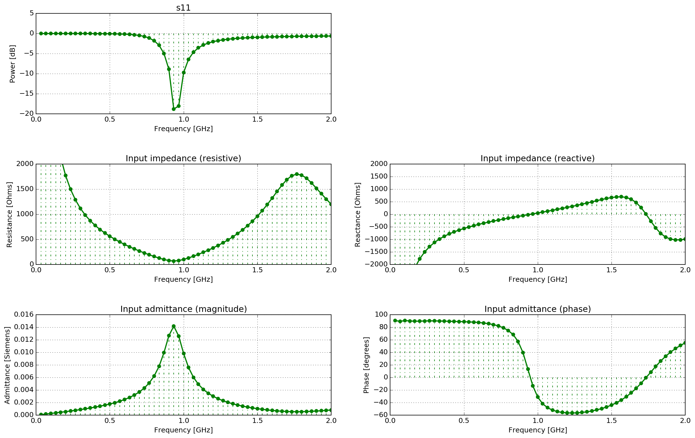
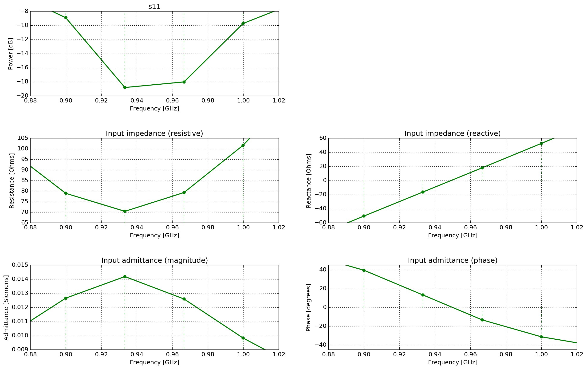
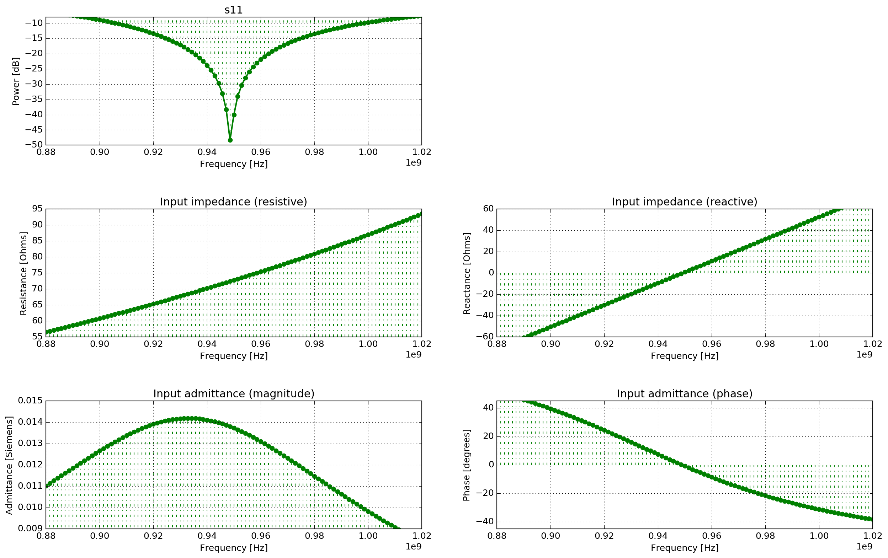
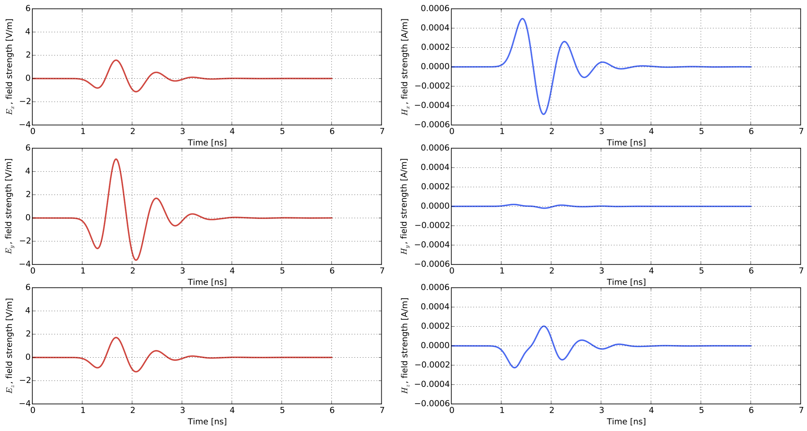
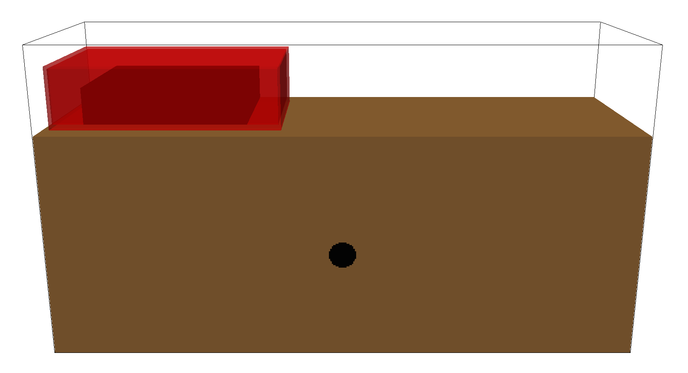
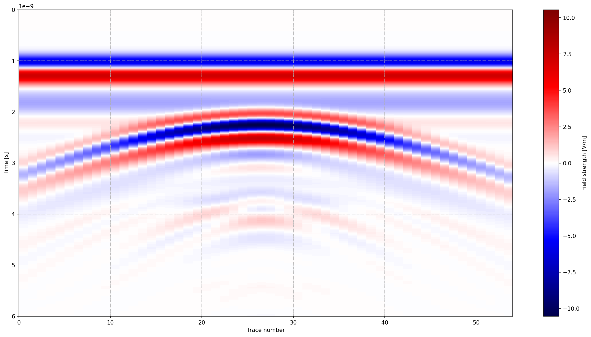

**************
Antenna models
**************

This section provides some example models of antennas. Each example comes with an input file which you can download and run.

.. _example-wire-dipole:

Wire dipole antenna model
=========================

:download:`antenna_wire_dipole_fs.in <../../user_models/antenna_wire_dipole_fs.in>`

This example demonstrates a model of a half-wavelength wire dipole antenna in free space. It is a balanced antenna and it's characteristics are well known from theory [BAL2005]_. The length of the dipole is 150mm with a 1mm gap between the arms.

.. literalinclude:: ../../user_models/antenna_wire_dipole_fs.in
    :language: none
    :linenos:

The wire is modelled using the ``#edge`` command which specifies properties of the edge of the Yee cell. The antenna is fed using the ``#transmission_line`` command. The one-dimensional transmission line model virtually attaches to the dipole at the gap between the arms. The antenna has an input resistance :math:`Z_{in} = 73~\Omega` specified in the ``#transmission_line`` command, and uses a Gaussian waveform with a centre frequency of 1GHz. A time window of 60ns is used: firstly, to give enough time for the response to decay down to zero; and secondly, to allow a reasonable resolution (17MHz) for calculating antenna parameters that involve taking a FFT (:math:`\Delta f=1/T` where :math:`\Delta f` is the frequency bin spacing and :math:`T` is the time window).

Time histories of voltage and current values in the transmission line are saved to the output file. These are documented in the :ref:`output file section <output>`. These parameters are useful for calculating characteristics of the antenna such as the input impedance or S-parameters. gprMax includes a Python module (in the ``tools`` package) to help you view the input impedance and admittance and s11 parameter from an antenna model fed using a transmission line. Details of how to use this module is given in the :ref:`tools section <plotting>`.

Results
-------

You can view the results (see :ref:`output` and :ref:`tools<plotting>` sections) using the command:

.. code-block:: none

    python -m tools.plot_antenna_params user_models/antenna_wire_dipole_fs.out

.. _antenna_wire_dipole_fs_tl_params:

.. figure:: images/antenna_wire_dipole_fs_tl_params.png
    :width: 600px

    Time and frequency domain plots of the incident and total (incident + reflected) voltages and currents in the transmission line (:math:`\Delta f = 17~MHz`).

.. _antenna_wire_dipole_fs_ant_params:

    Input admittance and impedance (resistance and reactance) and s11 parameter values of the antenna (:math:`\Delta f = 17~MHz`).

.. _antenna_wire_dipole_fs_ant_params_detail:

    Detailed view of input admittance and impedance (resistance and reactance) and s11 parameter values of the antenna (:math:`\Delta f = 17~MHz`).

:numref:`antenna_wire_dipole_fs_tl_params` shows time histories and frequency spectra of the incident and total (incident + reflected) voltages and currents in the transmission line. :numref:`antenna_wire_dipole_fs_ant_params` shows the input admittance and impedance (resistance and reactance), and s11 parameter of the half-wavelength wire dipole. :numref:`antenna_wire_dipole_fs_ant_params_detail` shows a more detailed view of these parameters. The s11 parameter shows that the first resonance of the antenna is at 950MHz. Depending on the radius of the wire, the length of the dipole for first resonance is about :math:`l=0.47\lambda` to :math:`0.48\lambda`. The thinner the wire the closer the resonance is to :math:`0.48\lambda` [BAL2005]_. In this case, with a first resonance of 950MHz and a length of 150mm, :math:`l/\lambda=0.475`. The input impedance is :math:`Z_{in} = 72.8 + j1~\Omega`. If :math:`l/\lambda=0.5` then the theoretical input impedance would be :math:`Z_{in} = 73 + j42.5~\Omega`. The reactive (imaginery) part associated with the input impedance of a dipole is a function of its length.

:numref:`antenna_wire_dipole_fs_ant_params_detail_1p4MHz` demonstrates the increased frequency resolution (:math:`\Delta f = 1.4~MHz`) when an even longer time window (700ns) is used.

.. _antenna_wire_dipole_fs_ant_params_detail_1p4MHz:

    Detailed view of input admittance and impedance (resistance and reactance) and s11 parameter values of the antenna (:math:`\Delta f = 1.4~MHz`)

.. _example-bowtie:

Bowtie antenna model
====================

:download:`antenna_like_MALA_1200_fs.in <../../user_models/antenna_like_MALA_1200_fs.in>`

This example demonstrates how to use one of the built-in antenna models in a simulation. Using a model of an antenna rather than a simple source, such as a Hertzian dipole, can improve the accuracy of the results of a simulation for many situations. It is especially important when the target is in the near-field of the antenna and there are complex interactions between the antenna and the environment. The simulation uses the model of an antenna similar to a MALA 1.2GHz antenna.

.. literalinclude:: ../../user_models/antenna_like_MALA_1200_fs.in
    :language: none
    :linenos:

.. figure:: images/antenna_like_MALA_1200.png
    :width: 600 px

    FDTD geometry mesh showing an antenna model similar to a MALA 1.2GHz antenna (skid removed for illustrative purposes).

The antenna model is loaded from a Python module and inserted into the input file just like another geometry command. The arguments for the ``antenna_like_MALA_1200`` function specify its (x, y, z) location as 0.132m, 0.095m, 0.100m using a 1mm spatial resolution. In this example the antenna is the only object in the model, i.e. the antenna is in free space. More information on using the built-in antenna models can be found in the :ref:`Python section <python>`.

Results
-------

When the simulation is run two geometry files for the antenna are produced along with an output file which contains a single receiver (the antenna output). You can view the results (see :ref:`output` and :ref:`tools<plotting>` sections) using the command:

.. code-block:: none

    python -m tools.plot_Ascan user_models/antenna_like_MALA_1200_fs.out --outputs Ey

:numref:`antenna_like_MALA_1200_fs_results` shows the time history of the y-component of the electric field from the receiver bowtie of the antenna model (the antenna bowties are aligned with the y axis).

.. _antenna_like_MALA_1200_fs_results:

    Ey field output from the receiver bowtie of a model of an antenna similar to a MALA 1.2GHz antenna.

B-scan with a bowtie antenna model
==================================

:download:`cylinder_Bscan_GSSI_1500.in <../../user_models/cylinder_Bscan_GSSI_1500.in>`

This example demonstrates how to create a B-scan with an antenna model. The scenario is purposely simple to illustrate the method. A metal cylinder of diameter 20mm is buried in a dielectric half-space which has a relative permittivity of six. The simulation uses the model of an antenna similar to a GSSI 1.5GHz antenna.

.. literalinclude:: ../../user_models/cylinder_Bscan_GSSI_1500.in
    :language: none
    :linenos:

    FDTD geometry mesh showing a metal cylinder buried in a half-space and an antenna model similar to a GSSI 1.5GHz antenna.

The antenna must be moved to a new position for every single A-scan (trace) in the B-scan. In this example the B-scan distance will be 270mm with a trace every 5mm, so 54 model runs will be required.

.. code-block:: none

    python -m gprMax cylinder_Bscan_GSSI_1500.in -n 54

The total number of runs for a model as well as the number of the current run of the model are stored and can be accessed in Python as ``number_model_runs`` and ``current_model_run``. The ``current_model_run`` can be used to move the position of the antenna for every run of the model as shown in Line 13. The antenna will be moved 5mm in the x direction for every new run of the model.

.. note::

    If you are moving an antenna model within a simulation, e.g. to generate a B-scan, you should ensure that the step size you choose is a multiple of the spatial resolution of the simulation. Otherwise when the position of antenna is converted to cell coordinates the geometry maybe altered.

Results
-------

After merging the A-scans into a single file you can now view an image of the B-scan using the command see :ref:`output` and :ref:`tools<plotting>` sections:

.. code-block:: none

    python -m tools.plot_Bscan user_models/cylinder_Bscan_GSSI_1500_merged.out Ey

:numref:`cylinder_Bscan_GSSI_1500_results` shows the B-scan (of the Ey field component). The initial part of the signal (~1-2 ns) represents the direct wave from transmitter to receiver. Then comes a hyperbolic response from the metal cylinder.

.. _cylinder_Bscan_GSSI_1500_results:

    B-scan of model of a metal cylinder buried in a dielectric half-space with a model of an antenna similar to a GSSI 1.5GHz antenna.
