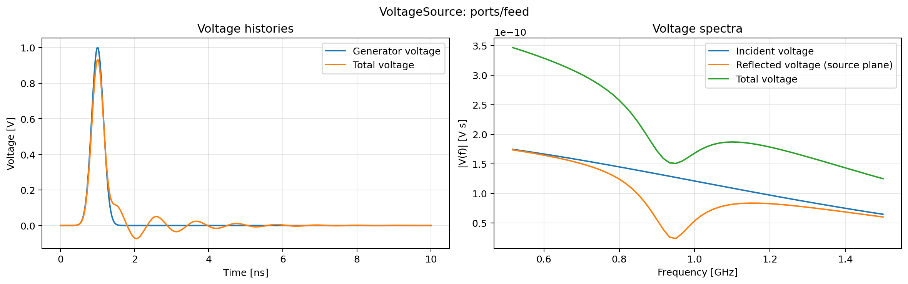
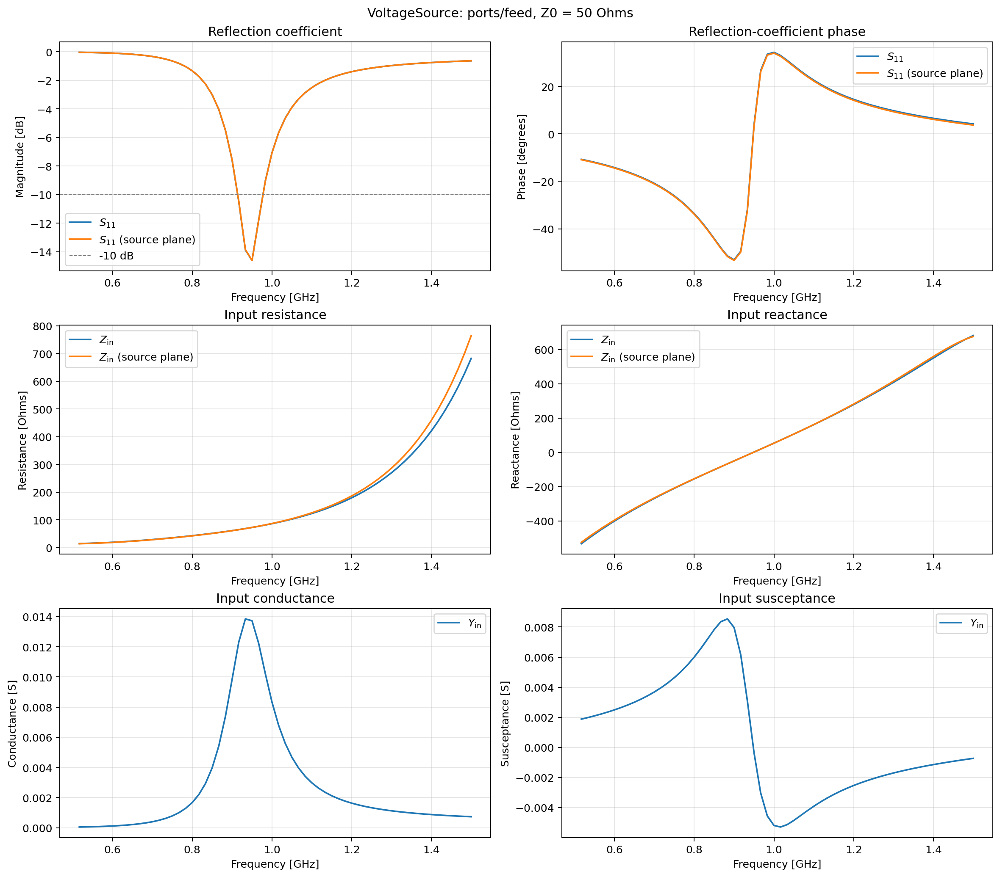
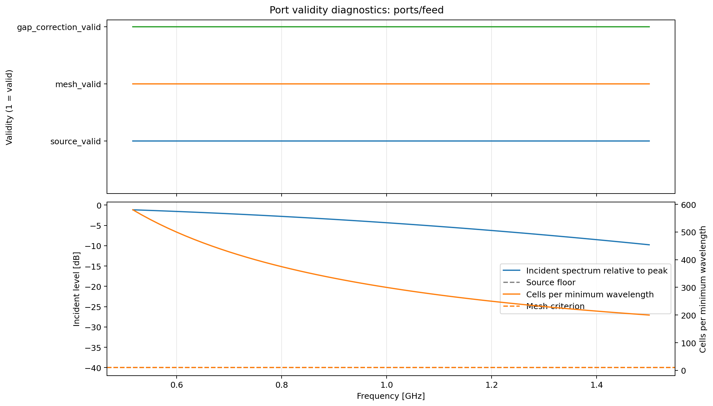
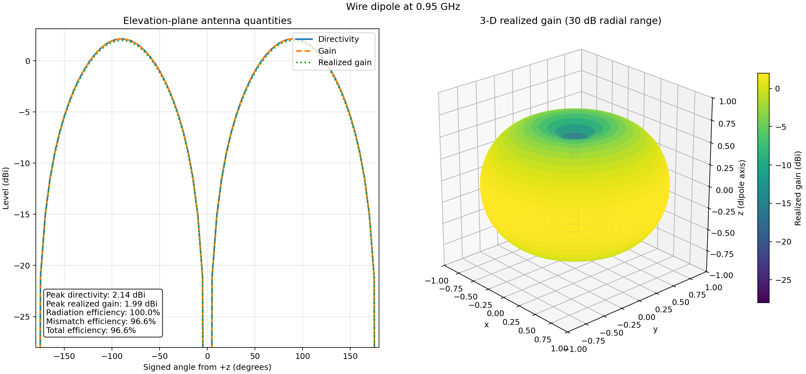
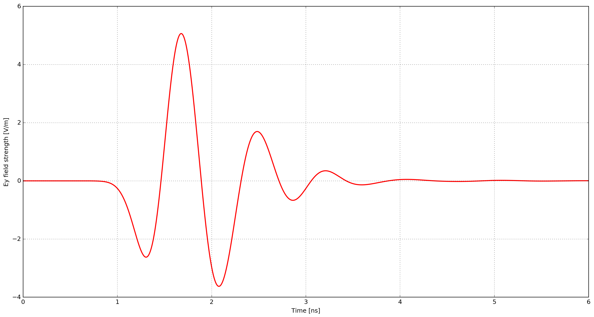
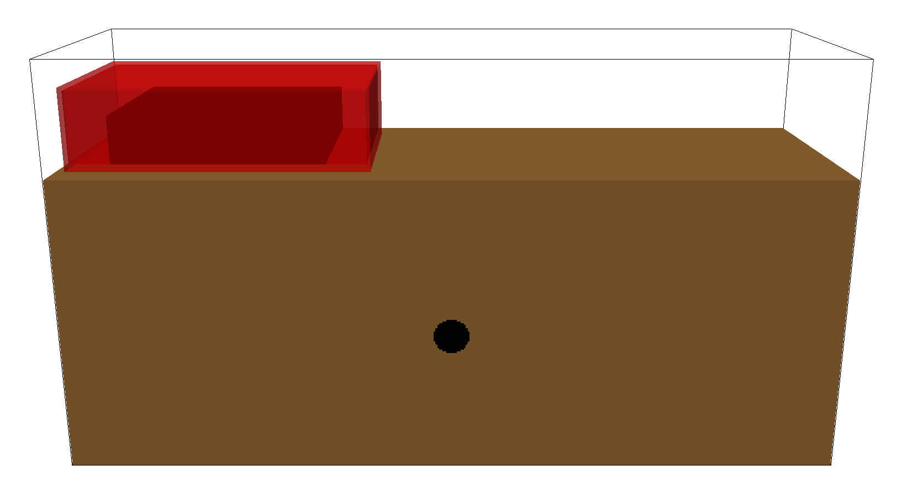
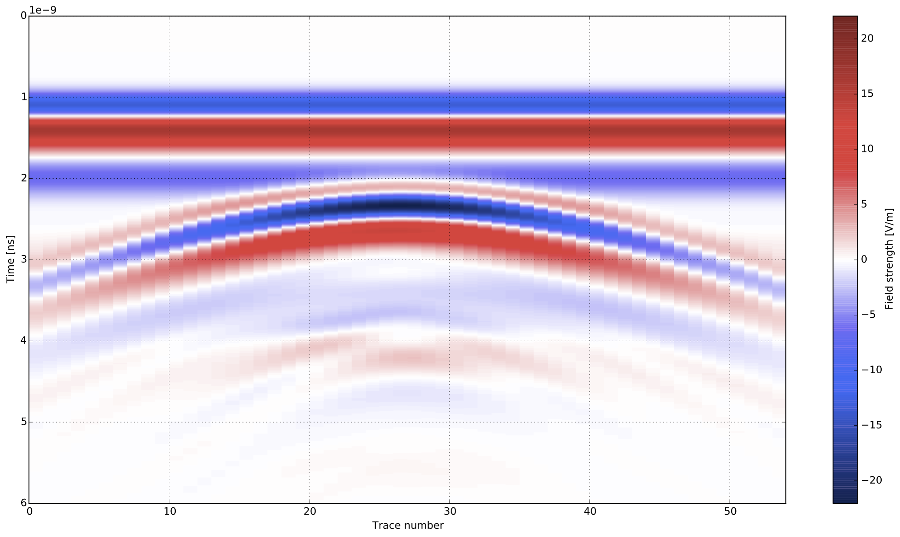

**************
Antenna models
**************

This section provides some example models of antennas. Each example comes with an input file which you can download and run.

.. _example-wire-dipole:

Wire dipole antenna model
=========================

:download:`antenna_wire_dipole_fs.in <../../examples/antennas/wire_dipole/antenna_wire_dipole_fs.in>`
and
:download:`antenna_wire_dipole_fs.py <../../examples/antennas/wire_dipole/antenna_wire_dipole_fs.py>`
are equivalent hash-command and Python API models of a half-wavelength wire
dipole in free space. The balanced antenna is 150 mm long and has a one-cell,
1 mm gap between its PEC arms.

.. literalinclude:: ../../examples/antennas/wire_dipole/antenna_wire_dipole_fs.in
    :language: none
    :linenos:

The antenna is excited by a one-cell, 50 Ohm resistive voltage source whose
optional ID names the automatic output port ``feed``. gprMax samples the total
gap voltage during the solve and, after the
time loop, directly calculates the complex reflection coefficient, input
impedance, and input admittance. The effective Yee-edge gap capacitance and
background conductance are removed from the reported terminal quantities.
Users do not need to reconstruct S11 from voltage and current histories.

The Gaussian waveform has a nominal frequency of 1 GHz. The 60 ns time window
provides a native FFT-bin spacing of approximately 16.7 MHz. The default
voltage-source port spectrum is limited by the model's lambda/10 mesh criterion and
also carries per-frequency validity masks based on source bandwidth and the
terminal reconstruction. These masks should be applied when plotting.

Results
-------

The model HDF5 file contains the authoritative arrays directly under
``/ports/feed``. They can be plotted without recalculating them:

.. code-block:: console

    python -m toolboxes.Plotting.plot_port \
        examples/antennas/wire_dipole/antenna_wire_dipole_fs.h5 \
        --port feed --fmin 0.5e9 --fmax 1.5e9 --tmax 10e-9 --save

The ``--port`` option may be omitted when the file contains exactly one port.
For direct access:

.. code-block:: python

    import h5py
    import numpy as np

    with h5py.File("antenna_wire_dipole_fs.h5", "r") as output:
        port = output["ports/feed"]
        frequency = port["frequency"][...]
        s11 = port["S11"][...]
        zin = port["Zin"][...]
        valid = port["valid_S11"][...].astype(bool)

    s11_db = 20 * np.log10(np.abs(s11[valid]))

The saved filenames include the full port path. This prevents a second port in
the same model from overwriting the first port's figures.

.. _antenna_wire_dipole_fs_port_signals:

    Available voltage histories and spectra. No current panel is created because a resistive voltage-source port does not require or store a current history.

.. _antenna_wire_dipole_fs_port_params:

    Stored S11, input impedance, and input admittance for the voltage-source port.

    Frequency-validity masks and the source-band and mesh-resolution diagnostics from which they are constructed.

For a thin centre-fed dipole, first resonance normally occurs when its length
is approximately :math:`0.47\lambda` to :math:`0.48\lambda`, depending on wire
radius [BAL2005]_. A half-wave dipole has a theoretical impedance near
:math:`73+j42.5~\Omega`; shortening it to resonance removes most of that input
reactance. This model gives its first resonance at approximately 950 MHz, with
:math:`Z_\mathrm{in}\approx72.8+j1.8~\Omega`. The numerical resonance and
impedance should be interpreted with a grid-convergence study because an FDTD
edge has a mesh-dependent effective radius.

Radiation pattern, directivity, and gain
----------------------------------------

:download:`antenna_wire_dipole_pattern.in <../../examples/antennas/wire_dipole/antenna_wire_dipole_pattern.in>`
extends the same one-cell voltage-port feed to a complete antenna-pattern
calculation using the traditional hash-command input. An equivalent
:download:`Python API model <../../examples/antennas/wire_dipole/antenna_wire_dipole_pattern.py>`
is provided for users who want to generate or modify the angular requests
programmatically. The domain is enlarged to give the integration surface more
clearance from the PML. The companion
:download:`plot_wire_dipole_pattern.py <../../examples/antennas/wire_dipole/plot_wire_dipole_pattern.py>`
reads the persisted antenna quantities without repeating the NTFF
calculation.

.. literalinclude:: ../../examples/antennas/wire_dipole/antenna_wire_dipole_pattern.in
    :language: none
    :linenos:

The ``NTFFSurface`` encloses the complete dipole and feed. The rectangular-
window ``NTFFFrequencyTransform`` accumulates conventional equivalent-current
surface phasors at 950 MHz. ``NTFFAntennaPorts`` associates the transform with
the physical ``feed`` port; this association supplies accepted and incident
power for gain, realized gain, and efficiency. Every physical port in a
multiport antenna must be listed, including ports whose source amplitude is
zero.

``NTFFFarFieldArray`` stores a full-sphere grid with a five-degree angular
step. Directivity is normalised by total radiated power, gain additionally
includes radiation efficiency, and realized gain additionally includes port
mismatch. The definitions and HDF5 datasets are given in
:ref:`output-ntff`.

Run and plot the example using:

.. code-block:: console

    python -m gprMax examples/antennas/wire_dipole/antenna_wire_dipole_pattern.in -gpu 0
    python examples/antennas/wire_dipole/plot_wire_dipole_pattern.py

Omit ``-gpu 0`` for a CPU simulation. The plot combines a principal-plane
cut with a 3-D realized-gain surface. Its radial coordinate is clipped to a
30 dB dynamic range while colour retains the absolute realized gain in dBi.

.. _antenna-wire-dipole-pattern:

    Directivity, gain, and realized gain of the PEC wire dipole at 950 MHz,
    with the corresponding three-dimensional realized-gain pattern.

The calculated peak directivity is 2.14 dBi, close to the theoretical 2.15
dBi of a thin half-wave dipole. Because the antenna materials are lossless,
the radiation efficiency is approximately 100%. The 50 Ohm feed has a 96.6%
mismatch efficiency at 950 MHz, giving a peak realized gain of 1.99 dBi and a
total efficiency of 96.6%. These values are frequency-specific and should be
checked for mesh, domain, surface-position, and time-window convergence.

Transmission-line alternative
-----------------------------

:download:`antenna_wire_dipole_transmission_line.py <../../examples/antennas/wire_dipole/antenna_wire_dipole_transmission_line.py>`
retains the one-dimensional transmission-line feed for studies that need its
explicit incident and total voltage/current histories or the independent
current-wave terminal checks. The transmission line also stores its own
authoritative S11, Zin, and Yin datasets for direct HDF5 access.

.. _example-bowtie:

Bowtie antenna model
====================

:download:`antenna_like_MALA_1200_fs.py <../../examples/gpr/antennas/antenna_like_MALA_1200_fs.py>`

This example demonstrates how to use one of the built-in antenna models in a simulation. Using a model of an antenna rather than a simple source, such as a Hertzian dipole, can improve the accuracy of the results of a simulation for many situations. It is especially important when the target is in the near-field of the antenna and there are complex interactions between the antenna and the environment. The simulation uses the model of an antenna similar to a MALA 1.2GHz antenna.

.. literalinclude:: ../../examples/gpr/antennas/antenna_like_MALA_1200_fs.py
    :language: python
    :linenos:

.. figure:: ../../images_shared/antenna_like_MALA_1200.png
    :width: 600 px

    FDTD geometry mesh showing an antenna model similar to a MALA 1.2GHz antenna (skid removed for illustrative purposes).

The antenna model is loaded from a Python module and the objects from the antenna model are added to the scene. The arguments for the ``antenna_like_MALA_1200`` function specify its (x, y, z) location as 0.132m, 0.095m, 0.100m using a 1mm spatial resolution. In this example the antenna is the only object in the model, i.e. the antenna is in free space. More information on using the built-in antenna models can be found in the ``toolboxes/GPRAntennaModels`` package.

Results
-------

When the simulation is run two geometry files for the antenna are produced along with an output file which contains a single receiver (the antenna output). You can view the results (see :ref:`output` section and README.rst for the ``toolboxes/Plotting`` package) using the command:

.. code-block:: none

    python -m toolboxes.Plotting.plot_Ascan examples/gpr/antennas/antenna_like_MALA_1200_fs.h5 --outputs Ey

:numref:`antenna_like_MALA_1200_fs_results` shows the time history of the y-component of the electric field from the receiver bowtie of the antenna model (the antenna bowties are aligned with the y-axis).

.. _antenna_like_MALA_1200_fs_results:

    Ey field output from the receiver bowtie of a model of an antenna similar to a MALA 1.2GHz antenna.

B-scan with a bowtie antenna model
==================================

:download:`cylinder_Bscan_GSSI_1500.py <../../examples/gpr/antennas/gssi_1500/cylinder_Bscan_GSSI_1500.py>`

This example demonstrates how to create a B-scan with an antenna model. The scenario is purposely simple to illustrate the method. A metal cylinder of diameter 20mm is buried in a dielectric half-space which has a relative permittivity of six. The simulation uses the model of an antenna similar to a GSSI 1.5GHz antenna.

.. literalinclude:: ../../examples/gpr/antennas/gssi_1500/cylinder_Bscan_GSSI_1500.py
    :language: python
    :linenos:

    FDTD geometry mesh showing a metal cylinder buried in a half-space and an antenna model similar to a GSSI 1.5GHz antenna.

The antenna must be moved to a new position for every single A-scan (trace) in the B-scan. This is done using a for loop and creating a new scene (with a new antenna position) for each A-scan. In this example the B-scan distance will be 270mm with a trace every 5mm, so 54 model runs will be required.

.. code-block:: none

    gprMax.run(scenes=scenes, n=54, geometry_only=False, outputfile=fn, gpu=None)

.. note::

    If you are moving an antenna model within a simulation, e.g. to generate a B-scan, you should ensure that the step size you choose is a multiple of the spatial resolution of the simulation. Otherwise when the position of antenna is converted to cell coordinates the geometry maybe altered.

Results
-------

After merging the A-scans into a single file you can now view an image of the B-scan using the command (see :ref:`output` section and README.rst for the ``toolboxes/Plotting`` package):

.. code-block:: none

    python -m toolboxes.Plotting.plot_Bscan examples/gpr/antennas/gssi_1500/cylinder_Bscan_GSSI_1500_merged.h5 Ey

:numref:`cylinder_Bscan_GSSI_1500_results` shows the B-scan (of the Ey field component). The initial part of the signal (~1-2 ns) represents the direct wave from transmitter to receiver. Then comes a hyperbolic response from the metal cylinder.

.. _cylinder_Bscan_GSSI_1500_results:

    B-scan of the model of a metal cylinder buried in a dielectric half-space with a model of an antenna similar to a GSSI 1.5GHz antenna.
