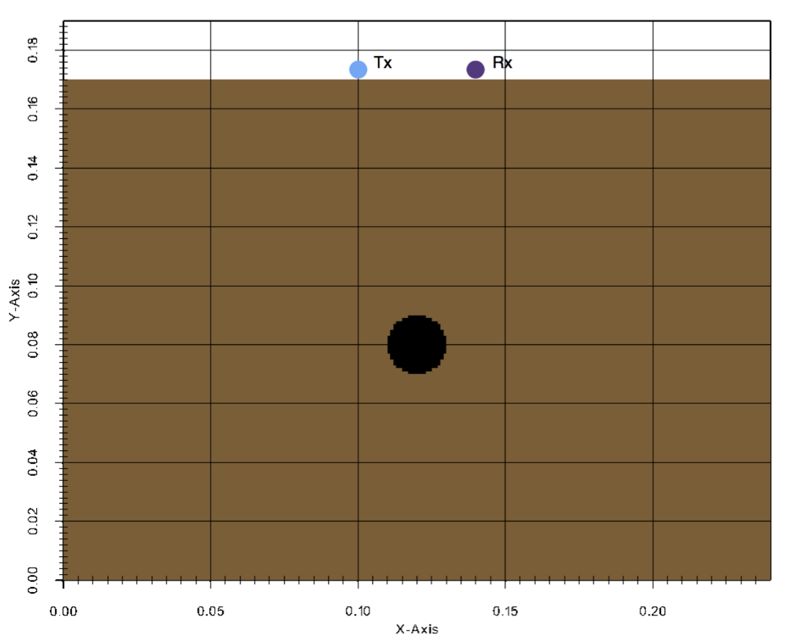

****************************
Introductory/basic 2D models
****************************

This section provides some general example models in 2D that demonstrate how to use certain features of gprMax. Each example comes with an input file which you can download and run.

.. _example-2D-Ascan:

A-scan from a metal cylinder
============================

:download:`cylinder_Ascan_2D.in <../../user_models/cylinder_Ascan_2D.in>`

This example is the gprMax equivalent of 'Hello World'! It demonstrates how to simulate a single trace (A-scan) from a metal cylinder buried in a dielectric half-space.

.. literalinclude:: ../../user_models/cylinder_Ascan_2D.in
    :language: none
    :linenos:

The geometry of the scenario is straightforward and is shown in :numref:`cylinder_half_space_geo`.

.. _cylinder_half_space_geo:

    Geometry of a 2D model of a metal cylinder buried in a dielectric half-space.

For this initial example a detailed description of what each command in the input file does and why each command was used is given. The following steps explain the steps taken to build the input file:

Determine the constitutive parameters for the materials
-------------------------------------------------------

There will be three different materials in the model representing air, the dielectric half-space, and the metal cylinder. Air (free space) already exists as a built-in material in gprMax which can be accessed using the ``free_space`` identifier. The metal cylinder will be modelled as a Perfect Electric Conductor, which again exists as a built-in material in gprMax and can be accessed using the ``pec`` identifier. So the only material which has to be defined is for the dielectric half-space. It is a non-magnetic material, i.e. :math:`\mu_r=1` and :math:`\sigma_*=0` and with a relative permittivity of six, :math:`\epsilon_r=6`, and zero conductivity, :math:`\sigma=0`. The identifier ``half_space`` will be used.

.. code-block:: none

    #material: 6 0 1 0 half_space

Determine the source type and excitation frequency
--------------------------------------------------

These should generally be known, often based on the GPR system or scenario being modelled. Low frequencies are used where significant penetration depth is important, whereas high frequencies are used where less penetration and better resolution are required. In this case a theoretical Hertzian dipole source fed with a Ricker waveform with a centre frequency of :math:`f_c=1.5~\textrm{GHz}` will be used to simulate the GPR antenna (later examples will demonstrate how to include a model of the actual GPR antenna in the simulation).

.. code-block:: none

    #waveform: ricker 1 1.5e9 my_ricker
    #hertzian_dipole: z 0.100 0.170 0 my_ricker

The Ricker waveform is created with the ``#waveform`` command, specifying an amplitude of one, centre frequency of 1.5 GHz and picking an arbitrary identifier of ``my_ricker``. The Hertzian dipole source is created using the ``#hertzian_dipole`` command, specifying a z direction polarisation (the survey direction if a B-scan were being created), location on the surface of the slab, and using the Ricker waveform already created.

Calculate a spatial resolution and domain size
----------------------------------------------

In the :ref:`guidance` section it was stated that a good *rule-of-thumb* was that the spatial resolution should be one tenth of the smallest wavelength present in the model. To determine the smallest wavelength, the highest frequency present in the model is required. This is not the centre frequency of the Ricker waveform! By examining the spectrum of the Ricker waveform it is evident much higher frequencies are present, 2-3 times as high as the centre frequency. So the highest frequency present in the model is likely to be around 4 GHz. The wavelength at 4 GHz in the half-space would be:

.. math:: \lambda = \frac{c}{f \sqrt{\epsilon_r}} = \frac{299792458}{4\times 10^9 \sqrt{6}} \approx 31~\textrm{mm}

This would give a minimum spatial resolution of 3 mm. However, the diameter of the cylinder is 20 mm so would be resolved to 7 cells. Therefore a better choice would be 2 mm which resolves the diameter of the rebar to 10 cells.

.. code-block:: none

    #dx_dy_dz: 0.002 0.002 0.002

The domain size should be enough to enclose the volume of interest, plus allow 10 cells (if using the default value) for the PML absorbing boundary conditions and approximately another 10 cells of between the PML and any objects of interest. In this case the plan is to take a B-scan of the scenario (in the next example) so the domain should be large enough to do that. Although this is a 2D model one cell must be specified in the infinite direction (in this case the z direction) of the domain.

.. code-block:: none

    #domain: 0.240 0.190 0.002

Since this is a 2D model the PML should be switched off for the two faces of the domain in the infinite direction (in this case the z direction). This is achieved using the command:

.. code-block:: none

    #pml_cells: 10 10 0 10 10 0

Choose a time window
--------------------

It is desired to see the reflection from the cylinder, therefore the time window must be long enough to allow the electromagnetic waves to propagate from the source through the half-space to the cylinder and be reflected back to the receiver, i.e.

.. math:: t = \frac{0.180}{\frac{c}{\sqrt{6}}} \approx 1.5~\textrm{ns}

This is the minimum time required, but the pulse wavelet has a width of 1.2 ns, to allow for the entire pulse wavelet to be reflected back to the receiver an initial time window of 3 ns will be tested.

.. code-block:: none

    #time_window: 3e-9

gprMax will calculate the time step required for the model using the CFL condition in 3D. However, since this is a 2D model the time step can be relaxed to the CFL condition in 2D. This is achieved using the command:

.. code-block:: none

    #time_step_limit_type: 2D

Create the objects
------------------

Now physical objects can created for the half-space and the cylinder. First the ``#box`` command will be used to create the half-space and then the ``#cylinder`` command will be given which will overwrite the properties of the half-space with those of the cylinder at the location of the cylinder.

.. code-block:: none

    #box: 0 0 0 0.240 0.170 0.002 half_space
    #cylinder: 0.120 0.080 0 0.120 0.080 0.002 0.010 pec

Run the model
-------------

You can now run the model:

.. code-block:: none

    python -m gprMax cylinder_Ascan_2D.in

View the results
----------------

You should have produced an output file ``cylinder_Ascan_2D.out``. You can view the results (see :ref:`output` section) using the command:

.. code-block:: none

    python -m tools.plot_Ascan cylinder_Ascan_2D.out

:numref:`cylinder_Ascan_results` shows the time history of the electric and magnetic field components at the receiver location. The :math:`E_z` field component can be converted to voltage which represents the A-scan (trace). The initial part of the signal (<1.5 ns) represents the direct wave from transmitter to receiver. Then comes the reflected wavelet from the metal cylinder.

.. _cylinder_Ascan_results:

.. figure:: images/cylinder_Ascan.png

    Field outputs from a model of a metal cylinder buried in a dielectric half-space.

B-scan from a metal cylinder
============================

:download:`cylinder_Bscan_2D.in <../../user_models/cylinder_Bscan_2D.in>`

This example using the same geometry as the previous example but this time a B-scan is created. A B-scan is composed of multiple traces (A-scans) recorded as the source and receiver are moved over the target, in this case the metal cylinder.

.. literalinclude:: ../../user_models/cylinder_Bscan_2D.in
    :language: none
    :linenos:

The differences between this input file and the one from the A-scan are the x coordinates of the source and receiver (lines 11 adnd 12), and the commands needed to move the source and receiver (lines 13 and 14). The source and receiver are offset by 40mm from each other as before. They are now shifted to the starting position for the scan. The ``#src_steps`` command is used to tell gprMax to move every source in the model by specified steps each time the model is run. Similarly, the ``#rx_steps`` command is used to tell gprMax to move every receiver in the model by specified steps each time the model is run. Note, the same functionality could be achieved by using a block of Python code in the input file to move the source and receiver (for further details see the :ref:`Python section <python>`).

To run the model for a B-scan is slightly different than for a single A-scan. You must pass an optional argument to gprMax to specify the number of times the model should be run, which in this case is the number of A-scans (traces) that will comprise the B-scan. For a B-scan over a distance of 120mm with a step of 2mm that is 60 A-scans.

.. code-block:: none

    python -m gprMax cylinder_Bscan_2D.in -n 60

Results
-------

You should have produced 60 output files, one for each A-scan, with names ``cylinder_Bscan_2D1.out``, ``cylinder_Bscan_2D2.out`` etc... These can be combined into a single file using the command:

.. code-block:: none

    python -m tools.outputfiles_merge cylinder_Bscan_2D 60

You should see a combined output file ``cylinder_Bscan_2D_all.out``. The tool will ask you if you want to delete the original single A-scan output files or keep them.

You can now view an image of the B-scan using the command:

.. code-block:: none

    python -m tools.plot_Bscan cylinder_Bscan_2D_all.out --field Ez

:numref:`cylinder_Bscan_results` shows the B-scan (image of the Ez field). As expected a hyperbolic response is present from the metal cylinder.

.. _cylinder_Bscan_results:

.. figure:: images/cylinder_Bscan_results.png
    :width: 800px

    B-scan of model of a metal cylinder buried in a dielectric half-space.

