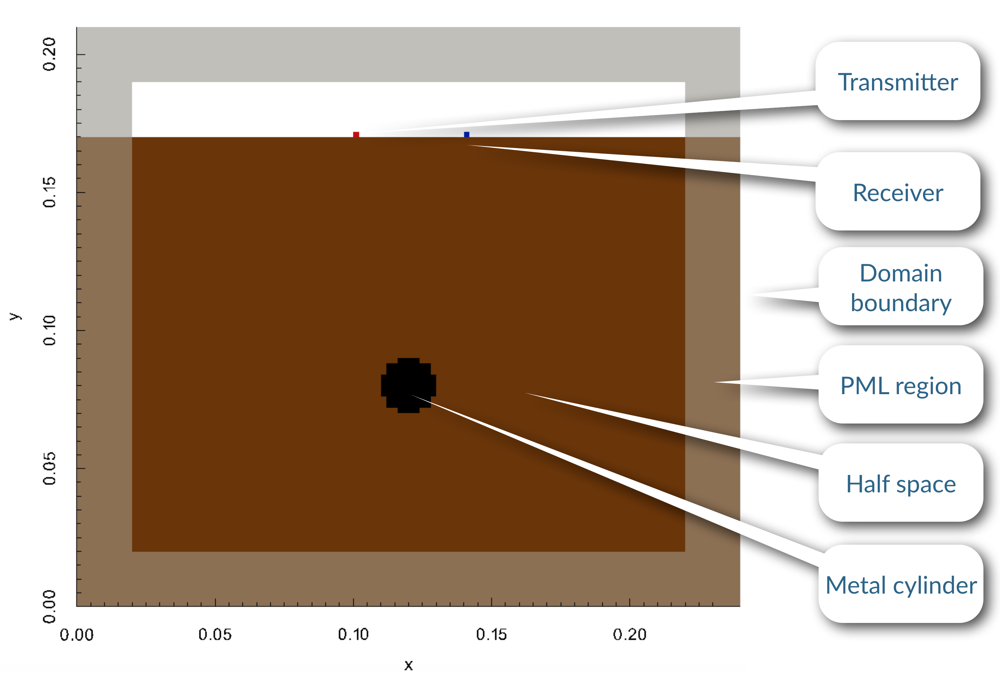
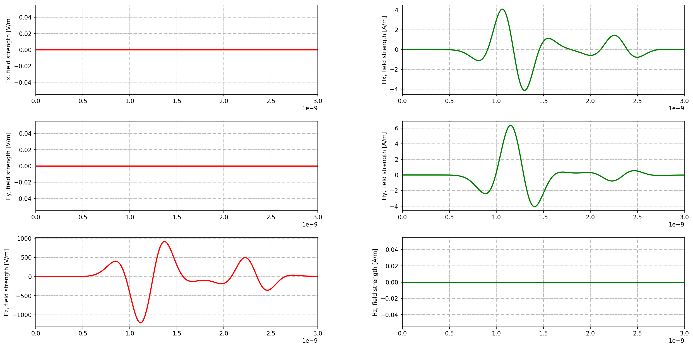
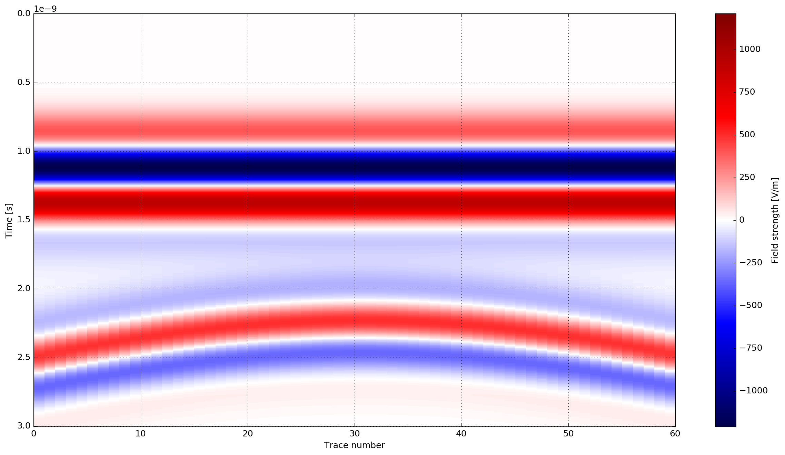

************************
Introductory (2D) models
************************

This section provides some introductory example models in 2D that demonstrate the basic features of gprMax. Each example comes with an input file which you can download and run.

If gprMax was installed from a binary wheel, all version-matched examples can
be copied into a writable workspace before following this section:

.. code-block:: console

    python -m gprMax.examples list
    python -m gprMax.examples copy ~/gprMax-v4-examples
    cd ~/gprMax-v4-examples

The copied workspace contains the same ``examples/`` paths used below. The
source installation already provides this directory directly.

.. _example-2D-Ascan:

A-scan from a metal cylinder
============================

:download:`cylinder_Ascan_2D.in <../../examples/gpr/basic/cylinder_Ascan_2D.in>`

This example is the GPR modelling equivalent of 'Hello World'! It demonstrates how to simulate a single trace (A-scan) from a metal cylinder buried in a dielectric half-space.

.. literalinclude:: ../../examples/gpr/basic/cylinder_Ascan_2D.in
    :language: none
    :linenos:

The geometry of the scenario is straightforward and an image created from the geometry view is shown in :numref:`cylinder_half_space_geo`. The transparent area around the boundary of the domain represents the :ref:`PML region <pml>`. The red cell is the source and the blue cell is the receiver.

.. _cylinder_half_space_geo:

    The geometry of a 2D model of a metal cylinder buried in a dielectric half-space.

For this initial example, a detailed description of what each command in the input file does and why each command was used is given. The following steps explain the process of building the input file:

Determine the constitutive parameters for the materials
-------------------------------------------------------

There will be three different materials in the model representing air, the dielectric half-space, and the metal cylinder. Air (free space) already exists as a built-in material in gprMax which can be accessed using the ``free_space`` identifier. The metal cylinder will be modelled as a Perfect Electric Conductor, which again exists as a built-in material in gprMax and can be accessed using the ``pec`` identifier. So the only material which has to be defined is for the dielectric half-space. It is a non-magnetic material, i.e. :math:`\mu_r=1` and :math:`\sigma_*=0` and with a relative permittivity of six, :math:`\epsilon_r=6`, and zero conductivity, :math:`\sigma=0`. The identifier ``half_space`` will be used.

.. code-block:: none

    #material: 6 0 1 0 half_space

Determine the source type and excitation frequency
--------------------------------------------------

These should generally be known, often based on the GPR system or scenario being modelled. Low frequencies are used where significant penetration depth is important, whereas high frequencies are used where less penetration and better resolution are required. In this case a theoretical Hertzian dipole source fed with a Ricker waveform with a centre frequency of :math:`f_c=1.5~\textrm{GHz}` will be used to simulate the GPR antenna (see the :ref:`bowtie antenna example model <example-bowtie>` for how to include a model of the actual GPR antenna in the simulation).

.. code-block:: none

    #waveform: ricker 1 1.5e9 my_ricker
    #hertzian_dipole: z 0.100 0.170 inf my_ricker

The Ricker waveform is created with the ``#waveform`` command, specifying an amplitude of one, centre frequency of 1.5 GHz, and picking an arbitrary identifier of ``my_ricker``. The Hertzian dipole source is created using the ``#hertzian_dipole`` command, specifying a z direction polarisation (perpendicular to the survey direction if a B-scan were being created), location on the surface of the slab, and using the Ricker waveform already created.

Calculate a spatial resolution and domain size
----------------------------------------------

In the :ref:`guidance` section it was stated that a good *rule-of-thumb* was that the spatial resolution should be one tenth of the smallest wavelength present in the model. To determine the smallest wavelength, the highest frequency and lowest velocity present in the model are required. The highest frequency is not the centre frequency of the Ricker waveform! :ref:`By examining the spectrum of a Ricker waveform <waveforms>` it is evident much higher frequencies are present, i.e. at a level -40dB from the centre frequency, frequencies 2-3 times as high are present. In this case the highest significant frequency present in the model is likely to be around 4 GHz. The wavelength at 4 GHz in the half-space (which has the lowest velocity) would be:

.. math:: \lambda = \frac{c}{f \sqrt{\epsilon_r}} = \frac{299792458}{4\times 10^9 \sqrt{6}} \approx 31~\textrm{mm}

This would give a minimum spatial resolution of 3 mm. However, the diameter of the cylinder is 20 mm so would be resolved to 7 cells. Therefore a better choice would be 2 mm which resolves the diameter of the rebar to 10 cells.

.. code-block:: none

    #dx_dy_dz: 0.002 0.002 0.002

The domain size should be enough to enclose the volume of interest, plus allow 10 cells (if using the default value) for the PML absorbing boundary conditions and approximately another 10 cells of between the PML and any objects of interest. In this case the plan is to take a B-scan of the scenario (in the next example) so the domain should be large enough to do that. This model is invariant in the z direction and uses the TMz field system because its electric source is z directed. The mode and invariant axis are declared explicitly:

.. code-block:: none

    #domain_mode: TM
    #domain: 0.240 0.210 inf

Here ``inf`` identifies the invariant axis; it does not create an infinitely
large grid. gprMax resolves it to the one-cell internal thickness required by
TM mode. TEz instead uses ``#domain_mode: TE`` with the same domain declaration
and is represented internally by two cells. A TEz model would require an
in-plane electric source or a z-directed magnetic source because its active
components are :math:`E_x`, :math:`E_y`, and :math:`H_z`.

Choose a time window
--------------------

It is desired to see the reflection from the cylinder, therefore the time window must be long enough to allow the electromagnetic waves to propagate from the source through the half-space to the cylinder and be reflected back to the receiver, i.e.

.. math:: t = \frac{0.180}{\frac{c}{\sqrt{6}}} \approx 1.5~\textrm{ns}

This is the minimum time required, but the source waveform has a width of 1.2 ns, to allow for the entire source waveform to be reflected back to the receiver an initial time window of 3 ns will be tested.

.. code-block:: none

    #time_window: 3e-9

The time step required for the model is automatically calculated using the :ref:`CFL condition in 2D <guidance>`.

Create the objects
------------------

Now physical objects can be created for the half-space and the cylinder. First, the ``#box`` command will be used to create the half-space and then the ``#cylinder`` command will be given which will overwrite the properties of the half-space with those of the cylinder at the location of the cylinder.

.. code-block:: none

    #box: 0 0 0 0.240 0.170 inf half_space
    #cylinder: 0.120 0.080 0 0.120 0.080 inf 0.010 pec

For an upper bound, ``inf`` spans the object to the far face of the invariant
axis. For a single source or receiver coordinate, it selects the active
interior reference layer. The source and receiver in this example therefore
use:

.. code-block:: none

    #hertzian_dipole: z 0.100 0.170 inf my_ricker
    #rx: 0.140 0.170 inf

Run the model
-------------

You can now run the model:

.. code-block:: none

    python -m gprMax examples/gpr/basic/cylinder_Ascan_2D.in

.. tip::
    * You can use the ``--geometry-only`` command line argument to build a model and produce any geometry views but not run the simulation. This option is useful for checking the geometry of the model is correct.

View the results
----------------

You should have produced an output file ``cylinder_Ascan_2D.h5``. You can view the results (see :ref:`output` section) using the command:

.. code-block:: none

    python -m gprMax.toolboxes.Plotting.plot_Ascan examples/gpr/basic/cylinder_Ascan_2D.h5

:numref:`cylinder_Ascan_results` shows the time history of the electric and magnetic field components and currents at the receiver location. The :math:`E_z` field component can be converted to a voltage that represents the A-scan (trace). The initial part of the signal (~0.5-1.5 ns) represents the direct wave from transmitter to receiver. Then comes the reflected wavelet (~1.8-2.6 ns), which has opposite polarity, from the metal cylinder.

.. _cylinder_Ascan_results:

    Electric and magnetic field component time histories from the receiver in the model of a metal cylinder buried in a dielectric half-space.

Check out a `video of the field propagation in this example <https://youtu.be/BpBo0-SFda4>`_. More videos can be found `on our YouTube channel <https://www.youtube.com/@Gprmax>`_.

B-scan from a metal cylinder
============================

:download:`cylinder_Bscan_2D.in <../../examples/gpr/basic/cylinder_Bscan_2D.in>`

This example uses the same geometry as the previous example but this time a B-scan is created. A B-scan is composed of multiple traces (A-scans) recorded as the source and receiver are moved over the target, in this case the metal cylinder.

.. literalinclude:: ../../examples/gpr/basic/cylinder_Bscan_2D.in
    :language: none
    :linenos:

The differences between this input file and the one from the A-scan are the x coordinates of the source and receiver, and the commands needed to move the source and receiver. As before, the source and receiver are offset by 40mm from each other but they are now shifted to a starting position for the scan. The ``#src_steps`` command is used to move every source in the model by specified steps each time the model is run. Similarly, the ``#rx_steps`` command is used to move every receiver each time the model is run. The invariant z coordinates remain ``inf`` throughout the scan. The same stepping functionality can be achieved by using our Python API to move the source and receiver individually (see the :ref:`Python API <input-api>` section).

To create the B-scan, specify the number of A-scans with ``-n``. This example
uses 60 traces at 2 mm spacing, giving 59 intervals and 118 mm between the
first and last positions. A scan including both ends of a 120 mm interval
would require 61 traces.

.. code-block:: none

    python -m gprMax examples/gpr/basic/cylinder_Bscan_2D.in -n 60

Results
-------

You should have produced 60 output files, one for each A-scan, with names ``cylinder_Bscan_2D1.h5``, ``cylinder_Bscan_2D2.h5`` etc... These can be combined into a single file using the command:

.. code-block:: none

    python -m gprMax.toolboxes.Utilities.outputfiles_merge examples/gpr/basic/cylinder_Bscan_2D

You should see a combined output file ``cylinder_Bscan_2D_merged.h5``. You can add the optional argument ``--remove-files`` if you want to automatically delete the original single A-scan output files.

You can now view an image of the B-scan using the command:

.. code-block:: none

    python -m gprMax.toolboxes.Plotting.plot_Bscan examples/gpr/basic/cylinder_Bscan_2D_merged.h5 Ez

:numref:`cylinder_Bscan_results` shows the B-scan (of the :math:`E_z` field component). Again, the initial part of the signal (~0.5-1.5 ns) represents the direct wave from transmitter to receiver. Then comes the reflected wave (~2-3 ns) from the metal cylinder which creates the hyperbolic shape.

.. _cylinder_Bscan_results:

    B-scan of the model of a metal cylinder buried in a dielectric half-space.

.. _bscan_csv_study:

B-scan using a CSV study
========================

This version produces the same 60 traces as the stepping example above.
It separates the fixed model from the acquisition schedule: the input file
defines the cylinder, soil, source and receiver, while the CSV gives their
positions for each trace. gprMax builds the geometry once and resets the
fields before each simulation.

Download both files and keep them together:

* :download:`Model: cylinder_Bscan_2D_study.in <../../examples/gpr/basic/cylinder_Bscan_2D_study.in>`
* :download:`Acquisition: cylinder_Bscan_2D_study.csv <../../examples/gpr/basic/cylinder_Bscan_2D_study.csv>`

Define the model
----------------

.. literalinclude:: ../../examples/gpr/basic/cylinder_Bscan_2D_study.in
    :language: none
    :linenos:

Edit the material, geometry, mesh, waveform and recording time in this file.
The last line selects the acquisition CSV. It replaces ``#src_steps`` and
``#rx_steps``; do not combine the two acquisition methods in one model.

Edit the acquisition
--------------------

The first three traces are:

.. literalinclude:: ../../examples/gpr/basic/cylinder_Bscan_2D_study.csv
    :language: text
    :lines: 1-7

Each trace has two rows with the same ``case_id``: one for the transmitter
and one for the receiver. The supplied CSV contains 60 cases (120 data rows).

.. list-table:: CSV columns
    :header-rows: 1
    :widths: 25 75

    * - Column
      - Meaning
    * - ``case_id``
      - Name of the simulation, such as ``trace_001``. Cases run in order of first appearance in the CSV.
    * - ``object_id``
      - Object to move. ``hertzian_dipole_1`` is the first Hertzian dipole; ``rx_1`` is the first receiver.
    * - ``x_m``, ``y_m``, ``z_m``
      - Absolute coordinates in metres, not increments. Supply all three together.

Here the transmitter moves from x = 0.040 to 0.158 m and the receiver from
x = 0.080 to 0.198 m. Both remain at y = 0.170 m, with 40 mm separation.
The step is one 2 mm mesh cell.

CSV positions must be finite. This model uses TM mode with z invariant,
whose active field plane is at z = 0; therefore every ``z_m`` entry is
``0.000``. The ``inf`` positions in the input file resolve to this same
plane. For a 3D model, enter the actual z coordinates.

To change the scan, edit the positions or add/remove complete cases. Keep
both object rows for each moving transmitter-receiver pair: a source omitted
from a case is inactive, and an omitted receiver stays at its original model
position. Positions should lie on the mesh and within the usable domain.
For irregular paths or changing antenna separation, update each object's
coordinates independently.

Run and display the B-scan
--------------------------

From the repository root:

.. code-block:: console

    mkdir -p study_results
    python -m gprMax examples/gpr/basic/cylinder_Bscan_2D_study.in -o study_results/cylinder_Bscan_2D_study

The study determines the number of runs from the CSV and enables geometry
reuse automatically; ``-n`` and ``--geometry-fixed`` are unnecessary.
This produces ``cylinder_Bscan_2D_study1.h5`` through
``cylinder_Bscan_2D_study60.h5`` in ``study_results``. Each file records its
case ID and resolved acquisition settings in ``/study``.

Merge the receiver traces and display their Ez component:

.. code-block:: console

    python -m gprMax.toolboxes.Utilities.outputfiles_merge study_results/cylinder_Bscan_2D_study
    python -m gprMax.toolboxes.Plotting.plot_Bscan study_results/cylinder_Bscan_2D_study_merged.h5 Ez

The expected B-scan is the same as :numref:`cylinder_Bscan_results` above.

The merged ``rxs/rx1/Ez`` array has time samples along rows and trace number
along columns. Per-trace source and receiver positions are retained under
``/trace_metadata``. Keep the individual files to retain their full study
case records. The plot uses trace number on its horizontal axis; use the
recorded positions when plotting an irregular acquisition against distance.

This workflow moves theoretical sources and receivers within fixed geometry.
A physical antenna moving through the scene requires a newly built geometry
at each position, as in :doc:`the antenna B-scan example <examples_antennas>`.
The study runs sequential cases on the selected solver; MPI task farming
is not currently supported for studies.
