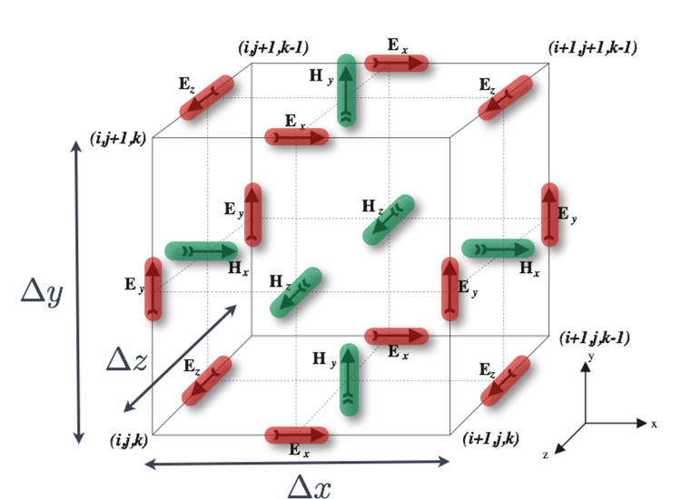
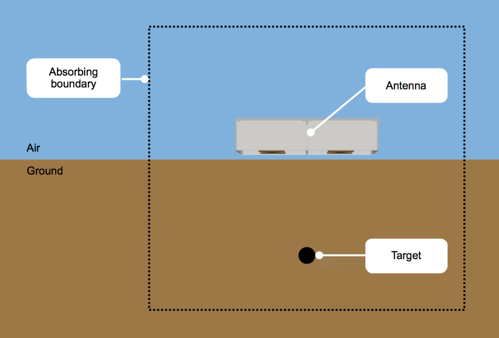

.. _guidance:

*************************
Guidance on GPR modelling
*************************

**In order to make the most of gprMax for modelling GPR you should be familiar with the Finite-Difference Time-Domain (FDTD) method method on which the software is based.**

This section discusses some basic concepts of the FDTD method and GPR modelling. There is a large amount of further information available in the relevant literature. Good starting points are [KUN1993]_ and [TAF2005]_, and the specific application of FDTD to the GPR forward problem is described in [GIA1997]_.

Basic concepts
==============

All electromagnetic phenomena, on a macroscopic scale, are described by the well-known Maxwell's equations. These are first order partial differential equations which express the relations between the fundamental electromagnetic field quantities and their dependence on their sources.

.. math::

    \boldsymbol{\nabla}\boldsymbol{\times}\mathbf{E} &=- \frac{\partial \mathbf{B}}{\partial t} \\
    \boldsymbol{\nabla}\boldsymbol{\times}\mathbf{H} &= \frac{\partial \mathbf{D}}{\partial t}+\mathbf{J_c}+\mathbf{J_s} \\
    \boldsymbol{\nabla}\boldsymbol{\cdot}\mathbf{B} &= 0 \\
    \boldsymbol{\nabla}\boldsymbol{\cdot}\mathbf{D} &= q_v

where :math:`t` is time (seconds) and :math:`q_v` is the volume electric charge density (coulombs/cubic metre). In Maxwell's equations, the field vectors are assumed to be single-valued, bounded, continuous functions of position and time. In order to simulate the GPR response from a particular target or set of targets the above equations have to be solved subject to the geometry of the problem and the initial conditions.

The nature of the GPR forward problem classifies it as an *initial value -- open boundary* problem. This means that in order to obtain a solution you have to define an initial condition (i.e. excitation of the GPR transmitting antenna) and allow for the resulting fields to propagate through space reaching a zero value at infinity since, there is no specific boundary which limits the geometry of the problem and where the electromagnetic fields can take a predetermined value. Although the first part is easy to accommodate (i.e. specification of the source), the second part cannot be easily tackled using a finite computational space.

The FDTD approach to the numerical solution of Maxwell's equations is to discretize both the space and time continua. Thus the discretization spatial :math:`\Delta x`, :math:`\Delta y` and :math:`\Delta z` and
temporal :math:`\Delta t` steps play a very significant role -- since the smaller they are the closer the FDTD model is to a real representation of the problem. However, the values of the discretization steps always have to be finite, since computers have a limited amount of storage and finite processing speed. Hence, the FDTD model represents a discretized version of the real problem and is of limited size. The building block of this discretized FDTD grid is the Yee cell [YEE1966]_ named after Kane Yee who pioneered the FDTD method. This is illustrated for the 3D case in :numref:`yeecell3D`.

.. _yeecell3D:

    Single FDTD Yee cell showing electric (red) and magnetic (green) field components.

By assigning appropriate constitutive parameters to the locations of the electromagnetic field components complex shaped targets can be included easily in the models. However, objects with curved boundaries are represented using a staircase approximation.

gprMax is fundamentally based on solving Maxwell's equations in 3D using the FDTD method - transverse electromagnetic (TEM) mode. However, it can also be used to carry out simulations in 2D using the transverse magnetic (TM) mode. This is achieved through specifying a single cell slice of the domain, i.e. one dimension of the domain must be equal to the spatial discretization in that direction. When this occurs the electric and magnetic field components on the two faces of single cell slice in the invariant direction are set to zero. This is illustrated for the 2D TMz case in :numref:`yeecell2DTMz`.

.. _yeecell2DTMz:

.. figure:: images/yeecell2dTMz.png
    :width: 500px

    Single FDTD Yee cell showing electric (red), magnetic (green), and zeroed out (grey) field components for 2D transverse magnetic (TM) z-direction mode.

Using this approach means that Maxwell's equations in 3D, shown in :eq:`maxwell3D` as six coupled partial differential equations, reduce to the corresponding 2D form - in this case 2D TMz, shown in :eq:`maxwell2DTMz`.

.. math::
    :label: maxwell3D

    &\frac{\partial E_x}{\partial t} = \frac{1}{\epsilon} \left( \frac{\partial H_z}{\partial y} - \frac{\partial H_y}{\partial z} - J_{Sx} - \sigma E_x \right) \\
    &\frac{\partial E_y}{\partial t} = \frac{1}{\epsilon} \left( \frac{\partial H_x}{\partial z} - \frac{\partial H_z}{\partial x} - J_{Sy} - \sigma E_y \right) \\
    &\frac{\partial E_z}{\partial t} = \frac{1}{\epsilon} \left( \frac{\partial H_y}{\partial x} - \frac{\partial H_x}{\partial y} - J_{Sz} - \sigma E_z \right) \\
    &\frac{\partial H_x}{\partial t} = \frac{1}{\mu} \left( \frac{\partial E_y}{\partial z} - \frac{\partial E_z}{\partial y} - M_{Sx} - \sigma^* H_x \right) \\
    &\frac{\partial H_y}{\partial t} = \frac{1}{\mu} \left( \frac{\partial E_z}{\partial x} - \frac{\partial E_x}{\partial z} - M_{Sy} - \sigma^* H_y \right) \\
    &\frac{\partial H_z}{\partial t} = \frac{1}{\mu} \left( \frac{\partial E_x}{\partial y} - \frac{\partial E_y}{\partial x} - M_{Sz} - \sigma^* H_z \right)

.. math::
    :label: maxwell2DTMz

    &\frac{\partial E_z}{\partial t} = \frac{1}{\epsilon} \left( \frac{\partial H_y}{\partial x} - \frac{\partial H_x}{\partial y} - J_{Sz} - \sigma E_z \right) \\
    &\frac{\partial H_x}{\partial t} = \frac{1}{\mu} \left( - \frac{\partial E_z}{\partial y} - M_{Sx} - \sigma^* H_x \right) \\
    &\frac{\partial H_y}{\partial t} = \frac{1}{\mu} \left( \frac{\partial E_z}{\partial x} - M_{Sy} - \sigma^* H_y \right)

These equations are discretized in both space and time and applied in each FDTD cell. The numerical solution is obtained directly in the time domain in an iterative fashion. In each iteration the electromagnetic fields advance (propagate) in the FDTD grid and each iteration corresponds to an elapsed simulated time of one :math:`\Delta t`. Hence by specifying the number of iterations you can instruct the FDTD solver to simulate the fields for a given time window.

The price you have to pay for obtaining a solution directly in the time domain using the FDTD method is that the values of :math:`\Delta x`, :math:`\Delta y`, :math:`\Delta z` and :math:`\Delta t` can not be assigned independently. FDTD is a conditionally stable numerical process. The stability condition is known as the CFL condition after the initials of Courant, Freidrichs and Lewy and is given by,

.. math:: \Delta t \leq \frac{1}{c\sqrt{\frac{1}{(\Delta x)^2}+\frac{1}{(\Delta y)^2}+\frac{1}{(\Delta z)^2}}},

where :math:`c` is the speed of light. Hence :math:`\Delta t` is bounded by the values of :math:`\Delta x`, :math:`\Delta y` and :math:`\Delta z`. The stability condition for the 2D case is easily obtained by letting :math:`\Delta z \longrightarrow \infty`.

Coordinate system and conventions
=================================

A right-handed Cartesian coordinate system is used with the origin of space coordinates in the *lower left corner* at (0,0,0). :numref:`coord3d` illustrates the coordinate system of gprMax. Only one row of cells in the x direction is depicted. The space coordinates range from the left edge of the first cell to the right edge of the last one. Assuming that :math:`\Delta x = 1` metre, if you wanted to allocate a rectangle with its x dimension equal to 3 metres and its lower x coordinate at 1 then the x range would be [1..4]. The 3D cells allocated by gprMax would be [1..3]. In the 3D FDTD cell there are no field components located at the centre of the cell. Electric field components are tangential to, and magnetic field components normal to the interfaces between cells. The field components depicted in :numref:`coord3d` correspond to space coordinate 1. Source and output points defined in space coordinates are directly converted to cell coordinates and the corresponding field components.

.. _coord3d:

.. figure:: images/coord3d.png
    :width: 500px

    gprMax coordinate system and conventions.

The actual positions of field components for a given set of space coordinates (x, y, z) are:

.. math::

    &E_x~(x+\frac{\Delta x}{2}, y, z) \\
    &E_y~(x, y+\frac{\Delta y}{2}, z) \\
    &E_z~(x, y, z+\frac{\Delta z}{2}) \\
    &H_x~(x, y+\frac{\Delta y}{2}, z+\frac{\Delta z}{2}) \\
    &H_y~(x+\frac{\Delta x}{2}, y, z+\frac{\Delta z}{2}) \\
    &H_z~(x+\frac{\Delta x}{2}, y+\frac{\Delta y}{2}, z)

Hertzian dipole sources as well as other electric field excitations (i.e. voltage sources, transmission lines) are located at the corresponding electric field components.

Spatial discretization
======================

There is no specific guideline for choosing the right spatial discretization for a given problem. In general, it depends on the required accuracy, the frequency content of the source pulse and the size of the targets. Obviously, all targets present in a model must be adequately resolved. This means, for example, that a cylinder with radius equal to one or two spatial steps does not really look like a cylinder!

An other important factor which influences the spatial discretization is the errors associated with numerically induced dispersion. This means that contrary to the real world where electromagnetic waves propagate with the same velocity irrespectively of their direction and frequency (assuming no dispersive media and far-field conditions) in the discrete one this is not the case. This error (details can be found in [GIA1997]_ and [KUN1993]_) can be kept in a minimum if the following *rule-of-thumb* is satisfied:

**The discretization step should be at least ten times smaller than the smallest wavelength of the propagating electromagnetic fields.**

.. math:: \Delta l = \frac{\lambda}{10}

Note that in general low-loss media wavelengths are much smaller compared to free space.

.. _pml:

Absorbing boundary conditions
=============================

One of the most challenging issues in modelling *open boundary* problems, such as GPR, is the truncation of the computational domain at a finite distance from sources and targets where the values of the electromagnetic fields can not be calculated directly by the numerical method applied inside the model. Hence, an approximate condition known as *absorbing boundary condition (ABC)* is applied at a sufficient distance from the source to truncate and therefore limit the computational space. The role of this ABC is to absorb any waves impinging on it, hence simulating an unbounded space. The computational space (i.e the model) limited by the ABCs should contain all important features of the model such as sources and output points and targets. :numref:`abcs` illustrates this basic difference between the problem to be modelled and the actual FDTD modelled space.

.. _abcs:

    GPR forward problem showing computational domain bounded by Absorbing Boundary Conditions (ABCs)

It is assumed that the half-space which contains the target(s) is of infinite extent. Therefore, the only reflected waves will be the ones originating from the target. In cases where the host medium is not of infinite extent (e.g. a finite concrete slab) the assumption of infinite extent can be made as far as the actual reflections from the slab termination are not of interest or its actual size is large enough that any reflected waves which will originate at its termination will not affect the solution for the required time window. In general, any objects that span the size of the computational domain (i.e. model) are assumed to extend to infinity. The only reflections which will originate from their termination at the truncation boundaries of the model are due to imperfections of the ABCs and in general are of a very small amplitude compared with the reflections from target(s) inside the model.

The ABCs employed in gprMax will, in general, perform well (i.e. without introducing significant artificial reflections) if all sources and targets are kept at least 15 cells away from them. gprMax uses Perfectly Matched Layer (PML) ABCs based on a recursive integration approach to the complex frequency shifted (CFS) PML [GIA2012]_. A general formulation of this RIPML, which can be used to develop any order of PML, has been used to implement first and second order CFS stretching functions. One of the attractions of the RIPML is that it is easily applied as a correction to the field quantities after the complete FDTD grid has been updated using the standard FDTD update equations.

The cells of the RIPML, which have a user adjustable thickness, very efficiently absorb most waves that propagate in them. Although, source and output points can be specified inside these cells **it is wrong to do so** from the point of view of correct modelling. The fields inside these cells are not of interest to GPR modelling. Placing sources inside these cells could have effects that have not been studied and will certainly provide erroneous results from the perspective of GPR modelling. The requirement to keep sources and targets at least 15 cells away for the PML has to be taken into account when deciding the size of the model domain. Additionally, free space (i.e. air) should be always included above a source for at least 15-20 cells in GPR models. Obviously, the more cells there are between observation points, sources, targets and the absorbing boundaries, the better the results will be.

gprMax now offers the ability (for advanced users) to customise the parameters of the PML which allows its performance to be better optimised for specific applications. For further details see the :ref:`PML commands section <pml-commands>`.

All other *boundary conditions* which apply at interfaces between different media in the FDTD model are automatically enforced in gprMax.
