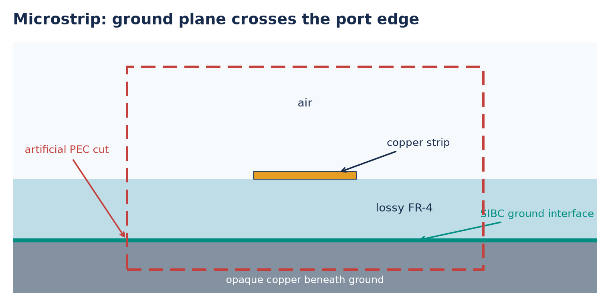
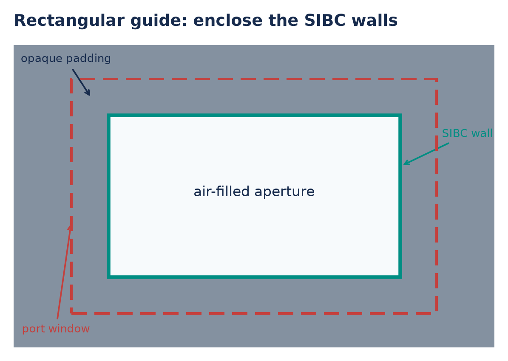
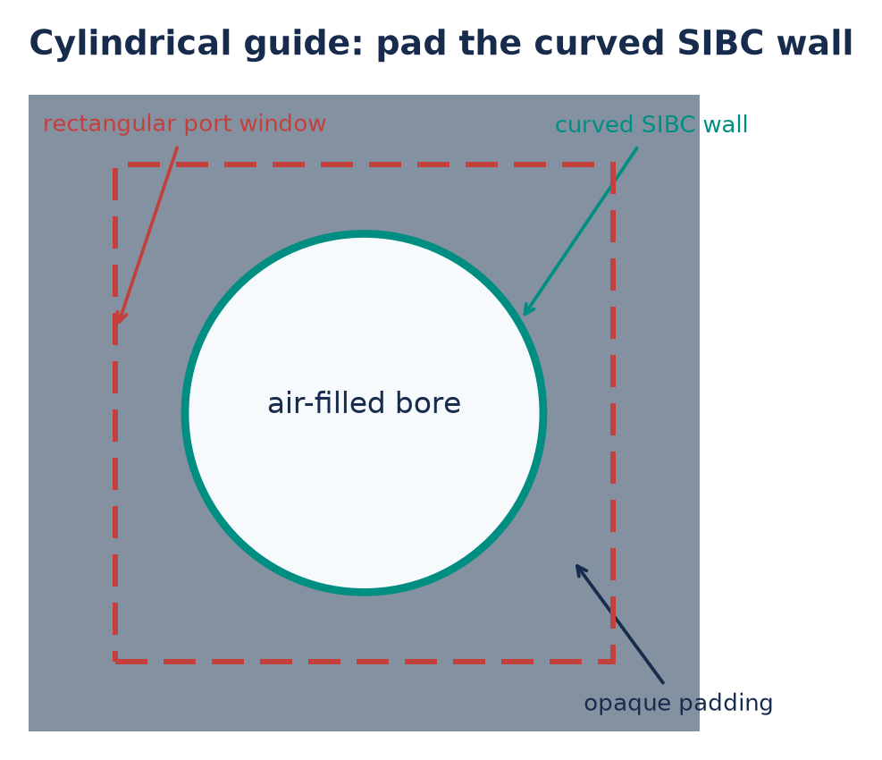

.. _impedance-surfaces:

********************************************
Surface impedance and impedance volumes
********************************************

A surface-impedance boundary condition (SIBC) models losses in a thick
conductor without meshing its skin depth. ``SurfaceImpedance`` defines the
boundary response and its identifier; it does not create geometry. Assign
that ID to a supported volume primitive, such as a box or sphere, to create
an **impedance volume**. gprMax excludes fields inside the volume and applies
the specified response at its voxel boundary. It does not assign the fitted
bulk conductivity to interior cells and solve the fields inside the metal.

This is a **closed, electrically opaque volume**, not a transmissive sheet.
Choose it for thick conductors with a local scalar surface response. A
one-cell-thick volume still blocks transmission; it does not become a thin
film model. The presets describe smooth, non-magnetic bulk metal at 293 K,
not roughness, plating, temperature dependence, or optical materials.

This guide starts with setup and result checks. The equations and validation
evidence are in :doc:`impedance_surfaces_theory`.

The `published HTML guide <https://docs.gprmax.com/en/latest/impedance_surfaces.html>`_
renders the shared parameter table that GitHub's source preview cannot expand.

.. contents:: On this page
   :local:
   :depth: 1

First copper model
==================

The existing rectangular-waveguide example compares identical PEC and copper
guides. It is a useful first check for someone accustomed to assigning a
finite-conductivity wall in a frequency-domain simulator.

The following defines the surface model and geometry for that workflow.
It assumes ``scene`` already contains a domain and mesh, and ``lower``/``upper`` are the
corners of a finite-thickness wall; the runnable script below supplies them.
Lengths are in metres, frequencies in Hz, and conductivity in S/m.

.. code-block:: python

   scene.add(gprMax.SurfaceImpedance(
       id="copper_wall", preset="copper",
       fit_frequency_range=(80e9, 200e9),
       fit_order="auto", fit_tolerance=2e-3, plot_fit=True,
   ))
   scene.add(gprMax.Box(
       p1=lower, p2=upper, material_id="copper_wall", averaging="n",
   ))

The model measures 130--150 GHz. The wider 80--200 GHz fit covers its pulse
and modal anchors; a fit band is the range over which the boundary model is
accurate, not the list of output frequencies. gprMax also checks the
discrete-time response at the modal anchor frequencies. If that check reports an
out-of-band frequency, follow :ref:`impedance-fit-band-help` rather than
ignoring the warning or forcing a lower fit order.

With gprMax installed in the active Python environment, run from the
repository root:

.. code-block:: console

   python examples/features/impedance_surface/rectangular_waveguide_comparison/run_comparison.py --geometry-only
   python examples/features/impedance_surface/rectangular_waveguide_comparison/run_comparison.py
   python examples/features/impedance_surface/rectangular_waveguide_comparison/plot_results.py

The first command builds the voxel geometry and solves the transverse modal
fields without advancing time. Inspect the copper fit PNG and both
``*_eigenmode_fields.png`` files beside the script. Check the intended TE10
pattern and confinement before running the second command.

The full comparison writes ``pec_rectangular_waveguide.h5`` and
``copper_rectangular_waveguide.h5``. The plotter writes
``rectangular_waveguide_eigenmode_comparison.png`` and prints the 140 GHz
effective indices, copper attenuation, and wall-to-centre electric-field
ratios. Expect a small tangential electric field at the copper wall and zero
at the PEC wall. Copper's passive forward effective index has negative
imaginary part, corresponding to positive attenuation.

FDTD launches a pulse and records its evolution. This example deliberately
stops its walls before PML and uses a short record before wall-end reflections
return. It demonstrates the local wall law, not a matched termination. For a
longer transmission experiment, use the uniform PML or virtual-guide setup
in :ref:`sibc-pml`. Independently scaled modal pictures show shape; use the
receiver ratios and complex effective index for quantitative comparisons.

Choosing a surface model
========================

.. include:: _includes/surface_impedance_parameters.rstinc

Metal presets and bulk conductivity
-----------------------------------

Available presets are ``aluminium``, ``copper``, ``gold``, ``molybdenum``,
``palladium``, ``silver``, ``tungsten``, and ``zinc``. Case-insensitive element
symbols and ``aluminum`` are also accepted. Use a supplied conductivity when
you have a suitable bulk value instead of a named preset:

.. code-block:: python

   scene.add(gprMax.SurfaceImpedance(
       id="custom_wall", conductivity=3.2e7,
       fit_frequency_range=(8e9, 12e9), fit_order="auto",
   ))

Both routes fit the same passive good-conductor model. Fitted bands cannot
exceed 300 GHz and must satisfy the good-conductor applicability check. The
model assumes the real conductor is several skin depths thick. These checks
and the fit construction are derived in :ref:`impedance-metal-theory`.

The selected pole count is available as ``fit_pole_count`` and
``fit_result.selected_pole_count``. More poles cost memory and update time;
the automatic setting avoids an unnecessarily high order for a narrow band.
For example, automatic fitting selects two poles over 8--12 GHz at the
default tolerance.
State-space coefficients are internal and cannot be supplied to the public
constructor. They are saved for reproducibility in :ref:`impedance-output`.

Ideal resistance and exact PMC
------------------------------

Use a constant resistance for an idealised boundary experiment:

.. code-block:: python

   scene.add(gprMax.SurfaceImpedance(id="resistive_wall", resistance=50.0))
   scene.add(gprMax.SurfaceImpedance(id="pmc_wall", resistance=float("inf")))

Assign either ID to the same kind of opaque volume geometry as copper. A
frequency-independent real resistance is not the dispersive surface response
of a physical metal; gprMax reports that limitation when it is built.

Positive infinite resistance gives exactly zero surface admittance and is
the PMC boundary at the main-voxel face. It does not approximate infinity
with a large finite number. Built-in ``pmc`` volume geometry uses legacy H
constraints that can move a flat wall's effective reflection plane by half
a cell. Its use, including PMC-equivalent materials, warns once per affected
grid. Unused declarations, internal TE constraints, and PMC symmetry planes
do not trigger that geometry warning. See :ref:`impedance-pmc-theory` for
the exact update and reflection-plane validation.

Equivalent hash commands
------------------------

The same surface models and geometry can be specified with hash commands:

.. code-block:: text

   #surface_impedance: copper_wall preset copper 80e9 200e9 auto 2e-3 y
   #surface_impedance: custom_wall conductivity 3.2e7 8e9 12e9
   #surface_impedance: resistive_wall resistance 50
   #surface_impedance: pmc_wall resistance inf
   #box: 0.10 0.07 0.05 0.20 0.13 0.10 copper_wall n

These are definitions and a geometry fragment, not a complete input file.
For fitted surfaces, the optional final ``y`` enables fit plots during full
runs as well as geometry-only runs. The default, ``n``, writes fit plots
only during geometry-only runs. See :ref:`input-hash-cmds` for the full
command syntax and :ref:`input-api` for the Python constructor reference.

Building geometry
=================

Geometry follows declaration order: later objects overwrite earlier ones.
Several primitives with the same surface-impedance ID can form a body;
a later air or dielectric object can cut a cavity. Tags are optional
metadata, not a way to assign impedance.
The final voxel geometry determines which faces receive the boundary law.
Refine curved or oblique walls until both their staircase representation and
the result of interest converge; avoiding skin-depth cells does not remove
the need to resolve the surrounding fields and geometry.

Supported geometry
------------------

Surface-impedance IDs can be assigned directly to boxes, spheres,
ellipsoids, cylinders and cones (axis-aligned or oblique), finite-thickness
cylindrical sectors, and finite-thickness triangular prisms. Their final
voxel boundaries must satisfy the connectivity checks described below.
A ``FractalBox`` can also use a
surface-impedance ID as its ``mixing_model_id``, but it must set
``n_materials=1`` because one opaque volume cannot contain a graded set of
surface models, and it must be used with a roughness, grass, or water
modifier. For an unmodified single-material volume, use ``Box`` instead.

Assign one scalar surface-impedance model, not a different model for each
direction. In the Python API, use ``material_id`` rather
than directional ``material_ids``. Hash-command geometry must likewise use
the surface-impedance ID as its sole material identifier. Surface-impedance
geometry is not dielectric-smoothed.

Plates, electric or magnetic edges, zero-thickness triangles and cylindrical
sectors, and boxes that collapse to zero cells on any axis are rejected.
Those sheet and line objects have retained fields on both sides and require a
two-sided sheet transition condition rather than the implemented one-sided
opaque-volume boundary.

Impedance geometry cannot currently be exported and reimported using
``GeometryObjectsWrite`` and ``GeometryObjectsRead``. Recreate the
``SurfaceImpedance`` definition and native geometry in the destination scene.

The volume must occupy at least one cell along every non-empty axis and there
must be at least one retained cell between the complete impedance region and
each non-symmetry domain boundary. The region may extend to a declared PEC or
PMC symmetry plane, or continue uniformly through a longitudinal PML to its
outer boundary, subject to the requirements in :ref:`sibc-pml`.

Voxel-boundary topology
-----------------------

The final voxel geometry, after all drawing and cutout operations, must have
an unambiguous boundary. Cells belonging to one body must meet through full
faces, not only through an edge or corner. Both the opaque body and the
surrounding retained field region must remain locally connected. Separate
bodies are allowed; a contact between different surface-impedance IDs is
still checked as part of the same excluded geometry, with no surface response on an
internal metal-to-metal face.

When an error identifies a bad edge or vertex, inspect that part of the
voxel model. Thicken a narrow connection, separate touching bodies, refine
the mesh, or shift a curved surface relative to the grid. Two individually
valid primitives can produce an invalid union or cutout. The exact local
quadrant tests are in :ref:`impedance-geometry-theory`.

Contacts and symmetry
---------------------

Isotropic PEC, PMC, and impedance volumes may touch. PEC forces a shared
tangential electric component to zero regardless of adjacent-object drawing
order. A diagonal PEC/SIBC contact with separating retained cells produces
a warning; face-sharing contacts do not. Use isotropic materials: directional PEC/PMC
mixtures at an impedance boundary are rejected.

Legacy PMC contacts keep their existing reflection-plane limitation. They
do not turn an adjacent impedance surface into an exact PMC. For a wall at
the voxel face, use infinite surface resistance as described above.

PEC and PMC ``SymmetryBoundary`` planes are supported on all six domain
faces, including intersecting planes. The geometry must also be valid after
reflection across the symmetry plane. No artificial end cap is introduced
where the excluded volume meets it. See :ref:`impedance-geometry-theory`
for the component constraints and retained-area treatment.

Run the contact example to inspect its geometry and contact-field traces:

.. code-block:: console

   python examples/features/impedance_surface/pec_pmc_contacts.py --output-dir results/contacts
   python examples/features/impedance_surface/pec_pmc_contacts.py --symmetry pmc --output-dir results/symmetry

Use ``--symmetry pec`` for the corresponding PEC plane.

Two-dimensional models
----------------------

Use ``DomainMode(mode="TE")`` or ``DomainMode(mode="TM")`` and
``float("inf")`` for the domain's invariant extent. Extrude the impedance
geometry through that entire dimension. gprMax supports all three choices
of invariant axis; the geometry cannot vary across its synthetic storage
layers. Those layers do not represent a physical thickness. Modal power in
2D is reported per metre along the invariant direction.

Running reliably
================

.. _impedance-automatic-timestep:

Automatic time-step margin
--------------------------

FDTD advances fields in small time steps. The mesh imposes a maximum
Courant--Friedrichs--Lewy (CFL) time step; the usual stability-factor command
scales that limit. Declaring any ``SurfaceImpedance`` caps the factor at
**0.99**, preserving a smaller user setting. It does not multiply a factor
of 0.8 by 0.99: the result remains 0.8.

The cap applies before time windows and sources are built, even for an
unused surface declaration. If it reduces the requested factor, the build
log explains the change and reports the effective time step. Geometry reuse
does not apply the cap twice, and the original Scene objects are unchanged.
Models without a surface declaration keep their ordinary time-step behaviour.

To request more margin, use the existing command:

.. code-block:: python

   scene.add(gprMax.TimeStepStabilityFactor(f=0.9))

The equivalent hash command is ``#time_step_stability_factor: 0.9``. A time window
in seconds keeps its duration and adjusts the iteration count. A window
specified as an iteration count instead becomes shorter in physical time.
Use the same explicit factor in comparative PEC runs if samples must share
the same physical times.

The cap addresses sensitivity near the CFL endpoint; it is not a general
stability guarantee. In particular, it does not repair the invalid custom
PML profiles discussed below. See :ref:`impedance-stability-theory` for the
clipped-circulation analysis and long-run evidence.

Mesh, bandwidth, and recording time
-----------------------------------

Check convergence separately in mesh spacing, fit accuracy, modal anchors,
and recording duration. The pulse must fit within the time window and the
response must have time to decay. A longer record can reveal a late return
from a reflecting termination that a short record hides. Extra output
frequency bins alone do not improve any of these approximations.

Supported solver configurations
-------------------------------

The implementation supports three-dimensional and two-dimensional main-grid
CPU models. All TE and TM invariant-axis orientations are supported.
The following combinations are deliberately rejected:

* CUDA, OpenCL, and Metal field solvers;
* MPI domain decomposition and subgrids;
* thin wires in the same grid;
* an impedance boundary which changes along a PML absorption direction;
* a lumped electric source, rational-network terminal, or transmission-line edge
  which overlaps a boundary electric edge;
* a directional PEC/PMC material mixture immediately outside the boundary.

An axial discrete plane wave is unsupported because it samples the completed
geometry to construct its layered auxiliary line. A homogeneous vector/angle
discrete plane wave is supported only when the complete impedance boundary is
strictly inside its total-field/scattered-field box.

A direct :class:`gprMax.EigenmodePort` in 3D or 2D may cross an
impedance guide. The guide boundary must be invariant along the propagation
direction through both cells adjacent to the modal plane. Every port window
has a PEC transverse boundary, whether or not a ``VirtualWaveguide`` is
attached. Tangential electric fields on the rim are zero. This constraint
replaces complete SIBC rows on the rim as well as rows whose magnetic stencil
would extend outside the window, so the modal solve and auxiliary guide use
the same boundary condition. The build reports when this replaces surface
rows. To retain a wall's surface impedance and loss, extend the window at
least one opaque voxel beyond it. The interior rows keep their magnetic
circulation, bulk mass, surface admittance, and histories; missing samples in
these rows are still rejected. A guide end cap normal to the propagation
axis cannot cross the retained solve region.

The window may cut across a ground plane or another uniformly extruded
impedance volume. This is an artificial PEC truncation, not an open boundary
or a continuation of the metal beyond the window. Enlarge the window to
check convergence of the mode and S-parameters, especially where appreciable
fields reach its edges. Opaque padding remains useful when the whole guide
fits within the window.

Choosing an SIBC eigenmode port window
--------------------------------------

The drawings below show cross-sections looking along the propagation axis.
Place the port plane perpendicular to the guide, on a section where both the
retained medium and SIBC wall continue unchanged on either side. The dashed
rectangle is the modal window; it is not a change to the physical geometry.
The examples use propagation along ``z``, but the same rule applies to other
port normals.

   **Microstrip.** Include the strip, substrate, and significant fringing
   field. The window can cut the extended SIBC ground plane at its side edges.
   Those cropped surface rows meet the artificial PEC port boundary; the
   ground interface and lossy FR-4 within the aperture remain physical. The
   opaque copper below the ground keeps the ground interface inside the
   window, preserving its SIBC loss.

   **Rectangular waveguide.** Put the entire air aperture and all four SIBC
   walls inside the window. Extend the window at least one opaque voxel past
   every wall to retain its surface impedance in the modal solve and, when
   attached, the auxiliary PML. If a wall lies exactly on the rim, it becomes
   PEC in the modal solve and virtual guide, removing that wall's impedance
   and loss from the modeled continuation.

   **Cylindrical waveguide.** Enclose the circular bore and its SIBC wall in
   the rectangular modal window, with opaque voxels outside the wall to keep
   it inside the PEC rim. The circle is schematic: the solver sees a voxelized
   wall. Refine the transverse grid and check the mode and S-parameters for
   convergence, especially near the curved boundary.

.. _sibc-pml:

Waveguides and absorbers
========================

A port launches and measures a wave; it does not absorb a returning wave.
Either extend the physical guide into domain PML or attach a
:ref:`virtual-waveguide` to its port. The eigenmode guide explains the
setup, port directions, and active/passive choices. The additional SIBC
requirements are collected here:

* Keep the wall and the surrounding host medium uniformly extruded along every intersecting
  PML absorption direction, including neighbouring stencil cells. Wall faces
  must be tangent to that direction; end caps, steps, and changes of surface
  model inside the absorber are rejected.
* At the intersecting edges, retained bulk materials may be heterogeneous,
  lossy, and electrically dispersive (Debye, Lorentz, Drude, or inclusive
  mixtures). Each must be isotropic, with positive finite high-frequency
  permittivity and permeability and finite nonnegative conductivities.
  Air/substrate junctions are supported. Each constituent must continue
  unchanged through the absorber and its neighbouring stencil cells.
  The surface itself may also be dispersive.
* Both HORIPML and MRIPML support one or two CFS terms for this coupling.
  For an internal ``PMLSlab``, extend its transverse bounds into the opaque
  volume to cover the wall's electric and magnetic samples. Ending a bound
  exactly on the wall can omit required samples and is rejected.
* A virtual-guide modal window may intersect SIBC walls at its artificial PEC
  rim. The modal solve and auxiliary guide both clamp tangential electric
  fields there, including on complete physical SIBC walls at the rim. Use
  opaque padding beyond a wall to retain its surface impedance. In 2D these
  constraints apply only along the physical transverse axis, not the
  synthetic invariant dimension.
  CPU virtual guides support the same lossy/dispersive retained hosts as
  domain PML, including independent bulk and surface histories at the
  aperture and throughout the auxiliary absorber.
* Keep the existing source clearance and fit-band requirements. SIBC
  coupling is available on CPU main grids in 3D and all TE/TM orientations,
  in either propagation direction; it does not support subgrids, MPI, or
  accelerator solvers.

Boundary PMLs may carry the uniformly extruded volume to the outer domain
boundary without a retained-cell gap there. The virtual guide copies the
aperture and its surface model into a separate auxiliary grid; you do not
draw that continuation in the main geometry.

Try the executable reduced-mode examples:

.. code-block:: console

   python examples/features/impedance_surface/virtual_waveguide_2d.py --mode TM --wall pmc
   python examples/features/impedance_surface/virtual_waveguide_2d.py --mode TE --wall foster

The source and auxiliary surface histories receive the coupled boundary
correction, including for exact PMC. The update equations and comparisons
with physical continuations are in :ref:`impedance-pml-theory`.

A copper microstrip with air above a lossy or dispersive substrate may
continue into longitudinal domain PML with the same cross-section. The
strip and ground must occupy finite-thickness voxels and extend through the
absorber; keep their transverse end faces clear of transverse PML. For
dispersive substrates, ``DispersiveAveraging(enabled=True)`` makes the bulk
interface sampling consistent with the surface solver's retained-area
integration. A pulse comparison with a causally longer line is available as::

    python -m testing.validation.impedance_surface.validate_microstrip_pml --host all

Custom PML errors
-----------------

The demonstrated unstable second-order HORIPML product profiles are rejected
during coefficient construction. The error identifies the profile and the
offending electric or magnetic sample. **Reducing the time step does not
cure this profile instability.** Use one CFS factor, or apply the specific
second-alpha repair described in :ref:`pml-higher-order-stability` for the
investigated unit-kappa, unshifted-first-factor configuration. The repair
matches the second alpha grading to ``1.1 * sigma1``; it is not a universal
recipe for arbitrary profiles.

Keep explicit zero conductivity distinct from automatic conductivity:
``None`` requests automatic selection. Passing the profile guard does not
certify stability for every material and geometry combination.

Results and troubleshooting
===========================

Use the fit plot to check the surface model over its fit band, modal plots to
check the field pattern, and modal coefficients or receiver traces to check
the simulated response. These answer different questions. The HDF5 surface
metadata records the chosen model and discrete-time coefficients; see
:ref:`impedance-output`. For modal S-parameters, also apply the validity
masks explained in :ref:`eigenmode-results`.

``non-passive on the discrete band``
    The trapezoidal unit-circle response has negative real impedance. This is
    an internal fit failure for the public passive models and should be
    reported with the input and fit band.

.. _impedance-fit-band-help:

``frequency is outside ... fit band``
    Expand the preset or conductivity fit band to include every eigenmode anchor frequency and
    its bilinear-warped frequency. Close to Nyquist the warped frequency can
    be much higher than the physical anchor. Reducing ``dt`` also reduces the
    difference.

``impedance-volume voxel topology is non-manifold at a Yee edge``
    The error reports the edge orientation and grid index where two impedance
    quadrants touch only diagonally. Connect the impedance cells through a
    full voxel face, or move them apart so they no longer share the reported
    edge. Refining the mesh, thickening the feature, increasing a curved
    object's radius, or adjusting its position can change the final
    rasterization.

``impedance-volume voxel topology is non-manifold at grid vertex``
    The error reports the vertex index and whether the impedance cells,
    retained cells, or both are not face-connected within its incident
    ``2 x 2 x 2`` neighbourhood. Reshape the geometry so both sets connect
    through voxel faces, or separate the impedance regions so they share
    neither an edge nor a vertex. The check includes contacts between
    different surface-impedance IDs.

``must have at least one retained cell`` or PML intersection
    Move or shorten the impedance volume. The excluded region can touch only
    declared PEC or PMC symmetry faces of the domain, or continue uniformly
    through a longitudinal PML. Check the extrusion, host-material, and slab
    coverage requirements in :ref:`sibc-pml` for a PML intersection.

``eigenmodes require a propagation-invariant boundary``
    Move the modal plane into a uniform section, extend the guide through both
    adjacent normal cells, remove an end cap at the plane, and make the modal
    window include the complete aperture.

Unexpected gain or positive ``Im(n_eff)``
    Check the :math:`e^{+j\omega t}` and :math:`e^{-j\beta w}` conventions,
    the metal-to-dielectric normal, fit passivity, and forward-mode selection.
    For the implemented convention, a passive forward mode has
    :math:`\operatorname{Im}n_{\mathrm{eff}}<0`.

Large source-plane reflection
    Confirm that source and monitor anchors cover the significant waveform
    band, the guide is uniform at the source plane, wall-end returns are
    outside the measurement gate, and the modal window is large enough that
    its artificial PEC rim does not affect the guided mode. Then refine the
    Yee grid and repeat. Do not infer boundary failure
    from a trace contaminated by a nearby open guide end.

Metal result disagrees with measurement
    Check temperature, purity, alloying, plating thickness, surface roughness,
    magnetic permeability, and whether several skin depths fit inside the
    real conductor. The preset is a local semi-infinite good-conductor model,
    not a universal named-material database.

.. seealso::

   :doc:`impedance_surfaces_theory` contains the boundary and ADE equations,
   clipped-field update, stability analysis, and validation evidence.
