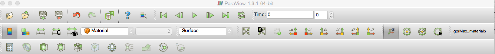

.. _output:

***********
Output data
***********

Field(s) output
===============

gprMax produces an output file that has the same name as the input file but with ``.out`` appended. The output file uses the widely-supported `HDF5 <https://www.hdfgroup.org/HDF5/>`_ format which was designed to store and organize large amounts of numerical data. There are a number of free tools available to read HDF5 files. Also MATLAB has high- and low-level functions for reading and writing HDF5 files, i.e. ``h5info`` and ``h5disp`` are useful for returning information and displaying the contents of HDF5 files respectively. gprMax includes some Python modules (in the ``tools`` package) to help you view output data. These are documented in the :ref:`tools section <plotting>`.

File structure
--------------

The output file has the following HDF5 attributes at the root (``/``):

* ``gprMax`` is the version number of gprMax used to create the output
* ``Title`` is the title of the model
* ``Iterations`` is the number of iterations for the time window of the model
* ``nx_ny_nz`` is a tuple containing the number of cells in each direction of the model
* ``dx_dy_dz`` is a tuple containing the spatial discretisation, i.e. :math:`\Delta x`, :math:`\Delta y`, :math:`\Delta z`
* ``dt`` is the time step of the model, i.e. :math:`\Delta t`
* ``srcsteps`` is the spatial increment used to move all sources between model runs.
* ``rxsteps`` is the spatial increment used to move all receivers between model runs.
* ``nsrc`` is the total number of sources in the model.
* ``nrx`` is the total number of receievers in the model.

The output file contains HDF5 groups for sources (``srcs``), transmission lines (``tls``), and receivers (``rxs``). Within each group are further groups that correspond to individual sources/transmission lines/receivers, e.g. ``src1``, ``src2`` etc...

.. code-block:: none

    /
        rxs/
            rx1/
                Name
                Position
                Ex
                Ey
                Ez
                Hx
                Hy
                Hz
                Ix [optional]
                Iy [optional]
                Iz [optional]
            rx2/
                ...
        srcs/
            src1/
                Type
                Position
            src2/
                ...

        tls/
            tl1/
                Position
                Resistance
                dl
                Vinc
                Iinc
                Vtotal
                Itotal
            tl2/
                ...

Within each individual ``rx`` group are the following attributes:

* ``Name`` is the name of the receiver if specified. Otherwise 'Rx(x,y,z)', where x,y,z is the position of the receiver, is used.
* ``Position`` is the x, y, z position (in metres) of the receiver in the model.

Within each individual ``rx`` group can be the following datasets:

* ``Ex`` is an array containing the time history (for the model time window) of the values of the x component of the electric field at that receiver position.
* ``Ey`` is an array containing the time history (for the model time window) of the values of the y component of the electric field at that receiver position.
* ``Ez`` is an array containing the time history (for the model time window) of the values of the z component of the electric field at that receiver position.
* ``Hx`` is an array containing the time history (for the model time window) of the values of the x component of the magnetic field at that receiver position.
* ``Hy`` is an array containing the time history (for the model time window) of the values of the y component of the magnetic field at that receiver position.
* ``Hz`` is an array containing the time history (for the model time window) of the values of the z component of the magnetic field at that receiver position.
* ``Ix`` is an optional array containing the time history (for the model time window) of the values of the x component of current (calculated around a single cell loop) at that receiver position.
* ``Iy`` is an optional array containing the time history (for the model time window) of the values of the y component of current (calculated around a single cell loop) at that receiver position.
* ``Iz`` is an optional array containing the time history (for the model time window) of the values of the z component of current (calculated around a single cell loop) at that receiver position.

Within each individual ``src`` group are the following attributes:

* ``Type`` is the type of source, e.g. Hertzian dipole, voltage source etc...
* ``Position`` is the x, y, z position (in metres) of the source in the model.

Within each individual ``tl`` group are the following attributes:

* ``Position`` is the x, y, z position (in metres) of the source in the model.
* ``Resistance`` is the resistance of the transmission line.
* ``dl`` is the spatial discretisation of the transmission line.

Within each individual ``tl`` group are the following datasets:

* ``Vinc`` is an array containing the time history (for the model time window) of the values of the incident voltage in the transmission line.
* ``Iinc`` is an array containing the time history (for the model time window) of the values of the incident current in the transmission line.
* ``Vtotal`` is an array containing the time history (for the model time window) of the values of the total (field) voltage in the transmission line.
* ``Itotal`` is an array containing the time history (for the model time window) of the values of the total (field) current in the transmission line.

Snapshots
---------

Snapshot files use the open source `Visualization ToolKit (VTK) <http://www.vtk.org>`_ format which can be viewed in many free readers, such as `Paraview <http://www.paraview.org>`_. Paraview is an open-source, multi-platform data analysis and visualization application. It is available for Linux, macOS, and Windows. The ``#snapshot:`` command produces an ImageData (.vti) snapshot file containing electric and magnetic field data and current data for each time instance requested.

.. tip::
    You can take advantage of Python scripting to easily create a series of snapshots. For example, to create 30 snapshots starting at time 0.1ns until 3ns in intervals of 0.1ns, use the following code snippet in your input file. Replace ``xs, ys, zs, xf, yf, zf, dx, dy, dz`` accordingly.

    .. code-block:: none

        #python:
        from gprMax.input_cmd_funcs import *
        for i in range(1, 31):
            snapshot(xs, ys, zs, xf, yf, zf, dx, dy, dz, (i/10)*1e-9, 'snapshot' + str(i))
        #end_python:

The following are steps to get started with viewing snapshot files in Paraview:

#. **Open the file** either from the File menu or toolbar. Paraview should recognise the time series based on the file name and load in all the files.
#. Click the **Apply** button in the Properties panel. You should see an outline of the snapshot volume.
#. Use the **Coloring** drop down menu to select either **E-field** or **H-field**, and the further drop down menu to select either **Magnitude**, **x**, **y** or **z** component.
#. From the **Representation** drop down menu select **Surface**.
#. You can step through or play as an animation the time steps using the **time controls** in the toolbar.

.. tip::
    * Turn on the Animation View (View->Animation View menu) to control the speed and start/stop points of the animation.

    * Use the Color Map Editor to adjust the Color Scaling.

    * Adjust the default lighting: In the Properties panel click on the gear icon to turn on the advanced properties. Go to the Lights section and click edit. Uncheck the Light Kit check box and click Close.

Geometry output
===============

Geometry files use the open source `Visualization ToolKit (VTK) <http://www.vtk.org>`_ format which can be viewed in many free readers, such as `Paraview <http://www.paraview.org>`_. Paraview is an open-source, multi-platform data analysis and visualization application. It is available for Linux, Mac OS X, and Windows.

The ``#geometry_view:`` command produces either ImageData (.vti) for a per-cell geometry view, or PolygonalData (.vtp) for a per-cell-edge geometry view. The per-cell geometry views also show the location of the PML regions and any sources and receivers in the model. The following are steps to get started with viewing geometry files in Paraview:

.. _pv_toolbar:

    Paraview toolbar showing ``gprMax_info`` macro button.

#. **Open the file** either from the File menu or toolbar.
#. Click the **Apply** button in the Properties panel. You should see an outline of the volume of the geometry view.
#. Install the ``gprMax_info.py`` Python script, that comes with the gprMax source code (in the ``tools/Paraview macros`` directory), as a macro in Paraview. This script makes it quick and easy to view the different materials in a geometry file. To add the script as a macro in Paraview choose the file from the Macros->Add new macro menu. It will then appear as a shortcut button in the toolbar as shown in :numref:`pv_toolbar`. You only need to do this once, the macro will be kept in Paraview for future use.
#. Click the ``gprMax_info`` shortcut button. All the materials in the model should appear in the Pipeline Browser as Threshold items as shown in :numref:`pv_pipeline`.

.. _pv_pipeline:

.. figure:: images/paraview_pipeline.png
    :width: 350 px

    Paraview Pipeline Browser showing list of materials in an example model.

.. tip::
    * You can turn on and off the visibility of materials using the eye icon in the Pipeline Browser. You can select multiple materials using the Shift key, and by shift-clicking the eye icon, turn the visibility of multiple materials on and off.

    * You can set the Color and Opacity of materials from the Properties panel.
