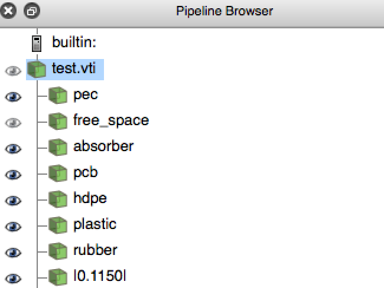

.. _output:

************
Model Output
************

Field(s) output
===============

gprMax produces an output file that primarily contains time history data for electromagnetic field outputs (receivers) in the model. The output file has the same name as the input file but with ``.h5`` appended, and therefore uses the widely-supported `HDF5 <https://www.hdfgroup.org/HDF5/>`_ format which was designed to store and organize large amounts of numerical data. There are a number of free tools available to read HDF5 files. Also MATLAB has high- and low-level functions for reading and writing HDF5 files, i.e. ``h5info`` and ``h5disp`` are useful for returning information and displaying the contents of HDF5 files respectively. gprMax includes some Python modules (in the ``toolboxes/plotting`` package) to help you view output data, which are documented in the README.rst file for that package.

File structure
--------------

The output file has the following HDF5 attributes at the root (``/``):

- ``gprMax`` is the version number of gprMax used to create the output
- ``Title`` is the title of the model
- ``Iterations`` is the number of iterations for the time window of the model
- ``nx_ny_nz`` is a tuple containing the number of cells in each direction of the model
- ``dx_dy_dz`` is a tuple containing the spatial discretisation, i.e. :math:`\Delta x`, :math:`\Delta y`, :math:`\Delta z`
- ``dt`` is the time step of the model, i.e. :math:`\Delta t`
- ``srcsteps`` is the spatial increment used to move all sources between model runs.
- ``rxsteps`` is the spatial increment used to move all receivers between model runs.
- ``nsrc`` is the total number of sources in the model.
- ``nrx`` is the total number of receievers in the model.
- ``nports`` is the number of voltage-source S11/impedance outputs.

The output file contains HDF5 groups for sources (``srcs``), transmission lines
(``tls``), magnetic frill sources (``frills``), receivers (``rxs``),
voltage-source ports (``ports``), and KSIR outputs (``ntff``) when requested.
Within these are further groups for each named or numbered output.

.. code-block:: none

    /
        rxs/
            rx1/
                Name
                Position
                Ex
                Ey
                Ez
                Hx
                Hy
                Hz
                Ix [optional]
                Iy [optional]
                Iz [optional]
            rx2/
                ...
        srcs/
            src1/
                Type
                Position
            src2/
                ...

        tls/
            tl1/
                Position
                Resistance
                dl
                Vinc
                Iinc
                Vtotal
                Itotal
                frequency
                S11
                Zin
                Yin
                S11_current
                Zin_current
                ...
            tl2/
                ...
        frills/ [optional]
            frill1/
                Position
                Polarisation
                Z0
                Mirror1Face
                Mirror2Face
                Mirror1
                Mirror2
                Vinc
                Vtotal
                Itot
                frequency
                S11
                Zin
                Yin
                ...
            frill2/
                ...
        ntff/ [optional]
            <monitor name>/
                ...
        ports/ [optional]
            <port ID>/
                frequency
                S11
                Zin
                Yin
                ...

Within each individual ``rx`` group are the following attributes:

* ``Name`` is the name of the receiver if specified. Otherwise 'Rx(x,y,z)', where x,y,z is the position of the receiver, is used.
* ``Position`` is the x, y, z position (in metres) of the receiver in the model.

Within each individual ``rx`` group can be the following datasets:

* ``Ex`` is an array containing the time history (for the model time window) of the values of the x component of the electric field at that receiver position.
* ``Ey`` is an array containing the time history (for the model time window) of the values of the y component of the electric field at that receiver position.
* ``Ez`` is an array containing the time history (for the model time window) of the values of the z component of the electric field at that receiver position.
* ``Hx`` is an array containing the time history (for the model time window) of the values of the x component of the magnetic field at that receiver position.
* ``Hy`` is an array containing the time history (for the model time window) of the values of the y component of the magnetic field at that receiver position.
* ``Hz`` is an array containing the time history (for the model time window) of the values of the z component of the magnetic field at that receiver position.
* ``Ix`` is an optional array containing the time history (for the model time window) of the values of the x component of current (calculated around a single cell loop) at that receiver position.
* ``Iy`` is an optional array containing the time history (for the model time window) of the values of the y component of current (calculated around a single cell loop) at that receiver position.
* ``Iz`` is an optional array containing the time history (for the model time window) of the values of the z component of current (calculated around a single cell loop) at that receiver position.

Within each individual ``src`` group are the following attributes:

* ``Type`` is the type of source, e.g. Hertzian dipole, voltage source etc...
* ``Position`` is the x, y, z position (in metres) of the source in the model.

Within each individual ``tl`` group are the following attributes:

* ``Position`` is the x, y, z position (in metres) of the source in the model.
* ``Resistance`` is the resistance of the transmission line.
* ``dl`` is the spatial discretisation of the transmission line.
* ``ReferenceImpedance`` is the real reference impedance used for S11 and is
  equal to ``Resistance``.
* ``SpectrumLimitMode``, ``MinimumWavelengthCells``,
  ``MeshFrequencyLimit``, ``NyquistFrequency``, and ``LimitingMaterial``
  describe the automatically selected frequency band.
* ``ZinPrimaryMethod`` identifies the voltage-wave S11 result as the primary
  impedance calculation. ``CurrentCheckMethod`` identifies the independent
  discrete-line current-wave calculation.

Within each individual ``tl`` group are the following datasets:

* ``Vinc`` is an array containing the time history (for the model time window) of the values of the incident voltage in the transmission line.
* ``Iinc`` is an array containing the time history (for the model time window) of the values of the incident current in the transmission line.
* ``Vtotal`` is an array containing the time history (for the model time window) of the values of the total (field) voltage in the transmission line.
* ``Itotal`` is an array containing the time history (for the model time window) of the values of the total (field) current in the transmission line.
* ``frequency`` is the authoritative non-negative frequency axis in Hz.
* ``Vincident_spectrum``, ``Vreflected_spectrum``, and ``Vtotal_spectrum``
  are the complex voltage spectra.
* ``Iincident_spectrum`` and ``Itotal_spectrum`` are the complex current
  spectra after accounting for the current's half-time-step staggering.
* ``S11`` is the voltage-wave reflection coefficient
  :math:`(V_\mathrm{total}-V_\mathrm{inc})/V_\mathrm{inc}`.
* ``Zin`` and ``Yin`` are the input impedance and admittance derived from
  ``S11`` and the line resistance.
* ``S11_current`` and ``Zin_current`` are independent checks calculated from
  the line current. The current is displaced from the voltage node by both
  half a time step and half a line cell; gprMax removes both offsets using the
  discrete 1D transmission-line dispersion relation. A simple phase shift of
  the total current alone is not sufficient because incident and reflected
  current waves require opposite spatial corrections.
* ``valid_S11``, ``valid_Zin``, ``valid_Yin``, ``valid_S11_current``, and
  ``valid_Zin_current`` are per-bin integer masks. ``source_valid``,
  ``mesh_valid``, ``line_propagation_valid``, ``incident_relative_dB``, and
  ``cells_per_minimum_wavelength`` provide the corresponding diagnostics.

Within each individual ``frill`` group are the following attributes:

* ``Position`` is the x, y, z position (in metres) of the feed point in the model.
* ``Polarisation`` is the antenna axis the source drives current along
  (``x``, ``y``, or ``z``).
* ``Z0`` is the user-supplied characteristic impedance (``Zcoax``), and is
  also the reference impedance used for S11.
* ``InnerConductorRadius`` is the radius :math:`a` obtained from the mandatory
  co-located ``#thin_wire``.
* ``CurrentTimeApproximation`` is ``average`` for Hyun's recommended average
  of the adjacent magnetic half-step currents.
* ``FeedSelfAdmittance`` is the precomputed Cartesian feed-cell coefficient
  :math:`G_f` (Siemens) used to solve the current feedback in closed form.
* ``TimeOffset`` is zero: ``Vinc``, ``Vtotal``, and the averaged ``Itot`` are
  all centred at integer electric-field times.
* ``Mirror1Face`` and ``Mirror2Face`` name the two domain faces transverse to
  ``Polarisation`` (for example ``x0``/``y0`` for a z-polarised source).
  ``Mirror1`` and ``Mirror2`` record whether the feed point actually sits on
  a symmetry-plane corner declared with ``#symmetry_boundary`` at that face.
* ``SpectrumLimitMode``, ``MinimumWavelengthCells``,
  ``MeshFrequencyLimit``, ``NyquistFrequency``, and ``LimitingMaterial``
  describe the automatically selected frequency band, as for ``tl`` groups.
* ``ZinPrimaryMethod`` identifies the voltage-wave S11 result as the primary
  impedance calculation - there is no separate current-based cross-check
  here, unlike a transmission line, since the frill's voltage and current
  histories are solved together at the same instant, not staggered.

Within each individual ``frill`` group are the following datasets:

* ``Vinc`` is an array containing the time history of the incident voltage
  (half the generator waveform).
* ``Vtotal`` is an array containing the time history of the total terminal
  voltage :math:`V_\mathrm{ab}`.
* ``Itot`` is an array containing the time history of the total current at
  the feed point, averaged from the adjacent magnetic half steps and
  generalised for a symmetry-mirrored feed point.
* ``frequency``, ``S11``, ``Zin``, ``Yin``, and their associated
  ``valid_S11``/``valid_Zin``/``valid_Yin``/``source_valid``/``mesh_valid``/
  ``incident_relative_dB``/``cells_per_minimum_wavelength`` diagnostics have
  the same meaning as the corresponding ``tl`` datasets.

Transmission-line S11 and impedance output
-------------------------------------------

S11, input impedance, and input admittance are generated automatically for
every transmission-line source; no ``#rx_port`` command or additional
receiver is required. With the real line resistance :math:`Z_0` as the
reference impedance, the primary results are

.. math::

    S_{11}=\frac{V_\mathrm{total}-V_\mathrm{inc}}{V_\mathrm{inc}},
    \qquad
    Z_\mathrm{in}=Z_0\frac{1+S_{11}}{1-S_{11}},
    \qquad
    Y_\mathrm{in}=\frac{1-S_{11}}{Z_0(1+S_{11})}.

This S11-based ``Zin`` is the primary result because direct division by the
terminal current becomes ill-conditioned at frequencies where that current
approaches zero. The independently de-embedded current result remains in
``Zin_current`` so that the line coupling and the voltage-wave result can be
checked. Algebraically undefined open- or short-circuit quantities are stored
as complex NaNs and identified by their validity masks.

The stored spectrum uses the native resolution :math:`\Delta f=1/T` and is
capped automatically at the lambda/10 mesh limit of the most restrictive
material in the model. The original ``Vinc``, ``Iinc``, ``Vtotal``, and
``Itotal`` histories remain available for users who need to reprocess a wider
research band.

For example, the valid S11 and impedance bins can be read directly:

.. code-block:: python

    import h5py
    import numpy as np

    with h5py.File('model.h5', 'r') as output:
        line = output['tls/tl1']
        frequency = line['frequency'][...]
        s11 = line['S11'][...]
        zin = line['Zin'][...]
        valid = (
            line['valid_S11'][...].astype(bool)
            & line['valid_Zin'][...].astype(bool)
        )

    s11_db = 20 * np.log10(np.abs(s11[valid]))
    resistance = zin.real[valid]
    reactance = zin.imag[valid]

Magnetic-frill-source S11 and impedance output
-----------------------------------------------

S11, input impedance, and input admittance are generated automatically for
every ``#magnetic_frill_source``, exactly as for a transmission line; no
``#rx_port`` command or additional receiver is required (the electric field
component along the polarisation axis is identically zero at the feed point
by construction, so no field sample is possible there in the first place).
Main-grid results are stored at ``/frills/frillN``. A Python API frill inside
a subgrid is stored at ``/subgrids/<subgrid ID>/frills/frillN``; its
``Position`` is reported in global physical coordinates, while its histories,
frequency axis, and validity limits use the owning subgrid's finer ``dt`` and
``dl``.
With the frill's user-supplied characteristic impedance :math:`Z_0` as the
reference impedance,

.. math::

    S_{11}=\frac{V_\mathrm{ab}-V_\mathrm{inc}}{V_\mathrm{inc}},
    \qquad
    Z_\mathrm{in}=Z_0\frac{1+S_{11}}{1-S_{11}},
    \qquad
    Y_\mathrm{in}=\frac{1-S_{11}}{Z_0(1+S_{11})}.

Unlike a transmission line, there is no independent current-based
cross-check: :math:`V_\mathrm{inc}`, :math:`V_\mathrm{ab}`, and
:math:`I_\mathrm{tot}` are centred at the same integer time. The current is
Hyun's average of the preceding and following magnetic half-step values; the
following value depends on the voltage applied in that update, so gprMax
solves the resulting feed-cell relation analytically. There is therefore no
remaining leapfrog phase shift to de-embed. :math:`I_\mathrm{tot}` is formed
directly from the mandatory thin wire's stored Mäkinen-projected H edges,
consistent with the :math:`F k_H` source deposit. At every sample the stored
histories satisfy

.. math::

    V_\mathrm{ab}=2V_\mathrm{inc}-Z_0 I_\mathrm{tot}.

If ``#rx_port`` is placed at the same feed point, it does not create a
second, independent measurement (unlike its role with ``#voltage_source``);
it can only override the ``spectrum_limit`` of this always-on automatic
output.

Voltage-source S11 and impedance output
---------------------------------------

The ``#rx_port`` command and ``RxPort`` Python object write one group per
main-grid port at ``/ports/<port ID>``. A port added to a Python API subgrid is
stored at ``/subgrids/<subgrid ID>/ports/<port ID>`` and uses the owning
subgrid's spatial step, time step, iteration count, material edge, and field
histories. For a finite-resistance source, its resistance is the reference
impedance :math:`Z_0`; the source-plane reflection coefficient is calculated
from the known generator voltage and sampled total gap voltage.
For a zero-resistance hard source, :math:`Z_0` is supplied by the voltage
source (50 Ohms by default) and
the terminal quantities are calculated from the prescribed voltage and
time-centred Ampere-loop current. Both paths remove the effective Yee-edge
background capacitance and conductance before reporting ``S11``, ``Zin``, and
``Yin``:

.. math::

    Z_\mathrm{in}=Z_0\frac{1+S_{11}}{1-S_{11}},
    \qquad
    Y_\mathrm{in}=\frac{1-S_{11}}{Z_0(1+S_{11})}.

Important attributes include:

* ``PortMode``, ``ReferenceImpedance``, ``ReferenceImpedanceSource``,
  ``Polarisation``, ``Position``, and ``GridPosition``;
* ``BackgroundMaterial``, ``GapCapacitance``, and
  ``BackgroundConductance``;
* ``SpectrumLimitMode``, ``MinimumWavelengthCells``,
  ``MeshFrequencyLimit``, ``NyquistFrequency``, and ``LimitingMaterial``;
* ``FrequencyRange`` (the first and last stored bins),
  ``ValidFrequencyRange`` (a convenience summary), and
  ``IndependentFrequencyResolution``;
* ``phasor_time_sign=exp(+j*omega*t)`` and
  ``forward_transform_sign=exp(-j*omega*t)``.

``Position`` is always expressed in the global physical coordinate frame,
including for a subgrid port, and therefore matches the associated source's
``Position`` attribute. ``GridPosition`` is the integer index in the owning
grid and can include the subgrid's internal boundary padding.

The principal datasets are:

* ``frequency``: the authoritative plotting axis in Hz;
* ``S11``, ``Zin``, and ``Yin``: corrected complex terminal quantities;
* ``S11_source`` and ``Zin_source``: uncorrected source-plane quantities;
* ``Vincident_spectrum``, ``Vreflected_source_spectrum``, and
  ``Vtotal_spectrum``: complex voltage spectra;
* ``time``, ``Vgenerator``, and ``Vtotal``: aligned voltage audit histories;
* ``time_current``, ``Iloop``, ``Iloop_spectrum``, and
  ``Iterminal_spectrum``: additional hard-source current data. ``Iloop`` is
  sampled at magnetic half-step times; its spectrum includes the Yee-gap
  admittance, while the terminal spectrum has that admittance removed;
* ``valid_S11``, ``valid_Zin``, ``valid_Yin``, ``source_valid``,
  ``mesh_valid``, and ``gap_correction_valid``: per-bin integer masks;
* ``incident_relative_dB`` and ``cells_per_minimum_wavelength``: diagnostics
  behind the masks.

The normal output is capped by the requested cells-per-wavelength criterion.
With ``spectrum_limit='nyquist'``, all native non-negative bins are retained
for research, including finite values outside the recommended band, while the
validity masks and lambda/10 advisory ceiling remain present. Algebraically
undefined values are stored as complex NaNs; finite invalid values are not
silently clipped.

The frequency dataset and validity mask can be plotted directly:

.. code-block:: python

    import h5py
    import matplotlib.pyplot as plt
    import numpy as np

    with h5py.File('model.h5', 'r') as output:
        port = output['ports/feed']
        frequency = port['frequency'][...]
        s11 = port['S11'][...]
        valid = port['valid_S11'][...].astype(bool)

    plt.plot(frequency[valid], 20 * np.log10(np.abs(s11[valid])))
    plt.xlabel('Frequency [Hz]')
    plt.ylabel(r'$|S_{11}|$ [dB]')

.. _output-ntff:

NTFF field-transformation output
--------------------------------

Reusable KSIR and equivalent-current outputs are stored in the normal model
file under their surface and transform IDs:

.. code-block:: none

    /ntff/<surface_id>/
        time/<rx_id>/
            points
            times
            time_origins
            valid_lengths
            fully_supported_lengths
            terminal_field_ratios
            terminal_decay_ok
            spherical_coordinates [spherical commands only]
            fields/<output>
        time_far_field/<output_id>/
            times
            theta
            phi
            directions
            terminal_field_ratios
            terminal_decay_ok
            fields/<output>
        frequency/<transform_id>/
            frequencies
            surface_dft/<component>/
                field
                normal_derivative
                patch_positions
                patch_normals
                area_weights
            receivers/<rx_id>/
                points
                spherical_coordinates [spherical commands only]
                fields/<output>
            far_field/<output_id>/
                theta
                phi
                directions
                radiated_power [directivity/efficiency requests]
                maximum_directivity
                maximum_directivity_dbi
                maximum_directivity_theta
                maximum_directivity_phi
                port_power/ [gain/efficiency requests]
                    port_ids
                    source_types
                    reference_impedances
                    incident_voltage_per_port
                    terminal_voltage_per_port
                    terminal_current_per_port
                    incident_power_per_port
                    accepted_power_per_port
                    incident_power
                    accepted_power
                    reflected_power
                    incident_relative_db
                    mesh_valid
                    terminal_valid
                    gain_valid
                    realized_gain_valid
                fields/<output>

The surface group records logical bounds, physical reference origin, closure
status, omitted symmetry faces, boundary types/coordinates, and image count.
The frequency transform group records its ``ksir`` or ``equivalent_current``
formulation, window, inferred wave speed and impedance, configured precision
and collection backend, plus the engineering convention:
``exp(+j*omega*t)`` phasors, ``exp(-j*omega*t)`` forward transform, and
``exp(-j*k*R)`` outgoing Green function.

Exact frequency receiver groups have ``range_normalized=False``. They contain
physical finite-distance phasors with every ``1/R`` and ``1/R**2`` term.
Far-field groups have ``range_normalized=True`` and a ``normalization``
attribute specifying ``r * exp(+j*k*r) * field``. Their radius is intentionally
absent. Complex datasets use the complex type paired with the configured
gprMax real precision.

The ``time_far_field`` group is produced by ``#ntff_time_far_field`` or its
array form. It records ``formulation=equivalent_current_1997``, linear
fractional-delay interpolation, CPU/Cython collection, and the normalization
``r * field at reduced time t - r/c``. Its real field arrays have shape
``(ndirections, ntimes)``. ``Er`` and ``Hr`` are identically zero in the
far-zone model; magnetic components are derived from
:math:`\mathbf H=(\hat{\mathbf r}\times\mathbf E)/\eta`.
The complete definitions and the distinction between the retained Yee-time
staggering and fractional-delay interpolation are given in
:ref:`ntff-formulations`.

Far-field derived antenna quantities
^^^^^^^^^^^^^^^^^^^^^^^^^^^^^^^^^^^^

``radiation_intensity`` has shape ``(nfrequencies, ndirections)``. If
``directivity`` or an efficiency is requested, the five full-sphere summary
datasets shown above have shape ``(nfrequencies,)``. The far-field group also
records the Gauss--Legendre/periodic quadrature orders and the completed
surface's bounding radius in metres. These summaries come from an internal
full-sphere calculation even if the stored user directions form only a cut;
the internal directional fields are not written to the output file. The
maximum is refined using the directions in that particular output whenever
they sample a larger value than the internal quadrature.

The linear definitions are

.. math::

    U=\frac{|F_\theta|^2+|F_\phi|^2}{2\eta},\qquad
    D=\frac{4\pi U}{P_\mathrm{rad}},\qquad
    P_\mathrm{rad}=\int_{4\pi}U\,\mathrm{d}\Omega.

``directivity_dbi``, ``gain_dbi``, and ``realized_gain_dbi`` are
``10*log10`` of their corresponding linear datasets. The linear gain and
efficiency definitions are

.. math::

    G=\frac{4\pi U}{P_\mathrm{acc}},\qquad
    G_\mathrm{realized}=\frac{4\pi U}{P_\mathrm{inc}},\qquad
    \eta_\mathrm{rad}=\frac{P_\mathrm{rad}}{P_\mathrm{acc}},\qquad
    \eta_\mathrm{total}=\frac{P_\mathrm{rad}}{P_\mathrm{inc}}.

The two efficiencies are frequency-only quantities and therefore have shape
``(nfrequencies,)`` even though they are stored in ``fields`` with the other
requested outputs.

For a ``#ksir_antenna_ports`` or ``#ntff_antenna_ports`` association, complex
port spectra and per-port powers have shape ``(nports, nfrequencies)``. Total
powers and all validity masks have shape ``(nfrequencies,)``. They use

.. math::

    P_\mathrm{acc}=\sum_p\frac{1}{2}\Re\{V_p I_p^*\},\qquad
    P_\mathrm{inc}=\sum_p\frac{|V_p^+|^2}{2Z_{0p}},\qquad
    P_\mathrm{refl}=P_\mathrm{inc}-P_\mathrm{acc}.

These are spectral power-normalisation quantities: the voltage and field
Fourier transforms carry a common time scale, which cancels in gain and
efficiency. Their HDF5 attributes consequently give voltage spectra in
``V s``, current spectra in ``A s``, and spectral powers in ``W s**2``. The
exact complex terminal and incident spectra are retained so that every
derived power can be checked independently. A zero-amplitude source remains
a terminated port with zero incident voltage; its terminal voltage/current
and signed accepted power can still be non-zero through mutual coupling.
The ``port_ids`` dataset stores main-grid IDs unchanged and qualifies subgrid
ports as ``<subgrid ID>/<local port ID>``. Although the grouped antenna result
is written below the main-grid NTFF group, each port spectrum is calculated
with the spatial step, time step, and trace length of the grid that owns it.

The validity datasets should always be applied before plotting. The default
gain bandwidth includes frequencies whose total incident spectrum is within
``40 dB`` of its peak and for which the mesh and port reconstruction are
valid. Invalid derived results are stored as ``NaN`` rather than a plausible
but ill-conditioned value.

When requested, ``far_field/<output_id>/fields/rcs`` contains real, linear
bistatic radar cross section in square metres. It is not stored in dBsm. For
the range-normalized scattered electric field
:math:`F_\mathrm{s}=r\exp(+jkr)E_\mathrm{s}`, gprMax calculates

.. math::

    \sigma(\theta,\phi,f)
    = 4\pi
      \frac{|F_{\mathrm{s},\theta}|^2+|F_{\mathrm{s},\phi}|^2}
      {|E_{\mathrm{inc},x}|^2+|E_{\mathrm{inc},y}|^2
       +|E_{\mathrm{inc},z}|^2}.

The denominator is obtained from the actual field history in the associated
discrete-plane-wave grid, accumulated at the transform frequencies with the
same time window as the surface data. It therefore includes the numerical
plane-wave amplitude and its configured start and stop times. A zero incident
spectrum produces ``NaN`` RCS. Very small incident values are mathematically
non-zero but can give unreliable results, so the requested frequencies should
remain within the useful excitation bandwidth.

For plotting in dBsm, convert the stored values explicitly:

.. code-block:: python

    import h5py
    import numpy as np

    with h5py.File('model.h5', 'r') as output:
        far = output['ntff/surface/frequency/transform/far_field/backscatter']
        rcs = far['fields/rcs'][...]  # linear RCS in m**2
        rcs_dbsm = 10 * np.log10(rcs)

Here ``theta`` and ``phi`` in the same group define the observation direction.
Monostatic RCS is the value in the direction opposite to plane-wave
propagation; all other directions are bistatic RCS. Use separate simulations
for different incident plane waves because selecting an association does not
separate simultaneously accumulated scattered fields.

Exact finite-distance KSIR time-domain fields retain the complete raw retarded
buffer and have shape ``(npoints, max(valid_lengths))``. Its final bins may contain only part of the
closed-surface history because different surface patches have different
propagation delays. For normal use, point ``q`` must therefore be sliced with
``fully_supported_lengths``:

.. code-block:: python

    length = fully_supported_lengths[q]
    physical_time = time_origins[q] + times[:length]
    trace = fields[output][q, :length]

``valid_lengths`` remains available for research access to every stored bin.
Those additional bins are not a complete field reconstruction unless the
surface fields had already decayed to zero. ``terminal_field_ratios`` gives,
for each point, the largest ratio between the final 32 fully supported samples
and the trace peak, evaluated independently for each underlying Cartesian
component. ``terminal_decay_ok`` is true when this is no greater than
``terminal_decay_threshold`` (stored as a group attribute). gprMax emits a
warning when the test fails; increasing the model time window is the correct
remedy.

With ``time_origin=simulation`` every origin is zero. With
``time_origin=first_arrival`` each origin retains its absolute propagation
time without storing the potentially large guaranteed leading-zero prefix.
For this origin policy, ``fully_supported_lengths`` normally equals the number
of FDTD iterations.

Equivalent-current transient far fields use a stricter output policy. Their
``times`` dataset already contains only the common interval for which every
surface patch has an available retarded-time sample; no partially supported
tail is written. The time coordinate is reduced time
:math:`\tau=t-r/c_b`, referenced to the surface origin, so increasing a
hypothetical observation radius would not prepend zeros. The
``terminal_field_ratios`` and ``terminal_decay_ok`` datasets are per direction.
A false value means the FDTD time window should be increased.

The surface DFT datasets are present by default and allow later angular or
point evaluation without rerunning FDTD. They can be large: their leading
dimensions are frequency and surface patch. An NTFF output creates the normal
model output file even when there are no conventional receivers or
transmission lines.

NTFF surfaces must strictly enclose every impressed source. For plane-wave
scattering models, the associated total-field/scattered-field box must be
strictly enclosed by the NTFF surface. The integration surface then samples
the scattered-field region outside the TFSF box, while the associated
numerical plane wave supplies the incident-field normalization used for RCS.
Sources and scatterers may reside on an HSG subgrid enclosed by these
main-grid surfaces. Neither an NTFF surface nor a TFSF correction surface may
touch or cut the HSG outer coupling surface; an overlapping surface must
strictly enclose the complete subgrid coupling region.

.. _outputs-snaps:

Snapshots
---------

Snapshot files contain a snapshot of the electromagnetic field values of a specified volume of the model domain at a specified point in time during the simulation. By default, snapshot files use the open source `Visualization ToolKit (VTK) <http://www.vtk.org>`_ format which can be viewed in many free readers, such as `Paraview <http://www.paraview.org>`_. Paraview is an open-source, multi-platform data analysis and visualization application. It is available for Linux, macOS, and Windows. You can optionally output snapshot files using the HDF5 format if desired.

.. tip::
    You can take advantage of our Python API to easily create a series of snapshots. For example, to create 30 snapshots starting at time 0.1ns until 3ns in intervals of 0.1ns, use the following code snippet in your input file. Replace ``x, y, z, dl, fn`` accordingly.

    .. code-block:: none

        import gprMax

        for i in range(1, 31):
            s = gprMax.Snapshot(p1=(0, 0, 0), p2=(x, y, z), dl=(dl, dl, dl),
                                time=(i/10) * 1e-9,
                                filename=fn.with_suffix('').parts[-1] + '_' + str(i))
            scene.add(s)

The following are steps to get started with viewing snapshot files in Paraview:

#. **Open the file** either from the File menu or toolbar. Paraview should recognise the time series based on the file name and load in all the files.
#. Click the **Apply** button in the Properties panel. You should see an outline of the snapshot volume.
#. Use the **Coloring** drop down menu to select the field component you want to visual, e.g. **Ex**, **Ey**, **Ez**, **Hx**, **Hy**, **Hz**.
#. From the **Representation** drop down menu select **Surface**.
#. You can step through or play as an animation the time steps using the **time controls** in the toolbar.

.. tip::
    * Turn on the Animation View (View->Animation View menu) to control the speed and start/stop points of the animation.

    * Use the Color Map Editor to adjust the Color Scaling.

Geometry output
===============

Geometry files use the open source `Visualization ToolKit (VTK) <http://www.vtk.org>`_ format (specifically VTKHDF) which can be viewed in many free readers, such as `Paraview <http://www.paraview.org>`_. Paraview is an open-source, multi-platform data analysis and visualization application. It is available for Linux, Mac OS X, and Windows.

The ``#geometry_view:`` command produces either ImageData for a per-cell geometry view, or UnstructuredGrid for a per-cell-edge geometry view. The following are steps to get started with viewing geometry files in Paraview:

.. _pv_toolbar:

    Paraview toolbar showing ``gprMax`` macro button.

#. **Open the file** either from the File menu or the toolbar.
#. Click the **Apply** button in the Properties panel. You should see an outline of the volume of the geometry view.
#. Install the ``gprMax.py`` Python script, that comes with the gprMax source code (in the ``toolboxes/Utilities/Paraview`` directory), as a macro in Paraview. This script makes it quick and easy to view the different materials in a geometry file. To add the script as a macro in Paraview choose the file from the Macros->Add new macro menu. It will then appear as a shortcut button in the toolbar as shown in :numref:`pv_toolbar`. You only need to do this once, the macro will be kept in Paraview for future use.
#. Click the ``gprMax`` shortcut button. All the materials in the model should appear in the Pipeline Browser as Threshold items as shown in :numref:`pv_pipeline`.

.. _pv_pipeline:

    Paraview Pipeline Browser showing list of materials in an example model.

.. tip::
    * You can turn on and off the visibility of materials using the eye icon in the Pipeline Browser. You can select multiple materials using the Shift key, and by shift-clicking the eye icon, turn the visibility of multiple materials on and off.

    * You can set the Color and Opacity of materials from the Properties panel.
