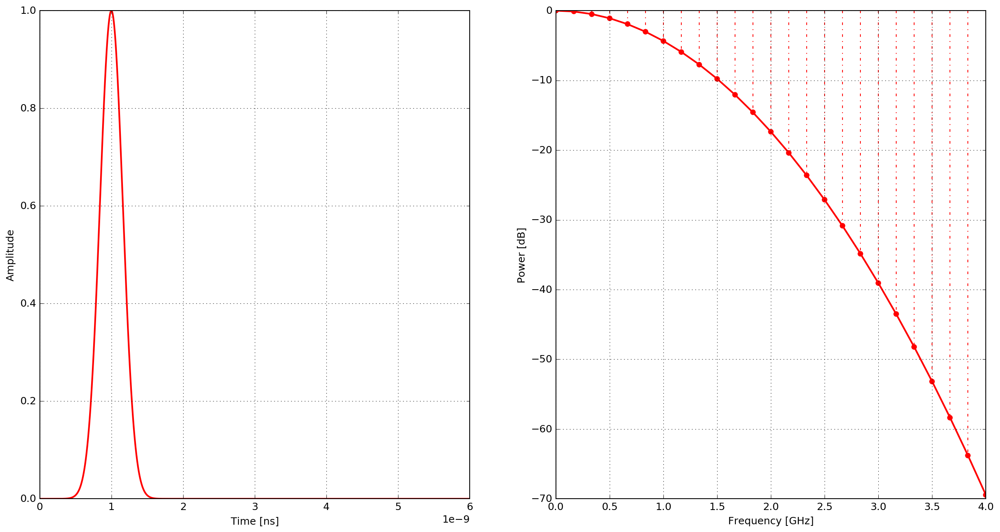
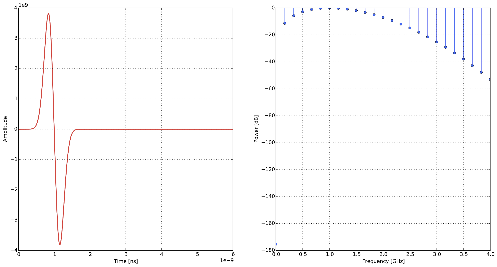
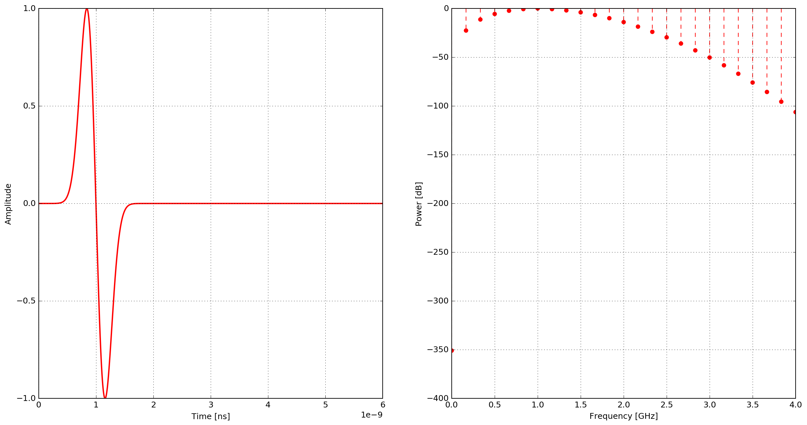
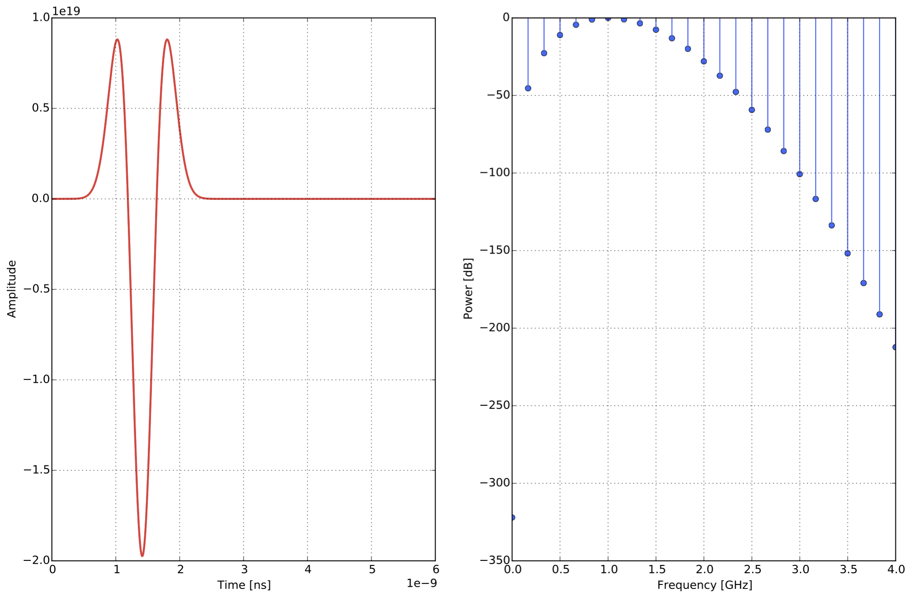
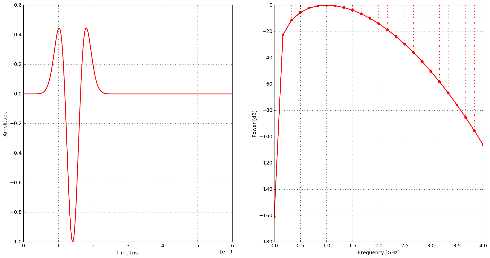
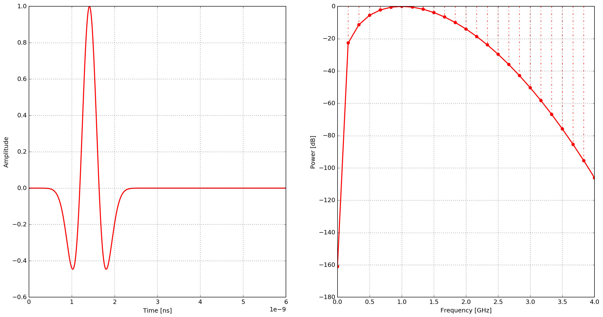
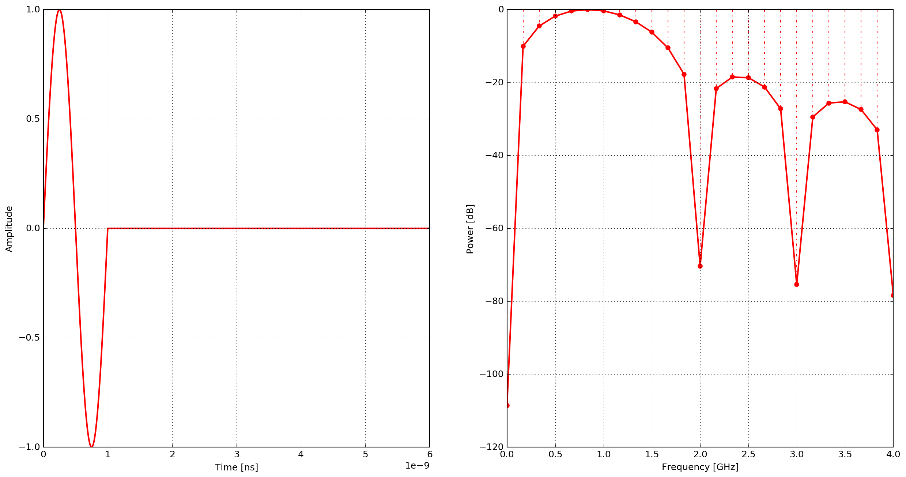
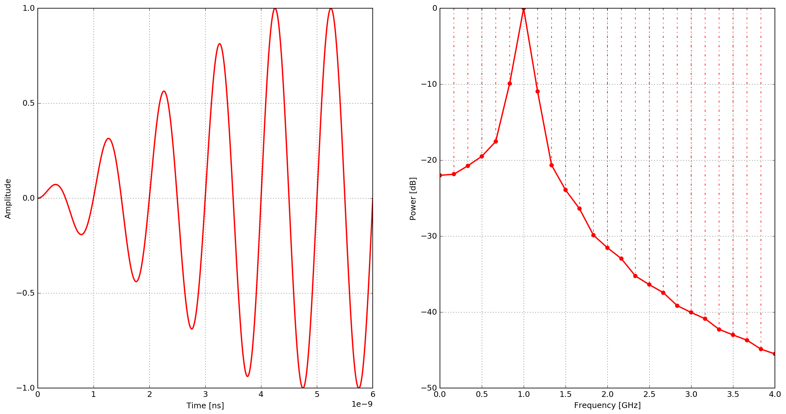

.. _plotting:

********
Plotting
********

A-scans
=======

plot_Ascan.py
=============

.. automodule:: tools.plot_Ascan
    :members:
    :undoc-members:

* Plot A-scans using the Python module ``plot_Ascan.py``. The module uses matplotlib to plot the time history for the electric and magnetic field components for all receivers in a model (each receiver gets a separate figure window). Usage (from the top-level gprMax directory) is: ``python -m tools.plot_Ascan my_outputfile.out``.

* Plot A-scans using the MATLAB script ``plot_Ascan.m``. The script plots the time history for the electric and magnetic field components for all receivers in a model (each receiver gets a separate figure window).

B-scans
=======

gprMax produces a separate output file for each trace (A-scan) in the B-scan.

* Combine the separate output files into one file using the Python module ``outputfiles_merge.py``. Usage (from the top-level gprMax directory) is: ``python -m tools.outputfiles_merge basefilename modelruns``, where ``basefilename`` is the base name file of the output file series, e.g. for ``myoutput1.out``, ``myoutput2.out`` the base file name would be ``myoutput``, and ``modelruns`` is the number of output files to combine.
* Plot an image of the B-scan using the Python module ``plot_Bscan.py``. Usage (from the top-level gprMax directory) is: ``python -m tools.plot_Bscan my_outputfile.out field``, where ``field`` is the name of field to plot, e.g. ``Ex``, ``Ey`` or ``Ez``.

.. _waveforms:

Built-in waveforms
==================

This section provides definitions of the functions that are used to create the built-in waveforms. Example plots are shown using the parameters: amplitude of one, frequency of 1GHz, time window of 6ns, and a time step of 1.926ps.

gaussian
--------

A Gaussian waveform.

.. math:: I = e^{-\zeta(t-\chi)^2}

where :math:`I` is the current, :math:`\zeta = 2\pi^2f^2`, :math:`\chi=\frac{1}{f}` and :math:`f` is the frequency.

    Example of the ``gaussian`` waveform - time domain and power spectrum.

gaussiandot
-----------

First derivative of a Gaussian waveform.

.. math:: I = -2 \zeta (t-\chi) e^{-\zeta(t-\chi)^2}

where :math:`I` is the current, :math:`\zeta = 2\pi^2f^2`, :math:`\chi=\frac{1}{f}` and :math:`f` is the frequency.

    Example of the ``gaussiandot`` waveform - time domain and power spectrum.

gaussiandotnorm
---------------

Normalised first derivative of a Gaussian waveform.

.. math:: I = -2 \sqrt{\frac{e}{2\zeta}} \zeta (t-\chi) e^{-\zeta(t-\chi)^2}

where :math:`I` is the current, :math:`\zeta = 2\pi^2f^2`, :math:`\chi=\frac{1}{f}` and :math:`f` is the frequency.

    Example of the ``gaussiandotnorm`` waveform - time domain and power spectrum.

gaussiandotdot
--------------

Second derivative of a Gaussian waveform.

.. math:: I = 2\zeta \left(2\zeta(t-\chi)^2 - 1 \right) e^{-\zeta(t-\chi)^2}

where :math:`I` is the current, :math:`\zeta = \pi^2f^2`, :math:`\chi=\frac{\sqrt{2}}{f}` and :math:`f` is the frequency.

    Example of the ``gaussiandotdot`` waveform - time domain and power spectrum.

gaussiandotdotnorm
------------------

Normalised second derivative of a Gaussian waveform.

.. math:: I = \left( 2\zeta (t-\chi)^2 - 1 \right) e^{-\zeta(t-\chi)^2}

where :math:`I` is the current, :math:`\zeta = \pi^2f^2`, :math:`\chi=\frac{\sqrt{2}}{f}` and :math:`f` is the frequency.

    Example of the ``gaussiandotdotnorm`` waveform - time domain and power spectrum.

ricker
------

A Ricker (or Mexican Hat) waveform which is the negative, normalised second derivative of a Gaussian waveform.

.. math:: I = - \left( 2\zeta (t-\chi)^2 -1 \right) e^{-\zeta(t-\chi)^2}

where :math:`I` is the current, :math:`\zeta = \pi^2f^2`, :math:`\chi=\frac{\sqrt{2}}{f}` and :math:`f` is the frequency.

    Example of the ``ricker`` waveform - time domain and power spectrum.

sine
----

A single cycle of a sine waveform.

.. math:: I = R\sin(2\pi ft)

and

.. math::

    R =
    \begin{cases}
    1 &\text{if $ft\leq1$}, \\
    0 &\text{if $ft>1$}.
    \end{cases}

:math:`I` is the current, :math:`t` is time and :math:`f` is the frequency.

    Example of the ``sine`` waveform - time domain and power spectrum.

contsine
--------

A continuous sine waveform. In order to avoid introducing noise into the calculation the amplitude of the waveform is modulated for the first cycle of the sine wave (ramp excitation).

.. math:: I = R\sin(2\pi ft)

and

.. math::

    R =
    \begin{cases}
    R_cft &\text{if $R\leq 1$}, \\
    1 &\text{if $R>1$}.
    \end{cases}

where :math:`I` is the current, :math:`R_c` is set to :math:`0.25`, :math:`t` is time and :math:`f` is the frequency.

    Example of the ``contsine`` waveform - time domain and power spectrum.

