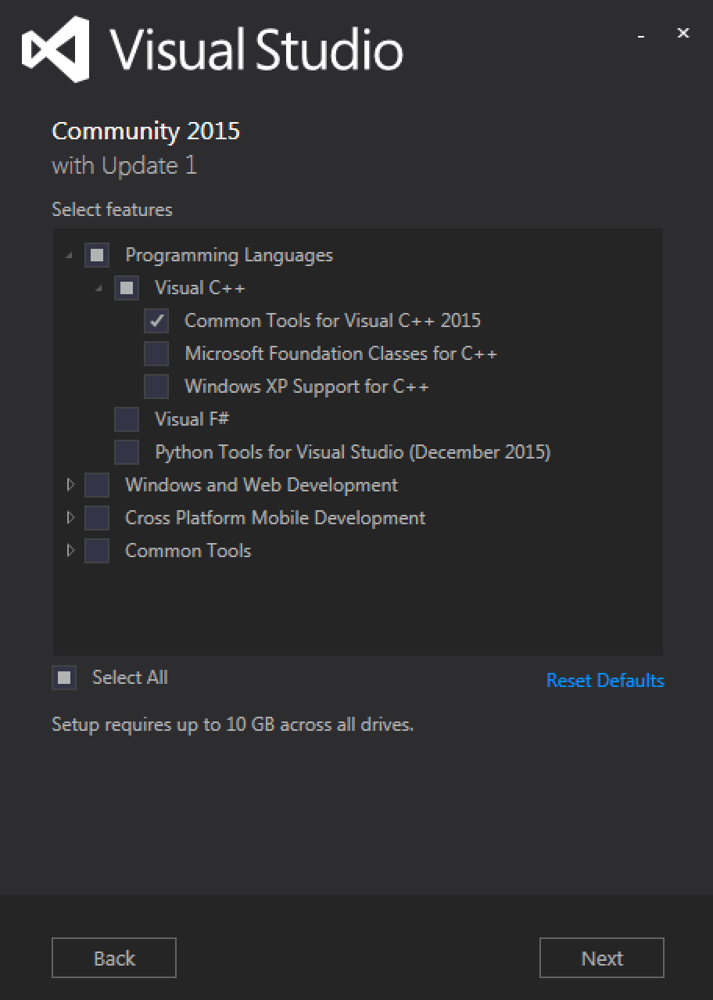

.. include:: ../../README.rst

.. _install-dev:

Installation for developers
===========================

Those that are interested in developing or contributing to gprMax should use the following installation guidance:

1. Get the code
2. Install Python and required Python packages
3. Install a C compiler which supports OpenMP
4. Compile the Cython extensions

1. Get the code
---------------

* Use **Git** (https://git-scm.com) and clone the master branch of the repository: :code:`git clone https://github.com/gprMax/gprMax.git`

2. Install Python and required Python packages
----------------------------------------------

We recommend using Miniconda to install Python and the required Python packages for gprMax in a self-contained Python environment. Miniconda is a mini version of Anaconda which is a completely free Python distribution (including for commercial use and redistribution). It includes more than 300 of the most popular Python packages for science, math, engineering, and data analysis.

* Install the Python 3.5 version of Miniconda for your platform (http://conda.pydata.org/miniconda.html).  Follow the instructions (http://conda.pydata.org/docs/install/quick.html) if you are having any trouble.
* Open a Terminal (Linux/Mac OS X) or Command Prompt (Windows) and navigate into the top-level gprMax directory.
* Update conda :code:`conda update conda`
* Create an environment (using the supplied environment file) for gprMax with all the necessary Python packages :code:`conda env create -f conda_env.yml`
* Activate the new environment (Linux/Mac OS X) :code:`source activate gprMax` or (Windows) :code:`activate gprMax`.

.. note::

    When you are finished using gprMax the Miniconda environment can be deactivated using (Linux/Mac OS X) :code:`source deactivate` or (Windows) :code:`deactivate`

3. Install a C compiler which supports OpenMP
---------------------------------------------

Linux
^^^^^

* gcc (https://gcc.gnu.org) should be already installed, so no action is required.

Mac OS X
^^^^^^^^

* gcc (https://gcc.gnu.org) is easily installed using the Homebrew package manager (http://brew.sh) :code:`brew install gcc --without-multilib`.

.. note::

    Installations of Xcode on Mac OS X come with the LLVM (clang) compiler, but it does not currently support OpenMP, so you must install gcc.

Microsoft Windows
^^^^^^^^^^^^^^^^^

* Download and install Microsoft Visual Studio 2015 Community (https://www.visualstudio.com/downloads/download-visual-studio-vs), which is free. Do a custom install and make sure under programming languages Visual C++ is selected, no other options are required.

    Screenshot of Microsoft Visual Studio 2015 Community custom install settings.

4. Compile the Cython extensions
--------------------------------

Once you have installed the aforementioned tools follow these steps to build the Cython extension modules for gprMax:

a) Open a Terminal (Linux/Mac OS X) or Command Prompt (Windows) and navigate into the top-level gprMax directory.
b) Compile the Cython extension modules using: :code:`python setup.py build_ext --inplace`. You should see a set of :code:`.c` source files and a set of :code:`.so` (Linux/Mac OS X) or :code:`.pyd` (Windows) compiled module files inside the gprMax directory.

.. note::

If you want to remove/clean Cython generated files, e.g. before rebuilding the Cython extensions, you can use :code:`python setup.py cleanall`.

**You are now ready to proceed to running gprMax.**