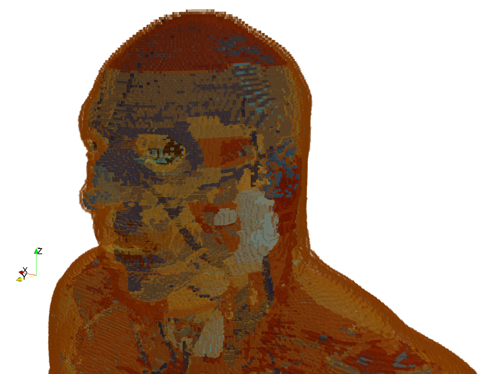

.. _user-libs:

**************
User libraries
**************

User libraries is a sub-package where useful Python modules contributed by users are stored.

antennas.py
===========

.. code-block:: python

    # Copyright (C) 2015-2016, Craig Warren
    #
    # This module is licensed under the Creative Commons Attribution-ShareAlike 4.0 International License.
    # To view a copy of this license, visit http://creativecommons.org/licenses/by-sa/4.0/.
    #
    # Please use the attribution at http://dx.doi.org/10.1190/1.3548506

The module currently features models of antennas similar to commercial antennas:

* Geophysical Survey Systems, Inc. (GSSI) 1.5 GHz (Model 5100) antenna (http://www.geophysical.com)
* MALA Geoscience 1.2 GHz antenna (http://www.malags.com/)

A description of how the models were created can be found at http://dx.doi.org/10.1190/1.3548506.

The antenna models can be accessed from within a block of Python code in your simulation. The models must be used with cubic spatial resolutions of either 1mm (default) or 2mm. For example, to use Python to include an antenna model similar to a GSSI 1.5 GHz antenna at a location 0.125m, 0.094m, 0.100m (x,y,z):

.. code-block:: none

    #python:
    from user_libs.antennas import antenna_like_GSSI_1500
    antenna_like_GSSI_1500(0.125, 0.094, 0.100)
    #end_python:

.. figure:: images/antenna_like_GSSI_1500.png
    :width: 600 px

    FDTD geometry mesh showing an antenna model similar to a GSSI 1.5 GHz antenna (skid removed for illustrative purposes).

.. figure:: images/antenna_like_MALA_1200.png
    :width: 600 px

    FDTD geometry mesh showing an antenna model similar to a MALA 1.2GHz antenna (skid removed for illustrative purposes).

AustinMan & AustinWoman
=======================

.. code-block:: python

    # This module is licensed under the Creative Commons Attribution-NonCommercial-NoDerivs 3.0 Unported License.
    # To view a copy of this license, visit http://creativecommons.org/licenses/by-nc-nd/3.0/.
    #
    # Please use the attribution at http://web.corral.tacc.utexas.edu/AustinManEMVoxels/AustinMan/citing_the_model/index.html

AustinMan and AustinWoman (http://bit.ly/AustinMan) are open source electromagnetic voxel models of the human body, which are developed by the Computational Electromagnetics Group (http://www.ece.utexas.edu/research/areas/electromagnetics-acoustics) at The University of Texas at Austin (http://www.utexas.edu). The models are based on data from the National Library of Medicine’s Visible Human Project (https://www.nlm.nih.gov/research/visible/visible_human.html).

    FDTD geometry mesh showing the head of the AustinMan model.

The AustinMan and AustinWoman models are not currently included in the user libraries sub-package, however they can be downloaded from http://bit.ly/AustinMan.

The following whole body models are available.

=========== ================= ==================
Model       Resolution (mm^3) Dimensions (cells)
=========== ================= ==================
AustinMan   8x8x8             86x47x235
AustinMan   4x4x4             171x94x470
AustinMan   2x2x2             342x187x939
AustinMan   1x1x1             683x374x1877
AustinWoman 8x8x8             86x47x217
AustinWoman 4x4x4             171x94x433
AustinWoman 2x2x2             342x187x865
AustinWoman 1x1x1
=========== ================= ==================

To use the models with gprMax:

* Download a HDF5 file (.h5) of AustinMan or AustinWoman at the resolution you wish to use.
* Download a text file of material descriptions for gprMax, either

    * ``AustinManWoman_gprMax_materials.txt`` for non-dispersive material properties at 900 MHz (http://niremf.ifac.cnr.it/tissprop/).
    * ``AustinManWoman_gprMax_materials_dispersive.txt`` for dispersive material properties that feature a 3-pole Debye model (http://dx.doi.org/10.1109/LMWC.2011.2180371). Not all materials have a dispersive description.

To insert either AustinMan or AustinWoman into a model use the ``#geometry_objects_file``. For example, to insert a 2x2x2mm^3 AustinMan with the lower left corner 40mm from the origin of the domain, and using disperive material properties, use the command:

.. code-block:: none

    #geometry_objects_file: 0.04 0.04 0.04 ../user_libs/AustinManWoman/AustinMan_v2.3_2x2x2.h5 ../user_libs/AustinManWoman/AustinManWoman_gprMax_materials_dispersive.txt

For further information on the `#geometry_objects_file` see the section on object contruction commands in the :ref:`Input commands section <commands>`.

.. figure:: images/AustinMan.png
    :width: 300 px

    FDTD geometry mesh showing the AustinMan body model.

