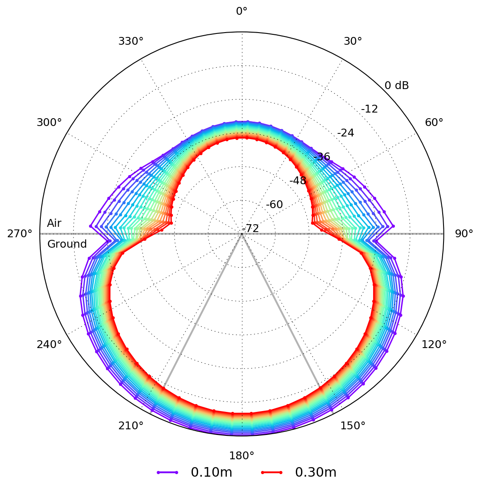

User libraries is a sub-package where useful Python modules contributed by users are stored.

****************
Antenna patterns
****************

Information
===========

**Author/Contact**: Craig Warren (craig.warren@northumbria.ac.uk), Northumbria University, UK

**License**: `Creative Commons Attribution-ShareAlike 4.0 International License <http://creativecommons.org/licenses/by-sa/4.0/>`_

**Attribution/cite**: Warren, C., Giannopoulos, A. (2016). Characterisation of a Ground Penetrating Radar Antenna in Lossless Homogeneous and Lossy Heterogeneous Environments. *Signal Processing* (http://dx.doi.org/10.1016/j.sigpro.2016.04.010)

The package features contains modules to help calculate, process, and visualise field patterns from simulations that contain models of antennas.

.. warning::

    Although the principals of calculating and visualising field patterns are straightforward, this package should be used with care. The package:

    * Does not calculate/plot conventional field patterns, i.e. at a single frequency. It uses a measure of the total energy of the electric field at a certain angle and radius, see http://dx.doi.org/10.1016/j.jappgeo.2013.08.001
    * Requires knowledge of Python to contruct input files with antenna models and positioning of receivers, as well as to edit/modify the saving and processing modules
    * Can require simulations that demand significant computational resource depending on the distance from the antenna at which the field patterns are observed, e.g. the example models, set with a maximum observation distance of 0.6m, require ~30GB of RAM

Module overview
===============

* ``initial_save.py`` is a module that calculates and stores (in a Numpy file) the field patterns from the output file of a simulation.
* ``plot_fields.py`` is a module that plots the field patterns. It should be used after the field pattern data has been processed and stored using the ``initial_save.py`` module.

The package has been designed to work with input files that follow examples found in the ``user_models`` directory:

* ``antenna_like_GSSI_1500_patterns_E.in`` is an input file that includes an antenna model similar to a GSSI 1.5 GHz antenna and receivers to calculate a field pattern in the principal E-plane of the antenna
* ``antenna_like_GSSI_1500_patterns_H.in`` is an input file that includes an antenna model similar to a GSSI 1.5 GHz antenna and receivers to calculate a field pattern in the principal H-plane of the antenna

How to use the module
=====================

* Firstly you should familiarise yourself with the example model input file. Edit the input file as desired and run one of the simulations for either E-plane or H-plane patterns.
* Whilst the simulation is running edit the 'user configurable paramters' sections of the ``initial_save.py`` and ``plot_fields.py`` modules to match the setup of the simulation.
* Once the simulation has completed, run the ``initial_save.py`` module on the output file, e.g. for the E-plane ``python -m user_libs.antenna_patterns.initial_save user_models/antenna_like_GSSI_1500_patterns_E_Er5.out``. This will produce a Numpy file containing the field pattern data.
* Plot the field pattern data by running the ``plot_fields.py`` module on the Numpy file, e.g. for the E-plane ``python -m user_libs.antenna_patterns.plot_fields user_models/antenna_like_GSSI_1500_patterns_E_Er5.npy``

.. tip::

    If you want to create different plots you just need to edit and re-run the ``plot_fields.py`` module on the Numpy file, i.e. you don't have to re-process the output file.

    Example of the E-plane pattern from a simulation containing an antenna model similar to a GSSI 1.5 GHz antenna over a homogeneous, lossless half-space with a relative permittivity of five.
