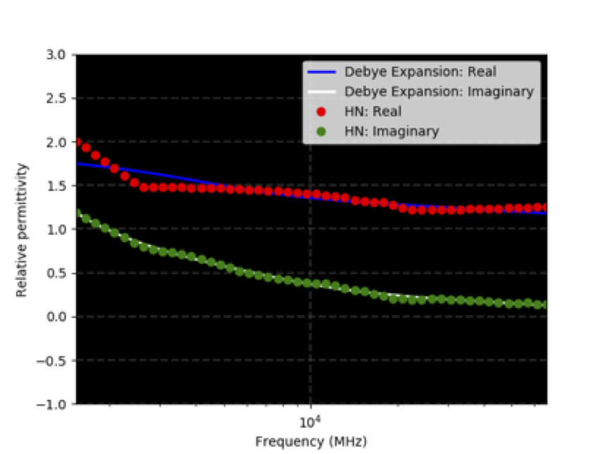
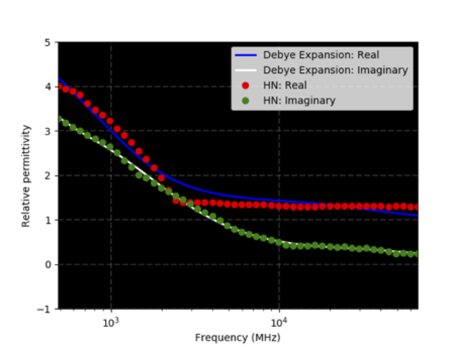
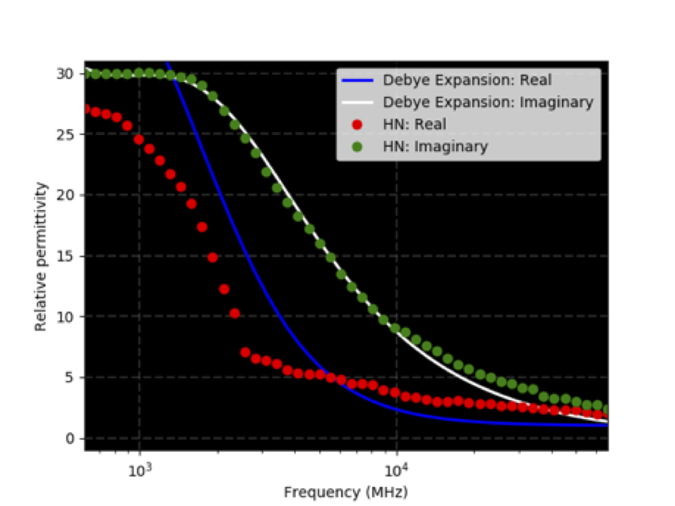
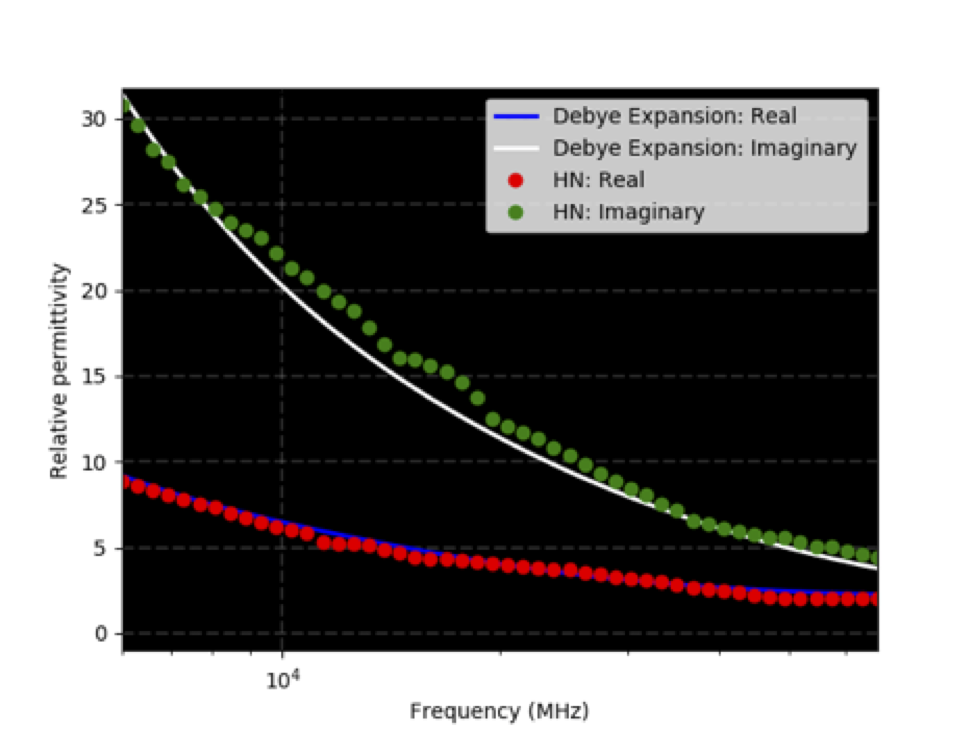
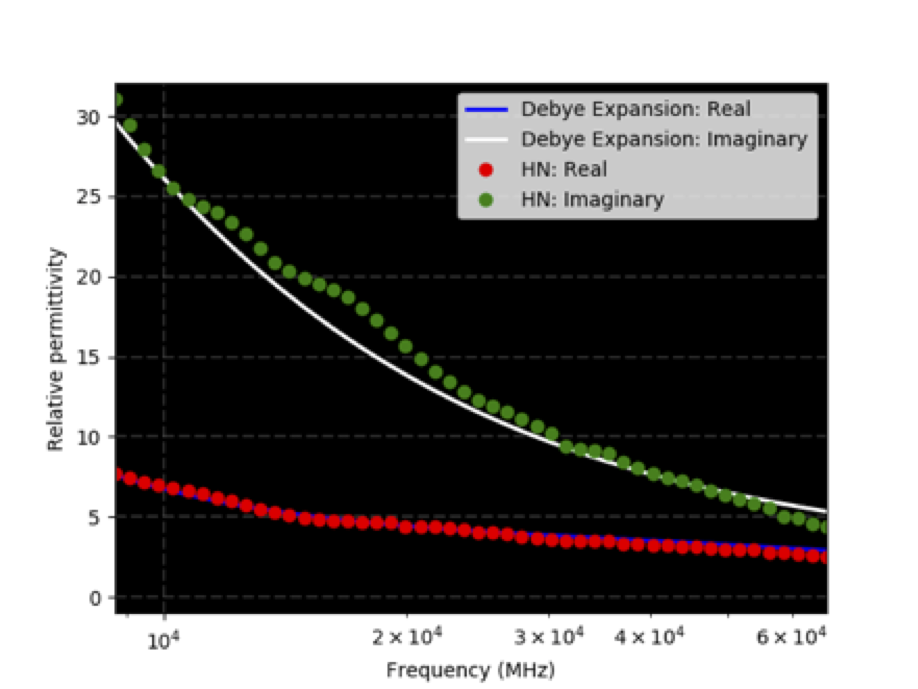

User libraries is a sub-package where useful Python modules contributed by users are stored.

*********
Materials
*********

Information
===========

The module is intended to provide a database of electromagnetic properties of different materials. It currently includes the following material libraries:

* ``eccosorb.txt`` contains information on some of the `Eccosorb LS series <http://www.eccosorb.com/products-eccosorb-ls.htm>`_ of electromagnetic absorber materials manufactured by `Laird NV <http://www.eccosorb.eu>`_ (formerly Emerson & Cuming Microwave Products NV). LS 14, 16, 18, 20, 22, 26, 28, and 30 are included. They are simulated using a 3-pole Debye model.

How to use the module
=====================

Example
-------

The simplest way to access any of the material libraries is to use the ``#include_file`` command, after which the name of the material can then be used with any object construction command:

.. code-block:: none

    #include_file: user_libs/materials/eccosorb.txt
    #box: 0 0 0 0.5 0.5 0.5 eccosorb_ls22

Eccosorb
========

`Eccosorb <http://www.eccosorb.eu>`_ are electromagnetic absorber materials manufactured by `Laird NV <http://www.eccosorb.eu>`_ (formerly Emerson & Cuming Microwave Products NV). Currently models for some of the LS series (14, 16, 18, 20, 22, 26, 28, and 30) are included in this library. The models were created by fitting a 3-pole Debye model to the real and imaginary parts of the relative permittivity taken from the `manufacturers datasheet <http://www.eccosorb.com/Collateral/Documents/English-US/Electrical%20Parameters/ls%20parameters.pdf>`_. The following figures show the fitting.

.. figure:: images/user_libs/eccosorb_ls14.png
    :width: 600 px

    3-pole Debye fit for Eccosorb LS14 absorber (HN indicates data from manufacturer datasheet)

.. figure:: images/user_libs/eccosorb_ls16.png
    :width: 600 px

    3-pole Debye fit for Eccosorb LS16 absorber (HN indicates data from manufacturer datasheet)

    3-pole Debye fit for Eccosorb LS18 absorber (HN indicates data from manufacturer datasheet)

    3-pole Debye fit for Eccosorb LS20 absorber (HN indicates data from manufacturer datasheet)

.. figure:: images/user_libs/eccosorb_ls22.png
    :width: 600 px

    3-pole Debye fit for Eccosorb LS22 absorber (HN indicates data from manufacturer datasheet)

    3-pole Debye fit for Eccosorb LS26 absorber (HN indicates data from manufacturer datasheet)

    3-pole Debye fit for Eccosorb LS28 absorber (HN indicates data from manufacturer datasheet)

    3-pole Debye fit for Eccosorb LS30 absorber (HN indicates data from manufacturer datasheet)
