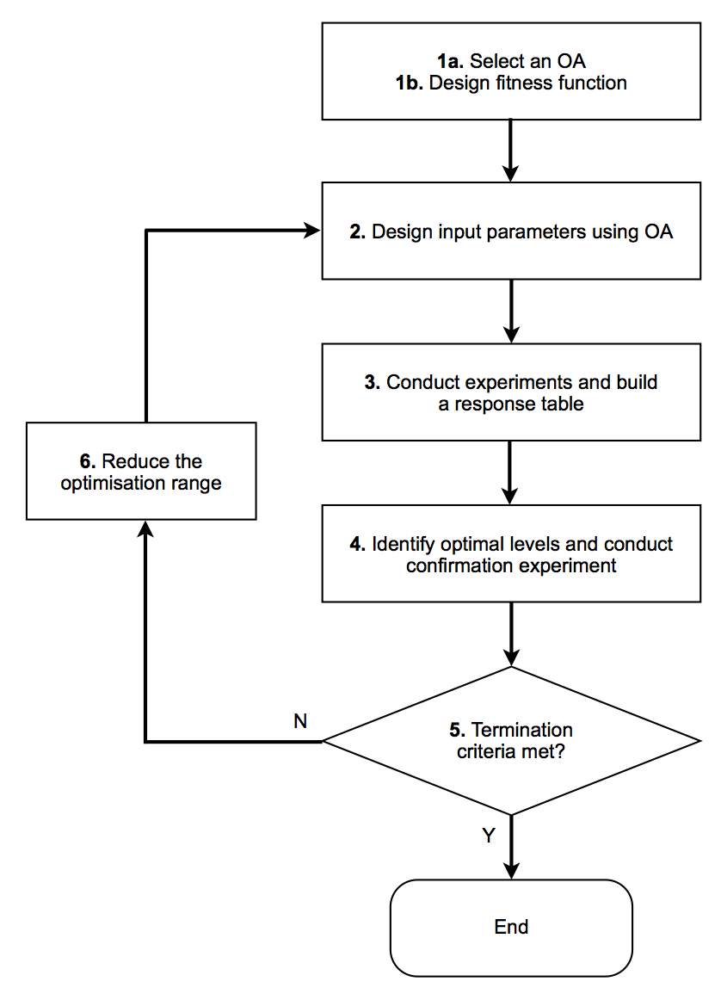
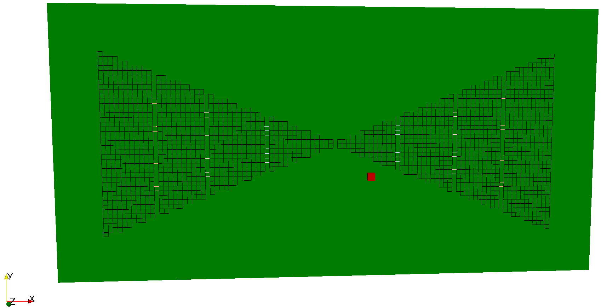
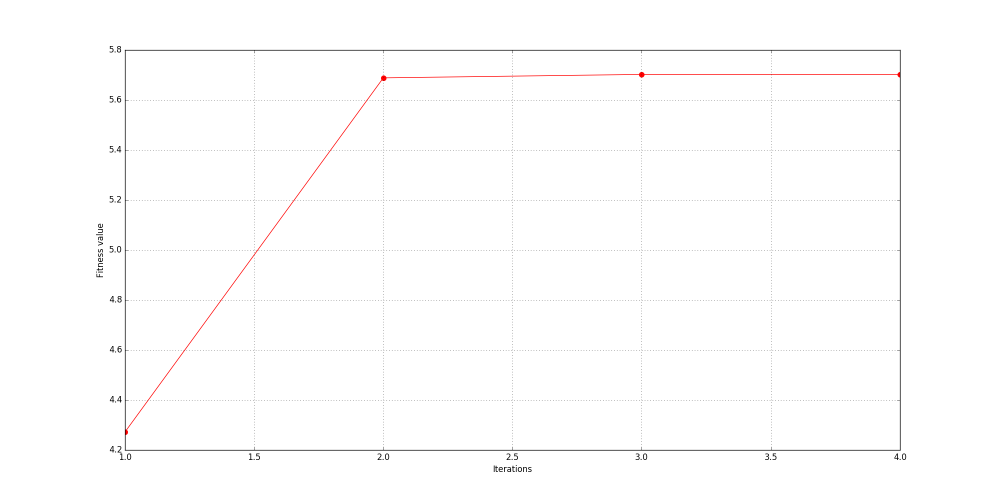
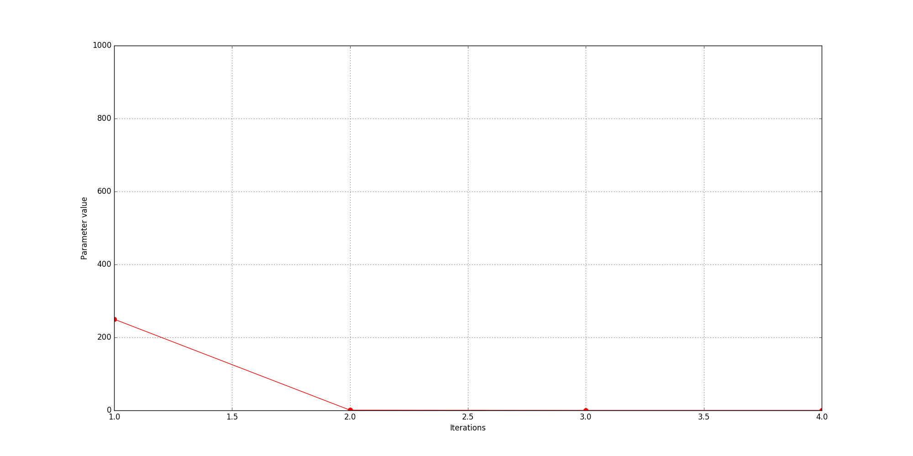

User libraries is a sub-package where useful Python modules contributed by users are stored.

*******************************
Optimisation - Taguchi's method
*******************************

Information
===========

**Author/Contact**: Craig Warren (craig.warren@northumbria.ac.uk), Northumbria University, UK

**License**: `Creative Commons Attribution-ShareAlike 4.0 International License <http://creativecommons.org/licenses/by-sa/4.0/>`_

**Attribution/cite**: Warren, C., Giannopoulos, A. (2011). Creating finite-difference time-domain models of commercial ground-penetrating radar antennas using Taguchi's optimization method. *Geophysics*, 76(2), G37-G47. (http://dx.doi.org/10.1190/1.3548506)

The package features an optimisation technique based on Taguchi's method. It allows users to define parameters in an input file and optimise their values based on a fitness function, for example it can be used to optimise material properties or geometry in a simulation.

.. warning::

    This package combines a number of advanced features and should not be used without knowledge and familiarity of the underlying techniques. It requires:

    * Knowledge of Python to contruct an input file to use with the optimisation
    * Familiarity of optimisation techniques, and in particular Taguchi's method
    * Careful sanity checks to be made throughout the process

Taguchi's method
----------------

Taguchi's method is based on the concept of the Orthogonal Array (OA) and has the following advantages:

* Simple to implement
* Effective in reduction of experiments
* Fast convergence speed
* Global optimum results
* Independence from initial values of optimisation parameters

Details of Taguchi's method in the context of electromagnetics can be found in [WEN2007a]_ and [WEN2007b]_.

Package overview
================

.. code-block:: none

    antenna_bowtie_opt.in
    fitness_functions.py
    OA_9_4_3_2.npy
    OA_18_7_3_2.npy
    plot_results.py

* ``antenna_bowtie_opt.in`` is a example model of a bowtie antenna where values of loading resistors are optimised.
* ``fitness_functions.py`` is a module containing fitness functions. There are some pre-built ones but users should add their own here.
* ``OA_9_4_3_2.npy`` and ``OA_18_7_3_2.npy`` are NumPy archives `containing pre-built OAs <http://neilsloane.com/oadir/>`_
* ``plot_results.py`` is a module for plotting the results, such as parameter values and convergence history, from an optimisation process when it has completed.

Implementation
--------------

The process by which Taguchi's method optimises parameters is illustrated in the following figure:

    Process associated with Taguchi's method.

In stage 1a, one of the 2 pre-built OAs will automatically be chosen depending on the number of parameters to optimise. Currently, up to 7 independent parameters can be optimised, although a method to construct OAs of any size is under testing.

In stage 1b, a fitness function is required to set a goal against which to compare results from the optimisation process. A number of pre-built fitness functions can be found in the ``fitness_functions.py`` module, e.g. ``minvalue``, ``maxvalue`` and ``xcorr``. Users can also easily add their own fitness functions to this module. All fitness functions must take two arguments:

* ``filename`` a string containing the full path and filename of the output file
* ``args`` a dictionary which can contain any number of additional arguments for the function, e.g. names of outputs (rxs) in the model

Additionally, all fitness functions must return a single fitness value which the optimsation process will aim to maximise.

Stages 2-6 are iterated through by the optimisation process.

Parameters and settings for the optimisation process are specified within a special Python block defined by ``#taguchi`` and ``#end_taguchi`` in the input file. The parameters to optimise must be defined in a dictionary named ``optparams`` and their initial ranges specified as lists with lower and upper values. The fitness function, it's parameters, and a stopping value are defined in dictionary named ``fitness`` which has keys for:

* ``name`` a string that is the name of the fitness function to be used
* ``args`` a dictionary containing arguments to be passed to the fitness function. Within ``args`` there must be a key called ``outputs`` which contains a string or list of the names of one or more outputs (rxs) in the model
* ``stop`` a value from the fitness function which when exceeded the optimisation should stop

Optionally a variable called ``maxiterations`` maybe specified which will set a maximum number of iterations after which the optimisation process will terminate irrespective of any other criteria. If it is not specified it defaults to a maximum of 20 iterations.

There is also a builtin criterion to terminate the optimisation process is successive fitness values are within 0.1% of one another.

How to use the package
======================

The package requires ``#python`` and ``#end_python`` to be used in the input file, as well as ``#taguchi`` and ``#end_taguchi`` for specifying parameters and setting for the optimisation process. A Taguchi optimisation is run using the command line option ``--opt-taguchi``.

Example
-------

The following example demonstrates using the Taguchi optimisation process to optimise values of loading resistors used in a bowtie antenna. The example is slighty contrived as the goal is simply to find values for the resistors that produces a maximum absolute amplitude in the response from the antenna. We already know this should occur when the values of the resistors are at a minimum. Nevertheless, it is useful to illustrate the optimisation process and how to use it.

    FDTD geometry mesh showing bowtie antenna with slots and loading resistors.

The bowtie design features three vertical slots (y-direction) in each arm of the bowtie. Each slot has different loading resistors, but within each slot there are four resistors of the same value. A resistor is modelled as two parallel edges of a cell. The bowtie is placed on a lossless substrate of relative permittivity 4.8. The antenna is modelled in free space, and an output point of the electric field (named ``Ex60mm``) is specified at a distance of 60mm from the feed of the bowtie (red coloured cell).

.. literalinclude:: ../../user_libs/optimisation_taguchi/antenna_bowtie_opt.in
    :language: none
    :linenos:

The first part of the input file (lines 1-6) contains the parameters to optimise, their initial ranges, and fitness function information for the optimisation process. Three parameters representing the resistor values are defined with ranges between 0.1 :math:`\Omega` and 1 :math:`k\Omega`. A pre-built fitness function called ``min_max_value`` is specified with a stopping criterion of 10V/m. Arguments for the ``min_max_value`` function are ``type`` given as ``absmax``, i.e. the maximum absolute values, and the output point in the model that will be used in the optimisation is specified as having the name ``Ex60mm``.

The next part of the input file (lines 8-92) contains the model. For the most part there is nothing special about the way the model is defined - a mixture of Python, NumPy and functional forms of the input commands (available by importing the module ``input_cmd_funcs``) are used. However, it is worth pointing out how the values of the parameters to optimise are accessed. On line 29 a NumPy array of the values of the resistors is created. The values are accessed using their names as keys to the ``optparams`` dictionary. On line 30 the values of the resistors are converted to conductivities, which are used to create new materials (line 34-35). The resistors are then built by applying the materials to cell edges (e.g. lines 55-62). The output point in the model in specifed with the name ``Ex60mm`` and as having only an ``Ex`` field output (line 42).

The optimisation process is run on the model using the ``--opt-taguchi`` command line flag.

.. code-block:: none

    python -m gprMax user_libs/optimisation_taguchi/antenna_bowtie_opt.in --opt-taguchi

Results
^^^^^^^

When the optimisation has completed a summary will be printed showing histories of the parameter values and the fitness metric. These values are also saved (pickled) to file and can be plotted using the ``plot_results.py`` module, for example:

.. code-block:: none

    python -m user_libs.optimisation_taguchi.plot_results user_libs/optimisation_taguchi/antenna_bowtie_opt_hist.pickle

.. code-block:: none

    Optimisations summary for: antenna_bowtie_opt_hist.pickle
    Number of iterations: 4
    History of fitness values: [4.2720928, 5.68856, 5.7023263, 5.7023263]
    History of parameter values:
    resinner [250.07498, 0.87031555, 0.1, 0.1]
    resmiddle [250.07498, 0.87031555, 0.1, 0.1]
    resouter [250.07498, 0.87031555, 0.1, 0.1]

    History of values of fitness metric (absolute maximum).

    History of values of parameters - ``resinner``, ``resmiddle``, and ``resouter`` (in this case they are all identical).

The optimisation process terminated after 4 iterations because succcessive fitness values were within 0.1% of one another. A maximum absolute amplitude value of 5.7 V/m was achieved when the three resistors had values of 0.1 :math:`\Omega`.
