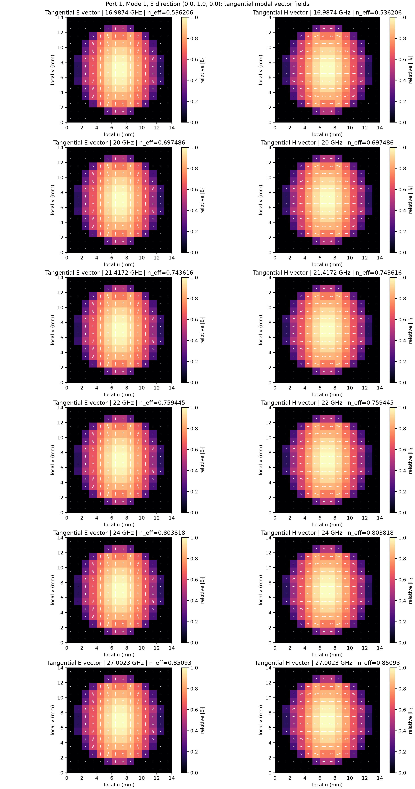
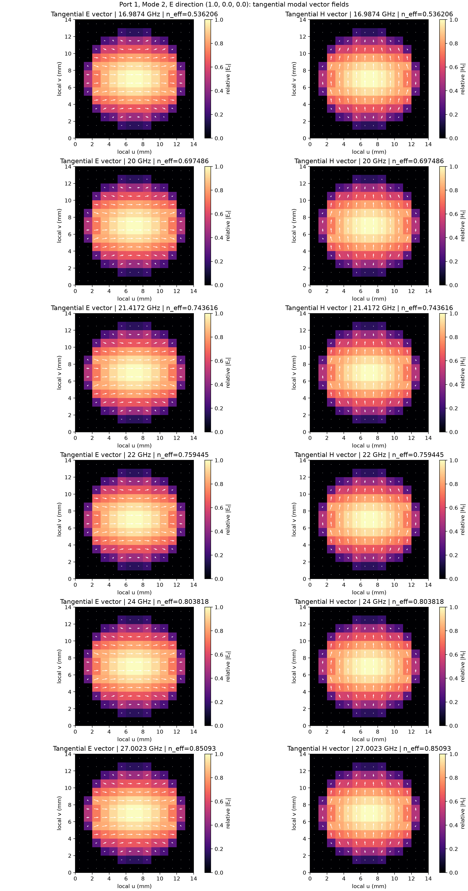

Circular TE11 with physical polarization labels
===============================================

This broadband example launches the degenerate TE11 pair in a circular,
air-filled PEC waveguide along global z. Both ports use:

.. code-block:: python

   degenerate=(1, 2),
   mode_polarizations="y",
   plot_fields=True,

The default ``mode_polarizations=None`` preserves automatic direction assignment
with ``tracking="auto"``. Here the single ``"y"`` overrides every degenerate
pair: the first member follows y and the second follows the orthogonal
direction (positive port-normal axis cross y), independent of propagation sign.
For this z-normal guide the partner is -x. ``"x"`` or ``"z"`` can likewise
select a direction when transverse to the port normal.

Mode 1 means vertical electric polarization (global y); mode 2 means
horizontal electric polarization (global -x). The directions are enforced at
every automatic frequency anchor and agree at the source and receiving port,
including the receiving port's reversed direction. Polarization describes
the integrated transverse E field, rather than every local field vector.

Choosing one of the three polarization forms
--------------------------------------------

Edit the ``EigenmodePort`` arguments inside the loop in ``circular_te11.py``
so both ports receive the same setting. Choose one of these alternatives:

.. code-block:: python

   # 1. One direction: every pair is y/-x in this z-normal guide.
   tracking="auto",
   mode_polarizations="y",

   # 2. Two directions: every pair is explicitly y/+x.
   tracking="auto",
   mode_polarizations=("y", "x"),

   # 3. Exact mode indices: only modes 1 and 2 get these assignments.
   tracking="legacy",
   degenerate=(1, 2),
   mode_polarizations={1: "y", 2: "x"},

Use one block, not all three. With automatic tracking, remove ``degenerate``;
it is ignored because the pairs are detected. Set ``mode_polarizations=None``
to retain the current automatic direction assignment. ``anchors="auto"``
controls frequency anchors and is separate from ``tracking="auto"``.

The first member is the lower tracked mode index within each pair. For one
direction the orthogonal partner is positive port normal cross that direction;
this convention does not change when the receiving port reverses propagation.
For two directions, the second is taken literally. Both must be transverse,
finite, real, nonzero and linearly independent. Out-of-plane directions and
nearly parallel or antiparallel directions raise an error before solving.
The normalized normal-component tolerance is ``1e-12``; the direction matrix
normalized direction-matrix condition-number limit is ``10``. The angle between
the directions must be approximately 11.4 to 168.6 degrees. Prefer orthogonal
directions.
Real vectors are normalized:
``(1, 1, 0)`` is one direction, whereas ``((1, 1, 0), (-1, 1, 0))`` is two.
Only numerically degenerate pairs can be mixed; isolated modes stay unchanged.

For ``circular_te11.in``, change the options on **both** port lines to one of:

.. code-block:: none

   tracking=auto mode_polarizations=y
   tracking=auto mode_polarizations=y;x
   tracking=legacy degenerate=1,2 mode_polarizations=1:y;2:x

For two vectors use ``mode_polarizations=1,1,0;-1,1,0`` with no spaces.
An exact-mode mapping with automatic tracking is rejected: choose a shared
form or switch to legacy tracking and declare the pair. To launch the second
member, change the excitation's mode to 2; the port definitions stay unchanged.

Why declare the pair?
---------------------

In a circular guide, the two TE11 patterns have the same propagation
constant but independent polarizations. The solver can return any rotated
pair of these patterns, so raw mode 1 is not inherently vertical. Its
orientation can change between frequency anchors without any physical
polarization conversion in the guide.

``degenerate`` tells gprMax to track both patterns together;
``mode_polarizations`` gives them the physical labels used here. This does
not excite both modes: the excitation's ``mode`` still selects the launched
channel. See the eigenmode user guide's explanation of degeneracy for the
difference between arbitrary basis rotation and physical mode splitting.

Model and commands
------------------

The 6 mm radius bore has a 1 mm cubic mesh. Its geometry extends uniformly
through the longitudinal PMLs. A virtual waveguide supplies the source-side
continuation; the receiving port is at the upper PML interface. The example
measures both polarizations over 20--24 GHz.

The PEC volume is built first and the air bore second. With ``averaging="y"``,
PEC wins at electric-field samples shared with the remaining wall: those
samples stay at zero field. With ``averaging="n"``, air wins at the samples
the bore writes, including shared wall samples it touches. Both settings work:
the mode solver reads the same final assignments as FDTD. They can give
different effective bore sizes and cutoff frequencies. This example and its
equivalent hash input use ``averaging="y"``.

Run from the repository root:

.. code-block:: console

   python examples/features/eigenmode_ports/example_7_degenerate_te11/circular_te11.py --geometry-only
   python examples/features/eigenmode_ports/example_7_degenerate_te11/circular_te11.py --mode 1
   python examples/features/eigenmode_ports/example_7_degenerate_te11/plot_results.py --mode 1
   python examples/features/eigenmode_ports/example_7_degenerate_te11/circular_te11.py --mode 2
   python examples/features/eigenmode_ports/example_7_degenerate_te11/plot_results.py --mode 2

Outputs default to this directory, with separate ``circular_te11_mode1`` and
``circular_te11_mode2`` stems. With ``plot_fields=True``, both geometry-only
and full runs generate the standard gprMax modal profile pictures for both
labelled modes at each retained anchor. Full runs also write HDF5 and
S-parameter CSV files; the result plotter
shows reflection/transmission into each labelled channel and Ex/Ey at the
guide-centre receiver. Expect transmission mainly into the launched
polarization. Small reflections and cross-polarized signals depend on the
mesh, anchor interpolation, PML and finite recording window.

Tracked modal profiles
----------------------

These are the standard pictures generated by the example's mode-1 run,
copied without modification from ``circular_te11_mode1_Port1_Mode1.png`` and
``circular_te11_mode1_Port1_Mode2.png``. Both modes are plotted regardless of
which channel is excited. The equivalent hash model enables these pictures
with the ``y`` plotting argument after ``auto``.

Each row shows a retained frequency anchor, including the guard anchors
outside the requested 20--24 GHz band. The left column shows transverse E;
the right shows transverse H. Here local u/v correspond to global x/y.
Arrows show field direction and colour shows relative magnitude, normalised
independently for E and H. The built-in plotter uses the aligned modal basis
and labels its requested electric direction in the title.

   Mode 1 retains global y electric polarization across all anchors.

   Mode 2 retains global x electric polarization despite its degeneracy with mode 1.

Selecting the excitation
------------------------

In Python, switching polarization requires changing only the excitation's
``mode=1`` to ``mode=2``; leave both port definitions unchanged. For diagonal
polarizations, change both ports to
``mode_polarizations=(1, 1, 0)``. For quadrature,
add a second excitation with the same waveform and ``mode=2, phase_deg=90``
while retaining the mode-1 excitation. This produces an active driven state,
so use its active-S outputs rather than this single-excitation S-parameter
plotter.

``circular_te11.in`` provides the equivalent hash model. Its final
``#eigenmode_excitation: 1 1 auto`` selects vertical polarization; change the
second integer to 2 for horizontal polarization. For custom output stems,
pass ``--output PATH`` to the Python model and ``--input PATH`` to the plotter.

Keep the circular geometry centred and its transverse spacings equal. If an
intentional asymmetry resolves the mode splitting, remove the degenerate
declaration and excite the independently solved modes instead.
