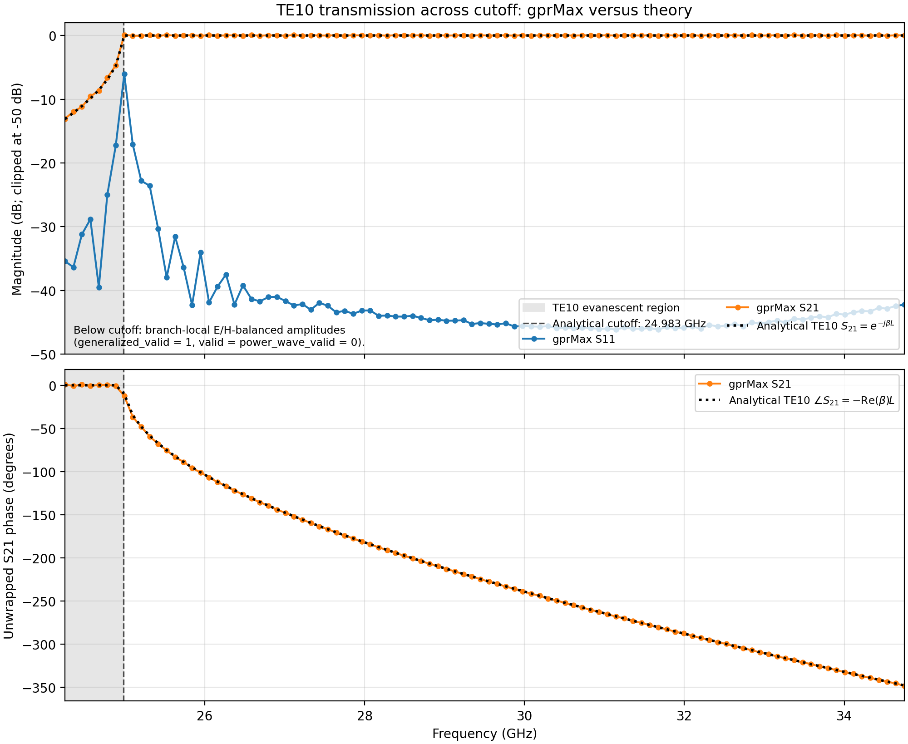

Validation models
=================

This directory contains reproducible, quantitative validation models. The
retained cases compare production gprMax outputs with independent analytical
solutions rather than with saved output from another gprMax version.

The main validations are:

* ``validate_plane_wave_dispersive_halfspace.py`` -- normal-incidence Fresnel
  reflection for dielectric, multipole Debye, Lorentz, and Drude materials;
* ``validate_plane_wave_realistic_materials.py`` -- Fresnel reflection for
  fresh water and Puerto Rico clay over their dispersive bands;
* ``validate_hertzian_dipole.py`` -- Hertzian-dipole far-field pattern and
  directivity, plus one analytical near-field time-domain component;
* ``validate_fdfd_eigenmodes.py`` -- effective index of 1D PEC
  parallel-plate and dielectric slab modes, plus 2D rectangular and cylindrical
  PEC waveguide modes, against analytical dispersion;
* ``validate_rational_network_literature.py`` -- elementary R, C, and L
  terminal sheets and the series-RC/series-RLC loaded-guide examples of
  Pereda et al. against their exact TEM reflection coefficients;
* ``validate_dielectric_sphere_rcs.py`` -- broadband dielectric-sphere
  monostatic RCS against the homogeneous-sphere Mie series;
* ``validate_debye_sphere_averaging.py`` -- three two-pole dispersive-soil
  spheres with and without dispersive interface averaging, compared with
  the homogeneous dispersive-sphere Mie series;
* ``validate_pec_sphere_rcs.py`` -- broadband PEC-sphere monostatic RCS
  against the Mie series; and
* ``rectangular_waveguide_partial_cutoff`` -- generalized TE10 transmission
  magnitude and phase across cutoff, compared with the analytical
  :math:`S_{21}=\exp(-j\beta L)` response.

The ``dispersive_averaging`` subdirectory adds mixed-family validations for
half spaces, finite multilayers, construction-order sensitivity, and a
Debye-core/Lorentz-shell sphere evaluated with the Aden--Kerker series.

``mie_pec.py`` and ``mie_dielectric.py`` supply the independent sphere series
used by both manual validation and automated tests. Behavioural and
backend-consistency suites without analytical reference solutions are kept
outside this directory under ``testing/regression`` and
``testing/backend_consistency``.

Rectangular-waveguide cutoff
----------------------------

The partial-cutoff model samples 100 frequencies across the TE10 transition.
Seven bins are below cutoff: their generalized modal coefficients remain
finite, while their separate physical-power-wave validity flags are false.
The retained plot compares gprMax directly with the analytical magnitude and
unwrapped phase; no auxiliary receiver-derived oracle is used.

   Simulated and analytical TE10 transmission through a 12 mm reference-plane
   separation. Below cutoff, :math:`\beta=-j\alpha`, so the magnitude decays as
   :math:`\exp(-\alpha L)` and the phase is zero. Above cutoff, the ideal
   magnitude is 0 dB and the phase is :math:`-\beta L`.

Running validations
-------------------

Run modules from the repository root, for example::

    python -m testing.validation.validate_plane_wave_dispersive_halfspace --gpu 0
    python -m testing.validation.validate_plane_wave_realistic_materials --gpu 0
    python -m testing.validation.validate_hertzian_dipole --gpu 0
    python -m testing.validation.validate_fdfd_eigenmodes
    python -m testing.validation.validate_rational_network_literature
    python -m testing.validation.validate_dielectric_sphere_rcs --gpu 0
    python -m testing.validation.validate_debye_sphere_averaging --gpu 0
    python -m testing.validation.validate_pec_sphere_rcs --gpu 0
    python -m testing.validation.dispersive_averaging.validate_multilayer_fdtd
    python -m testing.validation.dispersive_averaging.validate_core_shell_fdtd --gpu 0
    python -m gprMax \
        testing/validation/rectangular_waveguide_partial_cutoff/rectangular_waveguide_partial_cutoff.in \
        --hide-progress-bars
    python testing/validation/rectangular_waveguide_partial_cutoff/plot_partial_cutoff.py

Omit ``--gpu`` for CPU execution. The report-based drivers write a report,
summary, CSV data, and PNG figures. Their solver HDF5 and NumPy working data
are written below an ignored ``_cache`` directory. The partial-cutoff workflow
instead keeps its reproducible HDF5, CSV, and modal plots ignored beside the
model while retaining only the analytical comparison plot. Working data may
be retained locally for ``--reuse`` where supported, but it is not validation
evidence and must not be committed.

Each analytical script applies conservative numerical tolerances after writing
its outputs and exits with a non-zero status if the comparison fails. The
partial-cutoff plotter applies 0.45 dB magnitude and 3-degree phase limits. The
``summary.json`` and report produced by the report-based drivers record the
individual checks and the overall ``PASS``/``FAIL`` result. The full-resolution
plane-wave and PEC-sphere cases
are intentionally long-running manual validations; the focused ``tests``
suite contains smaller end-to-end analytical checks for routine CI use.

The plots and compact numerical tables are intentionally retained so that a
developer can inspect the last full validation without rerunning every large
model. A changed solver should be assessed by regenerating these files, not by
comparing only with the previous gprMax output.
