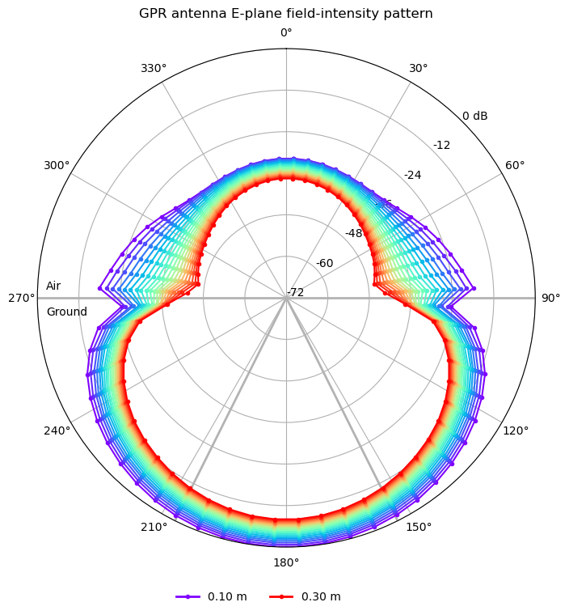

Toolboxes is a sub-package where useful Python modules contributed by users are stored.

********************
GPR Antenna Patterns
********************

Information
===========

**Author/Contact**: Craig Warren (craig.warren@northumbria.ac.uk), Northumbria University, UK

**License**: `Creative Commons Attribution-ShareAlike 4.0 International License <http://creativecommons.org/licenses/by-sa/4.0/>`_

**Attribution/cite**: Warren, C., Giannopoulos, A. (2016). Characterisation of a Ground Penetrating Radar Antenna in Lossless Homogeneous and Lossy Heterogeneous Environments. *Signal Processing* (http://dx.doi.org/10.1016/j.sigpro.2016.04.010)

The package contains scripts to calculate, process, and visualise finite-radius
field-intensity patterns from simulations containing models of GPR antennas.
Electric or magnetic field components are sampled by receiver circles around
the antenna and integrated over the time record. This makes the method useful
for antennas operating across an air--ground interface or in heterogeneous
ground, where a conventional homogeneous-background near-to-far-field
transformation is not applicable.

These outputs are not NTFF radiation patterns, gain, or directivity. They show
the angular distribution of a time-integrated tangential-field intensity at
the requested observation radii. Patterns at several radii are useful for
showing how the field distribution evolves through the near-field and
radiating regions.

.. warning::

    Although the principles of calculating and visualising field-intensity
    patterns are straightforward, this package should be used with care. The
    package:

    * Does not calculate a conventional single-frequency far-field pattern. It
      uses a time-integrated field-intensity measure at each angle and radius;
      see http://dx.doi.org/10.1016/j.jappgeo.2013.08.001.
    * Requires receiver circles large enough to contain all desired observation
      radii, which can make the FDTD domain computationally demanding.
    * Must not be interpreted as antenna gain or directivity. Use the NTFF
      antenna outputs for those quantities when the antenna and integration
      surface are entirely in a homogeneous background.

Package contents
================

* ``initial_save.py`` selects the explicitly identified pattern receivers,
  calculates the time-integrated field intensity, and stores the patterns and
  their metadata in a NumPy ``.npz`` file.
* ``plot_fields.py`` plots the processed patterns. It should be used after the
  data has been processed by ``initial_save.py``.

The package has been designed to work with the input file found in the ``examples`` directory:

* ``antenna_like_GSSI_1500_patterns.py`` includes a model similar to a GSSI
  1.5 GHz antenna and receiver circles for its principal E- or H-plane. It also
  writes a JSON metadata file used by the processing script.

How to use the package
======================

Run the E-plane example on CUDA device zero:

.. code-block:: console

    python examples/gpr/antennas/gssi_1500/antenna_like_GSSI_1500_patterns.py --pattern E --gpu 0

The default 1 mm model is intended for producing the final pattern. For a
quicker workflow check, the antenna model also supports a 2 mm grid:

.. code-block:: console

    python examples/gpr/antennas/gssi_1500/antenna_like_GSSI_1500_patterns.py --pattern E --resolution 0.002 --gpu 0

After the simulation, process the HDF5 receiver outputs. The matching JSON
metadata file is found automatically:

.. code-block:: console

    python -m toolboxes.AntennaPatterns.initial_save examples/gpr/antennas/gssi_1500/antenna_like_GSSI_1500_patterns.h5

Finally, create the polar plot:

.. code-block:: console

    python -m toolboxes.AntennaPatterns.plot_fields examples/gpr/antennas/gssi_1500/antenna_like_GSSI_1500_patterns.npz

Use ``--pattern H`` for the H-plane. The model stores the radii, angles,
pattern plane, material properties, and antenna origin in the metadata file,
so the processing and plotting scripts do not have to be edited to match the
model.

.. tip::

    Plot limits and output filenames can be changed using the command-line
    options of ``plot_fields.py`` without re-processing the HDF5 output.

    Example of the E-plane pattern from a simulation containing an antenna model similar to a GSSI 1.5 GHz antenna over a homogeneous, lossless half-space with a relative permittivity of five.
