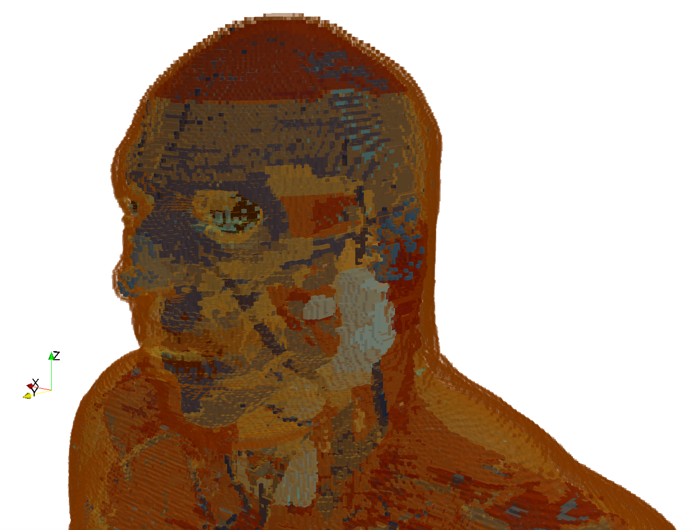
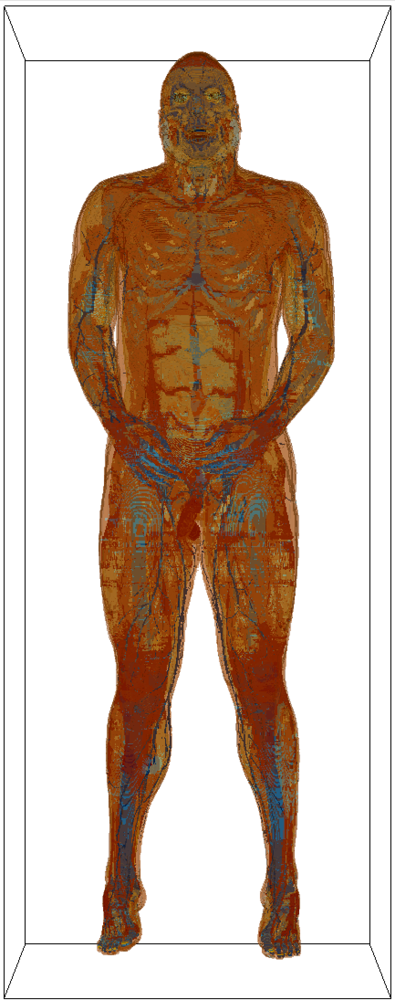

Toolboxes is a sub-package where useful Python modules contributed by users are stored.

*********************
AustinMan/AustinWoman
*********************

Information
===========

**Authors**: Jackson W. Massey, Cemil S. Geyik, Jungwook Choi, Hyun-Jae Lee, Natcha Techachainiran, Che-Lun Hsu, Robin Q. Nguyen, Trevor Latson, Madison Ball, and Ali E. Yılmaz

**Contact**: Ali E. Yılmaz (ayilmaz@mail.utexas.edu), The University of Texas at Austin

**License**: `Creative Commons Attribution-NonCommercial-NoDerivs 3.0 Unported License <https://creativecommons.org/licenses/by-nc-nd/3.0/>`_

**Attribution/cite**: Please follow the `AustinMan citation instructions <https://web.corral.tacc.utexas.edu/AustinManEMVoxels/AustinMan/citing_the_model/>`_ and cite `Massey et al. (2016) <https://doi.org/10.1109/EMBC.2016.7591444>`_.

`AustinMan and AustinWoman <https://web.corral.tacc.utexas.edu/AustinManEMVoxels/AustinMan/>`_ are publicly available electromagnetic voxel models of the human body developed by the Computational Electromagnetics Group at `The University of Texas at Austin <https://www.utexas.edu>`_. The models are based on the `National Library of Medicine's Visible Human Project <https://www.nlm.nih.gov/research/visible/visible_human.html>`_. The current AustinMan and AustinWoman release is v2.6 (2018); HDF5 files suitable for gprMax have been supplied since v2.3.

.. important::

    The model licence permits research, teaching, and other non-commercial use, but prohibits redistribution and derivative distribution. The model files are therefore not bundled with gprMax. Download them from the authors and follow their conditions of use. A cropped or otherwise modified model must not be redistributed as AustinMan or AustinWoman without the authors' permission.

    FDTD geometry mesh showing the head of the AustinMan model (2x2x2mm :math:`^3`).

The following whole body models are available:

=========== ========================== ==================
Model       Resolution (mm :math:`^3`) Dimensions (cells)
=========== ========================== ==================
AustinMan   8x8x8                      86 x 47 x 235
AustinMan   4x4x4                      171 x 94 x 470
AustinMan   2x2x2                      342 x 187 x 939
AustinMan   1x1x1                      683 x 374 x 1877
AustinWoman 8x8x8                      86 x 47 x 217
AustinWoman 4x4x4                      171 x 94 x 433
AustinWoman 2x2x2                      342 x 187 x 865
AustinWoman 1x1x1                      683 x 374 x 1730
=========== ========================== ==================

Tissue properties
=================

Biological-tissue properties are frequency dependent and vary with temperature, water content, age, physiological condition, and measurement method. The two files retained here reproduce the historical gprMax mapping used by the Austin models:

* ``AustinManWoman_materials.txt`` contains non-dispersive values at 900 MHz based on the Gabriel tissue-property compilation. It is a narrowband approximation.
* ``AustinManWoman_materials_dispersive.txt`` contains the historical three-pole Debye fits over 1 MHz--100 GHz from `Fujii (2012) <https://doi.org/10.1109/LMWC.2011.2180371>`_ for the tissues covered by that study. Tissues without a published fit retain their 900 MHz constant values.

These are legacy, reproducible model definitions rather than a current general-purpose BioEM catalogue. For new work, consult the `IT'IS Tissue Properties Database <https://itis.swiss/virtual-population/tissue-properties/database>`_. Its versioned downloads include frequency-dependent dielectric properties, references, and known limitations. At the time of writing, v5.0 is identified by DOI `10.13099/VIP21000-05-0 <https://doi.org/10.13099/VIP21000-05-0>`_. IT'IS permits access for scientific use but its website terms do not permit gprMax to redistribute the database without written consent, so its numerical data are not copied into this toolbox. Exported dielectric spectra can be fitted to a causal multi-pole Debye model with the :doc:`DebyeFit toolbox <inc_DebyeFit>`.

.. note::

    The dispersive file contains three-pole models for 24 Austin tissue labels; several labels intentionally share a fit. The remaining labels are constant 900 MHz approximations. The model time step must be smaller than every relaxation time used, which generally restricts the historical fit to the 1 mm and 2 mm voxel models.

Package contents
================

.. code-block:: none

    AustinManWoman_materials.txt
    AustinManWoman_materials_dispersive.txt
    head_only_h5.py

* ``head_only_h5.py`` is a script to assist with creating a model of only the head from a full body AustinMan/Woman model.

For example:

.. code-block:: none

    python -m toolboxes.AustinManWoman.head_only_h5 AustinMan_v2.6_2x2x2.h5

This writes ``AustinMan_v2.6_2x2x2_head.h5``. Use ``--output`` to choose a different output filename. The historical default retains the upper eighth of the model. ``--first-plane`` selects an explicit zero-based first z plane when another anatomical extent is required. The output preserves compression, root attributes, material keys, and any other metadata in a modern geometry file.

How to use the package
======================

The AustinMan and AustinWoman models themselves are not included in this sub-package.

* `Download an HDF5 file (.h5) of AustinMan or AustinWoman <https://web.corral.tacc.utexas.edu/AustinManEMVoxels/AustinMan/download/>`_ at the resolution you wish to use.

The legacy HDF5 files contain integer material indices but no stable material keys. Convert a downloaded model and one of the material files non-destructively to the current HDF5/JSON format:

.. code-block:: console

    python -m toolboxes.MaterialDatabase convert-geometry \
        AustinMan_v2.6_2x2x2.h5 \
        toolboxes/AustinManWoman/AustinManWoman_materials_dispersive.txt \
        --output-geometry AustinMan_v2.6_2x2x2_gprmax.h5 \
        --output-database AustinMan_v2_6_2mm_materials.json

The source model is not changed. The converted HDF5 file gains ``/material_keys`` and provenance attributes, and the material definitions are written to the adjacent JSON database. The material database filename without ``.json`` is then used by ``#geometry_objects_read``.

To insert either AustinMan or AustinWoman into a simulation use ``#geometry_objects_read``.

Example
-------

To insert the converted 2 mm AustinMan with its lower-left corner 40 mm from the domain origin, use:

.. code-block:: none

    #geometry_objects_read: 0.04 0.04 0.04 AustinMan_v2.6_2x2x2_gprmax.h5 AustinMan_v2_6_2mm_materials

Legacy use with the original HDF5 file and ``.txt`` material file remains supported for existing models, but the JSON form records stable keys and material provenance in simulation output and is recommended for new work.

For further information on the ``#geometry_objects_read`` command see the section on :ref:`object contruction commands<object-construction-commands>`.

    FDTD geometry mesh showing the AustinMan body model (2x2x2mm :math:`^3`).
