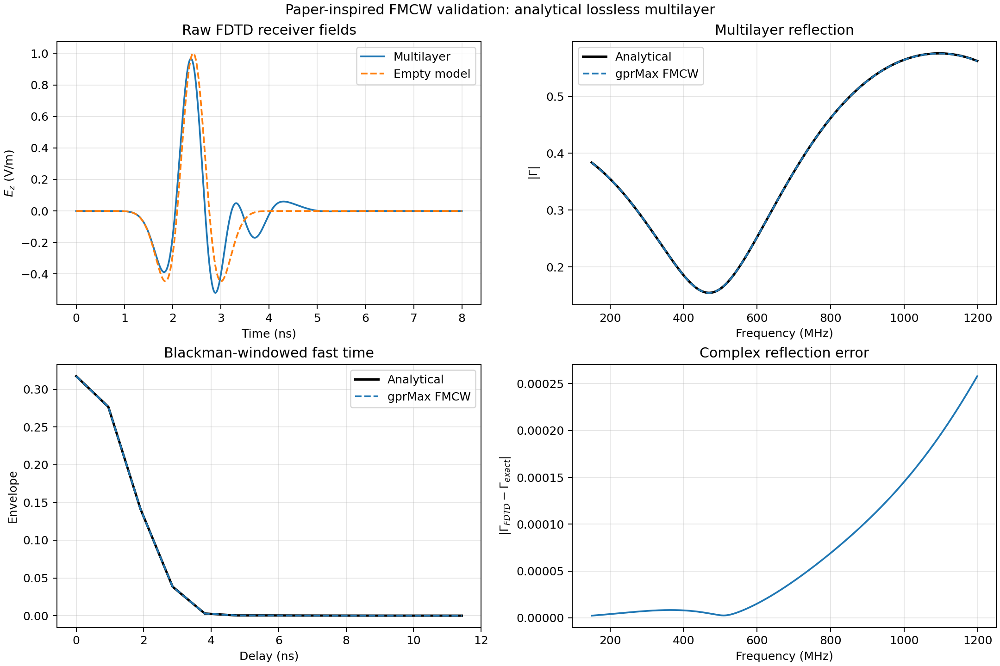

.. _fmcw:

****************************************
Frequency-Modulated Continuous-Wave GPR
****************************************

Information
===========

This toolbox synthesises frequency-modulated continuous-wave (FMCW) GPR
outputs from one broadband gprMax simulation. It follows the short-pulse FDTD
method of Eide *et al.* [EID2022FMCW]_, including background removal, source
deconvolution, instrument correction, sweep apodisation, and conversion to
fast time. It also provides ideal complex stretch-receiver I/Q samples for
general linear-FMCW studies.

The method does **not** run a long chirp through FDTD. A static linear FDTD
model has a channel response :math:`H(f)` that can be measured efficiently
with an impulse or another short broadband waveform. Every frequency in a
linear chirp then samples this same channel. This avoids an FDTD time window
comparable to a hardware sweep, which can be many orders of magnitude longer
than the electromagnetic transient of interest.

Paper-equivalent processing
===========================

For an FDTD excitation :math:`w_{\mathrm{FDTD}}(t)`, subsurface reflectivity
:math:`r(t)`, direct-wave coefficient :math:`d_d`, direct delay :math:`t_d`,
and source artefact :math:`\gamma_w(t)`, Eide *et al.* write

.. math::

    y_{\mathrm{FDTD}}(t)
    = w_{\mathrm{FDTD}}(t) *
      \left[r(t) + d_d\delta(t-t_d)\right] + \gamma_w(t).

An empty or reference-model simulation supplies the direct wave and source
artefact. After subtraction,

.. math::

    y_{\mathrm{target}}(t)-y_{\mathrm{background}}(t)
    = w_{\mathrm{FDTD}}(t)*r(t).

The toolbox first transforms the target and background records and divides
each by its *own exact stored source spectrum*. It then subtracts the two
normalised responses. This order is slightly more robust than subtracting raw
records first because it remains correct if nominally identical runs have
different sampled source amplitudes or time origins. With the engineering
convention :math:`\Re\{X\exp(+j\omega t)\}`,

.. math::

    H(f) = \frac{Y(f)}{W(f)},

where source and receiver Yee-time offsets are read from the HDF5 output and
included in the Fourier phase.

The processed FMCW spectrum is

.. math::

    Y_p(f) = A(f) I(f) H(f),

where :math:`A(f)` is the sweep window and :math:`I(f)` is an optional complex
instrument transfer function. The fast-time response is its inverse discrete
Fourier transform. This is the discrete form of (17) in [EID2022FMCW]_.

The supplied instrument response is deliberately user-defined. The toolbox
does not claim to contain a RIMFAX calibration. RIMFAX is a gated FMCW radar
covering 150--1200 MHz [HAM2020RIMFAX]_; a measured or designed response can
be supplied when that instrument is being represented.

Linear chirp and stretch receiver
=================================

For lower frequency :math:`f_0`, bandwidth :math:`B`, and sweep duration
:math:`T`, the analytic up-chirp is

.. math::

    w(\tau) = \widetilde{i}(\tau)
      \exp\left\{j\left[2\pi f_0\tau
      +\pi\frac{B}{T}\tau^2\right]\right\}.

A reflector with delay :math:`t_i` produces the deramped term

.. math::

    z_i(\tau) = a_i
      \exp\left(j2\pi\frac{B}{T}t_i\tau\right)
      \exp\left(-j\pi\frac{B}{T}t_i^2\right).

The first exponential has beat frequency
:math:`f_b=(B/T)t_i`. The second is residual video phase (RVP). It is normally
negligible for subsurface delays and long hardware sweeps, as assumed in
[EID2022FMCW]_. The toolbox can nevertheless include RVP on its discrete
delay grid for experimental short, steep chirps. A later instrument-processing
stage can compensate it by applying the opposite quadratic phase.

``--deramped`` stores the ideal analytic stretch-receiver signal. Its ``I``
and ``Q`` datasets are real and imaginary parts under a convention giving a
positive beat frequency for a delayed target during an up-chirp. The direct
fast-time and explicit stretch-receiver routes are algebraically equivalent
when RVP is neglected; this is checked automatically in the test suite.

Frequency and delay axes
========================

For :math:`N` sweep samples the toolbox uses the endpoint-exclusive grid

.. math::

    f_k = f_0 + \frac{B}{N}k, \qquad k=0,\ldots,N-1.

Consequently,

.. math::

    \Delta t_{\mathrm{fast}} = \frac{1}{B},

.. math::

    T_{\mathrm{unambiguous}} = \frac{N}{B}.

The delay resolution depends on bandwidth, not sweep duration. The sweep
duration controls chirp slope and maps delay to beat frequency. A homogeneous
two-way range axis can be requested with relative permittivity
:math:`\epsilon_r`, using

.. math::

    R = \frac{c}{2\sqrt{\epsilon_r}}t.

For layered or dispersive media this range is only a display approximation;
the stored delay axis is authoritative.

Preparing target and background models
======================================

An impulse is the most direct excitation, but any stored broadband source is
valid over frequencies where its spectrum is sufficiently strong. The FDTD
time window must capture the physical transient and its relevant late
arrivals; it does not have to equal the FMCW sweep duration.

For a discrete plane wave, or another excitation without a scalar stored-
source history, add ``--incident-reference`` and supply its empty/reference
run with ``--background``. The toolbox then calculates

.. math::

    H_{\mathrm{scattered}}(f)
    = \frac{Y_{\mathrm{total}}(f)-Y_{\mathrm{incident}}(f)}
           {Y_{\mathrm{incident}}(f)}.

The target and incident receiver coordinates and components must represent
the same observation point. This is the route used by the retained analytical
plane-wave validation.

The examples directory contains a small 2D layered target and its empty
background:

* :download:`layered_fmcw_2D.in
  <../../toolboxes/FMCW/examples/layered_fmcw_2D.in>`;
* :download:`layered_fmcw_background_2D.in
  <../../toolboxes/FMCW/examples/layered_fmcw_background_2D.in>`.

Run both models and inspect the stored paths:

.. code-block:: console

    python -m gprMax toolboxes/FMCW/examples/layered_fmcw_2D.in
    python -m gprMax toolboxes/FMCW/examples/layered_fmcw_background_2D.in
    python -m toolboxes.FMCW inspect layered_fmcw_2D.h5

Then synthesise a RIMFAX-band-like 100 ms up-chirp:

.. code-block:: console

    python -m toolboxes.FMCW process layered_fmcw_2D.h5 \
        --background layered_fmcw_background_2D.h5 \
        --source /srcs/src1 --receiver /rxs/rx1 --component Ez \
        --f-start 150e6 --f-stop 1.2e9 --samples 1024 \
        --sweep-time 100e-3 --window blackman --tail-taper 0.05 --deramped \
        --output layered_fmcw_2D_fmcw.h5 \
        --plot layered_fmcw_2D_fmcw.png

Instrument and receiver responses
=================================

``--instrument-response`` accepts a CSV frequency response with either

.. code-block:: text

    frequency_hz,real,imag

or

.. code-block:: text

    frequency_hz,magnitude,phase_deg

Complex interpolation is performed in magnitude and unwrapped phase. The
file must cover the complete requested band.

``--receiver-delay-response`` accepts ``delay_s`` plus ``gain``,
``real,imag``, or ``magnitude,phase_deg``. It can represent range gating or an
IF/ADC response after beat frequency has been mapped to delay. Keeping this
separate from :math:`I(f)` avoids confusing RF frequency-dependent antenna or
electronics corrections with beat/delay-dependent receiver behaviour.

Output
======

The processed HDF5 file stores:

* chirp limits, slope, duration, direction, and endpoint convention;
* target and optional background source/receiver spectra;
* the source-normalised, background-subtracted ``channel_response``;
* instrument response, sweep weights, processed spectrum, complex envelope,
  complex/real bandpass responses, and delay/range under ``fast_time``; and
* optional complex signal, I/Q, instantaneous frequency, beat-frequency bins,
  and mapped delays under ``deramped_sweep``.

Analytical multilayer validation
================================

``testing/validation/fmcw/validate_paper_multilayer.py`` is a canonical 2D
validation inspired by the lossless multilayer processing sequence in Fig. 4
of [EID2022FMCW]_. It is not an exact reproduction of the paper's 3D bistatic
antenna experiment. An empty gprMax model supplies the incident field; a
fine-grid multilayer model supplies the total field; and their ratio is
compared with the exact recursive normal-incidence reflection coefficient,
including propagation phase and all internal reflections. The calculation
uses the paper's 150--1200 MHz band, 100 ms sweep duration, and Blackman taper.

    Broadband gprMax fields, the source-normalised multilayer response, and
    the corrected fast-time result compared with the analytical multilayer
    solution.

For a 1 mm grid in double precision on CUDA, the complex relative error over
the full band is :math:`2.46\times10^{-4}`, the magnitude RMSE is
:math:`8.98\times10^{-5}`, and the Blackman-windowed fast-time complex error
is :math:`1.38\times10^{-4}`. The small remaining difference grows smoothly
with frequency and is attributable to FDTD spatial/time discretisation; the
direct and explicit stretch-processing implementations agree to floating-
point precision in the unit tests.

Scope and limitations
=====================

The method is exact for the sampled linear, time-invariant FDTD system over a
valid source bandwidth and a sufficiently long transient record. It naturally
includes linear material dispersion, antennas, PMLs, and scattering in the
calculated channel.

One channel response does not by itself model target motion between chirps,
Doppler evolution, oscillator phase noise, nonlinear receiver saturation,
ADC quantisation, or time-varying media. Those effects can be applied to a
sequence of channel responses or to the stored synthetic I/Q in a subsequent
instrument model. Up- and down-chirps are supported, but triangular multi-ramp
waveforms are assembled by processing their constituent sweeps.
