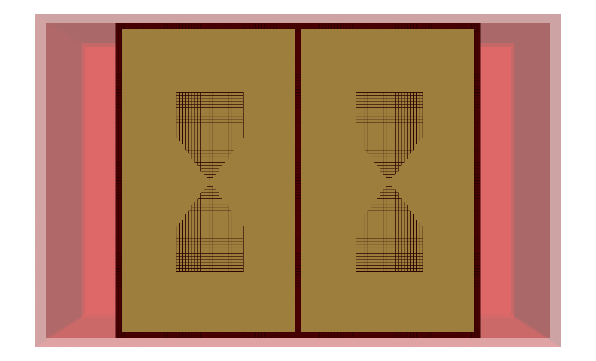
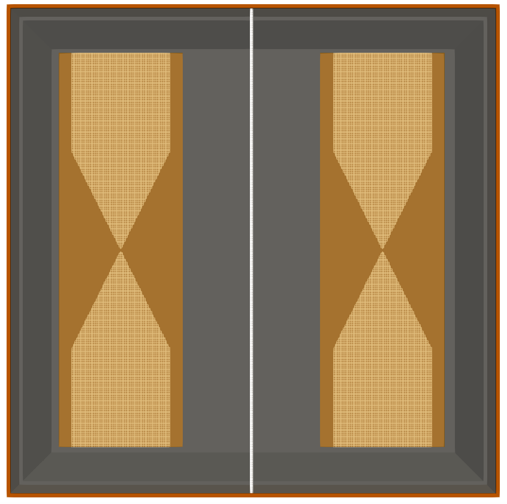
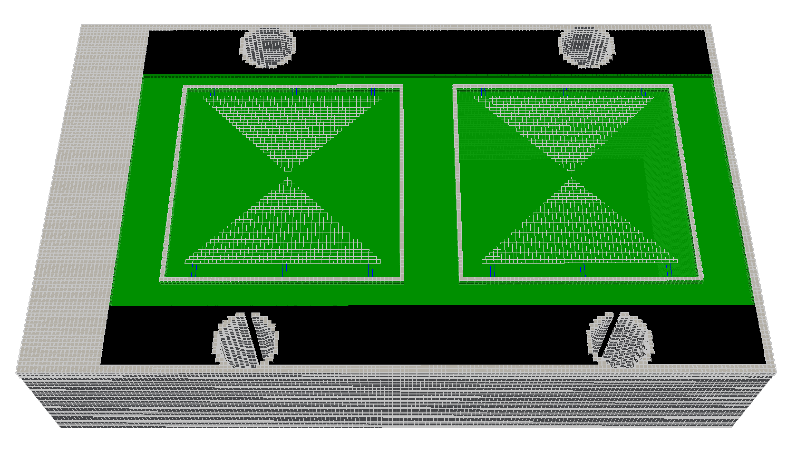

Toolboxes is a sub-package where useful Python modules contributed by users are stored.

******************
GPR Antenna Models
******************

Information
===========

The package features models of antennas similar to commercial GPR antennas. The following antenna models are included:

======================== ============= ============= ========================================================================================================================================================================================================================= ================
Manufacturer/Model       Dimensions    Resolution(s) Author/Contact                                                                                                                                                                                                            Attribution/Cite
======================== ============= ============= ========================================================================================================================================================================================================================= ================
GSSI 1.5GHz (Model 5100) 170x108x45mm  1, 2mm        Craig Warren (craig.warren@northumbria.ac.uk), Northumbria University, UK                                                                                                                                                 1
GSSI 2GHz palm antenna   86x86x68mm    1mm           Ourania Patsia, Antonios Giannopoulos, and Iraklis Giannakis, The University of Edinburgh, UK                                                                                                                              3
MALA 1.2GHz              184x109x46mm  1, 2mm        Craig Warren (craig.warren@northumbria.ac.uk), Northumbria University, UK                                                                                                                                                 —
GSSI 400MHz              300x300x170mm 2mm           Sam Stadler (sam.stadler@leibniz-liag.de), `Leibniz Institute for Applied Geophysics <https://www.leibniz-liag.de/en/research/methods/electromagnetic-methods/ground-penetrating-radar.html>`_, Germany                   2
======================== ============= ============= ========================================================================================================================================================================================================================= ================

**License**: `Creative Commons Attribution-ShareAlike 4.0 International License <http://creativecommons.org/licenses/by-sa/4.0/>`_

**Attributions/citations**:

1. Giannakis, I., Giannopoulos, A., & Warren, C. (2019). Realistic FDTD GPR antenna models optimised using a novel linear/non-linear Full Waveform Inversion. *IEEE Transactions on Geoscience and Remote Sensing*, 57(3), 1768-1778. (https://doi.org/10.1109/TGRS.2018.2869027)
2. Stadler, S., & Igel, J. (2022). Developing realistic FDTD GPR antenna surrogates by means of particle swarm optimization. *IEEE Transactions on Antennas and Propagation*, 70(6), 4259-4272. (https://doi.org/10.1109/TAP.2022.3142335)
3. Patsia, O., Giannopoulos, A., & Giannakis, I. (2024). Developing a realistic numerical equivalent of a GPR antenna transducer using global optimizers. *Near Surface Geophysics*, 22(2), 140-151. (https://doi.org/10.1002/nsg.12280)

Package contents
================

* ``GSSI.py`` is a module containing models of antennas similar to those manufactured by `Geophysical Survey Systems, Inc. (GSSI) <http://www.geophysical.com>`_.
* ``MALA.py`` is a module containing models of antennas similar to those manufactured by `MALA Geoscience <http://www.malags.com/>`_.

Descriptions of how the models were created can be found in the aforementioned attributions.

How to use the package
======================

The antenna models can be accessed from within a block of Python code in an input file. The models are inserted at location x,y,z. The coordinates are relative to the geometric centre of the antenna in the x-y plane and the bottom of the antenna skid in the z direction. The supported cubic spatial resolutions are listed in the table above and are selected with the keyword argument, e.g. ``resolution=0.002``.

.. note::

    If you are moving an antenna model within a simulation, e.g. to generate a B-scan, you should ensure that the step size you choose is a multiple of the spatial resolution of the simulation. Otherwise when the position of antenna is converted to cell coordinates the geometry maybe altered.

Example
-------

To include an antenna model similar to a GSSI 1.5 GHz antenna at a location 0.125m, 0.094m, 0.100m (x,y,z) using a 2mm cubic spatial resolution:

.. code-block:: none

    import gprMax
    from toolboxes.GPRAntennaModels.GSSI import antenna_like_GSSI_1500

    scene = gprMax.Scene()

    # Import antenna model and add to model
    dl = 0.002
    ant_pos = (0.125, 0.094, 0.100)
    gssi_objects = antenna_like_GSSI_1500(ant_pos[0], ant_pos[1], ant_pos[2],
                                          resolution=dl)
    for obj in gssi_objects:
        scene.add(obj)

    FDTD geometry mesh showing an antenna model similar to a GSSI 1.5 GHz antenna (skid removed for illustrative purposes).

    FDTD geometry mesh showing an antenna model similar to a GSSI 400 MHz antenna (skid removed for illustrative purposes).

    FDTD geometry mesh showing an antenna model similar to a MALA 1.2GHz antenna (skid removed for illustrative purposes).
