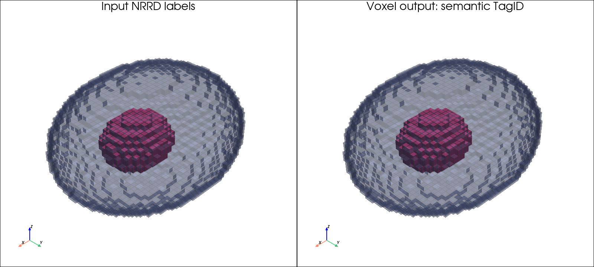
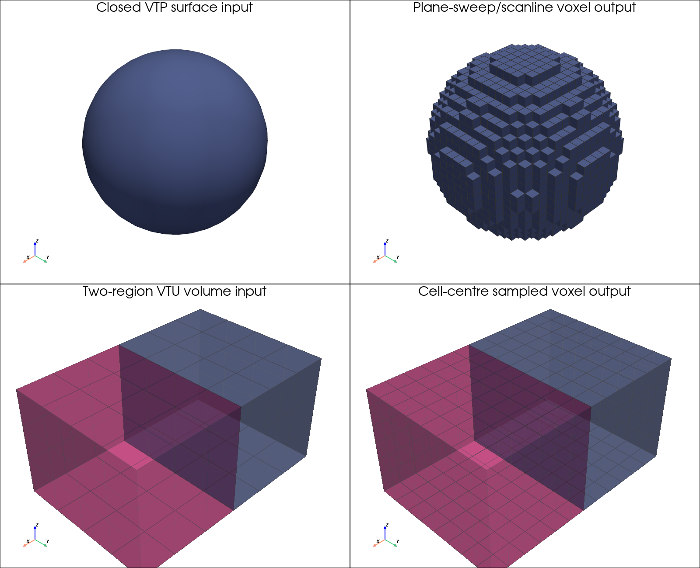

Tagged medical and mesh geometry import
=======================================

``GeometryImport`` converts labelled image volumes and general scientific
meshes into the cell-centred geometry format used by gprMax. Material identity
and semantic geometry identity are kept independent. Two organs can therefore
use the same electromagnetic material while retaining separate geometry tags
for field selection, deposited-power integration, or SAR reporting.

The generated ``geometry.h5`` contains the normal ``data`` and
``material_keys`` arrays and, when semantic regions exist, ``tag_data`` and
``tag_names``. The file can be imported with
``GeometryObjectsRead``/``#geometry_objects_read``. Tag ID zero means
``untagged`` and negative material cells do not overwrite existing gprMax
geometry.

Dependencies
------------

The recommended conda environment installs the format readers. The individual
dependencies are:

* ``nibabel`` for NIfTI;
* ``pynrrd`` for NRRD and 3D Slicer segmentation NRRD;
* ``SimpleITK`` for MetaImage;
* ``meshio`` and ``pyvista``/VTK for Gmsh and VTK-family meshes.

They are imported only when the corresponding converter is used and add no
runtime work to the FDTD solver.

Labelled volume workflow
------------------------

NIfTI (``.nii``/``.nii.gz``), NRRD (``.nrrd``/``.nhdr``), and MetaImage
(``.mha``/``.mhd``) integer label maps are supported. A 3D Slicer
segmentation should be exported as a single merged 3D labelmap; overlapping
four-dimensional segmentation NRRD is not accepted directly. Inspect a
volume with:

.. code-block:: console

    python -m toolboxes.GeometryImport volume inspect anatomy.nii.gz

Create an editable label mapping:

.. code-block:: console

    python -m toolboxes.GeometryImport volume prepare \
        anatomy.nii.gz anatomy_labels.csv

The table independently maps each source label to ``material_name`` and
``geometry_tag``. Label zero is included in the table but is excluded by
default. It may intentionally be included and tagged when zero represents a
meaningful free-space or fluid region rather than external background.

Convert the volume with:

.. code-block:: console

    python -m toolboxes.GeometryImport volume convert \
        anatomy.nii.gz anatomy_labels.csv anatomy_output

NIfTI and NRRD physical units are read from their metadata. Use ``--unit`` to
override them. MetaImage does not standardise a physical unit, so ``--unit m``,
``--unit mm``, or ``--unit um`` is required. Axis permutations and reversals
are handled without interpolation. Oblique or sheared volumes are rejected
and must first be resampled onto an axis-aligned grid with nearest-neighbour
label interpolation. These formats locate the first image sample at the
centre of its voxel. The converter records that position as
``first_cell_centre_m`` and the corresponding lower FDTD-cell boundary as
``grid_origin_m`` in ``conversion.json`` and ``origin_xyz`` in
``geometry.h5``. The HDF5 origin is provenance metadata;
``GeometryObjectsRead`` still inserts the local voxel grid at the explicit
``p1`` chosen by the model author.

Mesh workflow
-------------

Gmsh ``.msh`` and VTK ``.vtk``, ``.vtp``, and ``.vtu`` files are meshes, not
FDTD cell grids, and are therefore voxelised:

* a closed surface mesh is scanline-filled at the requested FDTD cell size;
* an unstructured volume mesh is sampled at the FDTD cell centres;
* Gmsh physical groups or a selected VTK cell-data array define semantic
  regions.

The two mesh cases use different voxelisation algorithms:

* closed surface regions are triangulated and checked for watertightness, then
  filled using the same axis-selectable plane-sweep and scanline algorithm as
  ``STEPtoVoxel``; this is an even--odd interior fill, not a conventional
  per-voxel ray cast;
* unstructured volume meshes are sampled at FDTD cell centres. VTK locates the
  containing tetrahedron, hexahedron, wedge, or other volume element and copies
  its discrete cell-region ID. Sampling is performed in bounded z-chunks to
  limit temporary memory.

Mesh formats do not provide a universal coordinate unit. It must always be
specified explicitly:

.. code-block:: console

    python -m toolboxes.GeometryImport mesh inspect model.msh --unit mm
    python -m toolboxes.GeometryImport mesh prepare \
        model.msh regions.csv --unit mm
    python -m toolboxes.GeometryImport mesh convert \
        model.msh regions.csv output --unit mm --voxel-size 0.001

For VTK data, use ``--region-array TissueId`` when the desired integer labels
are stored under a non-standard cell-data name. ``gmsh:physical`` and several
common region-array names are detected automatically. Named Gmsh physical
groups become the default geometry tags.

Surface meshes must be watertight. Unstructured meshes can contain tetrahedra,
hexahedra, wedges, or other VTK volume cells because VTK performs the
cell-containment query. Standard FEM files may also contain lower-dimensional
boundary elements. When dimensions are mixed, only the highest-dimensional
cells are voxelised: for example, tetrahedra are retained and their boundary
triangles are ignored. Named physical groups are resolved within that retained
dimension. The converter samples in bounded z chunks to avoid constructing
every FDTD cell centre at once. Surface boundary groups are not converted to
gprMax ``Plate`` or ``Edge`` objects by this workflow.

Outputs and material assignment
-------------------------------

Each conversion produces:

* ``geometry.h5`` -- material indices and compact semantic tag IDs, for input
  through ``GeometryObjectsRead``;
* ``geometry_preview.vti`` -- the same cell-centred ``MaterialIndex`` and
  ``TagID`` arrays for inspection in ParaView (written when the recommended
  PyVista/VTK dependency is available);
* ``materials.json`` -- an editable gprMax material database;
* ``conversion.json`` -- source regions, tags, coordinates, spacing, and cell
  counts.

External formats generally do not provide reliable electromagnetic
constitutive properties. The generated material entries therefore contain
``null`` values and must be reviewed before the geometry is used in a model.
Rerunning a conversion preserves an existing compatible JSON database rather
than discarding user edits. For SAR work, each relevant database entry must
also define ``mass_density_kg_per_m3`` in SI units. Geometry tags then allow
the resulting absorbed-power and SAR quantities to be selected or integrated
by anatomical region independently of the material mapping.

The preview uses the source geometry's physical origin. The HDF5 origin is
also retained as provenance, but gprMax inserts ``geometry.h5`` at the ``p1``
specified by ``GeometryObjectsRead``. A normal gprMax ``GeometryView`` output
therefore shows the geometry at its final model coordinates and includes the
reconstructed Yee material information as well as ``TagID``.

Interface averaging
-------------------

GeometryImport writes cell-centred voxel geometry rather than prescribing
individual Yee-component IDs. Imported tissue and dielectric interfaces can
therefore use gprMax's normal smoothing when the geometry is inserted:

.. code-block:: python

    scene.add(gprMax.DispersiveAveraging(enabled=True))
    scene.add(gprMax.GeometryObjectsRead(
        p1=(0.01, 0.01, 0.01),
        geofile="output/geometry.h5",
        material_database="materials",
        averaging="y",
    ))

The per-import default is ``averaging="n"`` for backward compatibility.
The global ``DispersiveAveraging`` option is needed only when dispersive
materials should also be mixed at interfaces. Geometry tags and mass density
remain cell-centred and are not averaged.

Nested anatomy and priorities
-----------------------------

Separate surface meshes may overlap after voxelisation. Their assignment
priority defines the final cell owner: higher-priority regions overwrite
lower-priority regions. This is important for nested anatomy, where a general
``other_tissue`` or body envelope should normally have lower priority than
specific organs. The resulting tags describe the final voxelised geometry;
they do not retain triangle, element, or primitive provenance.

Anatomical hierarchy is intentionally separate from the per-cell tag map.
For example, ``head`` can be defined in post-processing as a group containing
``brain``, ``eyes``, ``skull``, and other leaf tags. This avoids storing more
than one semantic ID per FDTD cell.

Privacy and licensing
---------------------

Clinical DICOM must be de-identified before it is exported for modelling.
Direct DICOM SEG import is not yet provided; 3D Slicer can export a DICOM
segmentation as NRRD or NIfTI while retaining a label table.

Many commercial or research anatomical phantoms prohibit redistribution of
the original or converted model. The converter can be used on locally licensed
data, but neither the input geometry nor the resulting HDF5/tag volume should
be committed unless its licence explicitly permits redistribution. Tests and
examples in gprMax use synthetic geometry or separately licensed open data.

Reproducible examples
---------------------

The examples directory contains scripts which generate their own small inputs,
so no external or licensed anatomy is required:

.. code-block:: console

    python -m toolboxes.GeometryImport.examples.labelled_volume_example
    python -m toolboxes.GeometryImport.examples.mesh_example

The first creates a synthetic two-region NRRD label map, converts it, and
completes its illustrative material database. The second exercises both a
closed VTP surface and a two-region VTU volume. Its generated material
templates deliberately retain ``null`` constitutive values for the user to
review.

The input-versus-voxel documentation figures are reproducible with:

.. code-block:: console

    python -m toolboxes.GeometryImport.examples.render_examples \
        --output images_shared

    Synthetic NRRD source labels and the corresponding cell-centred semantic
    tag volume. The inner organ remains independently selectable even where it
    uses an electromagnetic material shared with another region.

    The surface path uses plane-sweep/scanline filling; the unstructured-volume
    path queries the containing element at each FDTD cell centre.

Locally licensed multi-part anatomy
-----------------------------------

An anatomy supplied as one closed STL file per tissue can use the enhanced
``STLtoVoxel`` workflow. For example, for a local directory named
``anatomy_stl`` whose coordinates are in millimetres:

.. code-block:: console

    python -m toolboxes.STLtoVoxel.stltovoxel anatomy_stl \
        --unit mm --prepare anatomy.csv
    python -m toolboxes.STLtoVoxel.stltovoxel anatomy_stl \
        -dxdydz 0.002 --unit mm --assignments anatomy.csv

The assignment table should be reviewed before the second command. General
body envelopes must precede enclosed organs so that later, higher-priority
tissues own the final overlapping cells. The resulting tags keep tissues
independently addressable even when several use the same electromagnetic
material. Input meshes and converted HDF5 files remain subject to the
phantom's licence and are not automatically redistributable.
