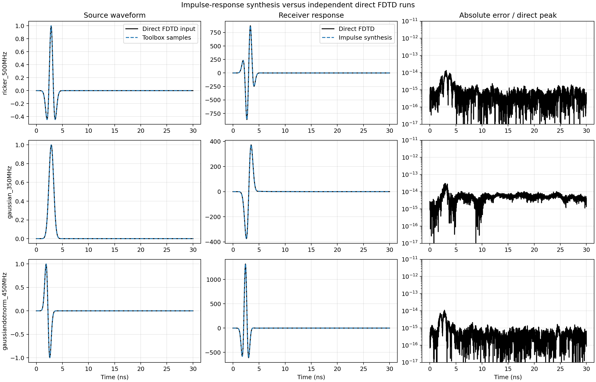

.. _impulse_response:

***********************************
Impulse-response waveform synthesis
***********************************

Information
===========

This toolbox uses one impulse-excited gprMax model to generate receiver
histories for many different source pulses. It is useful when the geometry,
materials, source type, and receiver arrangement remain fixed, but the source
waveform must be varied. The expensive FDTD solution is then run once; the
additional pulses require only post-processing.

For a linear, time-invariant discrete FDTD model,

.. math::

    y_x[n]=(h*x)[n]=\sum_m h[n-m]x[m],

where :math:`x[n]` is the scalar driving waveform, :math:`h[n]` is the
discrete transfer response between that source and a receiver, and
:math:`y_x[n]` is the receiver output. If the reference source contains the
one-sample impulse

.. math::

    x_\delta[n]=A\delta[n-n_\delta],

then its stored receiver output is

.. math::

    y_\delta[n]=A h[n-n_\delta].

The toolbox therefore calculates each requested output directly from the
stored impulse run:

.. math::

    y_x[n]=\frac{1}{A}\sum_m y_\delta[n+n_\delta-m]x[m].

It reads :math:`A` and :math:`n_\delta` from the actual source samples; it
does not assume a continuous-time unit-area Dirac delta or that the impulse
must occur at array index zero. The full causal convolution is formed before
it is cropped to the original receiver time window.

The method is exact, to floating-point precision, for the same discrete
linear FDTD system. It includes linear dispersive materials, PMLs, and all
multiple scattering already present in the impulse response. It is the
general waveform form of the impulse-response principle used by the
:ref:`SFCW toolbox <sfcw>`.

Timing
======

The target waveform must be sampled on the same update lattice as the
reference source. gprMax output records both:

* ``TimeSampleOffset`` -- the physical Yee time associated with a stored
  driving sample; and
* ``WaveformEvaluationTimeOffset`` -- the time at which the waveform function
  was evaluated during that update.

These are normally identical. A hard voltage source is the important
exception: its waveform value for update :math:`n` is evaluated at
:math:`n\Delta t`, but it is imposed on :math:`E^{n+1}` and therefore has a
physical ``TimeSampleOffset`` of :math:`\Delta t`. The toolbox uses the
evaluation offset when constructing target samples and retains the physical
offset in the output. Older files without the new evaluation attribute are
handled using the source type and driving quantity.

The output receiver samples retain their original electric, magnetic, or
current Yee-time offset. No additional half-step phase correction is needed.

Preparing an impulse model
==========================

Use one active scalar source with the built-in ``impulse`` waveform. The
source position, type, resistance or network, polarisation, start time,
geometry, and materials must be those required in every synthesised model.
Only the waveform may change.

The supplied example contains a PEC cylinder in a dielectric half-space:

:download:`Download the impulse-response example
<../../toolboxes/ImpulseResponse/examples/cylinder_impulse_2D.in>`.

.. code-block:: none

    #waveform: impulse 1 1 impulse
    #hertzian_dipole: z 0.200 0.320 inf impulse
    #rx: 0.240 0.320 inf response Ez

Run it normally:

.. code-block:: none

    python -m gprMax \
        toolboxes/ImpulseResponse/examples/cylinder_impulse_2D.in

The reference must contain exactly one significant source sample. The
toolbox also rejects another active scalar source because its contribution
cannot be separated from the selected impulse response. Multiple-source
superposition can instead be performed from one separate impulse run per
source.

Command-line usage
==================

Inspect the stored sources and receiver components:

.. code-block:: none

    python -m toolboxes.ImpulseResponse inspect cylinder_impulse_2D.h5

Generate two built-in gprMax pulses from that one run:

.. code-block:: none

    python -m toolboxes.ImpulseResponse process cylinder_impulse_2D.h5 \
        --source /srcs/src1 \
        --waveform ricker 1 500e6 ricker_500MHz \
        --waveform gaussian 1 350e6 gaussian_350MHz \
        --receiver /rxs/rx1:Ez \
        --stop-time 20e-9 \
        --max-frequency 1.2e9 \
        --output-dir cylinder_waveforms \
        --plot cylinder_waveforms.png

The four values after ``--waveform`` follow the familiar gprMax order:
waveform type, amplitude, frequency in hertz, and identifier. The option may
be repeated. All current built-in waveform definitions are supported. If
``--receiver`` is omitted, every stored ``E``, ``H``, and requested ``I``
receiver component is processed. Merged B-scans are convolved along their
time axis; use ``--source-file`` to identify an original A-scan containing
the source history when the merged file does not contain it.

``--start-time`` and ``--stop-time`` apply common activation times to all
built-in waveforms in a command. The stop time is particularly useful for a
finite-duration ``contsine``. Sampled CSV columns end naturally when their
time column ends and therefore ignore ``--stop-time``.

Arbitrary sampled waveforms
===========================

One CSV file can contain several user pulses. Its first column must be time
in seconds and every remaining column name becomes a waveform identifier:

.. code-block:: text

    time,measured_pulse,alternative_pulse
    0.0,0.0,0.0
    1.0e-11,0.12,0.04
    2.0e-11,0.31,0.15
    ...

Use it with:

.. code-block:: none

    python -m toolboxes.ImpulseResponse process cylinder_impulse_2D.h5 \
        --waveform-file measured_pulses.csv \
        --output-dir measured_waveforms

The columns contain the same scalar driving quantity and units reported for
the reference source, for example amperes for a Hertzian electric dipole or
volts for a voltage source. They are linearly interpolated at the exact
source waveform-evaluation times and set to zero outside the CSV time range.
``--start-time`` applies a common source start time to built-in and CSV
waveforms.

Python API
==========

The processing functions can be used directly:

.. code-block:: python

    from toolboxes.ImpulseResponse import (
        load_source_sampling,
        sample_builtin_waveform,
        synthesise_output,
        write_synthesised_output,
    )

    source = load_source_sampling("cylinder_impulse_2D.h5", "/srcs/src1")
    pulse = sample_builtin_waveform(
        source,
        "ricker",
        amplitude=1,
        frequency=500e6,
        waveform_id="ricker_500MHz",
    )
    result = synthesise_output(
        "cylinder_impulse_2D.h5",
        pulse,
        receiver_selections=[("/rxs/rx1", "Ez")],
        valid_max_frequency=1.2e9,
    )
    write_synthesised_output("cylinder_ricker_500MHz.h5", result)

Output
======

One HDF5 file is written for each target waveform. It preserves the selected
receiver paths, dataset timing attributes, and root grid metadata so ordinary
receiver plotting tools can read it. The selected source path contains the
new target samples and waveform metadata. ``/impulse_reference`` records the
original impulse samples and provenance.

These are waveform-synthesis products, not complete reruns. They contain the
selected receiver histories only. Snapshots, NTFF fields, derived S-parameters,
antenna metrics, and other state-dependent outputs are not regenerated.

Finite records and numerical bandwidth
======================================

The impulse run must be long enough to contain every physical arrival needed
in the new waveforms. The toolbox reports the peak in the final five percent
of each impulse receiver relative to its overall peak. A high tail means that
cropping assumes a non-negligible missing response. Extend the FDTD time
window whenever possible. ``--tail-taper FRACTION`` is available for a
carefully inspected residual numerical tail, but it also suppresses genuine
late arrivals within that interval.

An FDTD impulse has energy up to Nyquist, but the spatial mesh is not accurate
over that entire range. ``--max-frequency`` records a user-selected numerical
validity limit and reports the fraction of each target waveform's discrete
spectral energy above it. It does not silently filter the waveform. Choose
the limit using the shortest wavelength and material properties in the
model, normally requiring at least ten cells per wavelength.

End-to-end verification
=======================

The implementation was tested using a 2D PEC-cylinder scattering model in
double precision. One impulse run was used to synthesise 500 MHz Ricker,
350 MHz Gaussian, and 450 MHz normalised Gaussian-derivative receiver
histories. Each was compared with a separate FDTD run using that waveform
directly.

    Built-in target samples and receiver histories from impulse synthesis
    compared with independent direct FDTD runs. The right column shows the
    absolute sample error normalised by the corresponding direct-trace peak.

The maximum receiver errors were :math:`1.35\times10^{-14}` for the Ricker,
:math:`3.08\times10^{-14}` for the Gaussian, and
:math:`1.10\times10^{-14}` for the normalised Gaussian derivative. These are
double-precision round-off levels. The reproducible driver is
``testing/regression/impulse_response/validate_waveform_synthesis.py``; a
smaller end-to-end version is included in the automated test suite.

Limitations
===========

* The geometry, materials, boundary conditions, source implementation, and
  receiver arrangement must not change between target waveforms.
* The model and source coupling must remain linear and time invariant.
* One impulse run characterises one active source. Array excitations require
  one impulse response per independently driven element followed by linear
  superposition with the desired amplitudes and delays.
* A different source type or source resistance requires a new impulse run.
* Only stored receiver quantities are synthesised; solver-internal fields and
  derived output objects cannot be reconstructed from point receivers.
