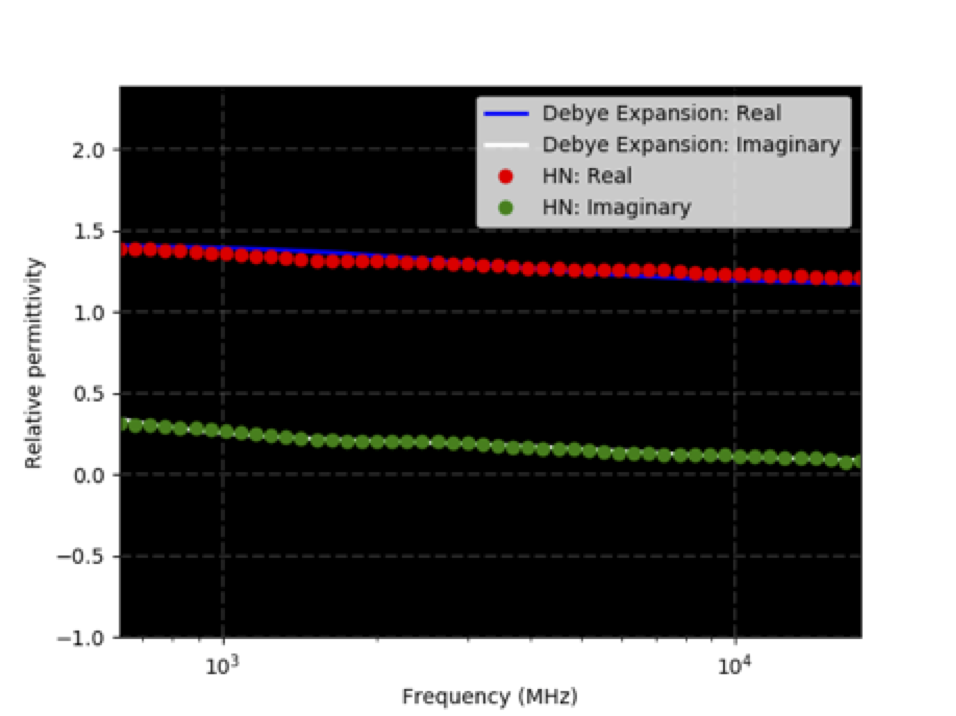
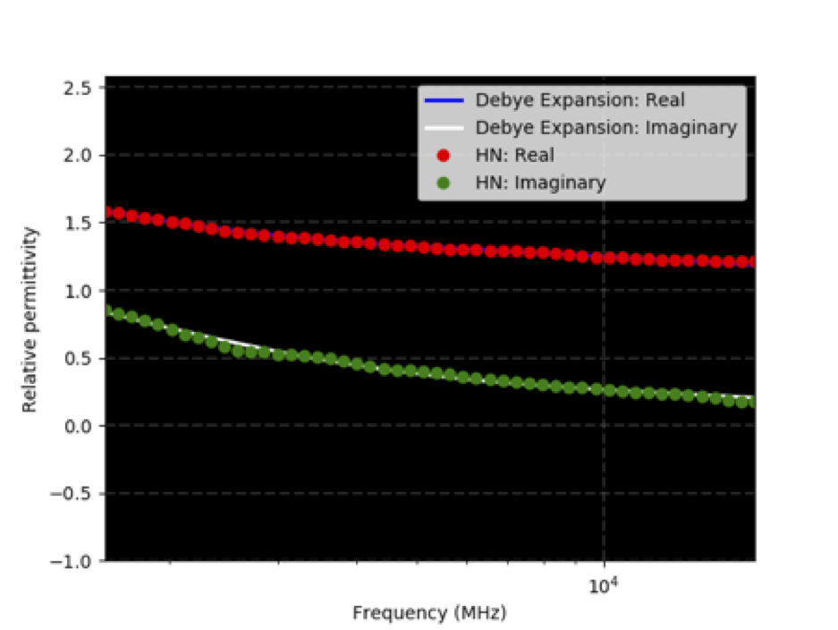
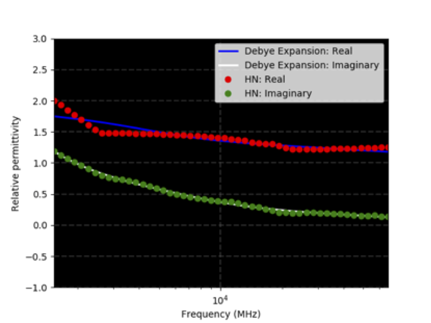
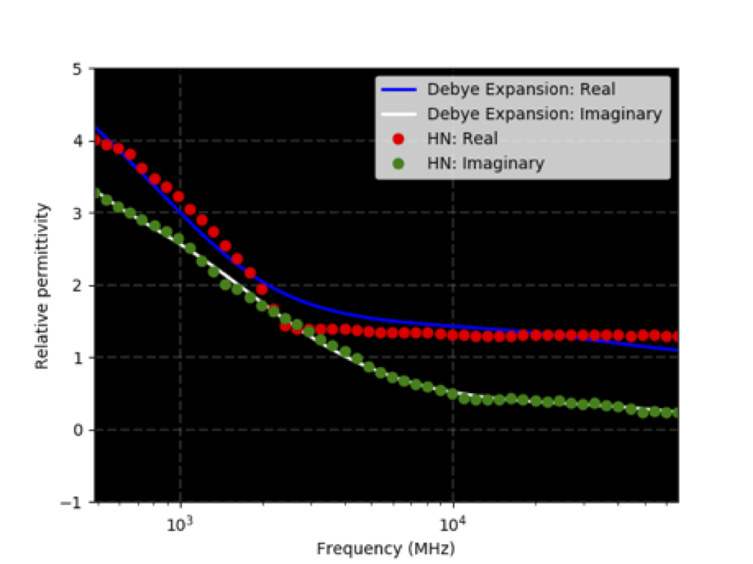
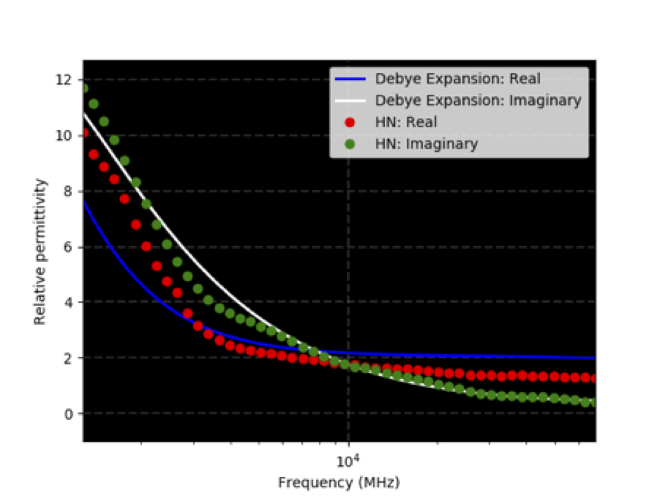
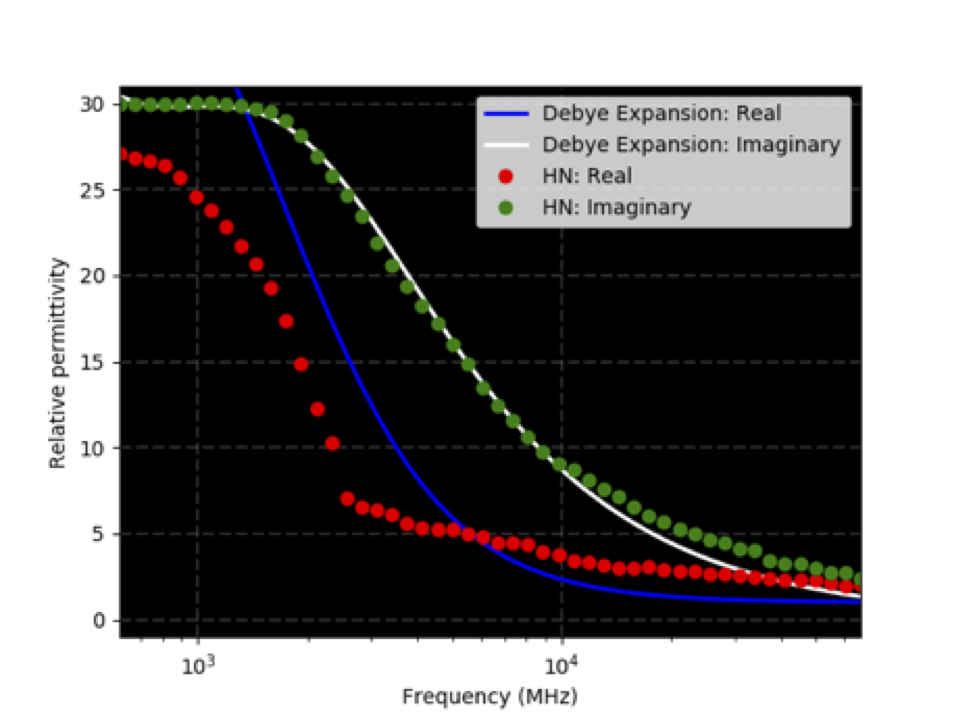
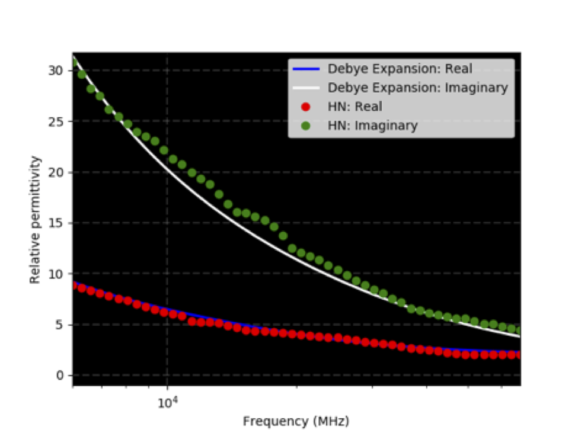
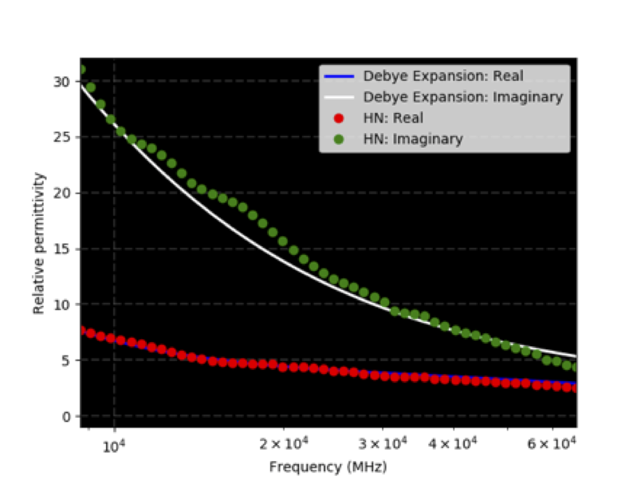

Toolboxes is a sub-package where useful Python modules contributed by users are stored.

*********
Materials
*********

Information
===========

This legacy package contains the original gprMax fitted material data and fit
figures. ``eccosorb.txt`` is retained so existing models continue to run. The
fits have not yet been promoted to the versioned ``antenna`` material
database: that requires a separate review of their source band, fit error,
current product data, and redistribution status.

* ``eccosorb.txt`` contains information on some of the `Eccosorb LS series <http://www.eccosorb.com/products-eccosorb-ls.htm>`_ of electromagnetic absorber materials manufactured by `Laird NV <http://www.eccosorb.eu>`_ (formerly Emerson & Cuming Microwave Products NV). LS 14, 16, 18, 20, 22, 26, 28, and 30 are included. They are simulated using a 3-pole Debye model.

How to use the package
======================

Example
-------

Existing models can include the legacy definitions with:

.. code-block:: none

    #include_file: toolboxes/Materials/eccosorb.txt
    #box: 0 0 0 0.5 0.5 0.5 eccosorb_ls22

For a new project, inspect the documented fits and current manufacturer data
before relying on these historical coefficients. A reviewed definition can
instead be copied into a project-local JSON database using the schema in the
main :doc:`material database documentation <material_databases>`.

Eccosorb
========

`Eccosorb <http://www.eccosorb.eu>`_ are electromagnetic absorber materials manufactured by `Laird NV <http://www.eccosorb.eu>`_ (formerly Emerson & Cuming Microwave Products NV). Currently models for some of the LS series (14, 16, 18, 20, 22, 26, 28, and 30) are included in this library. The models were created by fitting a 3-pole Debye model to the real and imaginary parts of the relative permittivity taken from the `manufacturers datasheet <http://www.eccosorb.com/Collateral/Documents/English-US/Electrical%20Parameters/ls%20parameters.pdf>`_. The following figures show the fitting.

    3-pole Debye fit for Eccosorb LS14 absorber (HN indicates data from manufacturer datasheet)

    3-pole Debye fit for Eccosorb LS16 absorber (HN indicates data from manufacturer datasheet)

    3-pole Debye fit for Eccosorb LS18 absorber (HN indicates data from manufacturer datasheet)

    3-pole Debye fit for Eccosorb LS20 absorber (HN indicates data from manufacturer datasheet)

    3-pole Debye fit for Eccosorb LS22 absorber (HN indicates data from manufacturer datasheet)

    3-pole Debye fit for Eccosorb LS26 absorber (HN indicates data from manufacturer datasheet)

    3-pole Debye fit for Eccosorb LS28 absorber (HN indicates data from manufacturer datasheet)

    3-pole Debye fit for Eccosorb LS30 absorber (HN indicates data from manufacturer datasheet)
