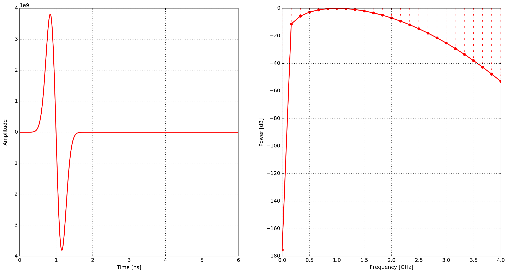
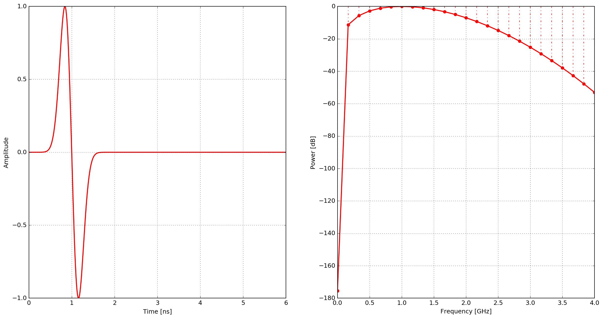
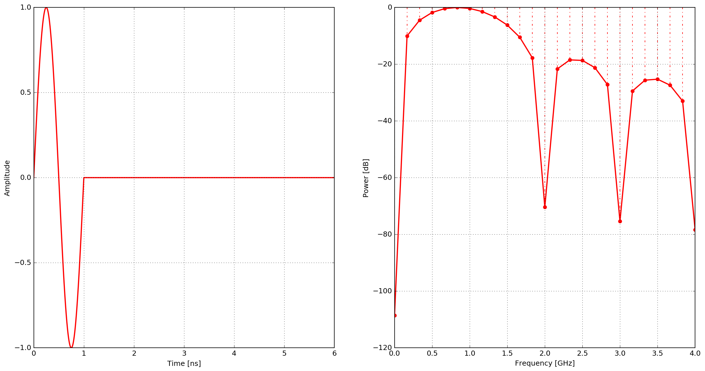
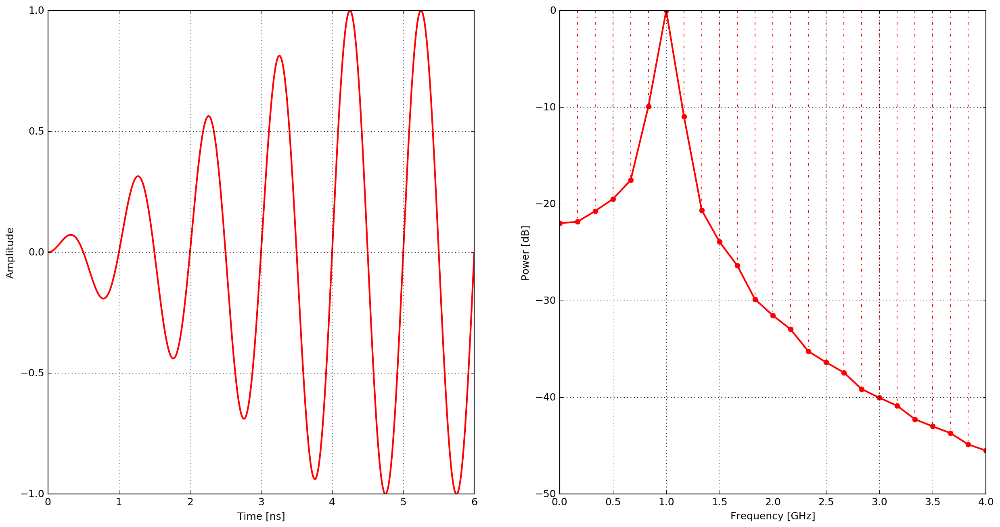
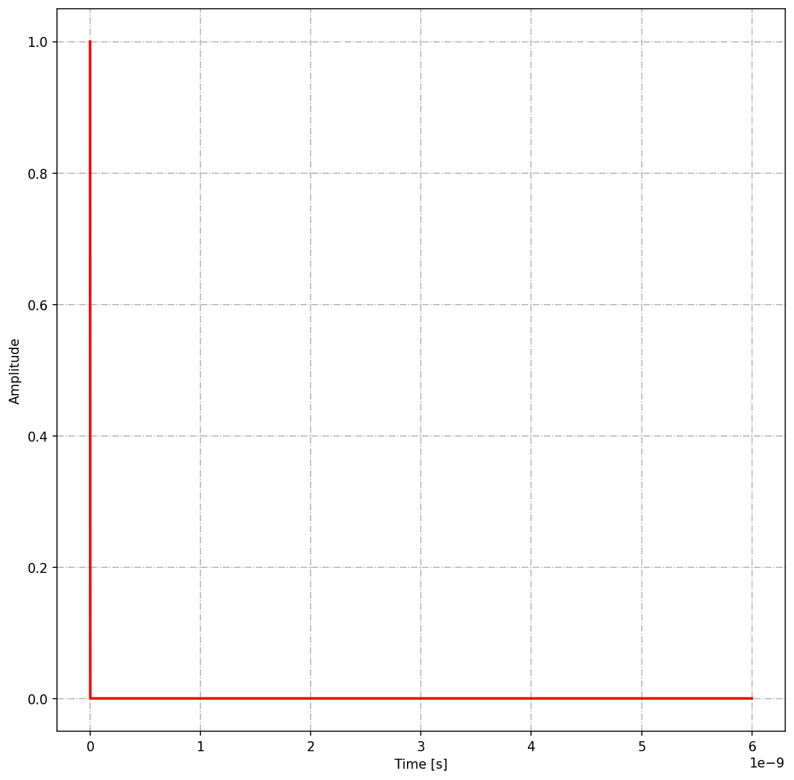

Toolboxes is a sub-package where useful Python modules contributed by users are stored.

********
Plotting
********

Information
===========

This package is intended to provide some basic scripts to get started with plotting outputs from simulations.

Package contents
================

plot_Ascan.py
-------------

This module uses matplotlib to plot the time history for the electric and magnetic field components, and currents for all receivers in a model (each receiver gets a separate figure window). Usage (from the top-level gprMax directory) is:

.. code-block:: none

    python -m toolboxes.Plotting.plot_Ascan outputfile

where ``outputfile`` is the name of output file including the path.

There are optional command line arguments:

* ``--outputs`` to specify a subset of the default output components (``Ex``, ``Ey``, ``Ez``, ``Hx``, ``Hy``, ``Hz``, ``Ix``, ``Iy`` or ``Iz``) to plot. By default all electric and magnetic field components are plotted.
* ``-fft`` to plot the Fast Fourier Transform (FFT) of a single output component

For example to plot the ``Ez`` output component with it's FFT:

.. code-block:: none

    python -m toolboxes.Plotting.plot_Ascan my_outputfile.h5 --outputs Ez -fft

plot_Bscan.py
-------------

gprMax produces a separate output file for each trace (A-scan) in the B-scan. These must be combined into a single file using the ``outputfiles_merge.py`` module (found in the ``toolboxes\Utilities``). This module uses matplotlib to plot an image of the B-scan. Usage (from the top-level gprMax directory) is:

.. code-block:: none

    python -m toolboxes.plotting.plot_Bscan outputfile rx-component

where:

* ``outputfile`` is the name of output file including the path
* ``rx-component`` is the name of the receiver output component (``Ex``, ``Ey``, ``Ez``, ``Hx``, ``Hy``, ``Hz``, ``Ix``, ``Iy`` or ``Iz``) to plot

plot_antenna_params.py
----------------------

This module uses matplotlib to plot the input impedance (resistance and reactance) and s11 parameter from an antenna model fed using a transmission line. It also plots the time history of the incident and reflected voltages in the transmission line and their frequency spectra. The module can optionally plot the s21 parameter if another transmission line or a receiver output (``#rx``) is used on the receiver antenna. Usage (from the top-level gprMax directory) is:

.. code-block:: none

    python -m toolboxes.plotting.plot_antenna_params outputfile

where ``outputfile`` is the name of output file including the path.

There are optional command line arguments:

* ``--tltx-num`` is the number of the transmission line (default is one) for the transmitter antenna. Transmission lines are numbered (starting at one) in the order they appear in the input file.
* ``--tlrx-num`` is the number of the transmission line (default is None) for the receiver antenna (for a s21 parameter). Transmission lines are numbered (starting at one) in the order they appear in the input file.
* ``--rx-num`` is the number of the receiver output (default is None) for the receiver antenna (for a s21 parameter). Receivers are numbered (starting at one) in the order they appear in the input file.
* ``--rx-component`` is the electric field component (``Ex``, ``Ey`` or ``Ez``) of the receiver output for the receiver antenna (for a s21 parameter).

For example to plot the input impedance, s11 and s21 parameters from a simulation with transmitter and receiver antennas that are attached to transmission lines (the transmission line feeding the transmitter appears first in the input file, and the transmission line attached to the receiver antenna appears after it).

.. code-block:: none

    python -m toolboxes.plotting.plot_antenna_params outputfile --tltx-num 1 --tlrx-num 2

.. _waveforms:

plot_source_wave.py
--------------------

This module uses matplotlib to plot one of the built-in waveforms in the time and frequency domain. Usage (from the top-level gprMax directory) is:

.. code-block:: none

    python -m toolboxes.plotting.plot_source_wave type amp freq timewindow dt

where:

* ``type`` is the type of waveform, e.g. gaussian, ricker etc...
* ``amp`` is the amplitude of the waveform
* ``freq`` is the centre frequency of the waveform (Hertz). In the case of the Gaussian waveform it is related to the pulse width.
* ``timewindow`` is the time window (seconds) to view the waveform, i.e. the time window of the proposed simulation
* ``dt`` is the time step (seconds) to view waveform, i.e. the time step of the proposed simulation

There is an optional command line argument:

* ``-fft`` to plot the Fast Fourier Transform (FFT) of the waveform

Definitions of the built-in waveforms and example plots are shown using the parameters: amplitude of one, centre frequency of 1GHz, time window of 6ns, and a time step of 1.926ps.

gaussian
^^^^^^^^

A Gaussian waveform.

.. math:: W(t) = e^{-\zeta(t-\chi)^2}

where :math:`\zeta = 2\pi^2f^2`, :math:`\chi=\frac{1}{f}` and :math:`f` is the frequency.

.. figure:: ../../images_shared/gaussian.png

    Example of the ``gaussian`` waveform - time domain and power spectrum.

gaussiandot
^^^^^^^^^^^

First derivative of a Gaussian waveform.

.. math:: W(t) = -2 \zeta (t-\chi) e^{-\zeta(t-\chi)^2}

where :math:`\zeta = 2\pi^2f^2`, :math:`\chi=\frac{1}{f}` and :math:`f` is the frequency.

    Example of the ``gaussiandot`` waveform - time domain and power spectrum.

gaussiandotnorm
^^^^^^^^^^^^^^^

Normalised first derivative of a Gaussian waveform.

.. math:: W(t) = -2 \sqrt{\frac{e}{2\zeta}} \zeta (t-\chi) e^{-\zeta(t-\chi)^2}

where :math:`\zeta = 2\pi^2f^2`, :math:`\chi=\frac{1}{f}` and :math:`f` is the frequency.

    Example of the ``gaussiandotnorm`` waveform - time domain and power spectrum.

gaussiandotdot
^^^^^^^^^^^^^^

Second derivative of a Gaussian waveform.

.. math:: W(t) = 2\zeta \left(2\zeta(t-\chi)^2 - 1 \right) e^{-\zeta(t-\chi)^2}

where :math:`\zeta = \pi^2f^2`, :math:`\chi=\frac{\sqrt{2}}{f}` and :math:`f` is the frequency.

.. figure:: ../../images_shared/gaussiandotdot.png

    Example of the ``gaussiandotdot`` waveform - time domain and power spectrum.

gaussiandotdotnorm
^^^^^^^^^^^^^^^^^^

Normalised second derivative of a Gaussian waveform.

.. math:: W(t) = \left( 2\zeta (t-\chi)^2 - 1 \right) e^{-\zeta(t-\chi)^2}

where :math:`\zeta = \pi^2f^2`, :math:`\chi=\frac{\sqrt{2}}{f}` and :math:`f` is the frequency.

.. figure:: ../../images_shared/gaussiandotdotnorm.png

    Example of the ``gaussiandotdotnorm`` waveform - time domain and power spectrum.

ricker
^^^^^^

A Ricker (or Mexican Hat) waveform which is the negative, normalised second derivative of a Gaussian waveform.

.. math:: W(t) = - \left( 2\zeta (t-\chi)^2 -1 \right) e^{-\zeta(t-\chi)^2}

where :math:`\zeta = \pi^2f^2`, :math:`\chi=\frac{\sqrt{2}}{f}` and :math:`f` is the frequency.

.. figure:: ../../images_shared/ricker.png

    Example of the ``ricker`` waveform - time domain and power spectrum.

sine
^^^^

A single cycle of a sine waveform.

.. math:: W(t) = R\sin(2\pi ft)

and

.. math::

    R =
    \begin{cases}
    1 &\text{if $ft\leq1$}, \\
    0 &\text{if $ft>1$}.
    \end{cases}

:math:`f` is the frequency

    Example of the ``sine`` waveform - time domain and power spectrum.

contsine
^^^^^^^^

A continuous sine waveform. In order to avoid introducing noise into the calculation the amplitude of the waveform is modulated for the first cycle of the sine wave (ramp excitation).

.. math:: W(t) = R\sin(2\pi ft)

and

.. math::

    R =
    \begin{cases}
    R_cft &\text{if $R\leq 1$}, \\
    1 &\text{if $R>1$}.
    \end{cases}

where :math:`R_c` is set to :math:`0.25` and :math:`f` is the frequency.

    Example of the ``contsine`` waveform - time domain and power spectrum.

impulse
^^^^^^^

A unit impulse or dirac delta waveform.

.. math::

    W(t) =
    \begin{cases}
    1 &\text{if $dt\leq 0$}, \\
    0 &\text{if $dt>1$}.
    \end{cases} 

    Example of the ``impulse`` waveform - time domain.

.. note::
    * The impulse waveform should be used with care! 
    * The impulse response of a model, i.e. when the source in the model is excited using the impulse waveform, is not likely to be useful when viewed in isolation. 
    * However, the impulse response of a model can be convolved with different inputs (waveforms) to provide valid outputs without having to run a separate model for each different input (waveform).
    * The impulse response of the model can only be legitimately convolved with inputs (waveforms) that respect the limits of numerical dispersion in the original model, i.e. if a waveform contains frequencies that will not propagate correctly (due to numerical dispersion) in the original model, then the convolution of the waveform with the impulse response will not be valid.