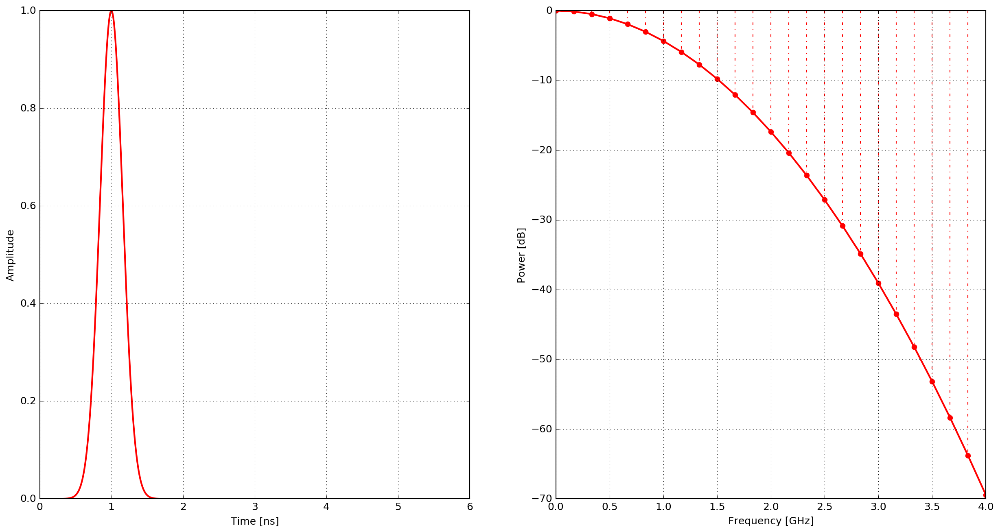
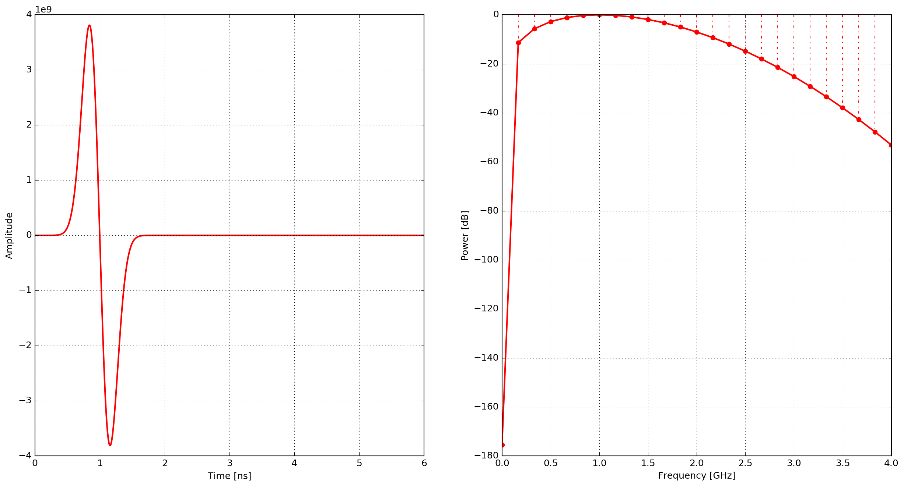
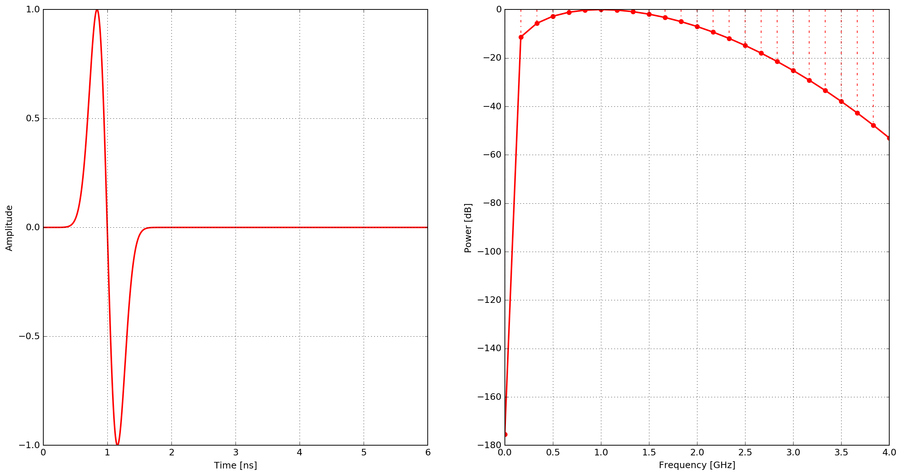
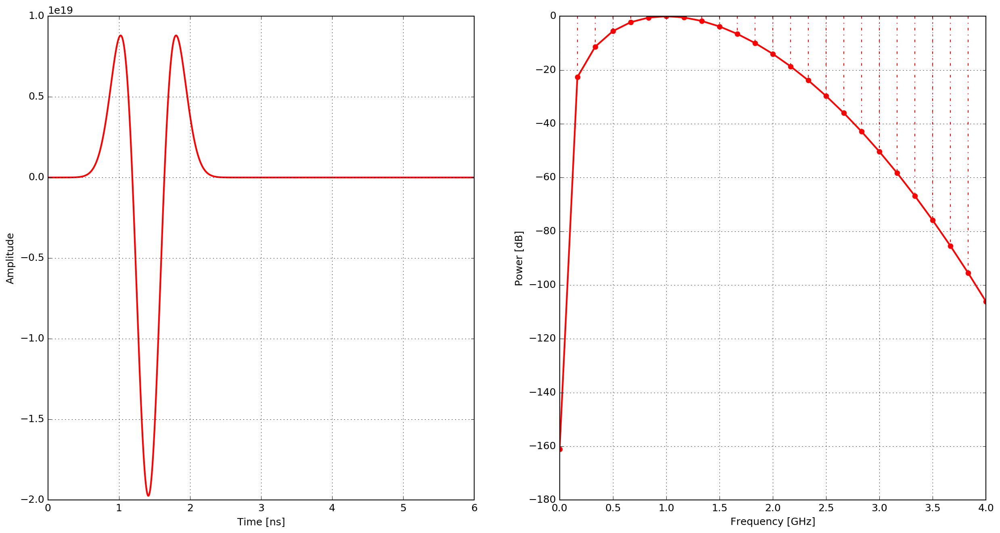
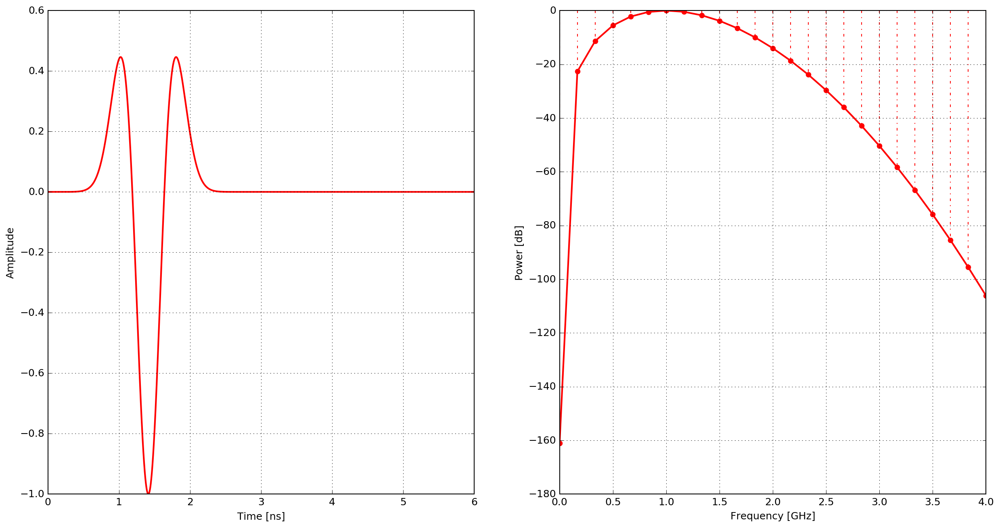
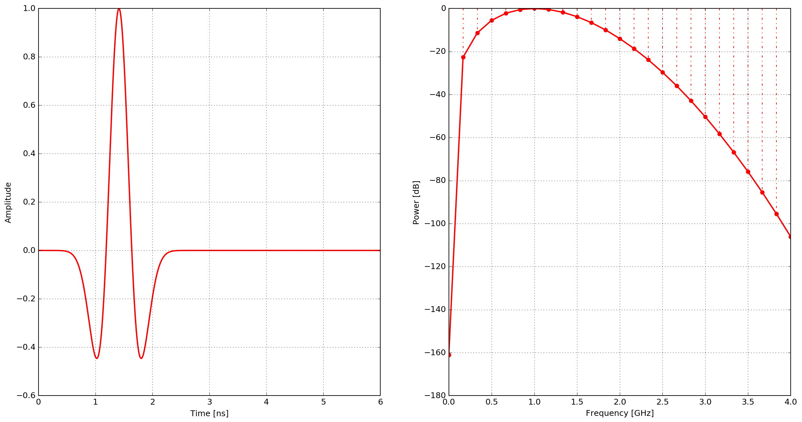
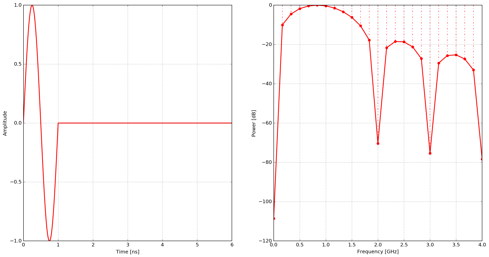
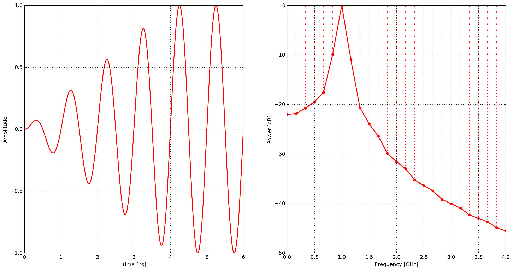
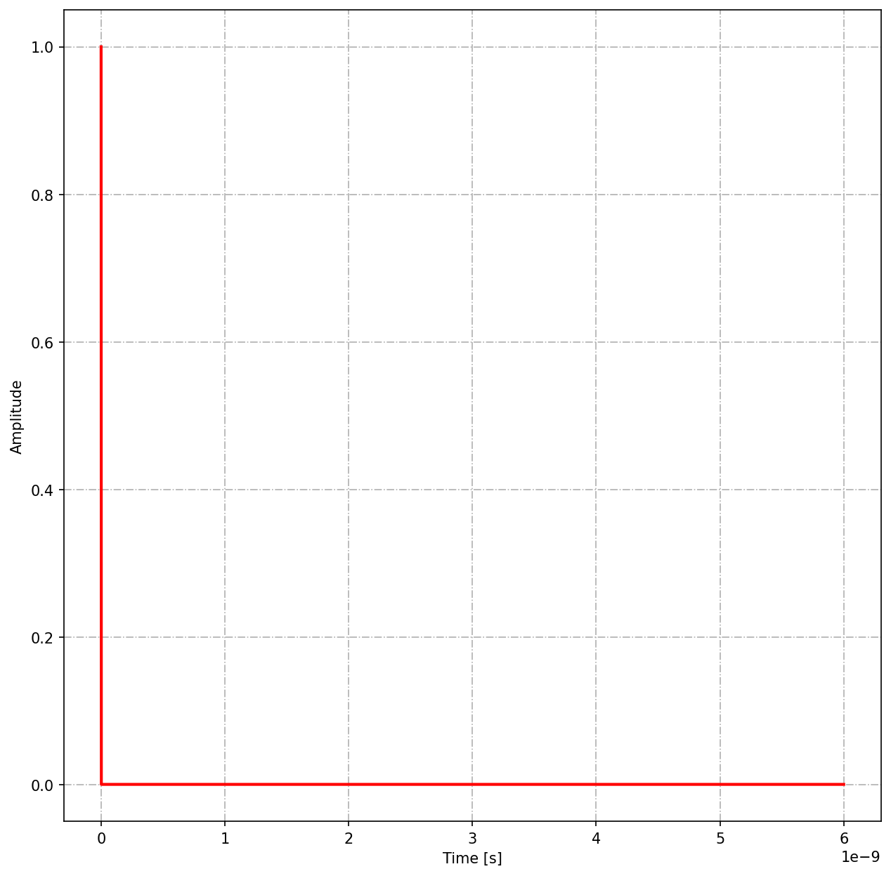

Toolboxes is a sub-package where useful Python modules contributed by users are stored.

********
Plotting
********

Information
===========

This package is intended to provide some basic scripts to get started with plotting outputs from simulations.

Package contents
================

plot_Ascan.py
-------------

This module uses matplotlib to plot the time history for the electric and magnetic field components, and currents for all receivers in a model (each receiver gets a separate figure window). Usage (from the top-level gprMax directory) is:

.. code-block:: none

    python -m toolboxes.Plotting.plot_Ascan outputfile

where ``outputfile`` is the name of output file including the path.

There are optional command line arguments:

* ``--outputs`` to specify a subset of the default output components (``Ex``, ``Ey``, ``Ez``, ``Hx``, ``Hy``, ``Hz``, ``Ix``, ``Iy`` or ``Iz``) to plot. By default all electric and magnetic field components are plotted.
* ``-fft`` to plot the Fast Fourier Transform (FFT) of a single output component

For example to plot the ``Ez`` output component with it's FFT:

.. code-block:: none

    python -m toolboxes.Plotting.plot_Ascan my_outputfile.h5 --outputs Ez -fft

plot_Bscan.py
-------------

gprMax produces a separate output file for each trace (A-scan) in the B-scan. These must be combined into a single file using the ``outputfiles_merge.py`` module (found in the ``toolboxes\Utilities``). This module uses matplotlib to plot an image of the B-scan. Usage (from the top-level gprMax directory) is:

.. code-block:: none

    python -m toolboxes.Plotting.plot_Bscan outputfile rx-component

where:

* ``outputfile`` is the name of output file including the path
* ``rx-component`` is the name of the receiver output component (``Ex``, ``Ey``, ``Ez``, ``Hx``, ``Hy``, ``Hz``, ``Ix``, ``Iy`` or ``Iz``) to plot

plot_port.py
------------

This module is the terminal-output counterpart to ``plot_Ascan.py``. An A-scan
plots local field or Ampere-loop samples from ``/rxs``; this module plots the
authoritative source-terminal quantities already calculated by gprMax. It
supports voltage-source ports, rational-network ports, transmission lines,
magnetic-frill ports, and ports inside subgrids. It does not repeat the S11 or
input-impedance calculation during plotting.

Run it with:

.. code-block:: none

    python -m toolboxes.Plotting.plot_port outputfile --save

All stored ports are plotted by default. Use a repeatable ``--port`` option to
select one or more port IDs or complete HDF5 paths:

.. code-block:: none

    python -m toolboxes.Plotting.plot_port outputfile \
        --port feed --port subgrids/fine_grid/ports/feed2 --save

Every port receives uniquely named parameter and signal figures, so plots from
the same model cannot overwrite one another. ``--output-dir`` selects their
directory; ``--format`` accepts ``png``, ``pdf``, or ``svg``; and ``--dpi``
controls raster resolution. Without ``--save`` the figures are displayed
interactively.

The parameter figure plots stored complex S11, input impedance, and input
admittance using their respective validity masks. Transmission-line
current-deembedding checks and voltage-source uncorrected source-plane values
are included when present. Invalid finite research values are hidden by
default; ``--show-invalid`` displays them as grey dotted lines. ``--validity``
adds a figure showing the stored source-band, mesh, gap-correction, and
line-propagation masks. It also plots the incident spectrum relative to its
peak and the cells per minimum wavelength when those diagnostics are stored,
together with the thresholds used to construct the masks.

The signal figure adapts to the available schema. It can include generator,
incident, reflected, and total voltage; incident, terminal, Ampere-loop, and
network currents; and their stored spectra. Missing quantities are not
estimated. ``--parameters-only`` suppresses this figure. ``--fmin`` and
``--fmax`` limit displayed frequencies in hertz, while ``--tmin`` and
``--tmax`` limit histories in seconds. Axes are automatically presented in
suitable engineering units.

``--list-ports`` prints all discoverable paths. The internal plotting data
model stores a collection of named S-parameter traces. It currently contains
S11 because local gprMax terminal outputs are one-port results; it can accept
additional Sij traces when an authoritative multiport output schema is added.

The former ``plot_antenna_params`` entry point remains as a compatibility
alias for the new plotter. Its legacy reconstruction of S11, Zin, and a
voltage/field transfer ratio labelled S21 has been retired. That calculation
did not include the present source, mesh, gap, and discrete-line validity
corrections, and a field-to-source ratio is not a power-wave S-parameter.

.. _waveforms:

plot_source_wave.py
--------------------

This module uses matplotlib to plot one of the built-in waveforms in the time and frequency domain. Usage (from the top-level gprMax directory) is:

.. code-block:: none

    python -m toolboxes.Plotting.plot_source_wave type amp freq timewindow dt

where:

* ``type`` is the type of waveform, e.g. gaussian, ricker etc...
* ``amp`` is the amplitude of the waveform
* ``freq`` is the centre frequency of the waveform (Hertz). In the case of the Gaussian waveform it is related to the pulse width.
* ``timewindow`` is the time window (seconds) to view the waveform, i.e. the time window of the proposed simulation
* ``dt`` is the time step (seconds) to view waveform, i.e. the time step of the proposed simulation

There is an optional command line argument:

* ``-fft`` to plot the Fast Fourier Transform (FFT) of the waveform

Definitions of the built-in waveforms and example plots are shown using the parameters: amplitude of one, centre frequency of 1GHz, time window of 6ns, and a time step of 1.926ps.

gaussian
^^^^^^^^

A Gaussian waveform.

.. math:: W(t) = e^{-\zeta(t-\chi)^2}

where :math:`\zeta = 2\pi^2f^2`, :math:`\chi=\frac{1}{f}` and :math:`f` is the frequency.

    Example of the ``gaussian`` waveform - time domain and power spectrum.

gaussiandot
^^^^^^^^^^^

First derivative of a Gaussian waveform.

.. math:: W(t) = -2 \zeta (t-\chi) e^{-\zeta(t-\chi)^2}

where :math:`\zeta = 2\pi^2f^2`, :math:`\chi=\frac{1}{f}` and :math:`f` is the frequency.

    Example of the ``gaussiandot`` waveform - time domain and power spectrum.

gaussiandotnorm
^^^^^^^^^^^^^^^

Normalised first derivative of a Gaussian waveform.

.. math:: W(t) = -2 \sqrt{\frac{e}{2\zeta}} \zeta (t-\chi) e^{-\zeta(t-\chi)^2}

where :math:`\zeta = 2\pi^2f^2`, :math:`\chi=\frac{1}{f}` and :math:`f` is the frequency.

    Example of the ``gaussiandotnorm`` waveform - time domain and power spectrum.

gaussiandotdot
^^^^^^^^^^^^^^

Second derivative of a Gaussian waveform.

.. math:: W(t) = 2\zeta \left(2\zeta(t-\chi)^2 - 1 \right) e^{-\zeta(t-\chi)^2}

where :math:`\zeta = \pi^2f^2`, :math:`\chi=\frac{\sqrt{2}}{f}` and :math:`f` is the frequency.

    Example of the ``gaussiandotdot`` waveform - time domain and power spectrum.

gaussiandotdotnorm
^^^^^^^^^^^^^^^^^^

Normalised second derivative of a Gaussian waveform.

.. math:: W(t) = \left( 2\zeta (t-\chi)^2 - 1 \right) e^{-\zeta(t-\chi)^2}

where :math:`\zeta = \pi^2f^2`, :math:`\chi=\frac{\sqrt{2}}{f}` and :math:`f` is the frequency.

    Example of the ``gaussiandotdotnorm`` waveform - time domain and power spectrum.

ricker
^^^^^^

A Ricker (or Mexican Hat) waveform which is the negative, normalised second derivative of a Gaussian waveform.

.. math:: W(t) = - \left( 2\zeta (t-\chi)^2 -1 \right) e^{-\zeta(t-\chi)^2}

where :math:`\zeta = \pi^2f^2`, :math:`\chi=\frac{\sqrt{2}}{f}` and :math:`f` is the frequency.

    Example of the ``ricker`` waveform - time domain and power spectrum.

sine
^^^^

A single cycle of a sine waveform.

.. math:: W(t) = R\sin(2\pi ft)

and

.. math::

    R =
    \begin{cases}
    1 &\text{if $ft\leq1$}, \\
    0 &\text{if $ft>1$}.
    \end{cases}

:math:`f` is the frequency

    Example of the ``sine`` waveform - time domain and power spectrum.

contsine
^^^^^^^^

A continuous sine waveform. In order to avoid introducing noise into the calculation the amplitude of the waveform is modulated for the first cycle of the sine wave (ramp excitation).

.. math:: W(t) = R\sin(2\pi ft)

and

.. math::

    R =
    \begin{cases}
    R_cft &\text{if $R\leq 1$}, \\
    1 &\text{if $R>1$}.
    \end{cases}

where :math:`R_c` is set to :math:`0.25` and :math:`f` is the frequency.

    Example of the ``contsine`` waveform - time domain and power spectrum.

impulse
^^^^^^^

A unit impulse or dirac delta waveform.

.. math::

    W(t) =
    \begin{cases}
    1 &\text{if $dt\leq 0$}, \\
    0 &\text{if $dt>1$}.
    \end{cases}

where :math:`dt` is the temporal resolution (timestep) of the model.

    Example of the ``impulse`` waveform - time domain.

.. note::
    * The impulse waveform should be used with care!
    * The impulse response of a model, i.e. when the source in the model is excited using the impulse waveform, is not likely to be useful when viewed in isolation.
    * However, the impulse response of a model can be convolved with different inputs (waveforms) to provide valid outputs without having to run a separate model for each different input (waveform).
    * The impulse response of the model can only be legitimately convolved with inputs (waveforms) that respect the limits of numerical dispersion in the original model, i.e. if a waveform contains frequencies that will not propagate correctly (due to numerical dispersion) in the original model, then the convolution of the waveform with the impulse response will not be valid.
