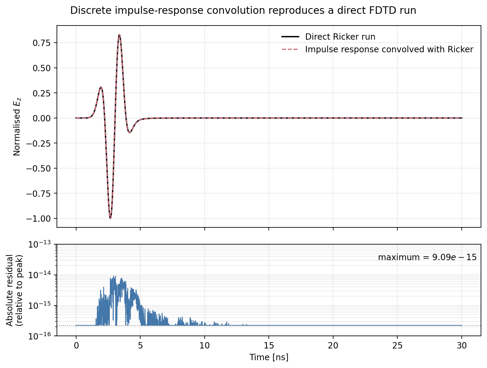
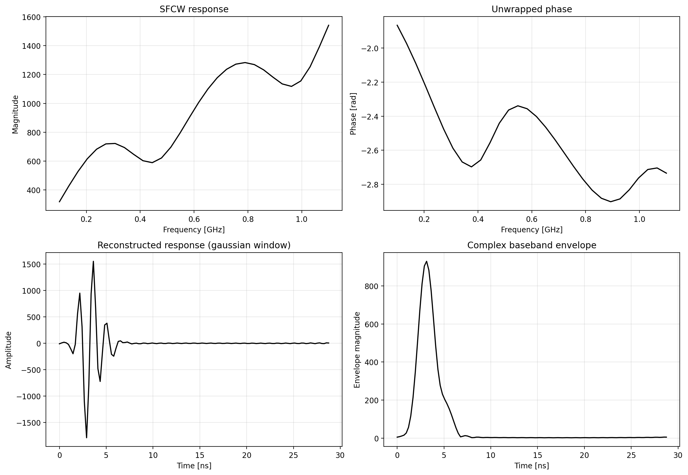

.. _sfcw:

*************************************
Stepped-Frequency Continuous-Wave GPR
*************************************

Information
===========

This toolbox synthesises stepped-frequency continuous-wave (SFCW) responses
from one broadband gprMax simulation. It implements the impulse-response
method presented by Giannopoulos, Warren, and Giannakis [GIA2023SFCW]_. The
method avoids running a separate FDTD simulation for every transmitted tone.

For a discrete source :math:`x[n]`, an FDTD model with impulse response
:math:`h[n]`, and receiver response :math:`y[n]`,

.. math::

    y_x[n] = (h*x)[n]
             = \sum_{m=0}^{n} h[n-m]x[m].

If an impulse with amplitude :math:`A` is applied at source sample zero, its
receiver trace :math:`y_\delta[n]` gives

.. math::

    h[n] = \frac{y_\delta[n]}{A}.

An impulsive run therefore supplies the response required to synthesise every
waveform, including every SFCW tone, within the numerically valid bandwidth of
the model. Equivalently, in the frequency domain,

.. math::

    Y_x(f) = H(f)X(f), \qquad
    H(f) = \frac{Y_\delta(f)}{X_\delta(f)}.

This result follows from the linearity and time invariance of the discrete
FDTD update equations; it does not depend on treating the tones as separate
FDTD simulations. Material dispersion, PMLs, and linear sources remain part
of the same discrete system and are therefore included in :math:`h[n]`.

The toolbox retains the physical Yee-time offset of every source and receiver
quantity. This is important because a resistive voltage source or Hertzian
electric dipole is sampled at :math:`(n+1/2)\Delta t`, whereas electric
receiver fields are stored at :math:`n\Delta t`. For the engineering phasor
convention :math:`\Re\{X\exp(+j\omega t)\}`, it evaluates

.. math::

    X(f) = \Delta t \sum_n x[n]
           \exp\left[-j2\pi f(n\Delta t+t_0)\right],

where :math:`t_0` is read from ``TimeSampleOffset`` in the output file. Thus,
the half-time-step source/receiver displacement is represented by its correct
phase rather than an assumed sample shift.

Two processing methods are available:

* ``direct`` evaluates the engineering-convention Fourier transform at the
  requested tone frequencies and divides by the actual stored source
  spectrum. This is the recommended and efficient default.
* ``homodyne`` requires a one-sample impulse. It convolves that impulse
  response with every cosine tone and recovers I and Q using ideal quadrature
  homodyne detection. It follows the signal chain in the published method and
  provides an independent check of the direct result.

Both use the convention :math:`\Re\{X\exp(+j\omega t)\}`. The stored complex
response is :math:`I+jQ` after normalising the ideal mixer factor of one half.

FDTD impulse-convolution check
==============================

The convolution identity is checked independently of the SFCW processing. A
2D TM free-space model was run twice using the same grid, Hertzian dipole, and
receiver: once with the built-in one-sample impulse and once directly with a
500 MHz Ricker waveform. The impulse receiver trace was divided by the
impulse amplitude and causally convolved with the *exact stored Ricker source
samples*. The full convolution was then cropped to the same 30 ns and 2545
samples as the direct Ricker simulation.

In double precision, the maximum time-domain difference relative to the peak
field was :math:`9.09\times10^{-15}`. Transforming those identically cropped
traces over 200--800 MHz gave maximum magnitude and phase differences of
:math:`5.3\times10^{-14}` dB and :math:`6.7\times10^{-13}` degrees,
respectively. These differences are numerical round-off.

    A direct Ricker-excited FDTD receiver trace and the trace obtained by
    convolving the impulse response with the stored Ricker excitation. The
    lower panel shows their absolute difference relative to the direct-trace
    peak.

The order of operations matters when validating finite records. Multiplying
the transforms of two separately truncated sequences does not generally give
the transform of the first :math:`N` samples of their causal convolution. The
comparison above therefore forms the full time-domain convolution, crops it
to the direct run's observation window, and only then transforms both traces.
This finite-window issue is distinct from the SFCW method and from whether the
Ricker waveform itself has decayed.

Preparing the model
===================

Use the built-in ``impulse`` waveform for the most direct workflow. The
example in ``toolboxes/SFCW/examples/cylinder_sfcw_2D.in`` contains a PEC
cylinder in a dielectric half-space:

:download:`Download the complete cylinder example
<../../toolboxes/SFCW/examples/cylinder_sfcw_2D.in>`.

.. code-block:: none

    #waveform: impulse 1 1 impulse
    #hertzian_dipole: z 0.200 0.320 inf impulse
    #rx: 0.240 0.320 inf response Ez

The frequency parameter required by the ``#waveform`` syntax is not used by
the impulse waveform. Keep the source start time at zero. A user-defined
function that is nonzero only when its argument is exactly zero is not a valid
electric-source impulse because an electric source first samples it at
:math:`\Delta t/2`; the toolbox detects a missing or non-impulsive source.

Recent gprMax output files store the exact source samples consumed by the
solver under ``/srcs/srcN/excitation``. They also store ``TimeSampleOffset``
on source and receiver datasets. Consequently, file-based and arbitrary
Python waveforms can be deconvolved without reconstructing their definitions.
Scalar references are available for voltage, Hertzian electric and magnetic,
rational-network, transmission-line, and magnetic-frill excitations. Use one
active source when calculating an ordinary transfer response. With several
simultaneously active sources the receiver contains their coherent sum;
selecting one source then merely defines the phase/amplitude reference and is
meaningful only when that combined excitation is intentional.

Usage
=====

First inspect an output file:

.. code-block:: none

    python -m toolboxes.SFCW inspect cylinder_sfcw_2D.h5

Then request, for example, 30 frequencies from 100 MHz to 1.1 GHz:

.. code-block:: none

    python -m toolboxes.SFCW process cylinder_sfcw_2D.h5 \
        --source /srcs/src1 --receiver /rxs/rx1 --component Ez \
        --f-start 100e6 --f-stop 1.1e9 --steps 30 \
        --window gaussian --zero-pad 4 --time-shift 3e-9 \
        --tail-taper 0.05 \
        --output cylinder_sfcw_2D_sfcw.h5 \
        --plot cylinder_sfcw_2D_sfcw.png

The example's target response has finished well before the final five percent
of its 30 ns FDTD record, so the command tapers that residual numerical tail.
The 3 ns display shift keeps the band-limited direct arrival away from the
periodic inverse-FFT boundary.

    Complex stepped-frequency data and the Gaussian-windowed response from
    the supplied cylinder example.

Use ``--method homodyne`` to reproduce tone convolution and I/Q detection.
This method is deliberately slower and accepts only one A-scan with a
one-sample impulse.

Merged B-scans are processed along their first (time) dimension. The merge
utility does not duplicate source groups, so identify any one of the original
A-scan files that contains the shared source history:

.. code-block:: none

    python -m toolboxes.SFCW process cylinder_Bscan_2D_merged.h5 \
        --source-file cylinder_Bscan_2D1.h5 \
        --receiver /rxs/rx1 --component Ez \
        --f-start 100e6 --f-stop 1.1e9 --steps 30 \
        --window gaussian --output cylinder_Bscan_2D_sfcw.h5 \
        --plot cylinder_Bscan_2D_sfcw.png

The direct method transforms all traces together. Its ``response`` and I/Q
datasets then have shape ``(frequency step, trace)``; the reconstructed arrays
have shape ``(time, trace)``.

The processed HDF5 file contains:

* ``frequency`` and the complex ``response``;
* normalised ``I`` and ``Q`` components;
* source and receiver spectra and the source-validity mask;
* the frequency weights, complex envelope, complex bandpass response, and
  real reconstructed response under ``time_response``.

Frequency and time-window validity
==================================

An FDTD impulse is a discrete, spectrally broad excitation, not evidence that
all frequencies are accurate. Select an upper frequency for which the
shortest wavelength in every material is adequately resolved, normally at
least ten cells per wavelength, and always remain below the FDTD Nyquist
frequency.

The FDTD time window need not equal :math:`1/\Delta f`. It must capture the
required propagation paths and allow the physical response to decay. The
uniform SFCW frequency interval :math:`\Delta f` independently sets the
periodic reconstructed time range

.. math::

    T_{\mathrm{SFCW}} = \frac{1}{\Delta f}.

Samples beyond the recorded FDTD response are necessarily assumed to be zero.
The command reports the peak level in the final five percent of the receiver
record. If it exceeds -60 dB, extend the simulation when possible. The optional
``--tail-taper FRACTION`` applies a raised-cosine taper to the stated fraction
of the end of the record, but it must not be used to suppress genuine late
arrivals.

``--zero-pad`` refines the displayed sampling of the reconstructed response;
it does not add bandwidth, resolution, or missing late-time information.

The inverse stepped-frequency response is periodic over
:math:`T_{\mathrm{SFCW}}`. A band-limited arrival close to time zero has
non-causal sidelobes that wrap to the end of this interval. ``--time-shift``
applies a documented linear phase ramp before the inverse FFT, moving the
displayed response away from that boundary without changing the stored
frequency response. It is a plotting/reference delay, not additional physical
propagation time.

A rectangular frequency window preserves the measured band but produces
strong time-domain ringing at its abrupt band edges. Gaussian, Hann, Hamming,
and Blackman weighting are available. The default Gaussian window follows the
windowed example in the published method.
