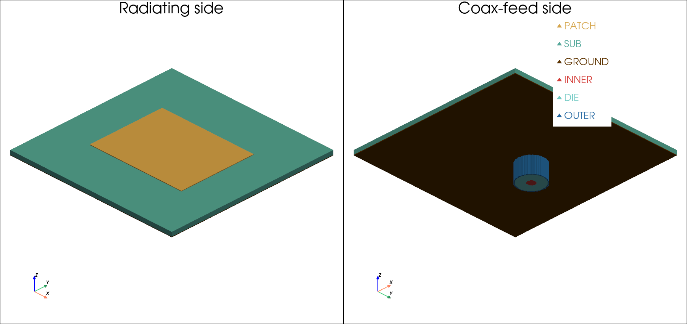
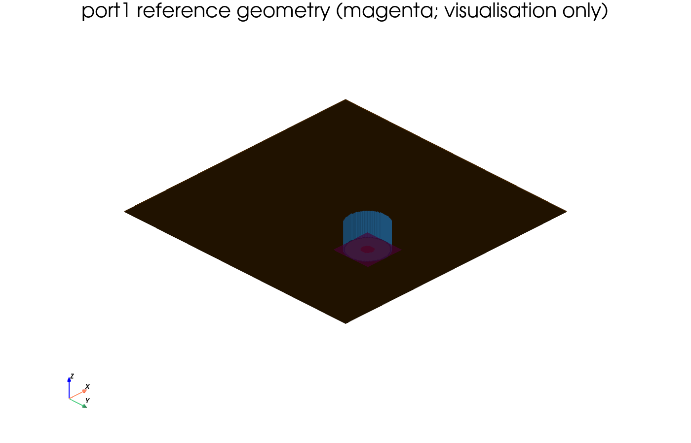
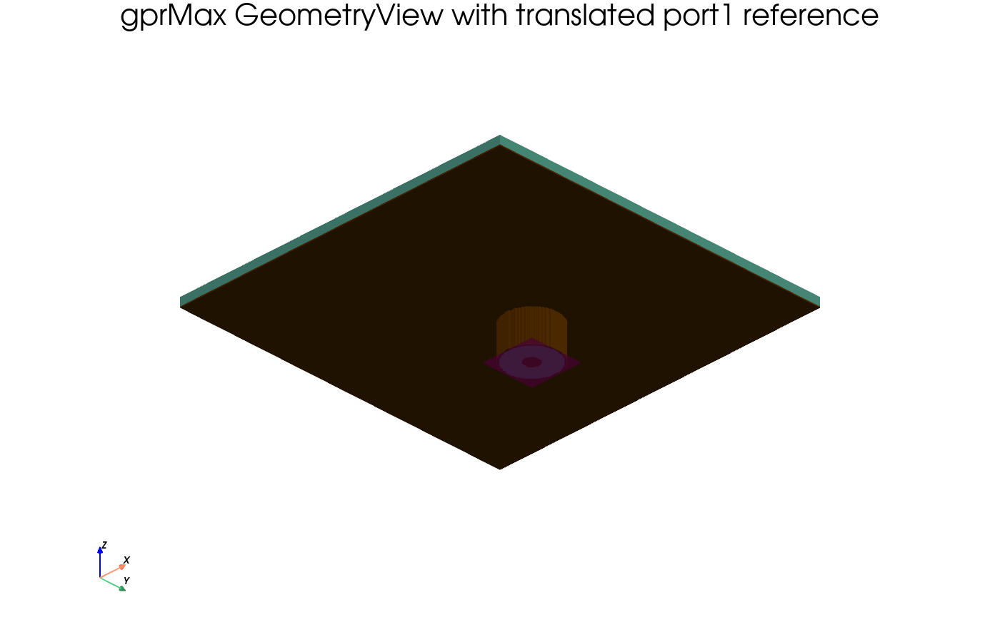
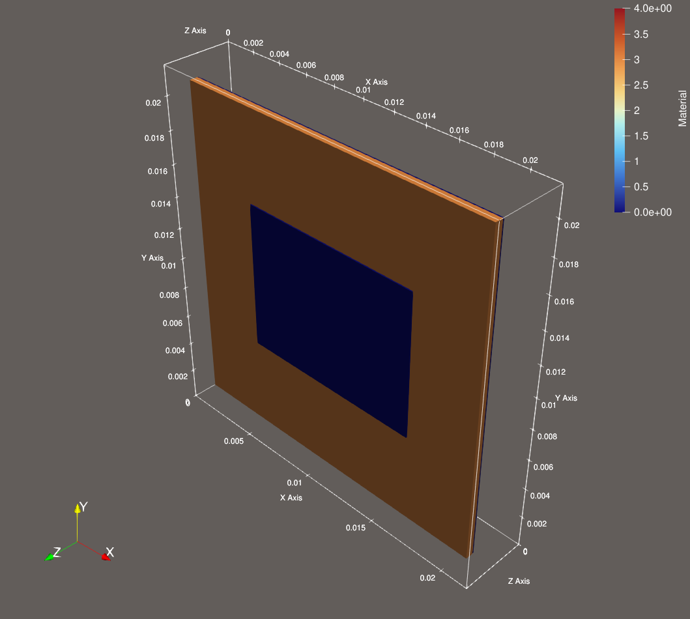
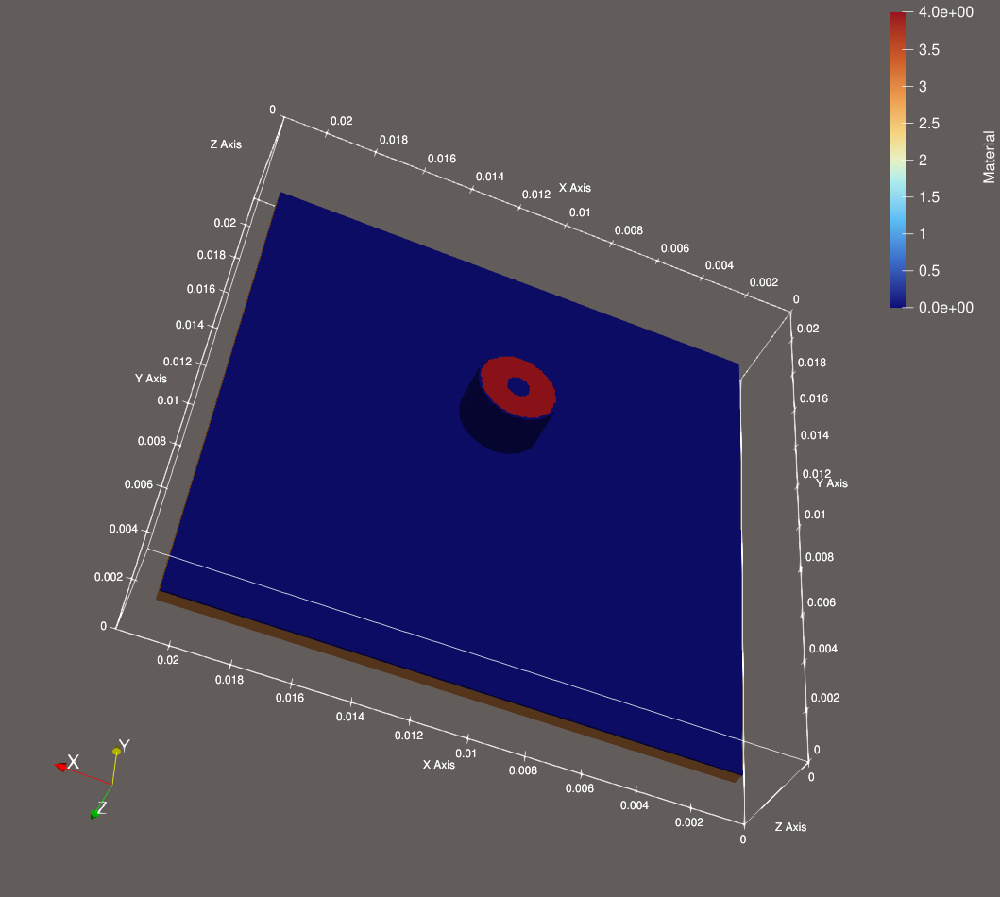

========================
STEP-to-voxel conversion
========================

The ``STEPtoVoxel`` toolbox converts STEP CAD assemblies into cell-labelled
voxel grids that can be imported by gprMax with
``GeometryObjectsRead``/``#geometry_objects_read``. It preserves assembly
components, provides an editable part-to-material mapping, resolves overlaps
using explicit priorities, and can export a VTK ImageData file for inspection
in ParaView.

The toolbox is based on the `STEP-to-gprMax project
<https://github.com/mahdeeabir1710/STEP-to-gprMax>`_ developed by **Mahdee
Abir** as part of an MEng project at the University of Edinburgh. The original
project is distributed under the MIT License; its copyright and licence notice
are retained in :download:`LICENSE <../../toolboxes/STEPtoVoxel/LICENSE>`.
The slice-based voxelisation work also builds on ideas from Christian
Pederkoff's `stl-to-voxel
<https://github.com/cpederkoff/stl-to-voxel>`_ project.

Installation
------------

STEP reading and tessellation require OpenCascade's Python bindings. Install
them from conda-forge in the environment used to run gprMax:

.. code-block:: console

    conda install -c conda-forge pythonocc-core

NumPy and h5py are already gprMax dependencies. PyVista is optional and is
only required for direct ``.vti`` export and interactive voxel visualisation:

.. code-block:: console

    conda install -c conda-forge pyvista

The toolbox imports OpenCascade and PyVista lazily. Normal gprMax usage is
therefore unaffected when these optional packages are absent.

Workflow
--------

First inspect the components and dimensions contained in a STEP file:

.. code-block:: console

    python -m toolboxes.STEPtoVoxel inspect model.stp \
        --voxel-size 0.0001 0.0001 0.0001

Create an editable material-assignment file:

.. code-block:: console

    python -m toolboxes.STEPtoVoxel prepare model.stp materials.csv \
        --voxel-size 0.0001 0.0001 0.0001

By default, repeated occurrences of the same STEP shape definition share one
CSV row. For example, an assembly containing many instances of one screw needs
only one material characterisation. The ``part_names`` column lists every
member and ``group_confidence=exact_instance`` explains why they were grouped.
The user can split a row into two rows and partition ``part_names`` whenever
instances require different materials.

The ``similar_group`` column reports geometrically similar candidates without
combining them. Approximate grouping is available explicitly when preparing
the file:

.. code-block:: console

    python -m toolboxes.STEPtoVoxel prepare model.stp materials.csv \
        --group-mode similar --group-tolerance 0.01

This comparison uses volume, surface area, topology and principal moments.
It cannot prove that two shapes or their materials are identical, so every
``similar_candidate`` group must be inspected before properties are entered.
Use ``--group-mode none`` to retain one row per component. Reusing exactly the
same material name and properties in separate rows still stores only one
material in the output. Higher priorities overwrite lower priorities where
CAD solids overlap. The converter also accepts the earlier one-row-per-part
CSV format.

After editing the CSV, perform the conversion:

.. code-block:: console

    python -m toolboxes.STEPtoVoxel convert model.stp materials.csv output \
        --voxel-size 0.0001 0.0001 0.0001

This creates:

* ``geometry.h5`` -- the ``int16`` material grid read by gprMax;
* ``materials.txt`` -- material commands whose order matches the grid values;
* ``markers.json`` -- reusable CAD source, receiver and port coordinates;
* ``geometry.vti`` -- component-labelled VTK ImageData for ParaView;
* ``reference_geometry_cad.vtp`` -- non-physical CAD ports, source edges,
  points and construction faces in the original CAD coordinate system;
* ``conversion.json`` -- dimensions, origin, component mapping and voxel
  counts.

Use ``--no-vtk`` if PyVista is not installed.

Coordinate systems
------------------

``geometry.vti`` and ``reference_geometry_cad.vtp`` retain the original CAD
coordinate system and overlay directly in ParaView. ``geometry.h5`` is a
local index grid: ``GeometryObjectsRead`` translates it to the model position
given by ``p1``. A gprMax ``GeometryView`` therefore uses model coordinates,
not the original CAD coordinates.

To overlay the CAD references on a gprMax GeometryView, translate them by

.. math::

    \boldsymbol{\Delta}
    = \mathbf{p}_1 - \mathbf{x}_{\mathrm{grid\ origin}}.

The helper below writes a translated copy while preserving the original VTP:

.. code-block:: python

    from toolboxes.STEPtoVoxel import translate_reference_geometry

    translation = tuple(
        import_origin[axis] - conversion_result.origin[axis]
        for axis in range(3)
    )
    translate_reference_geometry(
        conversion_result.reference_geometry_cad_file,
        "reference_geometry_gprmax.vtp",
        translation,
    )

The converter always writes the CAD-coordinate file. It cannot write the
gprMax-coordinate file until the model author chooses ``p1``. The example
script writes that translated file from the same ``import_origin`` passed to
``GeometryObjectsRead``; the gprMax solver itself does not generate either
reference file.

gprMax import
-------------

The CAD coordinates are translated into a local voxel grid. The
``origin_m`` entry in ``conversion.json`` records the original CAD-space
lower corner, while ``p1`` specifies where that local grid is inserted into
the gprMax domain:

.. code-block:: python

    scene.add(
        gprMax.GeometryObjectsRead(
            p1=(0.01, 0.01, 0.01),
            geofile="output/geometry.h5",
            matfile="output/materials.txt",
        )
    )

The gprMax discretisation must exactly match the voxel size recorded in
``geometry.h5``.

Voxelisation and thin CAD solids
--------------------------------

The solid voxeliser intersects a tessellated component with parallel planes
and fills each closed cross-section. ``--sweep-axis auto`` uses the shortest
grid dimension and prefers z when dimensions are equal. An explicit x, y or z
axis can be selected when reproducing or diagnosing a conversion.

The default ``--supersample 1`` evaluates the centre of every Yee cell. This
is the clearest reproducible material-assignment convention. A value greater
than one takes that number of samples along *each* of x, y and z and assigns a
cell when a strict majority of the resulting samples is inside. Thus a value
of two uses eight samples rather than sampling only one direction.

A closed solid thinner than one cell can lie between all cell centres and
disappear. If an otherwise empty solid is thinner than one cell along x, y or
z, the toolbox samples its own mid-plane and represents it with one FDTD cell
along that axis. This behaviour is enabled by default. It is intended as a
loss-prevention safeguard, not as a claim that an unresolved object has been
modelled accurately. The generated geometry must always be inspected.

Open or zero-volume CAD faces, edges and points are not converted into solid
materials.
They are listed during inspection, default to ``include=n`` in the material
CSV, and are exported separately to ``reference_geometry_cad.vtp``. Such
objects are often port planes, source edges, reference points or CAD
construction geometry. Load the VTP alongside ``geometry.vti`` in ParaView to
inspect them without changing the electromagnetic model.

CAD sources, receivers and ports
--------------------------------

Non-physical CAD objects can carry source and receiver placement into the
gprMax model. Give each marker a case-insensitive name beginning with one of
the following portable prefixes:

* ``gprmax_source_`` or ``source``;
* ``gprmax_receiver_``, ``receiver`` or ``rx``;
* ``gprmax_port_`` or ``port``.

For example, ``gprmax_source_tx1``, ``rx2`` and ``port1`` are recognised.
Markers always default to ``include=n`` and cannot be assigned physical
material by the converter.

A planar, zero-thickness face is recommended for a wave/coaxial port because
it records the aperture bounds, centre and normal axis. A CAD point is ideal
for a point source or receiver when the exporter preserves datum geometry.
An axis-aligned CAD edge is especially useful for a one-cell electric source:
``markers.json`` records both endpoints, its midpoint, length and ``x``, ``y``
or ``z`` axis. The line direction sign is still arbitrary, so source polarity
must be chosen in the model.
Many exporters discard isolated points and sketch lines; in that case use a
small sphere or box whose centroid marks the position. The marker solid is
excluded from voxelisation by its name.

``markers.json`` stores every marker in original CAD coordinates and in local
coordinates relative to ``geometry.h5``. If the voxel geometry is imported at
``p1``, its model position is

.. math::

    \mathbf{x}_{\mathrm{model}}
    = \mathbf{p}_1 + \mathbf{x}_{\mathrm{local}}.

The Python helper performs this translation:

.. code-block:: python

    from toolboxes.STEPtoVoxel import load_markers

    markers = load_markers("output/markers.json")
    source_position = markers["gprmax_source_tx1"].model_position(
        geometry_import_origin=(0.01, 0.01, 0.01)
    )

For surface markers the reported normal sign follows CAD tessellation and is
not a reliable excitation polarity; the dominant axis is reliable for an
axis-aligned plane. Excitation type, waveform, impedance, field component and
polarity must still be specified in the gprMax model.

Name recovery
-------------

Different STEP exporters attach semantic names to different entities. The
reader first uses OpenCascade/XCAF labels, then maps each transferred shape
back to its exact STEP entity and searches the referenced entity graph for
shape-representation, solid/surface, product, assembly-occurrence and layer
names. The selected source and confidence are written to ``conversion.json``
and shown by the ``inspect`` command. Representation order is used only as a
low-confidence fallback for flat files. If an exporter removes semantic names
entirely, they must be supplied manually in the material mapping.

Worked example: probe-fed patch antenna
---------------------------------------

``examples/patch_antenna`` contains a probe-fed microstrip patch exported as
an AP242 STEP file. It provides a compact example of the complete conversion
and source-placement workflow. The six physical components are ``PATCH``,
``SUB``, ``GROUND``, ``INNER``, ``DIE`` and ``OUTER``. A seventh object,
``port1``, is the zero-volume source plane exported by the CAD program.

.. important::

    ``port1`` is placement metadata, not an excitation. It remains outside
    ``geometry.h5``. The user must select the gprMax source type, waveform,
    propagation direction and polarity after inspecting the converted model.

The dielectric values supplied with this geometry are illustrative and must
be changed to the properties of the manufactured antenna before
electromagnetic results are interpreted.

1. Inspect the STEP metadata
^^^^^^^^^^^^^^^^^^^^^^^^^^^^

From the repository root, list the CAD components before assigning materials:

.. code-block:: console

    python -m toolboxes.STEPtoVoxel inspect \
        toolboxes/STEPtoVoxel/examples/patch_antenna/PROBE_FED.stp \
        --voxel-size 0.00007 0.00007 0.00007

The output should contain the six solids and ``port1``. The latter is reported
as a surface with an exact STEP name. If a source edge or receiver point were
present, they would be reported and retained in the same reference-geometry
workflow.

2. Prepare and edit material assignments
^^^^^^^^^^^^^^^^^^^^^^^^^^^^^^^^^^^^^^^^

Generate an editable CSV without overwriting the supplied example:

.. code-block:: console

    python -m toolboxes.STEPtoVoxel prepare \
        toolboxes/STEPtoVoxel/examples/patch_antenna/PROBE_FED.stp \
        patch_materials.csv \
        --voxel-size 0.00007 0.00007 0.00007

Assign the real substrate and coaxial-dielectric properties. The intended
roles in the supplied example are:

.. list-table:: Patch-antenna material assignments
    :header-rows: 1
    :widths: 18 20 14 48

    * - STEP component
      - Example material
      - Included
      - Purpose
    * - ``PATCH``
      - PEC
      - yes
      - Radiating conductor
    * - ``SUB``
      - dielectric
      - yes
      - Antenna substrate
    * - ``GROUND``
      - PEC
      - yes
      - Ground plane
    * - ``INNER``
      - PEC
      - yes
      - Coaxial inner conductor
    * - ``DIE``
      - dielectric
      - yes
      - Coaxial filling material
    * - ``OUTER``
      - PEC
      - yes
      - Coaxial outer conductor
    * - ``port1``
      - none
      - **no**
      - Non-physical source-plane marker

Keep ``port1`` as ``include=n``. The converter rejects a marker that is
accidentally enabled as a physical material.

3. Voxelise the assembly
^^^^^^^^^^^^^^^^^^^^^^^^

The 35 micrometre patch and ground metallisation require special care. The
example uses a 70 micrometre grid and the thin-solid preservation described
above:

.. code-block:: console

    python -m toolboxes.STEPtoVoxel convert \
        toolboxes/STEPtoVoxel/examples/patch_antenna/PROBE_FED.stp \
        toolboxes/STEPtoVoxel/examples/patch_antenna/materials.csv \
        patch_output --voxel-size 0.00007 0.00007 0.00007

The result is a compact ``290 x 290 x 41`` voxel grid. The 35 micrometre patch
and ground metallisation are thinner than the 70 micrometre cells, so the
thin-solid safeguard represents each with one layer. This preserves the
conductors but does not make their physical thickness resolved.

4. Inspect the material geometry
^^^^^^^^^^^^^^^^^^^^^^^^^^^^^^^^

Open ``patch_output/geometry.vti`` in ParaView and colour it by
``component_id``. The radiating side should show a rectangular patch centred
on the substrate; the opposite side should show the coaxial inner conductor,
dielectric and outer conductor passing through the ground plane. The two views
below were rendered from this component-labelled VTK output.

5. Inspect the source reference geometry
^^^^^^^^^^^^^^^^^^^^^^^^^^^^^^^^^^^^^^^^

Add ``patch_output/reference_geometry_cad.vtp`` to the same ParaView pipeline.
Display it as magenta with partial opacity while leaving ``geometry.vti``
visible. The overlay below shows the original ``port1`` CAD plane at the
bottom of the coax feed. It is not part of the material grid.

The VTP file may also contain named source edges and receiver points. Its
``reference_geometry_id`` cell data maps to the ``reference_geometry`` list in
``conversion.json``. Numerical source coordinates are obtained from
``markers.json`` rather than by reading positions from the visualisation.

6. Import the voxel geometry into gprMax
^^^^^^^^^^^^^^^^^^^^^^^^^^^^^^^^^^^^^^^^

The supplied Python example performs conversion, imports the HDF5 grid and
creates a gprMax geometry view. It also writes
``output/reference_geometry_gprmax.vtp`` with the translation required for a
direct ParaView overlay:

.. code-block:: console

    python toolboxes/STEPtoVoxel/examples/patch_antenna/patch_antenna_geometry.py

The essential import is:

.. code-block:: python

    dl = 70e-6
    import_origin = (10 * dl, 10 * dl, 10 * dl)

    scene.add(gprMax.Discretisation(p1=(dl, dl, dl)))
    scene.add(
        gprMax.GeometryObjectsRead(
            p1=import_origin,
            geofile="patch_output/geometry.h5",
            matfile="patch_output/materials.txt",
        )
    )

The gprMax discretisation must be identical to the conversion voxel size.
Use ``reference_geometry_cad.vtp`` with the converter VTI, or
``reference_geometry_gprmax.vtp`` with the gprMax GeometryView. Mixing those
coordinate systems displaces the reference plane.

The image below is generated from the actual gprMax GeometryView and the
translated VTP. The magenta plane now coincides with the bottom of the
coaxial-feed geometry in model coordinates.

The following ParaView views were exported from
``probe_fed_70um_gprmax_geometry.vtkhdf``, which was produced by the actual
gprMax geometry-only run after ``GeometryObjectsRead`` imported the voxel
model. They therefore show the geometry that gprMax will use rather than the
converter preview.

    Radiating patch side of the geometry imported into gprMax.

    Coaxial-feed side of the geometry imported into gprMax.

7. Translate and align the port plane
^^^^^^^^^^^^^^^^^^^^^^^^^^^^^^^^^^^^^

Load the marker and translate it by the same ``import_origin`` used for
``GeometryObjectsRead``:

.. code-block:: python

    from toolboxes.STEPtoVoxel import load_markers

    port = load_markers("patch_output/markers.json")["port1"]
    centre = port.model_position(import_origin)
    xmin, ymin, _, xmax, ymax, _ = port.model_bounds(import_origin)

    def snap(value):
        return round(value / dl) * dl

    zport = snap(centre[2])
    port_p1 = (snap(xmin), snap(ymin), zport)
    port_p2 = (snap(xmax), snap(ymax), zport)

The CAD plane has a very small export tolerance in its normal direction. The
code above collapses that thickness to the nearest Yee-grid plane. Inspect the
selected slice and, if necessary, move it one cell into a uniform section of
the coaxial guide. The ``axis`` supplied by the marker is reliable, but the
normal sign is not a source-polarity convention.

The resulting ``port_p1`` and ``port_p2`` can define an eigenmode port or
another source appropriate to the feed. See :doc:`eigenmode_port` for modal
port and virtual-waveguide excitation. A CAD marker deliberately does not
choose this physics on behalf of the user.

Limitations
-----------

* Solid voxelisation cannot reproduce zero-thickness sheets as physical
  material volumes.
* Thin-solid preservation applies when a complete component would otherwise
  be empty. It cannot recover every thin branch of a larger component or an
  arbitrarily oriented subcell sheet.
* CAD tessellation and voxelisation necessarily staircase curved and oblique
  surfaces.
* Approximate material grouping is a convenience suggestion and does not
  establish material identity.
* Very fine grids are memory intensive because the final material array is
  dense.
* Part names depend on exporter metadata. A fallback recovers flat AP242 shape
  representation names when OpenCascade exposes only generated label paths.
* Material overlap priorities must be checked for nested or intersecting
  assembly components.
