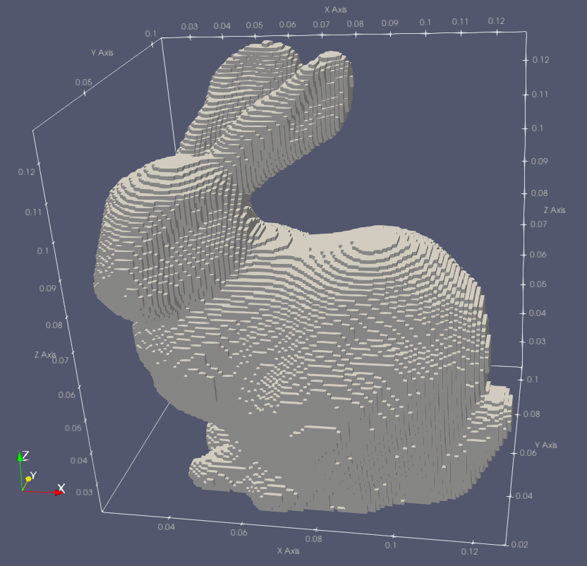

Toolboxes is a sub-package where useful Python modules contributed by users are stored.

**********
STLtoVoxel
**********

Information
===========

**Author/Contact**: Kartik Bansal (kartikbn21000@gmail.com)

This package provides the ability to directly model real objects without having to build their geometries manually using geometry primitives such as the ``#edge``, ``#plate``, ``#box`` etc.. commands. It specifically provides a tool to convert a `STL file <https://en.wikipedia.org/wiki/STL_(file_format)>`_, which can be produced by many CAD software packages, to a voxelised mesh (FDTD Yee cells) which is saved as a geometry file in HDF5 format suitable for directly importing into gprMax.

This package was created as part of the `Google Summer of Code <https://summerofcode.withgoogle.com/>`_ programme 2021 which gprMax participated. The package uses the `stl-to-voxel <https://github.com/cpederkoff/stl-to-voxel>`_ Python library by Christian Pederkoff.

**License**: `Creative Commons Attribution-ShareAlike 4.0 International License <http://creativecommons.org/licenses/by-sa/4.0/>`_

**Attribution/cite**: TBC

Package contents
================

* ``stltovoxel.py`` is the main script which should be executed to convert a STL file to a voxelised mesh which is saved as a geometry file in HDF5 format suitable for directly importing into gprMax.
* ``examples`` is a folder containing example STL files as well as gprMax input files that can be used to import the resulting HDF5 geometry files.
* ``convert.py``, ``perimeter.py``, ``slice.py`` are modules adapted from the `stl-to-voxel <https://github.com/cpederkoff/stl-to-voxel>`_ Python library by Christian Pederkoff.
* ``license.md`` is the license for the `stl-to-voxel <https://github.com/cpederkoff/stl-to-voxel>`_ Python library by Christian Pederkoff.

How to use the package
======================

The main script is ``stltovoxel.py`` which should be run at the command line and takes three arguments:

* ``path`` is base path to the folder containing the STL file(s) to convert.
* ``-dxdyz`` is the spatial discretisation of the generated voxelised mesh. It should be given as a floating point number.

The physical dimensions of the voxelised object will depend on the size of the object in the original STL file and the spatial discretisation chosen.

Example
-------

To create a voxelised mesh (HDF5 geometry file) from the ubiquitous `Stanford bunny <https://en.wikipedia.org/wiki/Stanford_bunny>`_ STL file, using a spatial discretisation of 1mm:

.. code-block:: none

    python -m toolboxes.STLtoVoxel.stltovoxel toolboxes/STLtoVoxel/examples/stl/Stanford_Bunny.stl -dxdydz 0.001

Since the number of voxels are 108 x 88 x 108 and the spatial discretisation chosen is 1mm, the physical dimensions of the Stanford bunny when imported into gprMax will be 0.108 x 0.088 x 0.108mm.

The following is an example of a ``materials.txt`` file that can be used with the generated geometry file (HDF5 format) when importing into gprMax. The material index used in the HDF5 geometry file corresponds to the number of STL files converted, e.g. it will be zero if only a single STL file is converted.

.. literalinclude:: ../../toolboxes/STLtoVoxel/examples/materials.txt
    :language: none
    :linenos:

The following Python script (using our Python API) can be used to import the generated geometry file ``Stanford_Bunny.h5`` and materials file ``materials.txt`` into a gprMax model. The bunny material will be sand, i.e. index zero in the materials file.

.. literalinclude:: ../../toolboxes/STLtoVoxel/examples/bunny.py
    :language: python
    :linenos:

.. figure:: ../../images_shared/stanford_bunny_stl.png
    :width: 600 px

    Image of the Stanford bunny STL file

    FDTD geometry mesh showing the Stanford bunny
