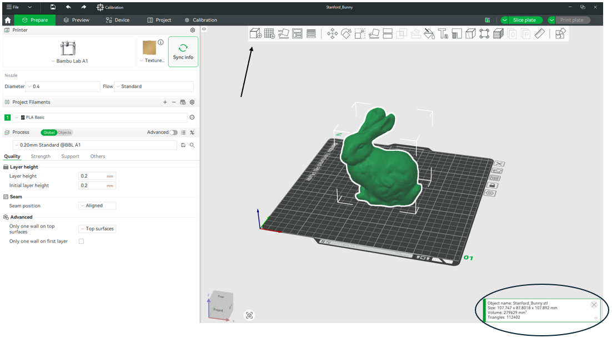
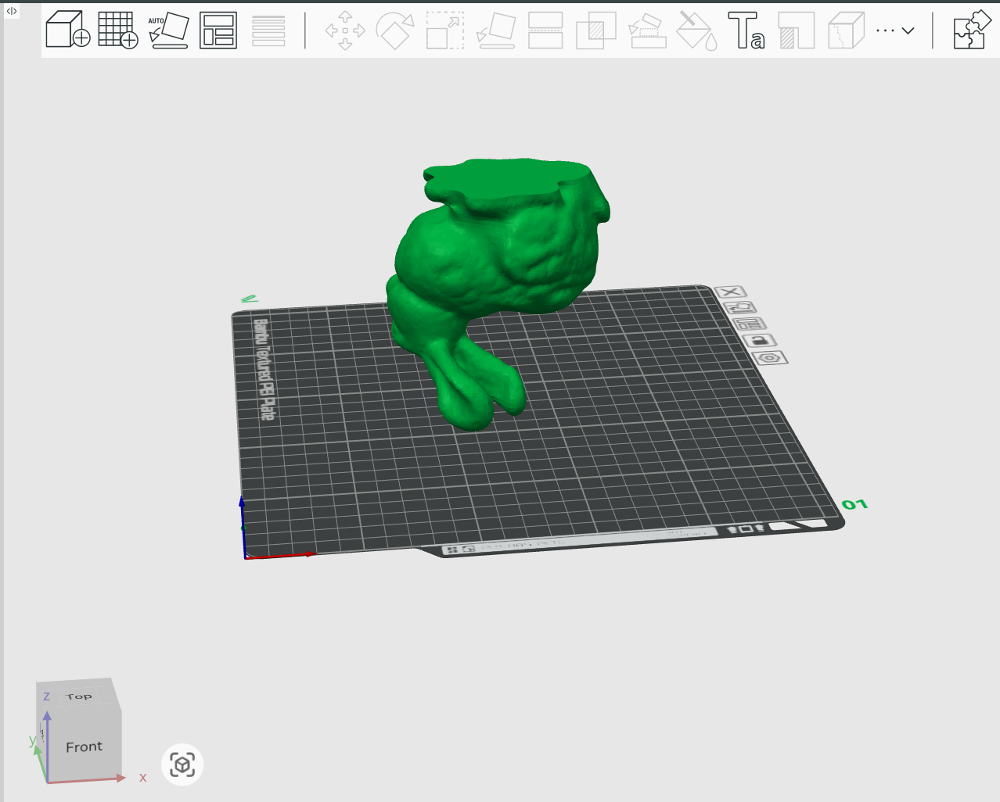
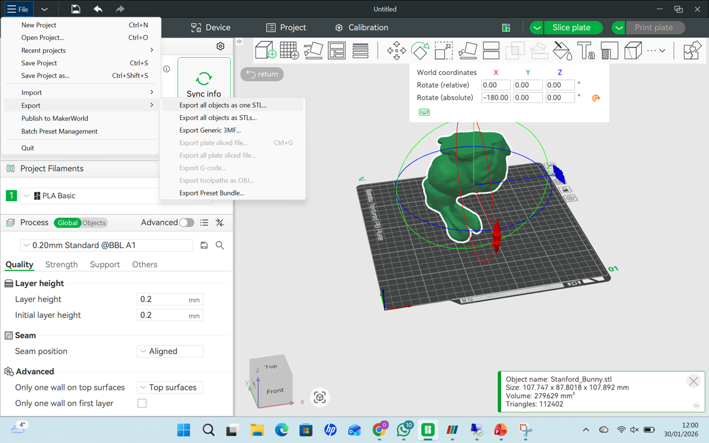
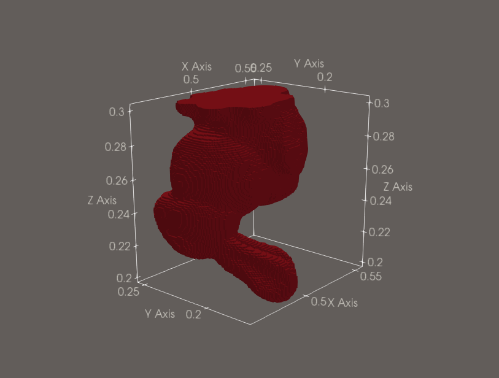
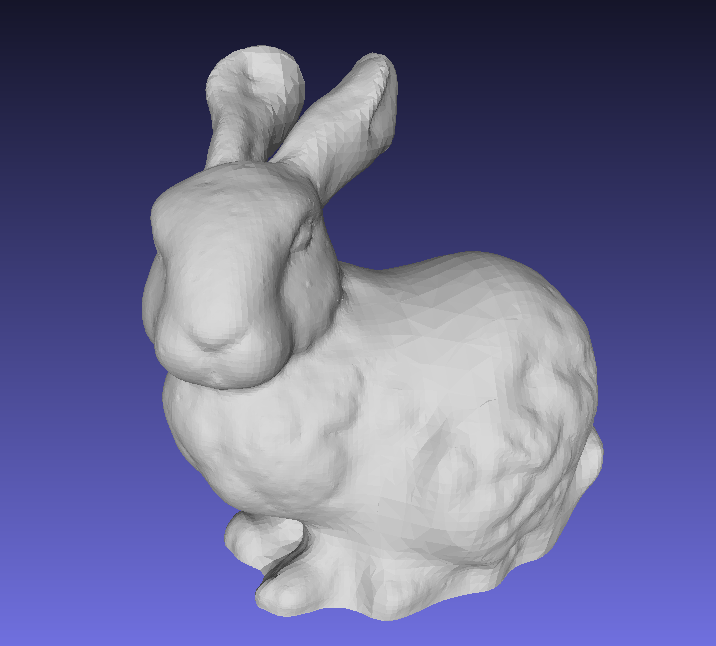
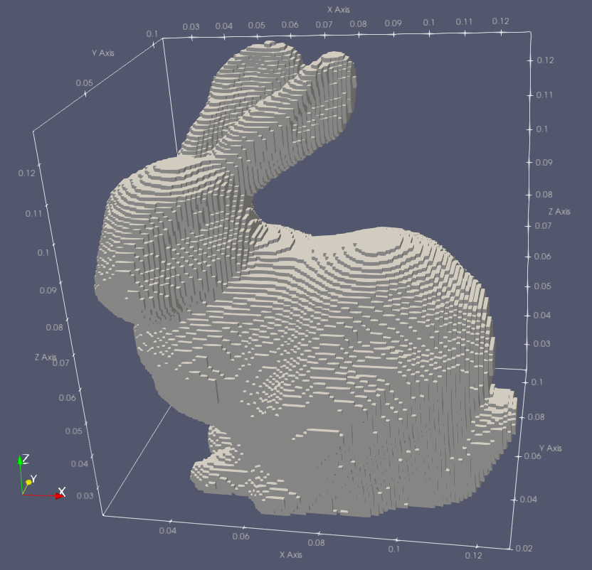

Toolboxes is a sub-package where useful Python modules contributed by users are stored.

**********
STLtoVoxel
**********

Information
===========

**Author/Contact**: Kartik Bansal (kartikbn21000@gmail.com)

This package provides the ability to directly model real objects without having to build their geometries manually using geometry primitives such as the ``#edge``, ``#plate``, ``#box`` etc.. commands. It specifically provides a tool to convert a `STL file <https://en.wikipedia.org/wiki/STL_(file_format)>`_, which can be produced by many CAD software packages, to a voxelised mesh (FDTD Yee cells) which is saved as a geometry file in HDF5 format suitable for directly importing into gprMax.

This package was created as part of the `Google Summer of Code <https://summerofcode.withgoogle.com/>`_ programme 2021 which gprMax participated. The package uses the `stl-to-voxel <https://github.com/cpederkoff/stl-to-voxel>`_ Python library by Christian Pederkoff.

**License**: `Creative Commons Attribution-ShareAlike 4.0 International License <http://creativecommons.org/licenses/by-sa/4.0/>`_

**Attribution/cite**: TBC

Package contents
================

* ``stltovoxel.py`` is the main script which should be executed to convert a STL file to a voxelised mesh which is saved as a geometry file in HDF5 format suitable for directly importing into gprMax.
* ``examples`` is a folder containing example STL files as well as gprMax input files that can be used to import the resulting HDF5 geometry files.
* ``convert.py``, ``perimeter.py``, ``slice.py`` are modules adapted from the `stl-to-voxel <https://github.com/cpederkoff/stl-to-voxel>`_ Python library by Christian Pederkoff.
* ``license.md`` is the license for the `stl-to-voxel <https://github.com/cpederkoff/stl-to-voxel>`_ Python library by Christian Pederkoff.

How to use the package
======================

The main script is ``stltovoxel.py`` which should be run at the command line and takes two arguments:

* ``path`` is base path to the folder containing the STL file(s) to convert.
* ``-dxdydz`` is the spatial discretisation of the generated voxelised mesh. It should be given as a floating point number.

STL has no standard coordinate unit. The historical toolbox assumed
millimetres and this remains the default. Use ``--unit m``, ``--unit mm``, or
``--unit um`` explicitly for new workflows.

For a directory containing several parts, create an editable assignment table
before conversion:

.. code-block:: console

    python -m toolboxes.STLtoVoxel.stltovoxel anatomy \
        --prepare anatomy.csv

Then convert with:

.. code-block:: console

    python -m toolboxes.STLtoVoxel.stltovoxel anatomy \
        -dxdydz 0.002 --assignments anatomy.csv

The CSV maps ``file`` independently to ``material_name`` and ``geometry_tag``.
For example, left and right eyes may share a vitreous material while retaining
separate tags. Higher-priority files overwrite lower-priority files wherever
closed surfaces overlap. Filename stems become tags when no assignment file is
provided.

The physical dimensions of the voxelised object will depend on the size of the object in the original STL file and the spatial discretisation chosen.

Method of rotating STL file
===========================

**Author/Contact**: Owen Wilkinson (owenwilkinson39@gmail.com)

The STLtoVoxel command enables real-world objects saved in stl format to be converted and imported directly into gprMax. However, this command currently does not support directional manipulation of geometries once inside gprMax.  `Bambu Studio
<https://bambulab.com/en/download/studio>`_, is a free, open-source application commonly used for slicing 3D printing models that provides a simple solution to this limitation. Importantly, Bambu Studio uses the same axis orientation as gprMax, making it well-suited for preparing stl, 3mf, oltp, stp, step,svg, amf or obj files before importing. The software is lightweight, intuitive, and requires no account creation. Skipping all setup steps will open a basic workspace with a printing base plate visible. Using the previous example of the Stanford Bunny, opening its STL file in Bambu Studio will display the model positioned on the base plate, as shown below.

    Image of the Stanford bunny STL file imported into Bambu Studios

The information panel in the bottom-right corner displays the STL object’s dimensions in the same format used in gprMax. To rotate the object about any axis, use the rotate icon located in the top toolbar. As the STL object is rotated, the dimensions shown in the bottom-right panel will update accordingly.

    Image of the Stanford bunny STL file rotated upside down

Finally, once the object is correctly oriented in the x, y, and z planes for the gprMax model, use the menu path File → Export → Export all objects as one STL. This will generate a new STL file containing the updated orientation. As before, convert this new STL file into an HDF5 file for use within gprMax, following the procedure outlined in the previous section.

    Image of the Stanford bunny STL file exported with new orientation

    Image of the Stanford bunny rotated inside Paraview

Example
-------

To create a voxelised mesh (HDF5 geometry file) from the ubiquitous `Stanford bunny <https://en.wikipedia.org/wiki/Stanford_bunny>`_ STL file, using a spatial discretisation of 1mm:

.. code-block:: none

    python -m toolboxes.STLtoVoxel.stltovoxel toolboxes/STLtoVoxel/examples/stl/Stanford_Bunny.stl -dxdydz 0.001

Since the number of voxels are 108 x 88 x 108 and the spatial discretisation chosen is 1mm, the physical dimensions of the Stanford bunny when imported into gprMax will be 0.108 x 0.088 x 0.108m.

The converter also creates an editable ``_materials.json`` database beside
the generated HDF5 file. Its
constitutive values are initially ``null`` because the STL file contains no
electromagnetic properties. They must be filled in before running gprMax. The
stable keys in the database are also stored in ``/material_keys`` in the HDF5
file, so their order cannot become detached from the voxel indices. Rerunning
the conversion preserves an existing database when its material keys still
match, so user-entered properties are not overwritten.

The HDF5 file also contains ``tag_data`` and ``tag_names``. Tag IDs describe
the final voxelised cells after overlap resolution and are imported by
``GeometryObjectsRead``. They are not material IDs and dielectric smoothing
does not alter their membership.

.. literalinclude:: ../../toolboxes/STLtoVoxel/examples/stl/Stanford_Bunny_geo_materials.json
    :language: json
    :linenos:

The following Python script imports the generated geometry and selects its
database by name. The example database assigns sand to the bunny.

.. literalinclude:: ../../toolboxes/STLtoVoxel/examples/bunny.py
    :language: python
    :linenos:

    Image of the Stanford bunny STL file

    FDTD geometry mesh showing the Stanford bunny
