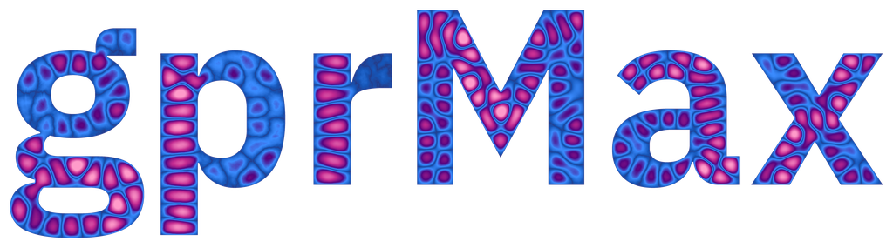

# gprMaxLogo toolbox



The original gprMax logo for version 3 was created by carving free-space cavities
of the word `gprMax` into an otherwise PEC two-dimensional FDTD domain, and their
resonant electric fields supplied the colour and texture. It was therefore a result
produced by gprMax rather than a conventional or handmade colour fill applied to text.

The version 4 wordmark preserves the same physical idea behind that original
gprMax logo: the letters are again free-space cavities carved into an otherwise
PEC two-dimensional FDTD domain, and their resonant electric fields supply the
colour and texture. The sources and the font used to carve the word `gprMax`
on the PEC plate differ from those used for version 3.

The approved wordmark uses IBM Plex Sans Bold with no additional letter
tracking. The font is distributed under the SIL Open Font License; its licence
is included in [`fonts/OFL.txt`](fonts/OFL.txt).

## Brand colours

The field magnitude is mapped through a scale that retains the established
gprMax purple while introducing blue nodes and pink antinodes:

| Role | Colour |
| --- | --- |
| gprMax purple | `#55037f` |
| Deep indigo | `#28367f` |
| Blue | `#1656b8` |
| Bright blue | `#3b8cff` |
| Magenta | `#c42b91` |
| Pink | `#ff9bca` |
| Recommended dark background | `#111827` |

Use a transparent asset where possible. Pre-composited white and dark versions
are supplied when an application does not preserve PNG transparency. Preserve
the `gprMax` capitalisation and the wordmark aspect ratio.

## Prebuilt assets

[`assets/`](assets) contains transparent, white-background, and dark-background
PNGs at widths of 2048, 1024, 512, 400, and 256 pixels. The 2048-pixel
transparent PNG is the largest committed derivative. Exact dimensions,
300 dpi print metadata, and SHA-256 checksums are recorded in
[`assets/manifest.json`](assets/manifest.json).

The documentation uses the 1024-pixel transparent asset and the top-level
README uses the 400-pixel asset. All committed sizes are downsampled from one
10000-pixel production master. That master is reproducible from the fixed field
snapshot but is not committed because it exceeds the repository file limit.

## How the model is built

The official model is a 2D TMz simulation with a 1.0 m by 0.5 m physical
domain and a 0.083333 mm spatial step (12000 by 6000 cells). The full plane is
initially PEC. The IBM Plex Sans glyph mask is then compressed into 9724
rectangular `#box` commands which replace the letters with free space. No PML
is required because the resonant cavities are surrounded by PEC.

Eight z-polarised Hertzian line sources excite the isolated glyph cavities
with continuous 10 or 12 GHz sinusoids. Their relative amplitudes were
calibrated to produce comparable RMS field strength in each glyph. The `Ez`
field is sampled at 10 ns. The renderer displays `abs(Ez)`,
normalised by its 99.5th percentile inside the letters, using a power-law
colour normalisation. The PEC region remains transparent.

### Fixed simulation and asset scaling

The waveform amplitude of a Hertzian dipole is its current, `I`, in amperes.
The source update in gprMax deposits

```text
J = I * dl / (dx * dy * dz).
```

For this 2D TMz model the z-directed source is a line current and `dl = dz`,
so `Jz = I / (dx * dy)`. The grid, source amplitudes, and all other simulation
parameters are fixed as part of the authoritative model. The model is run
once, its snapshot is rendered as the 10000-pixel transparent master, and
every smaller asset is produced by resampling that master.

The generated input file is [`model/gprmax_v4_logo.in`](model/gprmax_v4_logo.in).
The raw snapshot is approximately 1.7 GB and is intentionally not committed.
The 72-million-cell production model is best run on a GPU with adequate
memory.

## Reproduction

From the repository root, regenerate the model and glyph preview with:

```bash
python toolboxes/gprMaxLogo/logo_model.py
```

Run the generated model (device index is optional):

```bash
python -m gprMax toolboxes/gprMaxLogo/model/gprmax_v4_logo.in -gpu 0
```

Render a new transparent master from the resulting snapshot:

```bash
python toolboxes/gprMaxLogo/render_logo.py \
  toolboxes/gprMaxLogo/model/gprmax_v4_logo.in \
  toolboxes/gprMaxLogo/model/gprmax_v4_logo_snaps/logo_fields.h5 \
  /tmp/gprmax_v4_logo_master_10000.png --width-px 10000
```

Finally, create the standard screen and print assets:

```bash
python toolboxes/gprMaxLogo/export_assets.py \
  /tmp/gprmax_v4_logo_master_10000.png toolboxes/gprMaxLogo/assets
```

The requested pixel widths passed to `export_assets.py` determine which
derivatives are created from the master.
